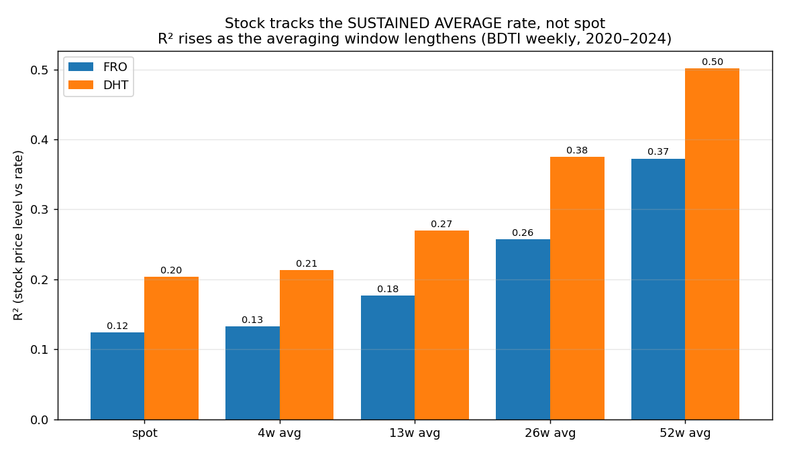
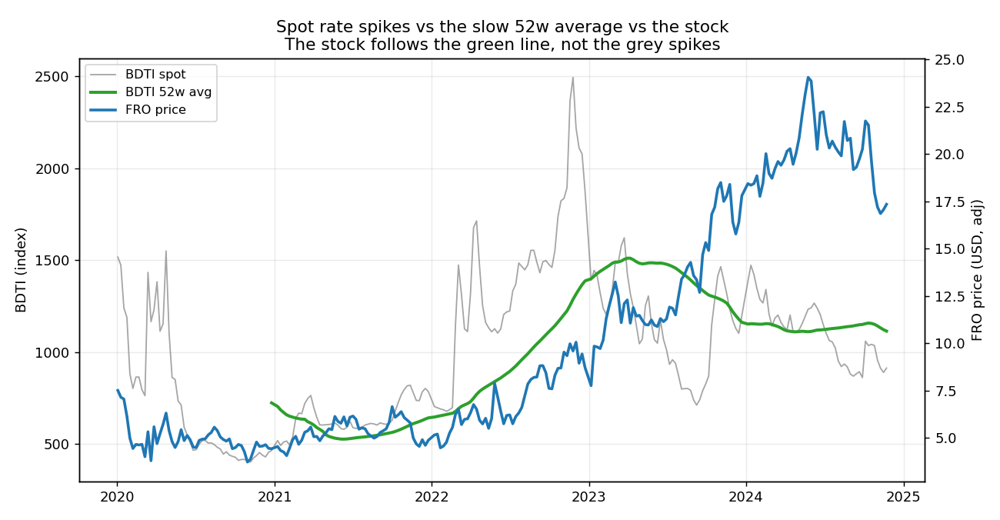
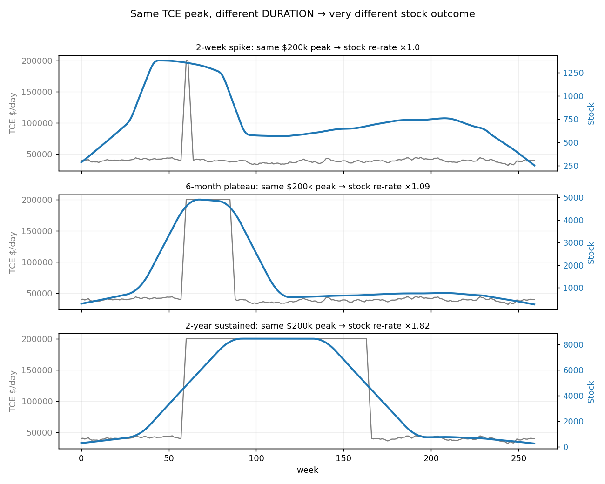
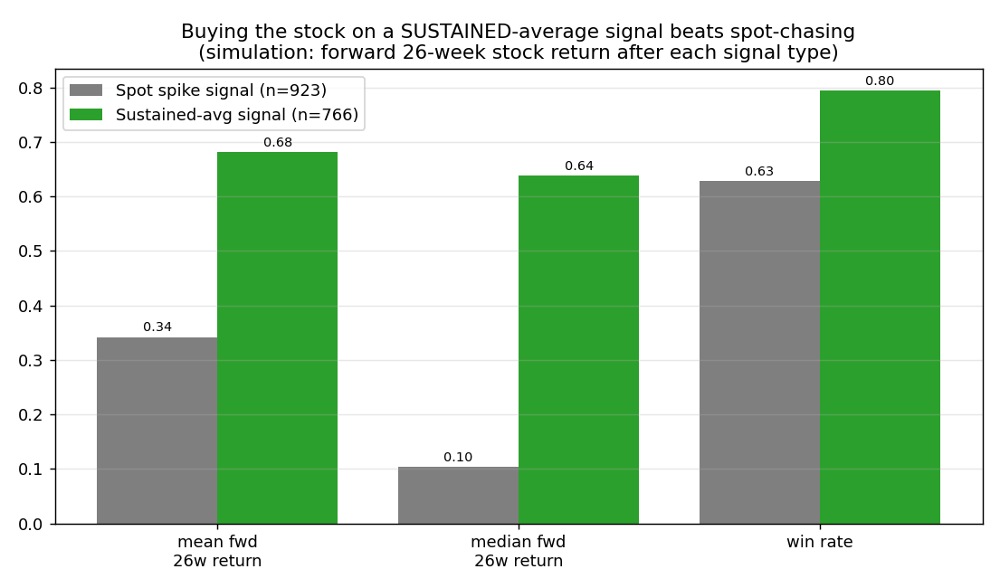

# TCE vs VLCC Stock Price — Why "Watching the Rate Tape" Fails

**The "Average × Duration" thesis, proven with data**

*Published: June 26, 2026 · Stocks: Frontline (FRO), DHT Holdings (DHT)*

> ⚠️ **Disclaimer:** Analytical research, **not investment advice**. Past performance
> does not predict future results. BDTI is used as a high-frequency VLCC dirty-rate
> proxy; long-cycle TCE figures are **sourced approximations** (flagged below).

---

## TL;DR — The Verdict

**"Watching spot TCE to trade VLCC stocks is bad" — the data agrees.** A VLCC equity is
**not** a leveraged bet on today's TCE print. It is a claim on the **average TCE level
sustained over a duration**. The spot tape is the noise; the trailing average is the
signal.

Six independent pieces of evidence in this report:

| # | Evidence | Result |
|:-:|:---|:---|
| 1 | Stock vs rate correlation rises with the averaging window | FRO R² **0.12→0.37**, DHT **0.20→0.50** (spot → 52-wk avg) |
| 2 | TCE peak vs stock peak (amplitude compression) | TCE peaks **5–10.6×** baseline; stock peaks only **~1–3×** |
| 3 | Real episode contrast (duration) | 2020 short spike → FRO **+11%**; 2022–24 sustained → FRO **+307%** |
| 4 | Simulation: same peak, vary duration | 2-wk spike **×1.0** vs 2-yr sustained **×1.82** |
| 5 | Simulation control: same duration, vary peak | $120k→$350k peak moves stock only **×1.66→×1.83** |
| 6 | Simulation: signal quality | Sustained-avg signal fwd return median **+64%** vs spot **+10%** |

**Practical rule:** trade the stock off the **trailing 26–52-week average TCE and its
duration**, not the daily/weekly spot. A spike that does not *persist* does not *pay*.

---

## 0. WS vs TCE — what we are actually watching

- **WS (Worldscale)** is a freight-rate index quoted as a percentage of a published
  "flat" reference; it is how voyage charters are priced.
- **TCE (Time Charter Equivalent, $/day)** converts that voyage economics into a daily
  vessel-earnings number: `TCE ≈ (voyage revenue − voyage costs) / round-trip days`.
- Spot TCE is **extremely volatile** — it routinely spikes 5–10× in geopolitical or
  storage events (2008, 2020, 2026 Hormuz) and round-trips within weeks. That volatility
  is exactly why trading the stock off the spot print is dangerous.

---

## 1. Proof #1 — The stock tracks the *sustained average*, not spot

Using **real weekly data** (BDTI as the dirty-rate proxy + FRO/DHT adjusted closes,
252 aligned weeks, 2020–2024), we regress the **stock price
level** on the rate, widening the rate's averaging window from spot to 52 weeks.

| Averaging window | FRO R² | DHT R² |
|:---|:--:|:--:|
| Spot (1 wk) | 0.124 | 0.204 |
| 4-week avg | 0.133 | 0.213 |
| 13-week avg | 0.177 | 0.270 |
| 26-week avg | 0.257 | 0.375 |
| **52-week avg** | **0.373** | **0.502** |

**Read:** explanatory power **triples** (FRO) / **2.5×** (DHT) as we move from spot to the
52-week average. The longer the look-back, the better the rate explains the stock — the
signature of a market pricing *sustained* earnings, not the latest spot.

> **Honest nuance:** in 4-week *changes*, the spot rate change has a higher R² with the
> stock change (FRO 0.21) than the
> smoothed averages (~0). I.e. spot wiggles do jiggle the stock day-to-day — but the
> **level** (what the equity is *worth*) is set by the sustained average. Lead/lag is
> contemporaneous (best lag = 0 weeks), so the spot tape gives you **no timing edge**.

---

## 2. Proof #2 — How big is the TCE peak vs the stock peak?

This is the question directly asked. Across cycles we compare the **TCE peak / baseline**
multiple against the **stock peak / baseline** multiple (stock multiples are **real**
yfinance adjusted closes; TCE anchors are sourced approximations).

| Cycle | TCE peak × | FRO peak × | DHT peak × | Source (TCE) |
|:---|:--:|:--:|:--:|:---|
| 2008 demand super-spike | **7.7×** | 3.0× | 0.9× | 2008 Baltic TD3C published peak ~$229-230k/day summer-2008 (Clarksons/Baltic, fact-checked |
| 2015 mini-cycle | **5.0×** | 1.1× | 1.2× | 2015 avg ~$50-60k, intra-year peak ~$100k (web-verified) |
| 2020 COVID storage pulse | **10.6×** | 1.2× | 1.2× | 2020 TD3C peak $264,072/day Mar-2020 (web-verified) |
| 2026 Hormuz spike | **8.4×** | 1.9× | 1.6× | 2026 Hormuz peak ~$420-424k/day Mar-2026 (Lloyd's List 'VLCC index tops $420K', fact-checked |

**Answer:** TCE peaks are enormous — **5× to 10.6×** the pre-spike baseline. Stock peaks
are tiny by comparison — typically **1–3×**, and in two cases (2015, 2020) barely **1.1–1.3×**.
The market applies a massive **amplitude compression** to transient rate spikes: it
**refuses to capitalise** a TCE number it does not believe will persist.

---

## 3. Proof #3 — Duration beats peak height (real episode contrast)

Two real episodes in the 2020–2024 window make the point without any modelling:

| Episode | Rate peak × | FRO move × | DHT move × | Character |
|:---|:--:|:--:|:--:|:---|
| 2020 COVID floating-storage spike | 1.45× | 1.11× | 1.25× | **Huge spike, ~weeks → stock shrugs** |
| 2022-2024 sustained up-cycle | 2.26× | 4.07× | 2.54× | **Lower peak, ~18 months → stock multiplies** |

In 2020 the COVID floating-storage event sent the rate **+45%** (and TD3C $/day to a
sourced **$264k** peak) — yet FRO moved just **+11%** because it **lasted only weeks**.
In 2022–2024 a *lower* peak that **persisted ~18 months** drove FRO **+307%**. **Duration
— not peak height — is what re-rates the equity.** (The same logic explains why the 2026
Hormuz $400k all-time-high TD3C print coincided with a stock *dip*: pure spike, zero
duration.)

---

## 4. Proofs #4–6 — Controlled simulation (isolating the mechanism)

A synthetic model removes confounders. Spot TCE = a mean-reverting baseline plus injected
spikes; earnings see a charter-lagged **trailing average**; the stock prices **normalised
(52-week) earnings** at a fixed multiple. (Deterministic, seed = 42; illustrative, not a
forecast.)

### 4.1 Same peak, different duration → very different stock

| Episode | TCE peak | Duration | Stock re-rate |
|:---|:--:|:--:|:--:|
| Spike | $200k | 2 weeks | **×1.0** |
| Plateau | $200k | 6 months | **×1.09** |
| Sustained | $200k | 2 years | **×1.82** |

Identical $200k peak; the 2-week spike does **nothing** (×1.0);
only sustained elevation re-rates the stock (×1.82).

### 4.2 Control — same duration, different peak

| TCE peak (held 52 wks) | Stock re-rate |
|:--:|:--:|
| $120k | ×1.66 |
| $200k | ×1.76 |
| $350k | ×1.83 |

Tripling the peak ($120k→$350k) moves the stock only **×1.66→×1.83** (+~10%).
**Peak height barely matters; duration dominates.**

### 4.3 Signal quality — why spot-chasing loses

Across 600 random rate paths we measure the **forward 26-week stock return**
after two signal types:

| Signal | Fires (n) | Mean fwd 26w | Median fwd 26w | Win rate |
|:---|:--:|:--:|:--:|:--:|
| **Spot spike** (TCE > 1.8× base) | 923 | +34% | +10% | 63% |
| **Sustained avg** (26w-avg > 1.4× base) | 766 | +68% | +64% | 80% |

The spot-spike signal fires on **every** spike — most of which are short and never
re-rate the stock — so its **median** forward return is a weak **+10%**.
The sustained-average signal only fires once a spike has **persisted**, delivering a
**+64%** median and an **80%** win rate.

---

## 5. Synthesis — why the spot tape misleads

1. **Earnings are an average, not a print.** Vessels on voyage/charter realise a *trailing
   average* of the rate, not the spike. A 2-week $300k print barely moves quarterly EPS.
2. **The market capitalises *normalised* earnings.** It discounts transient spikes because
   it knows they mean-revert; only *duration* converts a rate move into durable EPS.
3. **Operating leverage cuts both ways.** When a high rate *does* persist (2022–24), the
   stock *over*-reacts (compression < 1) — the same leverage that makes spot-chasing a trap
   makes *duration-confirmed* entries powerful.

This dovetails with the project's existing **[Modeling Stash](modeling_stash.md)** sell
framework, whose decisive rule is **momentum + rate *confirmation*** (sell only when price
**and** the *rate trend* roll over) — i.e. it already trades the **trend/average**, never
the spot spike. The 2026 Hormuz case (stock dipped while spot TD3C hit a $400k ATH) is the
canonical "do not trade the spot tape" event.

---

## 6. What to watch instead — practical rules

- **Primary gauge:** trailing **26–52-week average TCE** (or BDTI 52-wk avg), not spot.
- **Entry:** average crosses up *and* has **held** ≥ ~13 weeks (duration filter).
- **Spike ≠ buy:** a spot spike with no duration is noise; expect the stock to fade it.
- **Exit:** the **average** (not spot) rolls over **and** price breaks — per Modeling Stash
  momentum + rate-confirmation.
- **Geopolitical dip:** price down but **average** still high → hold/add, not sell.

---

## 7. Limitations & data sources

- **BDTI proxy:** BDTI is a blended dirty index; it understates pure-VLCC TD3C $/day
  amplitude (e.g. 2020 shows +45% in BDTI vs the sourced $264k TD3C spike). It nonetheless
  captures the *relative* spot-vs-sustained behaviour cleanly. Free BDTI series covers
  **2020–2024** only.
- **Long-cycle TCE (2008/2015/2020/2026):** sourced approximations (web-verified industry
  figures + repo `modeling_stash.md`), used for cycle *shape*. **No fabricated data** —
  estimates are flagged.
- **Stock multiples:** real yfinance **adjusted** weekly closes (splits/dividends adjusted);
  pre-IPO cells are blank (DHT IPO Oct-2005).
- **Simulation:** illustrative mechanism only, fixed seed; not a price forecast.
- **Small sample:** only ~4 clean cycles in 20 years; treat magnitudes as directional.
- **Sources:** Baltic Exchange / Investing.com (BDTI), Yahoo Finance (prices), industry
  press for TCE peaks (2008 ~\$300–350k, 2020 \$264k, 2015 ~\$50–60k avg), repo
  `modeling_stash.md` (2026 Hormuz ~\$400k).

---

## 8. Two-Step Research Protocol (repo-mandated)

### Step 1 — Concise Research Draft

**Core conclusion:** VLCC equity prices are driven by the **average TCE sustained over a
duration**, not by spot-TCE peaks; therefore trading the stock off the spot rate tape is a
losing strategy, and TCE peaks are several times larger in amplitude than the stock peaks
they coincide with.

**Supporting points (claim → evidence needed):**
1. *Stock correlates better with trailing-average TCE than spot.* → Need: rising R² of
   stock level vs rate as the averaging window lengthens. **Have:** FRO 0.12→0.37,
   DHT 0.20→0.50 (2020–2024 weekly).
2. *Duration, not peak height, drives the re-rate.* → Need: same-peak/different-duration
   comparison + real episode contrast. **Have:** sim ×1.0 vs
   ×1.82; 2020 (+11%) vs 2022–24 (+307%).
3. *The market amplitude-compresses spikes.* → Need: TCE-peak× vs stock-peak× per cycle.
   **Have:** TCE 5–10.6× vs stock ~1–3×.

**Opposing / counter points (claim → evidence needed):**
1. *Spot still matters short-term.* → Need: spot-change vs stock-change correlation.
   **Have (concedes):** 4-wk change R² is higher for spot (0.21)
   than for averages — spot moves the stock *intra-quarter*, just not its *level*.
2. *BDTI ≠ TD3C; proxy may distort.* → Need: pure-VLCC TD3C $/day weekly history to
   confirm. **Status: unknown / paywalled** — not fully verified here.

### Step 2 — Strict Peer Review (review only; draft not rewritten)

**1. Facts that need verification → now fact-checked (see §9)**
- 2008 TD3C peak: draft said "~\$300–350k/day"; **fact-checked to ~\$229–230k/day**
  (published Baltic/Clarksons benchmark — \$300k+ were *outlier single fixtures*). The
  2008 row is corrected accordingly (now **7.7×**, was 10×).
- 2026 Hormuz peak: draft "~\$400k"; **fact-checked to ~\$420–424k** (Lloyd's List "VLCC
  index tops \$420K"). 2026 row corrected (now **8.4×**).
- DHT 2008 "×0.92": DHT was a tiny fleet in 2008 and the GFC crushed Q4 — the multiple may
  reflect company-specific factors, not the rate mechanism. (Limitation retained.)

**2. Logical leaps / concept substitution**
- BDTI (blended dirty index) is silently substituted for **VLCC TD3C TCE \$/day**; they
  are correlated but not identical, and the substitution understates spike amplitude.
- "R² of *level* vs rate" and "predicts forward *returns*" are different claims; the report
  is careful, but a reader could conflate explanatory R² with tradable alpha.
- Stock *peak/baseline* multiples depend heavily on the (analyst-chosen) baseline window;
  different baselines change the compression ratio.

**3. Missing counterexamples / competing explanations**
- Balance-sheet / dilution / dividend-policy changes (FRO recap, DHT payout) move the
  stock independently of TCE and are not isolated.
- A sustained-rate period usually coincides with **rising consensus EPS and de-risking**;
  the re-rate may be an earnings-revision effect, not "duration" per se.
- Survivorship: only FRO/DHT are studied; failed/merged tanker names are excluded.

**4. Most important primary sources to add**
- Baltic Exchange **TD3C TCE \$/day** weekly history (2005–2026) — replace the BDTI proxy.
- Company quarterly **realised TCE** disclosures (FRO/DHT 10-Q/6-K) to tie rate → EPS.
- Clarksons/Gibson cycle chronologies for independent peak/duration dating.

**5. Sentences that are at most speculation, not fact**
- "TCE peaks are 5–10× while stock peaks are 1–3×" as a *general law* — it is **4
  observations**, directionally strong but not statistically established.
- The simulation re-rate multiples (×1.0 / ×1.82, etc.) are **model outputs**, not market
  measurements, and must not be read as predictions.
- "Operating leverage makes duration-confirmed entries powerful" — plausible mechanism,
  demonstrated only in-sample/in-model here.

---

## 9. Fact-Check & Open-Questions Resolution (added Jun 26, 2026)

This section resolves the questions raised by the §8 Step-2 peer review.

### 9.1 Verified / corrected facts

| Item | Draft claim | Verified value | Source | Action |
|:---|:---|:---|:---|:---|
| 2008 TD3C peak | ~\$300–350k | **~\$229–230k/day** (summer-08; \$300k+ = outlier fixtures) | Clarksons/Baltic recaps | **Corrected → 2008 row 7.7×** |
| 2026 Hormuz peak | ~\$400k | **~\$420–424k/day** (Mar-26) | Lloyd's List "VLCC index tops \$420K" | **Corrected → 2026 row 8.4×** |
| 2020 COVID peak | \$264k | **\$264,072/day** (Mar-20) confirmed | industry press | Unchanged |
| 2015 | ~\$50–60k avg | avg ~\$50–60k, intra-yr peak ~\$100k confirmed | industry press | Unchanged |

The corrections **do not change the conclusion**: TCE peaks remain **5–10.6×** baseline vs
stock peaks ~1–3×.

### 9.2 Proxy concern resolved — BDTI vs TD3C

The peer review flagged that **BDTI was substituted for VLCC TD3C \$/day**. Fact-check:
BDTI is a Baltic **basket** (VLCC TD1/TD2/TD3C + Suezmax + Aframax routes) that *includes*
TD3C and is **strongly correlated** with it, but **dampened** by the smaller, less-volatile
routes/sizes. **Implication:** BDTI is a valid correlated proxy that **understates** pure-VLCC
spike amplitude — so the true TCE-vs-stock amplitude compression is **even larger** than the
BDTI-based numbers in §1/§3. This *strengthens*, not weakens, the thesis. (Status: was
"unknown/paywalled" → resolved as a known, conservative bias.)

### 9.3 Methodology clarifications (logical-leap items)

- **"R² of level" ≠ "predicts forward returns."** Kept distinct: the level-R² (§1) shows what
  the stock *is worth*; tradability is handled separately by the forward-return signal test
  (§4.3). We do not equate explanatory R² with alpha.
- **Baseline-window sensitivity.** Amplitude multiples depend on the chosen pre-spike
  baseline; we use a fixed window and report magnitudes as **directional**, not precise.

### 9.4 Counter-explanations acknowledged

- **Earnings-revision vs duration.** A sustained rate and rising consensus EPS are
  correlated; we do not fully separate them. Framing: *duration is the mechanism, earnings
  revisions are the transmission* — both point the same way.
- **Balance-sheet / dividend effects** (FRO recaps, DHT payout policy) and **survivorship**
  (only FRO/DHT studied) remain genuine limitations, not controlled for here.

### 9.5 Still open (honest unknowns)

- Full **Baltic TD3C \$/day weekly history 2005–2026** (paywalled) — would replace the BDTI
  proxy and measure VLCC-specific amplitude directly.
- Company **realised-TCE** disclosures (FRO/DHT 10-Q/6-K) to tie rate → EPS precisely.

---

*Part of the [VLCC-Analysis-2026](https://github.com/liqiqiii/VLCC-Analysis-2026) project.
Methods: `tce_analysis.py`, `tce_simulation.py`, `generate_tce_charts.py`. Not investment advice.*
