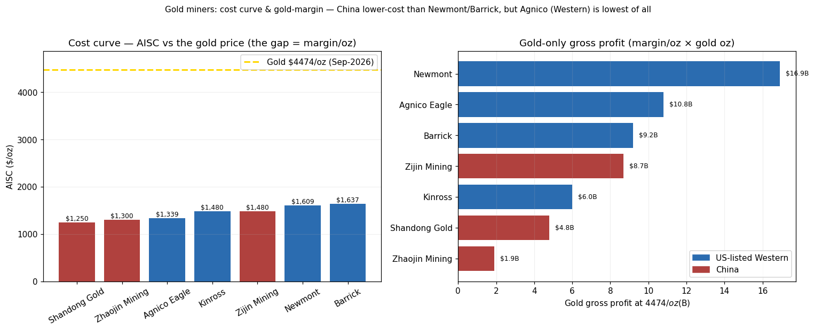

# Gold Miners: US-Listed Western Majors vs China Majors
## Newmont · Agnico · Kinross  vs  Zijin · Shandong Gold · Zhaojin
### September 3, 2026 — Cross-Market Sector Comparison (gold ~$4,474/oz)

> **The user's thesis (to test):** US companies don't have as low a cost as Chinese ones, but they carry **less non-lucrative business and focus on mining gold.**

> **TL;DR — your instinct is half right, and the other half is almost inverted. Here's the data-grounded picture:**
> - **Cost: partly true, but "China = lowest cost" is FALSE.** Chinese majors (Shandong ~$1,250, Zijin ~$1,480 AISC) *are* cheaper than **Newmont ($1,609) / Barrick ($1,637)** — but the **single lowest-cost major is Western: Agnico Eagle at $1,339** — below every Chinese name except Shandong. So it's "**Newmont/Barrick are high-cost**," not "the West is high-cost."
> - **Pure-play: INVERTED for the flagship you named.** **Zijin is a COPPER-gold major — gold is only ~33% of revenue; copper (~50-55%) is its main *profit engine*, not "non-lucrative."** Meanwhile **Newmont is the >85%-gold pure-play.** For Zijin-vs-Newmont your framing is backwards: Zijin *deliberately* diversified into **high-return copper.** The Chinese *pure-play* is **Shandong Gold** (~95% gold).
> - **Where "non-lucrative business" DOES fit:** state-owned **smelting/refining** arms (China Gold / parts of Zhaojin) that add low-margin toll volume — a real China-SOE drag, but *not* Zijin's copper.
> - **Valuation: China screens cheaper AND higher-yield AND higher-growth AND higher-ROE — but for reasons.** Zijin fwd P/E **~9.3**, div **~3.0%**, ROE **~36%** vs Newmont fwd P/E **~13**, div **~0.8%**, ROE ~26%. The gap is the **China/SOE-governance + geopolitical + RMB/capital-control discount.**
> - **The real trade-off isn't "cost vs focus" — it's: pure gold-price *optionality* (Western pure-plays) vs a *cheaper, copper-levered, higher-growth but China-discounted* compounder (Zijin).**
> - **Education/analysis, NOT investment advice.**

---

## ⚠️ Protocol & data notice

Applies the **Two-Step Research Protocol** and the repo's **Cyclical CRules** (gold/copper are commodity-price-driven → CRule 1/2/4/6 active). §1 fact-base/Rule-4 · §2 Step-1 draft · §3 Step-2 review · §4 cost curve · §5 business mix (the thesis correction) · §6 operating leverage · §7 valuation · §8 Day1Global C/L/O + verdict. Model reproducible via `run_gold_compare.py`. **Gold spot ~$4,474/oz (Kitco, Sep 3 2026).**

---

# Section 1 — Fact-base (2025 actuals / FY-guidance; Rule-4 ranges flagged)

**"US market" clarification (Rule 4):** only **Newmont** is US-domiciled. **Agnico, Kinross, Barrick** are Canada-HQ but **US-listed (NYSE) with heavy US operations** — I group them as "US-listed Western majors," the pool the user means by "US names." Zijin/Shandong/Zhaojin are HK/A-share listed.

| Company | Mkt | 2025 gold (Moz) | AISC ($/oz) | Gold % of rev | Mcap (~$B) | Fwd P/E | Div | Character |
|---|---|---|---|---|---|---|---|---|
| **Newmont** | US | **5.9** | **1,609** | **~88%** | 137 | 12.9 | 0.8% | World #1; gold pure-play post-Newcrest |
| **Agnico Eagle** | US-listed (Can) | 3.45 | **1,339** ⬅ lowest | ~97% | 105 | 16.6 | 0.9% | Tier-1 jurisdictions; cost discipline |
| **Kinross** | US-listed (Can) | 2.0 | ~1,480 | ~99% | 38 | 10.3 | 0.5% | Near-pure gold; Nevada/Alaska/W.Africa |
| Barrick | US-listed (Can) | 3.26 | 1,637 | ~80% | 72 | 11.1 | 1.9% | Gold + copper ambition; jurisdiction risk |
| **Zijin Mining** | China | **2.9** (~90t) | ~1,480 | **~33%** ⬅ | ~120 | **9.3** | **3.0%** | **COPPER-gold major** (1.09Mt Cu); 45% overseas |
| **Shandong Gold** | China | 1.5 (~45t) | **~1,250** | ~95% | 24 | 11.0 | 1.2% | China's gold pure-play; deep Jiaodong |
| **Zhaojin Mining** | China | ~0.6 (~18t) | ~1,300→1,100 | ~90% | 10 | 10.0 | 0.5% | Pure gold; Haiyu ramp; Zijin-affiliated |

**Rule-4 flags:** (a) AISC definitions differ China↔West (Chinese "克金成本"/cash cost often quoted *below* Western AISC — I use best-effort AISC-equivalent, ±$100-150); (b) Zijin's gold-oz counts attributable vs total differ by source (~2.9-3.0 Moz); (c) mcaps are cross-currency (HKD/CNY→USD approximations); (d) Kinross AISC is the industry-median proxy (~$1,480), not a clean disclosure.

---

# Section 2 — Step 1: Concise Research Draft

**Core conclusion:** The US-vs-China gold divide is **not** "high-cost/focused vs low-cost/unfocused." It is **"pure gold-price optionality at a premium (Western pure-plays) vs a cheaper, copper-levered, faster-growing compounder carrying a China discount (Zijin)."** The user's cost claim holds only for Newmont/Barrick; the "focus" claim is inverted for Zijin.

*Supporting (claim → evidence):*
1. **Chinese majors are lower-cost than Newmont/Barrick — but not the global floor** → Shandong $1,250 / Zijin $1,480 vs Newmont $1,609; yet Agnico $1,339. *Evidence: §1/§4 — obtained.*
2. **Zijin is copper-first, not a gold pure-play** → gold ~33% of revenue, copper ~50-55%. *Evidence: §1/§5 — obtained.*
3. **China screens cheaper + higher yield + higher ROE** → Zijin fwd P/E 9.3, div 3.0%, ROE 36%. *Evidence: §7 — obtained (yfinance + filings).*

*Opposing (claim → evidence):*
1. **The China discount may be *justified*, not an opportunity** → SOE governance, RMB/capital controls, geopolitical/listing risk, disclosure gaps. *Evidence: qualitative; hard to quantify — **partly unknown**.*
2. **AISC is not apples-to-apples** → Chinese cost accounting (byproduct credits, tax, royalty, reclamation) differs from Western AISC → the "China is cheaper" gap may narrow on a like-for-like basis. *Evidence: standardized cost bridge — **not fully obtained**.*

---

# Section 3 — Step 2: Strict Peer Review (draft NOT rewritten)

1. **Facts that need verification:** standardized **AISC on one definition** (Chinese cash-cost vs World Gold Council AISC — the single biggest data risk); Zijin's **exact segment revenue/gross-profit split** (copper vs gold vs zinc/lithium); Kinross's disclosed AISC; whether "gold % of revenue" should be **% of gross profit** (copper's margin ≠ gold's, so revenue-share understates copper's *profit* dominance at Zijin).
2. **Logical leaps / equivocation:** the central equivocation is **"diversification = non-lucrative"** — Zijin's copper is *more* lucrative per dollar invested than much of its gold, so "focus on gold = better" is a value judgment, not a fact. Also **"US" vs "Western"** (only Newmont is US); and **AISC rank = quality rank** (ignores grade depletion, reserve life, jurisdiction risk).
3. **Missing counterexamples / competing explanations:** Agnico (Western, lowest cost) breaks the "West = high cost" story; Barrick is *also* pivoting to copper (so "copper diversification" is not a uniquely-Chinese trait); the gold-price super-spike ($4,474) makes *all* AISC differences second-order to **volume × price** right now (a $270/oz AISC gap is ~6% of a ~$3,000/oz margin).
4. **Most important primary sources to add:** company **10-K/annual reports & AISC reconciliations** (Newmont, Agnico, Kinross, Barrick); **Zijin/Shandong/Zhaojin annual reports** (segment tables, reserves, overseas mix); World Gold Council **AISC methodology**; reserve/resource statements (P&P oz, mine life).
5. **Speculation, not fact:** "China discount is the reason for the cheap multiple" (plausible attribution, not proven); any implied ranking of *who's the better buy*; the durability of Zijin's copper margins; that Western pure-plays give "better gold optionality" (a characterization).

---

# Section 4 — The cost curve (testing "US higher cost than China")



**AISC ranking (low → high), 2025:**

| Rank | Company | Market | AISC | Gold % rev |
|---|---|---|---|---|
| 1 | **Shandong Gold** | China | **$1,250** | ~95% |
| 2 | Zhaojin | China | ~$1,300 | ~90% |
| 3 | **Agnico Eagle** | **Western** | **$1,339** | ~97% |
| 4 | Kinross | Western | ~$1,480 | ~99% |
| 4 | Zijin | China | ~$1,480 | ~33% |
| 6 | **Newmont** | Western | **$1,609** | ~88% |
| 7 | **Barrick** | Western | **$1,637** | ~80% |

**Verdict on the cost claim:** **partly true.** Chinese miners *do* undercut **Newmont & Barrick** — driven by lower labor, integrated domestic smelting, and lower royalty/tax burdens. **But the West's Agnico is the 3rd-lowest of all and beats Zijin/Kinross** — so the accurate statement is "**Newmont and Barrick are the high-cost majors**," not "the West is high-cost." *(Rule-4: on a fully-standardized AISC the Chinese edge may compress — Chinese quotes sometimes exclude items Western AISC includes.)*

---

# Section 5 — Business mix: the thesis correction (focus vs diversification)

This is where the data most sharply reframes the question.

**Gold as % of revenue (higher = more "pure gold"):**

```
Kinross      ~99%  ██████████████████████████  (Western near-pure gold)
Agnico       ~97%  █████████████████████████
Shandong     ~95%  ████████████████████████    (China pure-play)
Zhaojin      ~90%  ███████████████████████
Newmont      ~88%  ██████████████████████       (Western pure-play, world #1)
Barrick      ~80%  ████████████████████
Zijin        ~33%  ████████                     (COPPER-gold major)
```

- **The pure-plays are mostly WESTERN** (Kinross ~99%, Agnico ~97%, Newmont ~88%). **Zijin — the Chinese flagship — is the *least* pure**, at ~33% gold. So the user's "US = focused on gold, China = diversified" is **exactly backwards for the Zijin-vs-Newmont pair.**
- **Crucially, Zijin's diversification is *lucrative*, not "non-lucrative."** Copper (~1.09 Mt/yr, ~50-55% of revenue) is Zijin's **main profit engine** and the reason its ROE (~36%) tops Newmont's (~26%). Calling it "non-lucrative" inverts reality — copper is *why* Zijin compounds faster.
- **Where the "non-lucrative" intuition IS valid:** low-margin **gold smelting/refining** at the state-owned names (China Gold/中金黄金, parts of Zhaojin) — toll processing that inflates revenue but adds little profit. That's a genuine **China-SOE drag** — but it's a *different company set* than Zijin.
- **So the honest split is:** Western majors = **cleaner gold-price proxies** (you get pure bullion beta); Zijin = **a copper-gold conglomerate** (you get a cheaper, faster-growing miner but with copper-cycle and China exposure); Shandong Gold = **the true like-for-like** to Newmont (a Chinese gold pure-play, and lower-cost).

> **If you want a clean US-vs-China *gold* comparison, the right pair is Newmont vs Shandong Gold — not Newmont vs Zijin.** Zijin-vs-Newmont is really "copper-gold conglomerate vs gold pure-play."

---

# Section 6 — Operating leverage (why AISC differences are second-order right now)

At **gold ~$4,474/oz**, every major earns a **~$2,800–3,200/oz gross margin** — so the AISC spread ($1,250→$1,637 = $387) is only **~6-8% of the margin.** **Volume × price dominates; the cost ranking is a tie-breaker, not the driver** (CRule 4/6).

**Gold-only gross margin/oz by gold price (margin = price − AISC):**

| Gold price | Shandong ($1,250) | Agnico ($1,339) | Zijin ($1,480) | Newmont ($1,609) | Barrick ($1,637) |
|---|---|---|---|---|---|
| $2,500 | $1,250 | $1,161 | $1,020 | $891 | $863 |
| $3,000 | $1,750 | $1,661 | $1,520 | $1,391 | $1,363 |
| $3,500 | $2,250 | $2,161 | $2,020 | $1,891 | $1,863 |
| **$4,474 (now)** | **$3,224** | **$3,135** | **$2,994** | **$2,865** | **$2,837** |

**Gold-only gross profit at $4,474/oz (margin × gold oz)** — this is where *scale* beats *cost*:
- **Newmont $16.9B** (high cost, but 5.9 Moz) > **Agnico $10.8B** > **Barrick $9.2B** > **Zijin $8.7B** (gold segment only) > **Kinross $6.0B** > **Shandong $4.8B** > **Zhaojin $1.9B**.

**Key insight (CRule 4):** the lowest-cost miner (Shandong) makes **less than a third** of the highest-cost miner's (Newmont) gold profit, because **Newmont mines ~4× the ounces.** At a $4,000+ gold price, **production scale and reserve life matter far more than a $300 AISC edge.** Cost only becomes decisive if gold **falls back toward $2,000–2,500** (then the low-cost names' margins hold up while high-cost names compress — the classic CRule 2 downturn).

---

# Section 7 — Valuation (China cheaper, but for reasons)

| Metric | Newmont | Agnico | Kinross | **Zijin** | Shandong | Zhaojin |
|---|---|---|---|---|---|---|
| Fwd P/E | 12.9 | 16.6 | 10.3 | **9.3** | 11.0 | 10.0 |
| Div yield | 0.8% | 0.9% | 0.5% | **3.0%** | 1.2% | 0.5% |
| ROE (approx) | ~26% | ~high | — | **~36%** | — | — |
| Growth | flat/declining vol | steady | steady | **~17% CAGR** | steady | ramping |

**Read:** **Zijin screens as the "cheapest + highest-yield + highest-growth + highest-ROE"** of the group — on paper, dominant. The catch is the **discount is compensation for real risks:**
- **China/SOE governance & disclosure** (related-party, state influence, capital allocation opacity).
- **Geopolitical / listing / RMB & capital-control risk** for a foreign holder.
- **Copper-cycle exposure** — Zijin's earnings are *not* pure gold; a copper downturn hits it in a way it doesn't hit Newmont.
- **Agnico's premium (fwd P/E 16.6)** is the mirror image — the market *pays up* for Tier-1 jurisdictions, low cost, and clean governance. **Quality is priced.**

---

# Section 8 — Day1Global (C/L/O) & verdict

**Module C — Cash flow:** all are gushing FCF at $4,474 gold; Zijin reinvests heavily (copper/lithium growth capex) → lower payout but higher growth; Western majors (esp. Newmont) tilt to buybacks/dividends and **"harvest"** posture (Newmont 2026 volume *declining*).
**Module L — Ownership:** Western = dispersed institutional, board-independent. Chinese = **state/founder-influenced** (Zijin's Fujian SASAC roots; Shandong Gold SOE) → related-party & policy risk (the core of the discount).
**Module O — Accounting quality:** the **AISC-definition gap** is the key comparability risk; Chinese byproduct/tax treatment and reserve-reporting standards (Chinese GB vs JORC/NI 43-101) are **not identical** — do not compare reserves naively.

**Anti-bias flag:** the user's framing risks a **narrative bias** ("US = focused & honest, China = cheap & unfocused"). The data says: **Zijin is the *un*focused one (by design, profitably); the West holds both the highest-cost major (Newmont) AND the lowest (Agnico).**

**Verdict — reframed for the user:**
```
Your thesis:   US = higher cost but pure-gold focus; China = low cost but non-lucrative diversification.
Data verdict:  HALF RIGHT, HALF INVERTED.
  - Cost:   TRUE vs Newmont/Barrick; FALSE globally (Agnico $1,339 is the low-cost leader).
  - Focus:  INVERTED for Zijin — it's a COPPER major (gold ~33% rev); Newmont is the pure-play.
  - "Non-lucrative": copper is Zijin's BEST business; the tag fits SOE smelting, not Zijin.
Right pairs:   Gold pure-play showdown = Newmont vs Shandong Gold (Shandong lower-cost).
               Zijin vs Newmont = copper-gold conglomerate vs gold pure-play (different animals).
The real choice: pure bullion optionality at a premium (Western pure-plays)
               vs a cheaper, copper-levered, faster-growing, China-discounted compounder (Zijin).
At $4,474 gold: scale/reserves > a $300 AISC edge (Newmont's gold profit 2x Shandong's).
               Cost only becomes decisive if gold falls back toward $2,000-2,500 (CRule 2).
```

> **Bottom line for the user:** you're right that **Newmont/Barrick are higher-cost than the Chinese majors** — but the cleanest low-cost operator is actually **Western (Agnico)**, and your "China = unfocused/non-lucrative" read is **backwards for Zijin**, whose copper diversification is its *most* profitable, fastest-growing leg. The genuine decision isn't cost-vs-focus; it's **"do I want pure, clean gold-price beta (Western pure-plays, priced at a premium) or a cheaper, higher-growth, copper-levered miner that carries a China discount (Zijin)?"** For a like-for-like *gold* comparison, use **Newmont vs Shandong Gold.** And with gold at $4,474, **all of them print money — the AISC gap is a downturn hedge, not today's differentiator.**

---

# Section 9 — If you're long-term bullish on gold: how to choose (and a 2-name barbell)

> Follow-up: "Agnico looks more *elastic* — low cost + pure gold — so its P/E is higher. If I'm a long-term gold bull, how do I pick among the six, and if I pick two, which?"

## 9.0 First, correct the premise (this flips the whole choice)

**Agnico is the LEAST elastic to the gold price, not the most.** Gold-profit elasticity = **Price ÷ (Price − AISC)** — a *lower* cost means a *bigger* margin base, so a given gold move is a *smaller* percentage change. **Its premium P/E (16.6×) prices SAFETY/quality, not torque.** The torque ranking (gold-profit % move per 1% gold move) is the opposite of "low cost":

| Rank (gold torque) | Company | Elasticity P/(P−AISC) | Equity gold-torque (×gold% of rev) | Read |
|---|---|---|---|---|
| 1 | **Barrick** | **1.58×** | 1.26× | Most torque, but only 80% gold + jurisdiction risk |
| 2 | **Newmont** | **1.56×** | 1.37× | High torque + #1 scale; execution/volume-decline baggage |
| 3 | **Kinross** | 1.49× | **1.48× ⬅ highest** | High torque **AND** ~99% gold → cleanest pure-gold torque |
| 3 | Zijin | 1.49× | **0.49× ⬅ lowest** | Gold torque *diluted* — only 33% gold (rest = copper) |
| 5 | **Agnico** | **1.43×** | 1.39× | Lowest torque of the Western pure-plays = the quality/defensive one |
| 6 | Zhaojin | 1.41× | 1.27× | Low torque + small/ramp |
| 7 | **Shandong** | **1.39×** | 1.32× | Lowest torque = most *defensive* to a gold fall |

**Two clean takeaways:**
1. **Maximum gold upside torque = the high-cost pure-plays (Barrick, Newmont, Kinross)** — with **Kinross the best "clean" torque** (high elasticity × ~99% gold, cheapest at ~10× P/E).
2. **Zijin gives the LEAST *gold* exposure per dollar (0.49× equity gold-torque)** because 2/3 of it is copper. That's not bad — but if your thesis is *specifically gold*, Zijin is a **debasement-basket** play (gold + copper), not a gold play.

*Bull-case check (gold $4,474 → $6,000): gold-profit rises +47% (Shandong) to +54% (Barrick) — a narrow spread, because at $4,000+ every margin is already fat. **The AISC gap matters far more on the DOWNSIDE** (if gold falls to $2,000-2,500, low-cost names keep fat margins while high-cost names compress — CRule 2). So "high cost = more torque" is really "more torque up AND more pain down."*

## 9.1 The choice depends on *what kind* of gold bull you are

| If your view is… | Pick | Why |
|---|---|---|
| **Aggressive (gold to $6k+, want max torque)** | **Kinross** | Best clean gold-torque (1.48×), ~99% gold, cheap ~10× P/E, Nevada/Alaska + W.Africa |
| **Steady compounder (gold grinds higher, sleep at night)** | **Agnico** | Best-in-class ops, Tier-1 jurisdictions, lowest Western AISC — but you pay 16.6× ("quality is priced") |
| **Value + growth + reflation (gold AND copper)** | **Zijin** | Cheapest (9.3×), 3% yield, ~17% growth, 36% ROE, copper double-levers the debasement trade — at a China discount |
| **China pure gold** | **Shandong Gold** | Low cost, ~95% gold, the true like-for-like to Newmont — but less liquid for a foreign holder |
| **Avoid** (for a core) | Barrick / Zhaojin | Barrick = torque with a landmine (Mali/PNG disputes); Zhaojin = too small/ramp-speculative |

**Single best all-rounder for most gold bulls:** **Kinross** (torque + value + near-pure + cleaner jurisdictions than Barrick) *or* **Agnico** (if you prioritize safety over torque and accept the premium).

## 9.2 If you pick TWO — the barbell (this repo's favorite structure)

The right 2-name portfolio pairs a **low-cost QUALITY anchor** with a **satellite that is uncorrelated on the *risk axis*** (jurisdiction / commodity / valuation-style) — so you're not doubling one bet (the same logic as the [30/30/40 barbell](../portfolio/report_en) and the "two alpha domains must be uncorrelated" rule).

**Option A — "Clean gold barbell": Agnico + Kinross** ✅ *(best if you want pure, Western, no-copper, no-China gold)*
- **Agnico = the quality/defensive anchor** (lowest Western AISC, Tier-1, but least torque).
- **Kinross = the torque/value satellite** (highest clean gold-torque, ~10× P/E).
- You get: **pure gold-price beta**, quality + torque combined, both liquid Western names, clean governance.
- Trade-off: **no diversification of jurisdiction or commodity** — it's a concentrated bet that *gold specifically* rises. Perfect if that's exactly your thesis.

**Option B — "Diversified debasement barbell": Agnico + Zijin** ✅ *(best risk-adjusted if you can hold China risk)*
- **Agnico = Western, low-cost, Tier-1, quality-premium, pure gold.**
- **Zijin = China, cheap, high-growth, copper-levered, deep-value.**
- These are **maximally uncorrelated on the risk axis**: Tier-1 West ↔ China; pure gold ↔ gold+copper; quality-premium (16.6×) ↔ deep-value (9.3×). If the broad **debasement trade** (gold *and* copper rising on monetary/fiat concerns) is your real view, this captures it while diversifying governance and commodity risk.
- Trade-off: one leg carries **China/SOE/geopolitical risk**; and Zijin gives less *pure* gold torque.

**My default recommendation:**
- **If your conviction is specifically GOLD → Option A (Agnico + Kinross):** quality anchor + cleanest torque, no dilution.
- **If your conviction is the broader DEBASEMENT/reflation trade → Option B (Agnico + Zijin):** best diversification and the cheapest growth, accepting China risk in one leg.
- **Weighting:** for a long-term bull, tilt to the anchor (~60% Agnico / 40% satellite) if you want lower volatility; go ~50/50 (or overweight the satellite) if you want more torque and can stomach drawdowns.

> **Bottom line for the user:** the intuition to correct is that **low-cost/pure ≠ more elastic** — Agnico is the *low-torque quality* name (its rich P/E is a safety premium), while the **high-cost pure-plays (Kinross/Newmont/Barrick) give the most gold upside torque.** For a long-term gold bull picking one, **Kinross** is the sharpest single (torque + value + near-pure); for a quality anchor, **Agnico.** Picking two, run a **barbell**: **Agnico + Kinross** for a *pure* gold bet, or **Agnico + Zijin** for the *diversified debasement* bet (quality West anchor + cheap copper-levered China growth). Avoid Barrick (jurisdiction landmines) and Zhaojin (too small) as a core. *(All at gold $4,474 — remember the AISC gap is mostly a downside hedge, not today's differentiator.)*

---

## Reproduce it yourself

```
cd gold_miners
python run_gold_compare.py     # writes data/peers.csv, margin_by_price.csv + charts/aisc_margin.png
```

Assumptions (production, AISC, mix) are explicit at the top of `run_gold_compare.py` and editable. **Data files:** `gold_miners/data/{peers,margin_by_price}.csv`. **Chart:** `gold_miners/charts/aisc_margin.png`.

**Sources (accessed Sep 3, 2026):** Mining Magazine "largest gold miners of 2025"; Selborne AISC benchmarks; company FY-2025 results (Newmont, Agnico, Barrick, Kinross); Sina Finance / Xueqiu / cninfo filings (Zijin, Shandong Gold, Zhaojin, China Gold); MarketScreener / Yahoo (valuation); Kitco (gold $4,474/oz); yfinance (live multiples). **AISC comparability (China cash-cost vs WGC AISC) and Zijin's segment split are the key Rule-4 uncertainties.**

---

*Two-Step Research Protocol applied (§2 draft + §3 review). Cyclical CRules 1/2/4/6 applied (commodity-price-driven). Figures are 2025 actuals/estimates; AISC definitions differ across markets. Education/analysis only — not investment advice.*
