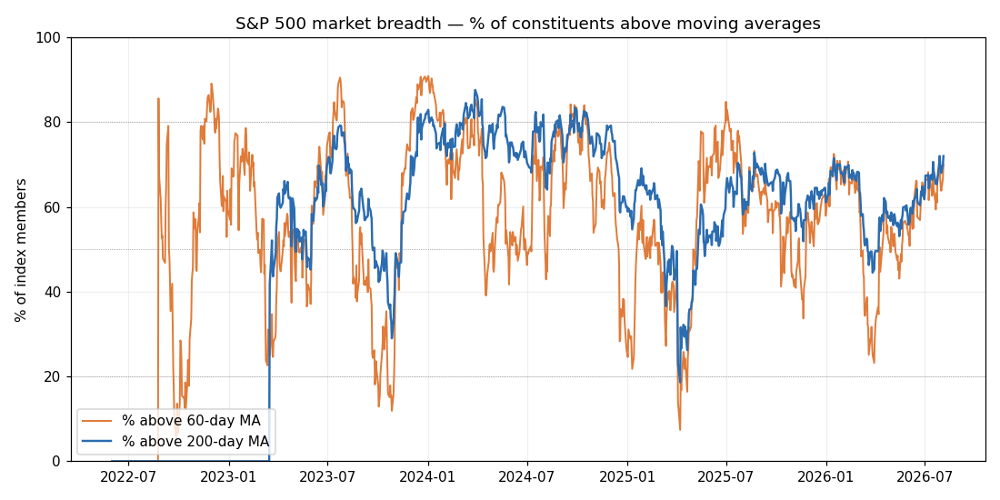
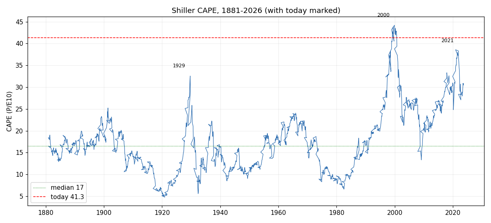
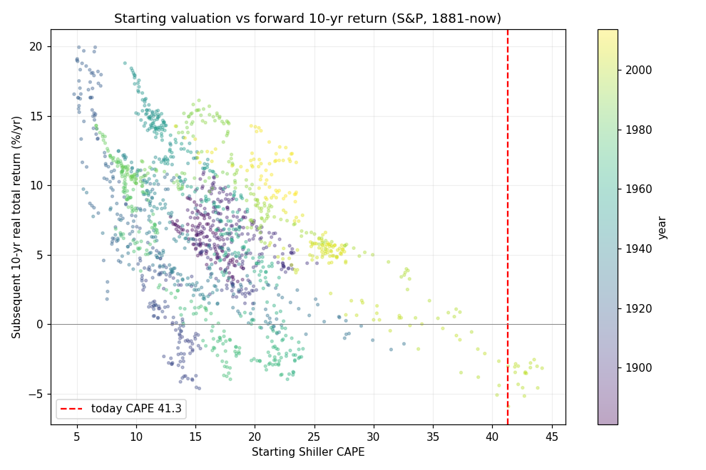
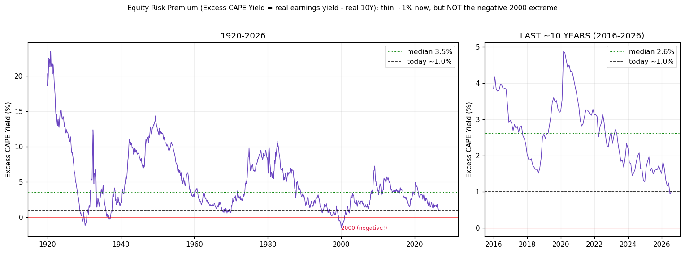

# 市场标尺：标普 500 现在有多高、质量有多好？
## 四个维度 —— 广度 · 估值 · 持仓 · 质量
### 2026 年 8 月 4 日 —— 市场层面分析

> **用户的要求：** 一份单独的报告，衡量**市场有多高、质量有多好**，围绕三个里程碑：(1) 涨势的**广度/宽度**（是否已扩散到半导体以外？——对比历史回溯）；(2) 一次**估值**检验（PE/PS 等对比历史）；(3) **机构/持仓**指标（CTA + 其他）。外加任何有用的补充。

> **TL;DR —— 昂贵且拥挤，但质量确实高。是"为完美定价"，而非"垃圾泡沫"。**
> - **估值：历史级极端。** 席勒 **CAPE 41.3 = 1881 年以来第 98.9 百分位**（中位数 16.5；史上唯有 1999 年 12 月的 44.2 更高）。前瞻 P/E 约 21（对比约 17–18 常态）、滚动约 28、P/S 约 3（对比约 1.5）、**巴菲特指标约为 GDP 的 225%（约 99 百分位）。** *每一个*指标都说昂贵。
> - **……但按利率调整后是薄、而非末日。** **超额 CAPE 收益率（股票盈利收益率 − 实际 10 年期）≈ +1.0%**，低于十年中位（约 2.6%）与长期中位（约 3.5%）——**十年来对债券最薄的缓冲**——但仍为**正，不同于 2000 年峰值（−2.6%）**。4.6% 的债券如今是真实竞争（§9.2a）。
> - **广度：两副面孔。** *参与度*健康（**72% 的标普成分股在其 200 日均线上方、70% 在 60 日均线上方**——由 503 只成分股计算，8 月 4 日），但*领导集中度*仍是**20 年来最窄**——等权/市值权（RSP/SPY）处于 2005–26 区间的**第 3 百分位**。"变宽"在 3 个月视角上为真（+1.8%），但**脆弱**：过去*一周*因大盘股财报而重新收窄 −3.5%，且过去一个月仅 **11 个行业中的 3 个**跑赢标普。
> - **前瞻回报：你付的价格决定你能拿多少。** 回测**145 年**：最便宜的 CAPE 十分位在其后 10 年带来 **+11.7%/年实际回报**，最贵的仅 **+0.6%/年**。**从 CAPE ≥34 起步（如今天的 41.3），此后 10 年平均实际回报为 −2.4%/年（区间 −5.9% 至 +1.7%）**——见 §9。此前每次 CAPE 约 40（1929、2000）都先于 **−43% 至 −77% 的实际回撤**。
> - **持仓：拥挤且不对称。** CTA 净多头（约 340 亿标普），若动量转向则有 **1000 亿+ 的*机械性*下行**；**VIX 16.5（第 48 百分位）**——无恐惧缓冲。
> - **质量：真正的多头之锚。** **创纪录的盈利 + 创纪录的净利率。** 这正是[AI 泡沫报告](../ai_bubble/report_cn)所说的"**1998→1999 年末、已装填但未点燃**"的市场，而*非*无盈利的 1999 式冲顶。高价，但底下是真实盈利。
> - **净结论：市场很高（估值约 99 百分位、持仓拥挤），安全边际很薄——但质量很高。易受持仓/利率/信用冲击，而非单纯估值崩塌。**
> - **仅为教育/分析，并非投资建议。**

---

## ⚠️ 协议与数据卫生提示

应用**两步研究协议**。§1 方法 · §2 第一步草稿 · §3 第二步评审 · §4 广度 · §5 估值 · §6 持仓 · §7 质量 · §8 综合结论。

**Rule 4 旗标：**（a）yfinance 列按字母序 → 按名称索引。（b）**CAPE 百分位、广度（RSP/SPY）、行业参与与 VIX 均在此*计算*且可复现**；（c）**前瞻/滚动 P/E、P/S 与巴菲特指标为网络来源的时点估计**（区间、非精确），已如实标注；（d）**CTA 数字在不同日期快照间冲突**（净多加仓 vs 早先投降式抛售）——方向上"拥挤"，确切数字为临时值。

---

# 第 1 节 —— 事实底稿与方法

- **计算得出（可复现，`run_market_gauge.py`）：** RSP/SPY 等权对市值权广度比 + 百分位 + 1 周→12 月趋势（yfinance，2005–26）；11 个行业相对 SPY 的参与度；VIX 水平 + 百分位；**席勒 CAPE 百分位**（耶鲁 `ie_data.xls`，1881 至今）。
- **网络来源（时点、已标注）：** 前瞻 P/E、滚动 P/E、P/S、巴菲特指标、200 日均线上方占比、CTA/持仓（高盛/德银经行业媒体）、利润率/盈利纪录。
- **百分位 = 相对该资产自身历史有多贵/多窄**（越高越极端）。我们同时报告*水平与百分位*，以免离群值误导。

---

# 第 2 节 —— 第一步：简明研究草稿

**核心结论：** 标普在**每个估值维度上都昂贵（CAPE 约 99 百分位）、机械性持仓拥挤、领导仍窄——但由创纪录的真实盈利支撑。** 它是一个*高价、高质量、薄安全边际*的市场：一个**为完美定价的后段周期**，而非低质量泡沫。下行更可能来自**持仓/利率/信用触发**，而非单纯估值。

*支撑（主张 → 证据）：*
1. **估值处约 99 百分位极端** → CAPE 41.3 = 1881 年来第 98.9 百分位；巴菲特约 225% GDP。*证据：§5——已取得。*
2. **尽管参与改善、领导广度仍历史级窄** → RSP/SPY 第 3 百分位；69% 在 200 日上方。*证据：§4——已取得。*
3. **盈利质量确实高** → 创纪录利润率 + 创纪录总盈利。*证据：§7——已取得（网络）。*

*反对（主张 → 证据）：*
1. **高估值或被利润率/利率"合理化"** → 创纪录盈利能力支撑更高倍数。*证据：需利润率可持续性/利率路径——**部分未知**。*
2. **广度在扩散 → 利多、非后段** → 3 月 RSP/SPY +1.8%、69% >200 日。*证据：已取得，但上周反转 + 3/11 行业说明其早且脆弱。*

---

# 第 3 节 —— 第二步：严格同行评审（不重写草稿）

1. **需核实的事实：** 精确的前瞻/滚动 P/E 与 P/S（区间、随提供方而变）；**200 日广度数字**（有来源引 69% *也有* 95%——定义敏感）；**实时 CTA 净敞口**（快照按日期冲突）；"创纪录利润率"是否为周期高点（均值回归风险）。
2. **逻辑跳跃 / 概念偷换：** 勿把**参与广度**（%>200 日、健康）与**领导集中度**（RSP/SPY、窄）混同——它们说*相反*的话，而"广度没问题"的头条掩盖了集中；"高利润率合理化高 CAPE"是**体制假设**、非定律（利润率会均值回归）；CAPE 是*长周期回报*信号、**非择时工具**。
3. **缺失的反例 / 竞争解释：** CAPE 已"昂贵"十年而市场继续涨（它预测*10 年*回报、非明年）；指数构成偏向更高利润率的科技（部分 CAPE 抬升是**结构性**、非纯泡沫）；债务货币化体制抬升*名义*一切。
4. **应补充的一手来源：** 标普/席勒盈利序列；Yardeni/FactSet 前瞻 P/E 与利润率数据；高盛/德银主经纪 CTA 报告（一手）；美联储/GDP 用于巴菲特分母；纽交所/纳指 A-D 与 %>200 日一手数据。
5. **推测、而非事实：** "为完美定价"；"薄安全边际"；触发将是持仓/信用而非估值；"1998→1999 年末"映射（借自 AI 泡沫报告的定性）。

---

# 第 4 节 —— 广度：两副面孔（涨势在扩散吗？）

**面孔 A —— 参与度健康（利多）：** **72% 的标普 500 成分股在其 200 日均线上方、70% 在 60 日均线上方**（由 503 只成分股计算，2026 年 8 月 4 日——图见 §9.1；与网络的约 69% 相符）。3 个月视角上等权指数在追赶（RSP/SPY **+1.8%**）。

**面孔 B —— 领导集中度是 20 年来最窄（警示）：**

| RSP/SPY（等权 对 市值权）| 数值 |
|---|---|
| 当前水平（2005 = 1.00）| **0.845** |
| **2005–2026 区间百分位** | **第 3** |
| 过去 12 个月变化 | **−1.4%**（大盘股仍领跑）|
| 过去 1 周变化 | **−3.5%**（因大盘股财报重新收窄）|
| 过去 3 个月变化 | **+1.8%**（扩散）|
| **过去 1 个月跑赢 SPY 的行业** | **3 / 11** |
| 过去 3 个月跑赢 SPY 的行业 | 4 / 11 |

**解读（直接回答用户）：** 你的直觉**部分正确**——参与度*确在*扩散（69% >200 日、3 个月等权追赶）。**但市值权集中度仍近 20 年极端，且改善早而脆弱：** *上周*实际重新收窄 −3.5%（大盘股财报把指数拉高、而平均个股落后），过去一个月仅 **11 个行业中的 3 个**跑赢指数。**结论：在历史级窄领导之上、真实但未确认的扩散。** 持久的体制转变应表现为 RSP/SPY *连续数月上行* + >6/11 行业领先——目前尚未如此。

*（RSP/SPY 是干净、可复现的广度代理：下跌时是少数大盘股在扛指数；上升时是平均个股在参与。）*

---

# 第 5 节 —— 估值：每个维度都昂贵

| 指标 | 2026年8月 | 历史均值/中位 | 百分位 | 判断 |
|---|---|---|---|---|
| **席勒 CAPE** | **41.3** | 16.5（中位）| **第 98.9** *（计算，1881 至今；史上最高 44.2 = 1999 年 12 月）* | **非常昂贵** |
| 前瞻 P/E | 约 21 | 约 17–18 | >90 | 昂贵 |
| 滚动 P/E | 约 28 | 约 19–20 | >90 | 昂贵 |
| 市销率 P/S | 约 3.0 | 约 1.5 | 约 99 | 历史 2 倍 |
| **巴菲特（市值/GDP）** | **约 225%** | 约 100% | **99–100** | 创纪录 |

**解读：** **没有任何一个估值指标说"便宜"。** 最稳健的单一锚——**CAPE 处 145 年的第 98.9 百分位**，基本等于互联网泡沫顶——意味着前瞻*10 年*实际回报很可能偏低。**警告（Rule 4 / §3）：** CAPE 是**长周期**信号、*非*择时工具（已高企十年）；部分抬升是**结构性**（指数偏向高利润率科技）与**体制性**（债务货币化抬升名义估值）。但就*安全边际*而言，答案毫不含糊：**非常薄。**

---

# 第 6 节 —— 持仓与波动：拥挤且不对称

- **CTA / 系统性趋势跟随：** 净多头（约 **340 亿**标普期货、约 930 亿全球股票）。风险**不对称且机械**：若动量转向，模型可能**无视基本面**全球抛售 **1000 亿+**——一次持仓驱动的气穴（同样是"机械、动量非价值"的资金流，可在任一方向过冲）。*（Rule 4：按日期的快照冲突——春季显示投降/做空，夏季净多加仓；方向按"拥挤"处理，确切数字为临时值。）*
- **VIX 16.5 —— 第 48 百分位**（1 年均值 18.2、2005–26 中位 16.8）：居中，**无恐惧缓冲**。保护偏便宜、盘面偏自满——与 [tail_hedge](../tail_hedge/summary_cn) 的观点一致：对冲最好在压力*之前*、VIX 低时买。
- **净结论：** 持仓是**脆弱性放大器**、而非触发——它让任何外生冲击（利率/信用/地缘）打得更狠更快。

---

# 第 7 节 —— 质量：真正的多头之锚

- **创纪录的总盈利 + 创纪录的净利率。** 这是与低质量泡沫的决定性区别：高价坐落在**真实且增长的利润**之上，而非故事股。
- 它与 [AI 泡沫报告](../ai_bubble/report_cn) 是同一信号（美光 80% 利润率、超大规模厂商现金机器）——那个"**1998→1999 年末、铲子确实赚钱**"的市场。之所以昂贵，*是因为*盈利真实且在加速，而非与之脱节。
- **质量警告（§3）：** 创纪录利润率是**周期高点**、可能均值回归；且质量**集中**在主导指数的同一批大盘股（见 §4）。所以"高质量"与"窄"是一枚硬币的两面——质量真实、但**分布不广**。

---

# 第 8 节 —— 综合结论：有多高、有多好

**百分位记分卡：**

| 维度 | 读数 | 信号 |
|---|---|---|
| 估值 —— CAPE | 41.3（第 98.9 百分位）| 🔴 昂贵 |
| 估值 —— 巴菲特 | 约 225% GDP（约 99）| 🔴 昂贵 |
| 广度 —— 集中度 | RSP/SPY 第 3 百分位 | 🟠 窄 |
| 广度 —— 近期趋势 | 3 月 +1.8% / 1 周 −3.5% | 🟡 扩散但脆弱 |
| 持仓 —— VIX | 第 48 百分位 | 🟡 居中 / 无缓冲 |
| 持仓 —— CTA | 净多、1000 亿+ 下行 | 🟠 拥挤/不对称 |
| **质量 —— 盈利** | 创纪录盈利 + 利润率 | 🟢 高（真实利润）|

```
有多高：   非常高。估值约 99 百分位（CAPE ≈ 互联网泡沫顶）、巴菲特创纪录、
           持仓拥挤。安全边际很薄。
有多好：   确实好。创纪录盈利 + 利润率；参与在改善。这是质量主导、非垃圾主导。
综合：     "为完美定价"。一个高价、高质量、薄缓冲、仍窄的后段周期市场。
           不是无盈利的 1999/2000 冲顶，但容错空间很小。
对应于：   AI 泡沫报告的"1998 -> 1999 年末、已装填但未点燃"
           （ai_bubble 附录 C）：脆弱前提具备、触发缺席。
脆弱点：   一次持仓/利率/信用冲击（CTA 平仓、美联储意外、甲骨文/AI 信用金丝雀），
           而非单纯估值崩塌。
何以改善质量：RSP/SPY 连续数月上行 + >6/11 行业领先（持久广度）——
           会让高位更健康、更不脆弱。
```

> **给用户的结论：** 市场**历史级高**——CAPE 处第 99 百分位（基本是 1999 水平）、巴菲特创纪录、持仓拥挤、领导仍是 20 年最窄。**但质量确实好：** 创纪录盈利与利润率意味着这是一个*为完美定价、高质量*的盘面，而非无盈利泡沫。你"宽度在变好"的判断**部分正确**——参与在改善（69% >200 日）——但市值权集中度仍近二十年极端、上周还重新收窄，故把扩散视为**真实但未确认**。实操：**薄安全边际 + 高质量 = 保持在场但对冲/分散**（这正是 [30/30/40 杠铃](../portfolio/report_cn) 与 [tail-hedge](../tail_hedge/summary_cn) 的理由），并盯**持仓/信用**触发、而非 P/E，来判断拐点。

---

# 第 9 节 —— 深挖更新（2026年8月4日）：真实广度、图表、前瞻回报与估值峰谷

> 按用户追问补充：(a) 由 503 只成分股得出的**真实**广度（% 在 **60 日**与 **200 日**均线上方）；(b) 一次 **CAPE → 前瞻回报回测**；(c) **图表**以观察趋势；以及(d) **峰/底历史**（"像 26 这样的高 P/E——哪一年、为什么、之后发生了什么？"）。全部经 `run_deep_dive.py` 可复现。

## 9.0 两步协议（针对新主张）

**第一步 —— 简明草稿。** *核心结论：* 今天的估值（CAPE 约 99 百分位）落在这样一个区域——在 145 年里，它先于**接近零至负的 10 年实际回报**；而广度确认了健康但窄的参与——强化 §8 "为完美定价"的结论。
- 支撑 1：*便宜起步 → 高前瞻回报、昂贵起步 → 低* → CAPE 十分位表（§9.2）。*证据：已取得。*
- 支撑 2：*此前每次 CAPE 约 40 都收场惨烈* → 1929/2000 回撤 −77%/−43%（§9.3）。*证据：已取得。*
- 支撑 3：*当前参与确实宽* → 72% >200 日 / 70% >60 日 计算所得（§9.1）。*证据：已取得。*
- 反对 1：*高利润率/结构或使更高 CAPE 合理* → 利润率创纪录、指数偏科技。*证据：部分——利润率均值回归未知。*
- 反对 2：*CAPE 非择时工具* → 自约 2017 起已 >30 而市场仍涨。*证据：已取得（1 年列很弱）。*

**第二步 —— 同行评审。** (1) *需核实：* 41.3（网络）与我截至 2023 年 9 月的席勒文件——百分位/回测使用**文件内**历史，41.3 作为标记；成分股广度用**当前**成分（幸存者偏差——被剔除的名字未计）。(2) *概念偷换：* "前瞻 10 年实际 −2.4%" 是**重叠**起始月的**平均**（自相关；有效 n≈36）——方向强、统计软。(3) *缺失反例：* CAPE ≥34 样本由 **1998–2000 与 2021** 主导——是少数体制、非 145 次独立抽样。(4) *一手来源：* 席勒原始序列；Bunn/Shiller 的 CAPE-回报研究；无幸存者偏差的成分股历史。(5) *推测、非事实：* 今天"必然"交出 −2.4%（是基率、非预测）；峰值类比（每个周期不同）。

## 9.1 由成分股得出的真实广度（今日计算）

**截至 2026 年 8 月 4 日：503 只成分股中 72% 在其 200 日均线上方、70% 在 60 日均线上方。** 这*确认*（并略微上修）网络的约 69%，并给 §4 的"面孔 A"定论——参与确实宽，而 60 日（更快）线略低于 200 日线，说明极近期动量既不过热、也未破位。



*左：**近 10 年（2015–2026）**；右：**近 12 个月**。解读：参与健康（两线约 70%），已从 2026 年初的低点恢复。整个十年里广度在 20–90% 间摆动——今天约 70% 属中性偏健康、并非狂热。但回想 §4 面孔 B——这种宽参与与**创纪录的市值权集中**（RSP/SPY 第 3 百分位）并存。两件事同时为真。*

## 9.2 估值的时间序列 + 前瞻回报回测

**前瞻 P/E 约 21 真的高于历史均值吗？是** —— 前瞻 P/E 约 21 对比约 10 年均值约 17–18，**高出约 15–20%**；更长历史的 P/E 中位约 15–16，故更贵。但最干净的长历史锚是 **CAPE**：



*左：**全历史 1881–2026**；右：**近 10 年（2016–2026）**。今天的 CAPE 41.3（红线）高于 1929 峰（32.6）与 2021 峰（38.6），仅次于 2000 峰（44.2），对比 145 年中位约 17。**而且相对近十年也高：2016–2026 的 CAPE 中位约 31——今天的 41.3 也高居这十年之首。**（数据卫生提示，Rule 4：耶鲁席勒镜像截至 2023 年 9 月、CAPE 30.8；**2023–2026 尾部（红）为重构**——由实际价格、并将缓慢的 10 年盈利分母校准至已报的 41.3，是透明的双锚内插、而非新数据源。）*

**回测 —— 起始估值 vs 此后实际总回报（年化，1881→今）：**

| CAPE 十分位 | CAPE 区间 | 前瞻 1 年 | 前瞻 3 年 | **前瞻 10 年** |
|---|---|---|---|---|
| 1（最便宜）| 4.8–9.3 | +16.7% | +12.8% | **+11.7%** |
| 5（中位）| 15.0–16.5 | +7.2% | +5.0% | **+6.7%** |
| 9 | 22.4–26.9 | +6.2% | +5.7% | **+4.5%** |
| **10（最贵）** | **26.9–44.2** | +2.9% | +0.9% | **+0.6%** |
| **从 CAPE ≥34 起步（如今天）** | ≥34 | — | — | **平均 −2.4%/年（−5.9% 至 +1.7%）** |



*左：**全历史（1881 至今），CAPE vs 前瞻 10 年实际回报**；右：**近 10 年（2013–2022 起点），CAPE vs 前瞻 1 年实际回报**。*

**解读：** 关系单调且强——**你付的价格决定你能拿的回报。** 最贵十分位*历史上*十年仅约 0%/年实际；≥34 区域（我们所处）平均为**负**。**引人注目的是，近十年面板也向下倾斜：** 即便在 1 年视角，这十年*最高*的 CAPE 读数（2021 峰约 38）随后是 **−10% 至 −20% 实际**（2022 熊市），而更便宜的 2013–2016 起点（CAPE 约 24）交出正收益。*警告（§9.0）：近十年 1 年信号严重依赖 2022 这单一事件——是提示、非证明；且这些都无法精确择时顶部（1 年信号在全样本中噪声大）。*

## 9.2a 按利率调整 —— 股权风险溢价（"对债券"的视角）

**原始 CAPE 唯一漏掉的东西：**"相对历史昂贵"暗含假设债券收益率与过去一样。并非如此——10 年期国债如今约 **4.6%**，而 2010 年代约 **2%**。利率感知的度量是**超额 CAPE 收益率（ECY）= CAPE 实际盈利收益率（1/CAPE）− 实际 10 年期收益率**——即股票相对债券的溢价。



**截至 2026 年 8 月，ECY ≈ +1.0%**——低于近十年中位（**约 2.6%**）与长期中位（**约 3.5%**）：**整个十年里股票对债券最薄的缓冲**（2010 年代中期约 4%，2020 年低点约 4.9%）。**但——关键的细微之处——它仍为*正*，不同于 2000 峰值（−2.6%）。** 因为 2000 年是高 CAPE *叠加高实际利率*，而今天的实际利率更低，故*利率调整后*的图景是**昂贵、但并非互联网泡沫顶那种零溢价极端。**

**两面解读：**
- 🔴 *偏空：* 对债券的溢价已从约 4%（2010 年代中期）压缩至约 1%——**债券如今是真实竞争**；这是更高更久体制对股票的征税，也是为何"直接买股票"比 2010 年代是更弱的本能反应。
- 🟢 *缓和：* 按利率计我们大致处于**第 10–25 百分位——薄、但为正**；一旦你不再把今天的倍数与近零利率的十年相比，原始 CAPE 的警报就有一部分被抵消。这是*反对*纯粹"CAPE = 2000 重演"恐慌的最强单一论据——也正是为何 [30/30/40 杠铃](../portfolio/report_cn) 的黄金 + 一小片国债如今更重要（债券终于付息了）。

*（数据卫生，Rule 4：ECY 历史为席勒自有列，截至 2023 年 9 月；2023–26 延伸锚定该末值，并按 CAPE 收益率与名义 10 年期的变化移动——恒定的通胀预期在利率差中抵消。水平为近似；趋势/百分位稳健。）*

## 9.3 估值峰与底 —— 哪一年、为什么、之后如何

*（实际总回报回撤与前瞻 10 年实际 CAGR 由席勒实际 TR 指数计算。）*

| 事件 | 约 CAPE | 驱动 | 此后 5 年**实际回撤** | 此后 10 年实际 CAGR |
|---|---|---|---|---|
| **1929-09 峰** | 32.6 | 咆哮 20 年代杠杆/保证金狂热 | **−77%** | −1.4%/年 |
| 1966 峰 | 24.1 | 漂亮 50 起点；滞胀前夜 | −22% | −2.5%/年 |
| **2000-03 峰** | **44.2** | 互联网泡沫 | **−43%** | −2.8%/年 |
| 2007-10 峰 | 27.5 | 房地产/信用顶 | −50% | +5.7%/年 |
| 2021-12 峰 | 38.6 | 疫情后刺激 / 大盘股 | −24% *（部分）* | −5.8%/年 *（进行中）* |
| **1982-07 底** | **6.6** | 沃尔克衰退；14% 通胀被打破 | 0% | **+14.3%/年** |
| **2009-03 底** | 13.3 | 金融危机底 | 0% | **+14.3%/年** |

**针对用户的具体例子——"像 26 这样的高 P/E"：** *滚动* P/E 处于 20 多的中高段（CAPE 20 多中段至约 30）曾聚集于 **1929、1966、2007**——每一个都是**大顶**，先于 −22% 至 −77% 的实际回撤与**失去的十年**。镜像同样决定性：两个**最便宜**的起点（1982 CAPE 6.6、2009 CAPE 13.3）在其后十年交出 **+14%/年实际**。**估值并未精确择时顶部，但它强有力地设定了 10 年回报——而今天的 41.3 站在错误的一端。**

## 9.4 这为结论新增了什么

- §8 "为完美定价"的判断**被一个数字强化**：从此处起，*基率*的 10 年实际回报约为 **0 至负**，且每次历史 CAPE 约 40 都先于深度实际回撤。
- **但质量（§7）与宽参与（§9.1）正是它是"1998→1999 年末"而非 2000 年 3 月的原因**——真实盈利、72% 个股参与。高价坐落在高质量之上。
- **实操含义不变且更锐利：** 低预期*回报* + 薄安全边际，支持 [30/30/40 杠铃](../portfolio/report_cn)（当股票前瞻回报低时，黄金的不相关实际回报更重要），并**盯持仓/信用来判拐点**——估值设定*赌注*、而非*时机*。

---

## 自行复现

```
cd market_gauge
python run_market_gauge.py     # 写入 data/*.csv（广度、行业广度、估值、VIX、记分卡）
python run_deep_dive.py        # §9：成分股广度（60/200 日）、CAPE 前瞻回报、ERP、峰谷 -> charts/*.png
```

**数据文件**（`market_gauge/data/`）：`breadth.csv`、`sector_breadth.csv`、`valuation.csv`、`vix.csv`、`scorecard.csv`，及 §9：`breadth_constituents.csv`、`cape_forward_returns.csv`、`excess_cape_yield.csv`、`valuation_peaks.csv`。**图表**（`market_gauge/charts/`）：`breadth_constituents.png`、`cape_history.png`、`cape_forward_scatter.png`、`erp_excess_cape_yield.png`。CAPE 由耶鲁 `ie_data.xls` 计算；成分股来自 `datasets/s-and-p-500-companies` 列表；10 年期收益率来自 yfinance `^TNX`。

**来源（访问于 2026 年 8 月 4 日）：** yfinance（RSP、SPY、^VIX、11 个 SPDR 行业）；耶鲁/席勒 `ie_data.xls`（CAPE 1881 至今）；网络估值（MacroMicro、investsnips、GuruFocus、worldperatio——前瞻/滚动 P/E、CAPE、巴菲特）；广度（Stock Alarm Pro、MacroMicro、CondorEdge——%>200 日、A/D）；持仓（高盛/德银经 Yahoo/Hedgeweek/Investing.com——CTA/情绪）。**PE/PS/巴菲特为时点估计（Rule 4）；CTA 快照按日期冲突。**

---

*两步研究协议已应用（§2 草稿 + §3 评审）。计算指标可复现；网络来源水平已标注。CAPE 是长周期、非择时信号。仅为教育/分析，并非投资建议。*
