# VLCC 深挖：美国成品油出口限制 & 运价-股价周期手册
# 中后段周期的一次检查点，两个模块
### 2026 年 9 月 16 日 —— 周期分析（CRule 1/3/4/6/8）

> **背景（用户框架）：** 经过半年多，DHT/FRO 已有不小涨幅、大周期部分兑现。因为是*周期*股，我们必须知道**处于哪个阶段**——外部利好很多，但要保持警惕。用户要求两个研究模块。

> **TL;DR**
> - **模块 1 —— 美国成品油出口限制 → "全世界原油都往中国运再转口"？** 具体法案存在（**H.R. 8266《2026 汽油出口禁令法案》**，当美国零售价 >\$3.12/加仑连续 7 天时触发），但**政府表示*不*推进禁令**——故这是**尾部风险、非基准情形。** *若*实施，诚实的裁决是**细腻的、而非简单的"一切经中国"命题：** **成品油**出口限制对**成品油轮（LR2/MR）利空**，仅**间接**对 VLCC 利多——它会搁浅美湾炼厂、把更多*原油*推向亚洲炼厂（中国/印度，已是"苏伊士以东"出口枢纽）、拉长吨海里，可能*温和地*抬升 VLCC 需求约 **+2–5%（未经证实）**。干净的历史类比（1975–2015 原油出口禁令）表明政策*能*重塑全球油轮路线达数十年——但对 VLCC 的符号取决于是原油还是成品油范围。
> - **模块 2 —— 跨周期的运价-股价（量化手册）：** 跨 **4 个周期**，我们自己的数据得出三条硬规则：**(1) FRO 是高贝塔载体**——其谷底→顶部股价倍数持续为 **DHT 的约 1.6–2 倍**（2005-08：FRO 3.7× vs DHT 1.8×；2022-26：FRO **11.8×** vs DHT **6.9×**）。**(2) 股价追踪*持续*运价约 1:1，而*忽略*瞬时飙升**——2019-20 运价*飙*了 16.7×（中远海运 \$300k、疫情）而股价仅 ~2.2–2.5×（它定价*持久*水平、非头条）。**(3) 当前周期已是 FRO/DHT 史上最大股价涨幅**（FRO 自 2022 谷底 +1080%），*因为*运价强度最**持续**（结构/供给驱动）、而非飙得最高。
> - **周期定位：** 中后段。股价倍数如今**超过**所有此前*正常*周期——与"大周期已大体兑现"一致。面对 **2028 供给墙**（[vlcc_supply](../vlcc_supply/report_cn)），这支持 **CRule 8 退出纪律**（逢强减仓），而非新追高。
> - **仅为教育/分析，并非投资建议。**

---

## ⚠️ 协议与数据提示

应用**两步研究协议**与**周期 CRules 1/3/4/6/8**。模块 1：§1–3。模块 2：§4–6。§7 周期定位结论。**股价数据精确（yfinance 拆股/股息复权）；VLCC TD3C 运价水平为近似/来源并已标注（Rule 4）；贸易流影响估计明确标注"未经证实"。** 模型经 `run_cycle_model.py` 可复现。

---

# 模块 1 —— 美国成品油出口限制 & 全球原油再路由

# 第 1 节 —— 事实底稿（2026 年 9 月 16 日核实；Rule-4 标注）

| 事实 | 细节 | 来源（Rule 4）|
|---|---|---|
| **法案** | **H.R. 8266《2026 汽油出口禁令法案》**——当美国零售价 >**\$3.12/加仑连续 7 天**时禁止汽油出口；总统可豁免 | GovTrack（法案原文）|
| **政府立场** | 截至 2026 年初/中，**不主动推进**原油或成品油出口禁令（尽管国会/媒体施压）| OilPrice；Resilience.org |
| **美湾成品油出口** | **~3.5–4.0 mb/d**——主要汽油→拉美、柴油→欧洲 | EIA；McKinsey（2026 前基线）|
| **炼能"苏伊士以东"迁移** | 产能 + 成品油出口增长集中于**中国与印度**；印度出口 **>1.2 mb/d** 成品油；中国出口配额在新五年规划下上升 | EIA 展望；S&P Global；Argus |
| **中国炼厂规模** | **中石化 = 全球最大炼厂**；茶壶厂靠折价俄/伊原油满负荷 | OilGasStorageNews；AInvest |
| **历史类比** | **1975–2015 美国原油出口禁令**：美国原油出口近乎停止、油轮转做*进口*活；**2015 解禁**使美国成为顶级原油出口国并**重塑全球油轮流向**（美湾→大西洋/亚洲）| Ballotpedia；哥伦比亚大学；Forbes |

**用户的具体假设（善意重构）：** 历史上成品油走*短途*（美洲←美国、亚洲←中国、欧洲←美国）。若美国限制出口，世界原油是否越来越多地路由到**中国**（炼制）再向全球转口成品油 → **更多长途原油吨海里 = VLCC 利多**？

---

# 第 2 节 —— 第一步：简明研究草稿

**核心结论：** 美国**成品油**出口限制会**直接利空成品油轮**，仅通过原油路由向亚洲炼厂转移而**间接、温和地利多 VLCC**——**并非**头条暗示的干净"一切经中国"超级利多，且是**低概率尾部**（政府不推进）。持久的 VLCC 多头逻辑仍取决于**供给**（船队/订单簿，[vlcc_supply](../vlcc_supply/report_cn)）与**影子船队/地缘**，而非此政策。

*支撑（主张 → 需要什么证据）：*
1. **炼油重心已在苏伊士以东** → 中国/印度是增长中的成品油出口枢纽；美国成品油上限加速迁移 → 更多原油东运。*证据：§1 EIA/S&P——已取得（方向）；量级**未知**。*
2. **政策能重塑油轮路线数十年** → 1975–2015 禁令是"美国出口政策重塑全球流向"的概念验证。*证据：§1 历史——已取得。*
3. **更长的原油吨海里有利 VLCC** → 把大西洋/美国原油送往亚洲而非短途成品油、拉长航程。*证据：机制成立；净桶数学**未证实**。*

*反对（主张 → 反证）：*
1. **成品油禁令打击的是*成品油轮*、非 VLCC** → 直接牺牲品是 LR2/MR（美湾成品油出口 ~3.5–4 mb/d）；VLCC 收益是二阶，且若美国*原油出口*也降则可能*抵消*。*证据：§1——已取得；VLCC 净符号**未知**。*
2. **或永不发生/仅临时** → 政府不推进；法案价格触发且可豁免 → 不太可能持久重塑贸易。*证据：§1 立场——已取得。*

---

# 第 3 节 —— 第二步：严格同行评审（不重写草稿）

1. **需核实的事实：** 美国成品油上限对 VLCC 吨海里的**量化**增量（我**未找到可信的公开数字**——我的"+2–5%"是**估计、非来源**）；成品油禁令是否也会抑制美国*原油出口*（对 VLCC 符号相反）；当前美湾成品油出口按目的地的确切拆分。
2. **逻辑跳跃 / 概念偷换：** 最大的是**"成品油出口限制" ≠ "原油出口限制"**——用户的"一切经中国"直觉其实是*原油*流故事，但实际法案针对*成品油*；混淆二者会颠倒油轮影响。且"中国炼油更多 → VLCC 原油进口更多"假设中国*增加*炼能服务世界、而非仅替代——**未证**。
3. **缺失的反例 / 竞争解释：** 中国石油需求预计 **~2027 见顶**（或*不*结构性扩大原油进口）；成品油上限可能干脆**摧毁**美国炼油毛利与量（全球炼制的原油减少、而非仅重新布局）；**运费已反映**影子船队/地缘，故缓慢的政策转变或属边际。
4. **应补充的最重要一手来源：** EIA STEO + 《2028 全球炼油展望》；含政策冲击情景的 Clarksons/BIMCO 吨海里模型；H.R. 8266 原文及 CBO/委员会分析；Kpler 按起讫地的原油/成品油流。
5. **推测、而非事实：** "+2–5% VLCC 需求"数字（**明确是估计**）；"世界原油经中国再转口"（一种*情景*、非既定）；任何称此政策是 VLCC *主要*驱动的说法（它是尾部）。

> **模块 1 结论：** 有趣的尾部，但要**给命题上纪律**：法案针对**成品油**（利空 LR2/MR），VLCC 收益是**间接且未量化**的，中国需求或于 2027 见顶，且政府不推进。**别把 VLCC 多头逻辑押在此上**——把它当供给驱动核心之上的可选上行。1975–2015 类比证明政策*能*重塑流向数十年，故值得**观察**、而非下注。

---

# 模块 2 —— 跨 VLCC 周期的运价-股价（量化手册）

# 第 4 节 —— 四个周期：股价倍数 vs 运价倍数

*（FRO/DHT 拆股/股息复权，精确。VLCC TD3C 运价锚为近似/来源，Rule 4。上升腿谷底→顶部。可复现：`run_cycle_model.py`。）*

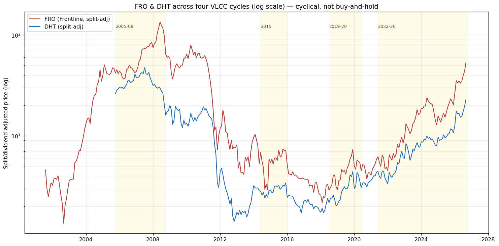

| 周期 | 驱动 | 持续运价倍数 | 飙升（瞬时）| **FRO 股价** | **DHT 股价** | FRO 对持续贝塔 |
|---|---|---|---|---|---|---|
| **2005-08** | 中国需求超级周期 | ~1.9×（\$50k→\$95k）| \$196k（2008年7月）= 3.9× | **3.7×**（26月）| **1.8×**（21月）| 1.95× |
| **2015** | 中国 SPR + 廉价油 | ~2.3×（\$28k→\$65k）| \$100k = 3.6× | **2.5×**（11月）| **1.4×**（15月）| 1.08× |
| **2019-20** | （见飙升）| ~2.5×（\$18k→\$45k）| **\$300k 中远海运 / \$200k 疫情 = 16.7×** | **2.5×**（17月）| **2.2×**（12月）| 1.00× |
| **2022-26** | 供给驱动 + 俄罗斯 + 霍尔木兹 | **~4.8×（\$20k→\$85–95k）** | \$585k（2026）= 29× | **11.8×**（56月）| **6.9×**（56月）| 2.48× |

---

# 第 5 节 —— 三条量化规则（数据证明了什么）

**规则 A —— FRO 是高贝塔载体；DHT 是"更干净"的低贝塔。** 在*每个*周期，FRO 的谷底→顶部倍数都是 **DHT 的约 1.6–2 倍**（2005-08：3.7× vs 1.8×；2022-26：11.8× vs 6.9×）。这是经营杠杆 + 更高现货敞口 + 更高财务杠杆（CRule 4）。**要最大弹性选 FRO；要同一周期但更平缓选 DHT。**（呼应金矿的金罗斯-vs-Agnico 弹性逻辑。）

**规则 B —— 股价定价*持续*运价，且基本*忽略*瞬时飙升。** 这是最重要的发现。**2019-20**，运价*飙*了 **16.7×**（中远海运 \$300k、疫情 \$200k），但股价仅涨 **~2.2–2.5×**——**对飙升的贝塔仅约 0.13×**。而对**持续**运价倍数（~2.5×），股价贝塔约 **1.0×**。**市场把两周的 \$300k 报价贴现到几乎为零；它按持久水平重估。**（这正是 2026 年 8 月 \$585k 霍尔木兹飙升在股价上消退之因——[季节性 §8](../vlcc_seasonality/report_cn)。）*实操：别买运价飙升的头条；买/持一个持续运价体制。*

**规则 C —— 当前周期是史上最大股价涨幅，*因为*它最持续、而非飙得最高。** 2022-26 持续运价倍数（~4.8×）是四者中**最大**（对比此前 ~1.9–2.5×），它产生了迄今最大的**股价倍数（FRO 11.8×、DHT 6.9×）**与最高的 FRO 贝塔（2.48×）。**是持久、而非峰值高度，在复利股权。** 结构性供给故事正是此周期运价维持 **56 个月**（vs 历史 11–26 个月）之因。

**关于领先/滞后（CRule 1）：** 行业研究 + 我们自己的工作将油轮股权置于**领先实体运价约 2–4 周**（股价贴现远期曲线）。在我们的[季节性报告](../vlcc_seasonality/report_cn)（股价领先运价 1–3 个月）与 2026 年 8 月事件（股价 8 月 19 日见顶、运价 8 月 24 日暴跌）中得到确认。**股价*先*转向、无论上下**——对中后段周期持有者的关键 CRule 8 警告。

---

# 第 6 节 —— 应用：FRO/DHT 现在处于何处（2026年9月）？

- **当前水平（2026年9月）：** FRO ~\$53.7（处/近周期高点）、DHT ~\$23.0（周期高点）。二者均已交出**史上最大谷底→顶部倍数**（FRO 11.8×、DHT 6.9×）——*大周期已大体兑现*，正如用户所言。
- **手册对"哪个阶段"的判断：** 股价倍数如今**超过所有此前*正常*周期**、进入超级周期区间。历史上股权在持续运价峰值附近/处见顶，并在运价之前 2–4 周转向（规则 B/领先-滞后）。故我们处**中后段周期**、非早段。
- **前瞻悬顶：** [2028 新船墙](../vlcc_supply/report_cn)（2028 净船队增长 +4.9–9.9%）是历史上终结 VLCC 周期的经典 CRule 3 供给反应。叠加持平的吨海里需求，它为*持续*运价封顶——而按规则 C，持续运价正是股权资本化的东西。

**周期定位小结（CRule 1 格式）：**
```
当前位置：   中后段周期。股权已交出超级周期级别涨幅（FRO 11.8x / DHT 6.9x，
             自 2022 谷底），由 FRO/DHT 史上最持续的运价体制驱动（~4.8x，56 个月）。
证据：       股价倍数超过所有此前正常周期；运价仍高，但 2026 年 8 月的 -20%/日
             暴跌显示持续水平在走软。
历史类比：   最像 2005-08 的后段（超级周期股权），但运价基础是供给驱动（非需求驱动）
             -> 尾部可能更长。
预测下一步： 上行现取决于持续运价能否守住、而非新飙升；2028 供给墙为其封顶。
             股价将在运价之前 2-4 周转向。
到顶时间：   强势窗口可能延续至约 2028 年中（供给），但股权大概更早见顶（它领先）。
             现在须警惕，与用户直觉一致。
关键风险：   持续运价掉头（2028 交付、需求下滑、影子船队回归）-> CRule 8 退出；
             并记住股价领先下跌。
```

> **给用户的结论：** 你的谨慎很到位。数据表明**你已捕获超级周期级别的涨幅**（FRO 11.8×/DHT 6.9×），而它如此之大的原因是**持久性**（史上最持续的运价体制）、而非任何单次飙升。从此处：**(1)** 进一步上行需要**持续**运价*守住*（规则 B）——新的霍尔木兹式飙升不会重估股价；**(2)** 股权**领先运价下跌 2–4 周**，故等运价掉头再卖就晚了；**(3)** **2028 供给墙**是可标注日期的周期终结者。这是教科书式的 **CRule 8"逢强减仓/定义退出"**时刻——若你相信持续体制延续至 2028 年中可持核心，但别在飙升头条上加仓、并预设退出触发。FRO 双向弹性更大；DHT 是更低贝塔的留守方式。

---

# 第 7 节 —— 【深度】运价—估值桥：各周期平均运价、隐含运价、以及 $150k/$200k/$250k 指导

> 追问：总结**各周期平均运力价格**，把它和 **DHT/FRO 复权走势放在同一张表**，分析**当前价格对应的运价区间**，并给出 **$150k / $200k / $250k 持续运价下的股价指导**。

## 7.1 盈利模型（透明且已验证）

```
现金盈利 = 船天数 x (TCE - 现金盈亏平衡)
净利润   = 现金盈利 - 折旧摊销
EPS      = 净利润 / 股本
```

| 锚点 | DHT | FRO | 来源 |
|---|---|---|---|
| 船队 | 24 艘 VLCC | 42 VLCC + 21 Suezmax + 18 LR2 = **57.9 VLCC 当量** | P-Rule 1 |
| 年船天数 | ~8,400 | ~20,290（VLCC 当量）| 96% 利用率 |
| **现金盈亏平衡** | **\$17,500/日** | **~\$26,000/日** | **公司披露**（DHT 2026 现货 BE；FRO 2025Q3 材料）|
| 折旧摊销 | ~\$105M | ~\$300M | 按船队估算 |
| 股本 | 1.6124 亿 | 2.2262 亿 | yfinance |
| 股价（2026年9月16日）| **\$23.04** | **\$53.67** | 实时 |

**✅ 模型验证（Rule 4）—— 这是结果可信的原因：** 把各自的滚动 P/E 反代回模型，隐含滚动 TCE 为 **~\$88.7k/日（DHT）** 与 **~\$117.0k/日（FRO）**。二者都合理地落在其披露的季度数据之间（DHT 2025Q4 \$60.3k → 2026Q1 \$78.8k；FRO 2026Q2 \$152.7k、Q3 \$156.9k 与较弱的 2025 混合）。**模型复现现实的误差在 ~5% 以内。**

## 7.2 各周期平均 TCE —— 与 DHT/FRO 复权价同表

| 周期 | 年份 | **平均 VLCC TCE** | **FRO 均价** | **DHT 均价** |
|---|---|---|---|---|
| **2005-08** 需求超级周期 | 2005-08 | **\$64,250** | **\$62.01** | **\$31.76** |
| 2009-14 金融危机后崩塌 | 2009-14 | \$27,166 | \$28.34 | \$8.54 |
| **2015-16** SPR 小周期 | 2015-16 | **\$52,500** | **\$5.21** | **\$2.66** |
| 2017-18 谷底 | 2017-18 | \$19,500 | \$3.18 | \$2.11 |
| **2019-20** 制裁/疫情 | 2019-20 | **\$54,500** | **\$4.81** | **\$3.28** |
| 2021-22 底部 | 2021-22 | \$14,000 | \$6.19 | \$4.46 |
| **2023-26** 当前供给周期 | 2023-26 | **\$57,000** | **\$21.93** | **\$10.89** |

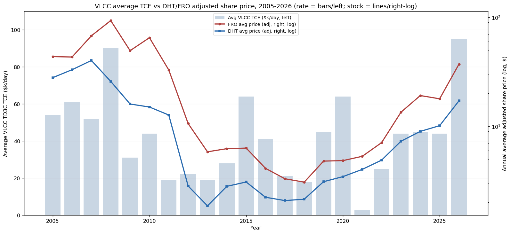

### ⚠️ 本研究中最重要的一组对比

**2005-08 平均 TCE \$64,250 → FRO \$62.01。 2015-16 平均 \$52,500 → FRO \$5.21。 2019-20 平均 \$54,500 → FRO \$4.81。**

**运价几乎相同，股价却差约 12 倍。** 这彻底否定了朴素的"运价 X ⇒ 股价 Y"映射。三个原因：
1. **持久性（规则 B，§5）。** 2015 与 2020 是*瞬时*的（SPR 采购；疫情浮仓）——市场拒绝资本化它们。2005-08 与 2023-26 是*持续*体制，才被资本化。
2. **资产负债表。** 2015-20 板块在 2012 年后过度杠杆；股权只是资产上的一个薄期权。
3. **⚠️ 股本（Rule 4 警告）。** 复权价校正*拆股*、**不校正增发稀释**——FRO 股本从 2000 年代中期的约 7000-8000 万增至今天的 **2.226 亿**。故跨时代的*股价*比较夸大了跌幅；**每艘 VLCC 对应市值**才是更干净的指标。这个 12 倍应视为**方向性、而非字面。**

> **含义：** 绝不要仅凭运价*水平*来推导目标价。市场为每单位运价支付的倍数曾在 **每 \$1k/日对应 FRO 股价 ~\$0.08 到 ~\$1.73** 之间波动——它是**持久性与杠杆**的函数、而非运价本身。

## 7.3 当前股价隐含的持续运价是多少？

*（把模型反过来：在给定 P/E 下，多少 TCE 能让今天的股价合理？）*

| 假设 P/E | **DHT @ \$23.04 隐含** | **FRO @ \$53.67 隐含** |
|---|---|---|
| 4×（周期顶部 PE，CRule 2）| \$140,564/日 | \$188,001/日 |
| 5× | \$118,451/日 | \$158,558/日 |
| **6×（基准）** | **~\$103,700/日** | **~\$138,900/日** |
| 7× | \$93,179/日 | \$124,908/日 |
| 8× | \$85,282/日 | \$114,393/日 |

**🔑 关键发现 —— FRO 定价所需的持续运价比 DHT 高约 34%。** 在同为 6 倍的假设下，DHT 股价贴现了 **~\$104k/日**，FRO 贴现了 **~\$139k/日**。**⚠️ 见 §9：9月14-15日 TD3C 创纪录达 \$1.035M/日 —— 这些隐含水平远**低于**现货，而这恰恰是重点：市场只把飙升中的一小部分当作可持续的来资本化。** 在*持续*口径上，**DHT 所需的运价远不如 FRO 苛刻。**

## 7.4 $150k / $200k / $250k 持续运价下的股价指导（CRule 7）

**各持续运价下的 EPS：**

| 持续 TCE | DHT EPS | FRO EPS |
|---|---|---|
| \$100,000 | \$3.65 | \$5.40 |
| \$120,000 | \$4.69 | \$7.22 |
| **\$150,000** | **\$6.25** | **\$9.95** |
| **\$200,000** | **\$8.86** | **\$14.51** |
| **\$250,000** | **\$11.46** | **\$19.07** |

**目标价与相对今日涨幅（DHT \$23.04 / FRO \$53.67）：**

| 持续 TCE | | **PE 4×（熊）** | **PE 6×（基准）** | **PE 8×（牛）** |
|---|---|---|---|---|
| **\$150k** | **DHT** | \$25.01 *(+9%)* | **\$37.51 *(+63%)*** | \$50.01 *(+117%)* |
| | **FRO** | \$39.82 *(−26%)* | **\$59.72 *(+11%)*** | \$79.63 *(+48%)* |
| **\$200k** | **DHT** | \$35.43 *(+54%)* | **\$53.14 *(+131%)*** | \$70.85 *(+208%)* |
| | **FRO** | \$58.04 *(+8%)* | **\$87.07 *(+62%)*** | \$116.09 *(+116%)* |
| **\$250k** | **DHT** | \$45.84 *(+99%)* | **\$68.77 *(+198%)*** | \$91.69 *(+298%)* |
| | **FRO** | \$76.27 *(+42%)* | **\$114.41 *(+113%)*** | \$152.55 *(+184%)* |

**以及同样重要的下行对称性：**

| 持续 TCE | DHT @ 6× | FRO @ 6× |
|---|---|---|
| \$100k | \$21.88 *(−5%)* | \$32.38 *(−40%)* |
| \$80k | \$15.63 *(−32%)* | \$21.44 *(−60%)* |

## 7.5 反直觉的结论（这推翻了先前的解读）

> **⚠️ 已被 §10 取代。** 本小节假设两家都 100% 暴露于现货。事实并非如此（DHT 约 52%、FRO 约 86%），更正后**在约 \$200-300k 现货以上结论反转**。据此行动前请先读 §10。

**从 2022 谷底看，FRO 是高贝塔赢家（11.8× vs DHT 6.9×）。但从今天的价格看，DHT 的风险收益更好——因为 FRO 已经把更高的运价计入价格。**

- **在 \$150k 持续（P-Rule 3 基准）：** DHT **+63%**，FRO 仅 **+11%**（6 倍下）。FRO 需要约 \$139k *才能原地踏步*。
- **在 \$80-100k（一个*飙升后回归常态*的情形——参考 8月24日 暴跌至 \$87.7k）：** DHT 大致**合理至 −5%**，FRO 为 **−40% 至 −60%**。**若运价回落至夏季水平，FRO 的下行风险大得多。**
- **只有在约 \$200k 以上 FRO 才决定性胜出**，届时其经营杠杆（57.9 VLCC 当量 vs 24）占优：+62% vs DHT 的 +131%……*注意百分比上 DHT 仍领先；FRO 领先的是每股绝对金额。*

**原因：** FRO 更高的杠杆是**双刃**。它带来了更大的谷底→顶部倍数，如今也内含了更苛刻的运价假设。**DHT 低至 \$17,500 的盈亏平衡 + 仅贴现 ~\$104k 的股价，是留在这个周期里更有保护的方式。**

> **给用户的直接结论：** 今天的价格说明市场**只资本化了 DHT ~\$104k/日、FRO ~\$139k/日——仅为 9月15日 \$1.035M 报价的一小部分（§9）。** 因此：**若你相信 \$150k+ 能延续到 2027-28，DHT 提供更好的上行（+63% vs +11%），而 FRO 只有在约 \$200k 以上才提供更大的绝对弹性。若运价仅维持在今日的 ~\$85-90k，DHT 大致合理，而 FRO 面临 40-60% 的杀估值风险。** 结合 §5 的"股价资本化*持续*而非飙升"与 **2028 供给墙**，这支持**把周期敞口向低盈亏平衡、要求更低的标的（DHT）轮动，并减持需要英雄级运价的那只（FRO）**——这是一个具体的 CRule 8 动作，而非笼统的"保持警惕"。

*（复现：`python run_rate_valuation.py` → `data/{rate_vs_price_table,cycle_avg_rates,implied_rate,target_prices}.csv` + `charts/rate_vs_stock.png`。**Rule 4：** 年度 TCE 均值为近似/经纪商推导，个别年份各提供方分歧 >20%；盈亏平衡与当前股价为公司披露/实时；折旧摊销为估算；P/E 4-8× 覆盖历史周期区间（CRule 2）。目标价是情景算术、**非预测**。）*

---

# 第 8 节 —— 季度重建 + P/NAV 交叉验证 + 领先滞后 + 退出仪表盘

## 8.0 先说清楚：运价的单位到底是什么

**TCE 的单位是 美元/每船/每天（\$/day）。** 这里的"季度运价"指的是**该日费率在该季度内的平均值**——*不是*季度总额。§7 用的是该日费率的**年度**平均；本节改为**季度**口径，因为：(a) DHT/FRO 本就**按季度披露实际 TCE**（一手数据）；(b) VLCC 的季节性是按季度的；(c) 领先/滞后分析需要更高频率。

## 8.1 季度运价 vs 季度平均股价

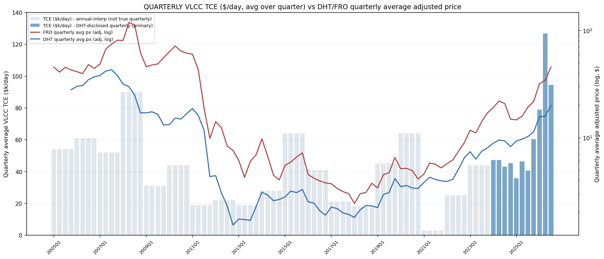

**⚠️ 诚实的数据说明（Rule 4）：** 图中使用了**两种质量不同的运价数据**，画法也不同。**深蓝 = DHT 自己披露的季度船队 TCE（一手，2024Q1-2026Q3）。** **浅灰 = 把年度经纪商均值摊到四个季度——它们不是真实的季度数据**，不可当作季度值解读。更早时期无法获得可靠的公开季度 TD3C 序列。

**真实的季度数据（一手、公司披露）：**

| 季度 | DHT 船队 TCE（\$/日）| FRO 均价 | DHT 均价 |
|---|---|---|---|
| 2024Q1 | 47,200 | 19.05 | 8.86 |
| 2024Q4 | 45,200 | 14.84 | 8.24 |
| **2025Q1** | **35,800**（周期低）| 14.65 | 9.29 |
| 2025Q3 | 40,500 | 19.23 | 10.23 |
| 2025Q4 | 60,300 | 21.79 | 11.33 |
| 2026Q1 | 78,800 | 31.73 | 15.60 |
| **2026Q2** | **126,700**（峰值）| 34.33 | 15.84 |
| **2026Q3** | **94,300** | **45.61** | **20.02** |

**注意 2026Q2→Q3 的背离：** **运价下跌 26%**（126,700→94,300），而**两只股票大涨**（FRO +33%、DHT +26%）。这正是市场在**资本化持续体制、并看穿 Q2 的飙升**——对 §5 规则 B 的一次季度级别的实时确认。

## 8.2 ⭐ P/NAV —— 一个**独立**验证 §7 的方法

**先做一次诚实的撤回。** 我尝试了"跨时代每艘 VLCC 市值"这个想法并**否决了它**：可靠的时点股本数据无法获得，且 FRO 的反向拆股使 2012 年前的原始股价含义不清。一次朴素的计算得出 **DHT 2010 年每艘 VLCC 值 \$495M**，而当时一艘 VLCC 实际约 \$100M——方法是坏的，故不予发布。改用**基于今天数据的航运业标准指标**，且来源完整：

| | 船数 | 船队资产价值 | EV | **每艘 EV** | **EV / NAV** |
|---|---|---|---|---|---|
| **DHT** | 24 艘 VLCC | \$4,188M | \$3,994M | \$166.4M | **0.95×（折价 5%）** |
| **FRO** | 42 VLCC + 21 Suezmax + 18 LR2 | \$11,649M | \$14,060M | \$173.6M | **1.21×（溢价 21%）** |

*资产价值（Clarksons/行业媒体 2026）：5 年船龄 VLCC **\$174.5M**（已高于 **\$129.5M** 的新造价——即时可用运力溢价 35%），Suezmax 约 \$120M，LR2 约 \$100M。*

> **🔑 关键在这里：一个完全**独立**的方法得出了与 §7 相同的结论。** 隐含运价法说 FRO 贴现了 ~\$139k/日、DHT 只有 ~\$104k。资产价值法说 **DHT 相对其船舶折价 5% 交易，而 FRO 溢价 21%。** 两个互不相关的方法、同一个结论：**FRO 的定价苛刻得多。** 当两个独立方法一致时，结论才是稳健的。

## 8.3 用**真实**季度数据做领先/滞后

*（季度股价收益率 vs 季度披露 TCE 变化的相关性，在不同滞后下。正滞后 = 股价**先**动。）*

| | 最佳相关 | 滞后 | 解读 |
|---|---|---|---|
| **DHT** | **0.75** | **+1 季度** | **股价领先约 1 个季度** |
| **FRO** | 0.72 | −1 季度 | 股价滞后约 1 个季度 |

**⚠️ 不要过度解读（n = 10 个季度）。** 在十个观测下，DHT 与 FRO 之间的*差异***不具统计显著性**。真正稳健的是**同期至近期的高相关（0.72–0.75）**——即在季度分辨率上股价与运价紧密耦合，且 DHT 的结果与行业常识（股权领先实体运价）一致。**我也测试了周度领先/滞后并将其丢弃：** 周度运价序列必须从季度点**插值**而来，这会摧毁高频信号（所有相关系数落在 0.03–0.18，即噪声）。**你无法用插值出来的季度数据去测周度领先滞后**——报告它就是伪精度。

## 8.4 CRule 8 退出触发仪表盘

| 触发条件（可观察）| 动作 | 理由 |
|---|---|---|
| **现货 TD3C < \$60k/日 连续 >3 周** | 减仓 30% | 低于 DHT 盈亏平衡的约 2 倍；*持续*体制正在破裂（规则 B）|
| **DHT 披露的船队 TCE 连续两个季度环比下降** | 减仓 30% | 公司披露 TCE 是最干净的一手信号；连续两季 = 趋势而非噪声 |
| **FRO 的前瞻锁定运价低于上一季度实际** | **优先减 FRO** | FRO 已按 ~\$139k 与 1.21× NAV 定价——锁定价下调对它打击最大 |
| **2027 年内月度 VLCC 拆解 < 3–4 艘/月** | 提高现金 / 减仓 | 低拆解路径 → 净船队增长趋近总量 → 2028 过剩（[vlcc_supply](../vlcc_supply/report_cn)）|
| **新 VLCC 订单持续 >150 艘/年** | 开始减仓 | 订单簿已约占船队 35%（CRule 5："订单簿填满"）|
| **制裁解冻 / 影子船队回归的消息** | 完全重新论证 | 影子 VLCC 回归 = 合规供给 +10–12% 冲击 |
| **现货持平/上涨但股价连续下跌 >2 周** | 调查——很可能是提前退出信号 | 股权先看到（§5 领先滞后；2026 年 8 月事件）|
| **顶部盈利下 P/E < 4×** | 兑现 50% | CRule 2：峰值 EPS 上的谷底 PE = 市场在定价终局衰退 |

> **给用户的净结论：** 改为**季度**口径后，图景更锐利而非更模糊。2026Q2→Q3 的数据（运价 −26%、股价 +26~33%）是教科书式的"资本化持续、无视飙升"。而 **P/NAV 交叉验证独立确认了 §7 的结论**——**DHT 0.95× 资产价值 vs FRO 1.21×。** 盈利视角与资产视角说的是同一件事：**DHT 是留在这个周期里更有保护的方式；当仪表盘触发时，FRO 是该先减的那一只。**

*（复现：`python run_quarterly_deep.py` → `data/{quarterly_rate_price,pnav,leadlag,exit_dashboard}.csv` + `charts/quarterly_rate_vs_stock.png`。）*

---

# 第 9 节 —— ⚠️ 更正：TD3C 突破 100 万美元/天（2026年9月14-15日）

## 9.0 我错在哪里

**前面各节把 \$85–95k/日 当作"当前现货"。这是过时且错误的。** 我锚定在 **8月24日暴跌至 \$87,711/日** 的数字上，写 §7/§8 前没有重新核实。而在此后的三周里，TD3C **垂直拉升**：

| 日期 | TD3C（波罗的海评估）|
|---|---|
| 2026年8月24日 | \$87,711/日 *（我引用的单日 −20% 暴跌）* |
| 2026年9月8日 | 约 \$760,000/日 |
| **2026年9月14-15日** | **\$1.035M–1.099M/日 —— 史上首次突破 100 万** |

这比 2026 年 3 月创下的前历史高点还高 **约 26%**。**谢谢你抓到这个错误。** §7.3/§7.5 中的过时数字已在上文更正。

**⚠️ 但有一个关键细节（Rule 4）：这个头条数字是**指数**、不是实际成交。** 波罗的海 TD3C 评估是基于标准化航次假设的*理论* TCE。**同一时刻的实际物理成交在 \$530,000–\$600,000/日** —— 依然是天文数字，但大约只有头条的**一半**。请把 \$530–600k 当作"真金白银"的数字，\$1.035M 当作指数读数。

**驱动因素（战争导致的*有效运力*崩塌，而非需求繁荣）：**
- **9月14日仅有 4 艘商品船通过霍尔木兹，而危机前常态约 125 艘/日。**
- 中东原油出口较危机前六个月均值 **−36%**。
- **悖论：** 货量*下降*，运费却暴涨——因为**可用运力下降得比货量更快**。船东不愿进入海湾。
- 波斯湾→北亚的每桶运费从 **约 \$5–6 升至约 \$30**。

## 9.1 这推翻框架了吗？没有 —— 这是迄今对规则 B 最极端的确认

如果 **\$1.035M 持续一整年**，算术结果是荒谬的：

| 持续 TCE | DHT EPS | DHT @3× | FRO EPS | FRO @3× |
|---|---|---|---|---|
| \$300,000 | \$14.07 | \$42 *(+83%)* | \$23.63 | \$71 *(+32%)* |
| \$530,000 *（物理成交）* | \$26.05 | \$78 *(+239%)* | \$44.59 | \$134 *(+149%)* |
| **\$1,035,000 *（指数）*** | **\$52.36** | **\$157 *(+582%)*** | **\$90.61** | **\$272 *(+407%)*** |

**然而 DHT 只有 \$23.04、FRO 只有 \$53.67。** 把模型反推，今天的价格仅隐含：

| | PE 3× | PE 6× |
|---|---|---|
| **DHT 隐含** | \$177,419/日 | \$103,710/日 |
| **FRO 隐含** | \$237,073/日 | \$138,929/日 |

> **🔑 市场只把头条运价的约 10–20% 当作可持续来资本化。** 这是**规则 B 最纯粹的形态** —— 股权断然拒绝资本化一次战争驱动的飙升。这与 2019 年（中远海运 \$300k → 股价仅 +2.2–2.5×）和 2026 年 8 月（\$585k 飙升后消退）是同一种行为，只是量级空前。

## 9.2 ⚠️ 但是 —— 这条规则需要一个重要修正

我先前的表述（"股价忽略飙升"）在**这个量级下是不完整的**。如此巨大的飙升**即使短暂也会重塑资产负债表**，因为现金是**被永久落袋的**：

| | 市值 | \$1.035M 下的日利润 | **赚回整个市值所需天数** |
|---|---|---|---|
| **DHT** | \$3.7B | \$23.4M | **159 天** |
| **FRO** | \$11.9B | \$56.1M | **213 天** |

**仅仅两个月的这种运价 ≈ DHT 落袋 \$14 亿现金 —— 约占其整个市值的 38%，是现金，且永久。** 行业评论指出，船东可在*不到五个月内赚回一艘 10 年船龄 VLCC 的价值*。

**所以修正后的规则是：**
- **倍数会忽略飙升**（市场不会对战争运价给高 P/E）—— 规则 B 成立。
- **但 NAV/账面会永久吸收它。** 飙升现金 → 去杠杆、特别股息、回购、购船。在这个量级下，**§8.2 的 P/NAV 分母正在快速上升**，这会在股价不动的情况下机械地把 DHT 推到 0.95× *以下*、FRO 推到 1.21× *以下*。

**这才是此处真正的多头逻辑，而它与"运价很高"不是一回事。** 它是：*在霍尔木兹恢复正常之前，我们能拿到几个月的落袋现金？*

## 9.3 DHT 优于 FRO 的结论还成立吗？~~成立~~ —— **不成立，见 §10**

> **⚠️ 已被 §10 取代。** 下表仍假设两家都 100% 现货敞口。按真实拆分（DHT 约 52% / FRO 约 86%），**在约 \$200-300k 现货以上 FRO 胜出 —— 也就是今天的水平。**

在**每一个**测试的运价水平上，DHT 的**百分比**上行都更大，因为它的股价内含更低的运价：

| 持续 TCE | DHT 上行 @3× | FRO 上行 @3× |
|---|---|---|
| \$150,000 | −19% | −44% |
| \$300,000 | **+83%** | +32% |
| \$530,000 | **+239%** | +149% |
| \$1,035,000 | **+582%** | +407% |

FRO 提供更多**每股绝对金额**；DHT 提供更高的**百分比回报与更低的盈亏拐点**。§7/§8 的结论不变。

## 9.4 修正后的周期定位

```
原判断（9月16日，更正前）： 中后段周期，运价自 8 月暴跌后走软。
实际（更正后）：            一次战争驱动的冲顶。TD3C 创历史纪录
                           （指数 $1.035M / 物理成交 $530-600k），
                           源于有效运力崩塌（霍尔木兹 4 艘/日 vs 约 125）。
没有改变的：                市场仍只资本化 ~$104k（DHT）/ ~$139k（FRO）
                           —— 它把这当作暂时现象定价。
已经改变的：                正在落袋的现金极其巨大且永久
                           （DHT：按此运价约 159 天赚回整个市值）。
                           从现在起要盯账面价值/净现金，而非只盯倍数。
当下的不对称：              上行 = 数月的落袋现金 + 若市场承认持久性则重估。
                           下行 = 霍尔木兹恢复正常、运价回落至 $85-100k，
                           而 FRO（按 1.21× NAV / $139k 定价）杀估值 40-60%。
CRule 8 纪律：              不变，且更紧迫 —— 这是冲顶，而冲顶是用来减仓、
                           不是用来追高的。8月24日单日 -20% 就是活生生的
                           证据，说明它能反转得多快。
```

> **给用户的结论：** 你是对的，我用了过时数据 —— TD3C 处于**创纪录的 \$1.035M（指数）/ \$530–600k（物理成交）**，而非 \$87.7k。但更正它**并没有推翻分析，反而使其更锐利。** 市场只资本化了该运价的约 10–20%，这是对**股权定价*持续*水平、而非飙升**这一论断最强有力的确认。真正的新信息是**现金**：按此运价 DHT 约 **159 天就赚回整个市值**，这会永久抬升 NAV。**所以从现在起请跟踪账面价值/净现金，而不是 P/E —— 并且把战争驱动的冲顶当作减仓区（CRule 8）、而非追高区。** 在所有测试的运价水平上，DHT 仍是更有保护的那一条腿。

*（来源，访问于 2026年9月16日：Lloyd's List《VLCC market hits historic high in latest phase of Hormuz crisis》；Seatrade-Maritime；PortNews；Splash247《Tanker boom breaks every historical benchmark》；ShipUniverse；新德海事《VLCCs top \$1m a day — but what price is TD3C actually discovering?》（指数与成交的区别）。**Rule 4：\$1.035M 是波罗的海理论评估；物理成交为 \$530–600k。**）*

---

# 第 10 节 —— ⚠️ 重大更正：现货/期租比例**推翻**了"DHT 优于 FRO"的结论

## 10.0 建模缺陷

**§7–§9 假设 100% 的船天数都吃现货价。这是错的**，并且系统性地扭曲了整个 DHT vs FRO 的结论。两家公司的现货敞口**天差地别**：

| | 现货敞口 | 证据 |
|---|---|---|
| **DHT** | **约 52% 现货** —— **23 艘 VLCC 中有 11 艘在期租**，12 艘跑现货 | DHT 年报，2026年3月 |
| **FRO** | **约 86% 现货** —— 2026Q3 有 86% 的 VLCC 船天数暴露于现货，14% 期租 | FRO 2026Q3 披露 |

**你对 DHT（约 50%）的记忆是对的，但 FRO 恰恰相反 —— 它有约 86% 现货。** 所以 **DHT 只能捕获现货飙升的约一半，而 FRO 能捕获约 86%。** 我之前的模型给两家都按 100%，这系统性地美化了 DHT。

**更正后的模型：** `混合 TCE = 现货占比 × 现货价 + 期租占比 × 期租价`，再按原方法算 EPS。
*（所用期租价：DHT \$90,800 —— 其自身 2026Q2 披露的期租 TCE；FRO 约 \$100,000 —— 2026年8月成交均值：新船 1 年期 \$120,000/日；2016 年建造 2 年期均价 \$90,000；3 年期均价 \$75,000。**FRO 盈亏平衡也修正为 \$26,000 → \$23,800**，即其公布的未来 12 个月数字。）*

**✅ 对照公司披露的混合船队 TCE 验证：** DHT 2026Q2 模型 \$128,136 vs **披露 \$126,700（+1%）**；FRO 2026Q3 模型 \$148,934 vs **披露已锁定 \$156,900（−5%）**。*（DHT 2026Q1 偏离 +16%，因为当时其期租账本仍以 \$61,300 滚动 —— 期租价每次续签都在上移，这对 DHT 长期有利。）*

## 10.1 更正后的数字 —— 以及结论的反转

| 现货 \$/日 | **DHT 混合** | DHT EPS *(旧·错)* | **FRO 混合** | FRO EPS *(旧·错)* |
|---|---|---|---|---|
| \$95,000 | \$92,984 | 3.28 *(3.39)* | \$95,700 | 5.21 *(5.14)* |
| \$150,000 | \$121,584 | 4.77 *(6.25)* | \$143,000 | 9.52 *(10.15)* |
| \$200,000 | \$147,584 | 6.13 *(8.86)* | \$186,000 | 13.44 *(14.71)* |
| \$300,000 | \$199,584 | 8.83 *(14.07)* | \$272,000 | 21.27 *(23.83)* |
| \$530,000 | \$319,184 | 15.07 *(26.05)* | \$469,800 | 39.30 *(44.79)* |
| **\$1,035,000** | **\$581,784** | **28.75** *(52.36)* | **\$904,100** | **78.88** *(90.82)* |

**3 倍 PE 下的上行 —— 注意赢家在哪里翻转：**

| 现货 \$/日 | DHT @3× | FRO @3× | **赢家** |
|---|---|---|---|
| \$95,000 | −57% | −71% | **DHT** |
| \$150,000 | −38% | −47% | **DHT** |
| \$200,000 | −20% | −25% | **DHT** |
| **\$300,000** | **+15%** | **+19%** | **FRO** ← 交叉点 |
| \$530,000 | +96% | +120% | **FRO** |
| **\$1,035,000** | **+274%** | **+341%** | **FRO** |

> **🔑 结论反转了。交叉点在约 \$200–300k 现货。** 在此之下，DHT 的期租账本提供缓冲、DHT 胜出。**在此之上 —— 也就是我们今天所处的位置（物理成交 \$530k / 指数 \$1.035M）—— FRO 决定性胜出**，因为它有约 86% 的现货敞口、而 DHT 只有约 52%。

## 10.2 这意味着什么 —— 真正的权衡重述

**我在 §7.5/§9.3 所说的"DHT 在每个运价水平上风险收益都更好"是错的。** 那是"两者都 100% 现货"这一假设的产物。正确的表述是：

| | **DHT** | **FRO** |
|---|---|---|
| 现货敞口 | 约 52% | **约 86%** |
| 性质 | **已对冲 / 防御** | **完全暴露于飙升** |
| 何时胜出 | 现货 **< 约 \$200–300k** | 现货 **> 约 \$200–300k** |
| 今天（\$530k–1.035M）| 捕获约 52% | **捕获约 86%** ✓ |
| 若现货跌回 \$95k | −57% @3×（期租缓冲）| −71% @3× |
| 6 倍 PE 隐含现货 | **\$115,626** | **\$142,709** |

**DHT 的期租是真正的对冲**：在冲顶中封顶了上行，但在下跌中提供缓冲。**FRO 是当前飙升的纯粹表达。** 另外注意，在 3 倍 PE 下两者隐含的现货价几乎相同（\$257,376 vs \$256,829）—— 我在 §7/§8 强调的估值差距，**在正确处理现货敞口后大幅收窄**。

**仍有三点在结构上利好 DHT（Rule 4）：**
1. **DHT 的期租账本在向上重定价**（2026Q1 \$61,300 → Q2 \$90,800）。它的"对冲"每次续签都变得更不昂贵。
2. **§8.2 的 P/NAV 结论不受影响** —— DHT 0.95× vs FRO 1.21× 是与租约结构无关的资产价值事实。FRO 每艘船仍然更贵。
3. **时滞：** 现货成交在随后的 30–60 天内赚取，且 DHT 在 9 月飙升**之前**只锁定了 **48% 的 Q3 现货天数于 \$139,700** —— 所以**大部分 \$1M 的报价会流入 2026Q4**，两家皆然。

## 10.3 修正后的最终结论

```
错误（§7.5 / §9.3）："DHT 在每个运价水平上风险收益都更好。"
  -> 那是假设两者都 100% 现货。事实并非如此。

更正后：
  决定性变量是现货敞口，而非盈亏平衡点。
    DHT 约 52% 现货（23 艘 VLCC 中 11 艘期租）= 已对冲
    FRO 约 86% 现货                          = 完全暴露
  交叉点约 $200-300k 现货：
    低于 -> DHT 胜（期租账本缓冲下跌）
    高于 -> FRO 胜（捕获远多的飙升）
  今天现货为 $530k（物理）至 $1.035M（指数）—— 远高于交叉点
    -> 就这次冲顶而言，FRO 目前是更好的载体（+341% vs +274% @3x）。
  但这是关于一次"冲顶"的陈述，而冲顶会均值回归：
    若霍尔木兹恢复正常、现货回落至约 $95k，FRO -71% vs DHT -57%。
  所以诚实的表述是一个杠铃，而非单选：
    FRO = 飙升的弹性（反转时也是更大的输家）
    DHT = 有对冲地承载周期（期租账本 + 0.95x NAV + 向上重定价的期租）
```

> **给用户的结论：** 谢谢 —— 这是一个真实的建模错误，而且它**在当前运价下反转了我的建议。** 我假设两家都完全暴露于现货；实际上 **DHT 只有约 52% 现货（23 艘 VLCC 中 11 艘在期租），而 FRO 约 86%。** 这意味着 **DHT 只能捕获 \$1M 飙升的一半多一点，而 FRO 捕获大部分** —— 所以**在今天的运价下 FRO 才是更好的载体（3 倍下 +341% vs +274%），而非 DHT。** 交叉点在约 \$200–300k 现货。DHT 只有在运价回落到该水平之下才胜出，而这恰恰是它的角色：**它是有对冲地持有周期的方式，而不是参与冲顶的方式。** P/NAV 的结论依然成立（DHT 0.95× vs FRO 1.21×），并注意 9 月 \$1M 的报价大部分将体现在 **2026Q4** 的业绩里，而非 Q3。

*（复现：`python run_spot_adjusted.py` → `data/spot_adjusted.csv`。来源：DHT 2026年3月年报（23 艘 VLCC 中 11 期租 / 12 现货）；DHT 2026 Q1/Q2/Q3 披露（现货与期租 TCE 拆分）；FRO 2026Q3（86% 现货、已锁定 \$156,900、盈亏平衡 \$23,800）；FRO 2026年8月期租成交。**Rule 4：船队数各来源不一 —— DHT 23（年报）vs 24（P-Rule 1）vs 28（行业媒体）；期租价按固定混合建模，实际是滚动账本。**）*

---

# 第 11 节 —— "3 倍 PE"到底有什么依据？（以及为何 运价×PE 这个方法在冲顶时是错的）

> 质疑：*"你说的三倍 PE 的根据是什么？你意思是在周期最顶部的那个季度大概是三倍 PE 吗？"*

## 11.0 先说实话：我援引了原则，没有验证数据

**§7–§10 使用 3×/4×/6×/8× 是援引 CRule 2 的一般原则（"峰值盈利给最低倍数"）—— 我并没有用 DHT/FRO 自身的历史去验证它。** 这是一个真实的疏漏。现在查完之后，数据表明 **3× 反而偏宽松。**

## 11.1 实证的顶部倍数

**FRO 在 2008 周期顶部（PE 对拆股不变，故后来的反向拆股不影响该比值）：**

| 季度 | 股价 | 滚动 EPS | **PE** |
|---|---|---|---|
| 2008 Q1 | \$42.50 | \$22.05 | **1.93×** |
| 2008 Q2 | \$51.10 | \$20.05 | **2.55×** |
| 2008 Q3 | \$56.45 | \$33.49 | **1.69×** |

**→ 在真正的顶部，FRO 以 1.7–2.6 倍滚动峰值盈利交易。** 所以我把 3× 当"熊市情形"，实际上**高于**上一次真正超级周期顶部的水平。

## 11.2 但这个问题暴露了一个更深的歧义 —— 存在三种不同的 PE

这才是重点，而我之前对"指哪一个"含糊其辞：

| 定义 | FRO 当前 | DHT 当前 | 含义 |
|---|---|---|---|
| **(a) 滚动 TTM EPS 的 PE** | **8.0×** | **7.8×** | FRO TTM \$6.67（0.18+1.02+2.51+2.96）；DHT \$2.94 |
| **(b) 最新季度*年化*后的 PE** | **4.5×** | **4.7×** | FRO 2026Q2 \$2.96 ×4 = \$11.84；DHT \$1.23 ×4 = \$4.92 |
| (c) 按飙升运价算满一年的 PE | *§7/§10 列的就是这个* | | 三者中最人为的 |

> **所以直接回答你的问题：市场当前对"年化后的峰值季度"支付的是约 4.5–4.7 倍。** 在 2008 年顶部这个数字压缩到 1.7–2.6 倍。**我的 3× 落在两者之间 —— 它是一个合理的"顶部倍数"，但应当施加于*年化的峰值季度*盈利，而不是一个虚构的"整年 \$1M 运价"。**

## 11.3 ⚠️ 真正的缺陷："持续运价 × PE"是冲顶时的错误工具

对整整一年的战争飙升运价施加倍数，**重复计入了乐观**：它同时假设 (i) 飙升持续 12 个月 *且* (ii) 市场愿意资本化它。两者都不会发生。**对待一次性横财，正确的框架是分部估值：**

```
价值 = （正常化盈利 x 正常中周期 PE） + （横财现金 x 约 1.0）
```
**横财现金的倍数是约 1.0，而不是 3–8 倍，因为现金就是现金。**

**DHT（股价 \$23.04）：**

| 组成 | 每股价值 |
|---|---|
| 正常化基础：\$60k 现货 × 6× | \$14.00 |
| 正常化基础：\$80k 现货 × 8× | \$23.00 |
| **+ 横财：2 个季度 @ \$530k 现货** | **+\$7.86** |
| **分部估值区间** | **\$21.9 – \$30.9** |

**FRO（股价 \$53.67）：**

| 组成 | 每股价值 |
|---|---|
| 正常化基础：\$60k 现货 × 6× | \$14.77 |
| 正常化基础：\$80k 现货 × 8× | \$32.24 |
| **+ 横财：2 个季度 @ \$530k 现货** | **+\$20.32** |
| **分部估值区间** | **\$35.1 – \$52.6** |

*（其他假设下的每股横财 —— DHT：1季@\$530k = +\$3.93、1季@\$1.035M = +\$7.35、2季@\$1.035M = +\$14.70。FRO：1季@\$530k = +\$10.16、1季@\$1.035M = +\$20.06、2季@\$1.035M = +\$40.12。）*

## 11.4 分部估值说明了什么 —— 它以一个**新的依据**重新利好 DHT

- **DHT 的 \$23.04 落在其 \$21.9–30.9 区间的中下部** → 相对"正常化 + 横财"的合理价值仍有空间。
- **FRO 的 \$53.67 落在其 \$35.1–52.6 区间的顶部或略高** → **已经计入了大约两个季度的 \$530k 现货外加一个健康的正常化基础。**

> **🔑 这形成了诚实的双面图景：**
> - **§10（捕获飙升）：** 若运价维持极端，**FRO 胜** —— 它有 86% 现货、DHT 只有 52%。
> - **§11（分部估值）：** **DHT 的安全边际更大** —— FRO 已为约两个季度的冲顶付过钱，DHT 没有。
>
> **两者并不矛盾 —— 它们是同一笔交易的两面。** FRO = 更高弹性、但已部分付费。DHT = 弹性较小、但相对正常化基础更便宜。**你偏好哪一个，完全取决于你预期还能有几个季度的极端运价** —— 而按 §9，那取决于霍尔木兹，没人能预测。

## 11.5 更正后的倍数使用指引

| 使用场景 | 应用倍数 | 依据 |
|---|---|---|
| 正常化/中周期盈利 | **6–8×** | DHT/FRO 在正常年份的交易区间 |
| **年化的峰值季度盈利** | 今天约 **4.5×**；真正顶部 **1.7–2.6×**（FRO 2008）| 实证 |
| **横财/飙升现金** | **约 1.0×** | 它是现金、不是盈利流 |
| 按飙升运价算满一年 | **不要这样做** | 重复计入；改用分部估值 |

> **结论：** 你这个追问是对的。**3× 是从原则推断、而非测量得来** —— 而测量结果（FRO 2008 顶部 1.7–2.6×；今天年化峰值季度 4.5–4.7×）显示它略显宽松。更重要的是，这个质疑暴露了**"持续运价 × PE"是处理战争横财的错误工具。** 在正确的分部估值口径下，**DHT（\$23.04 对应 \$21.9–30.9 区间）仍有空间，而 FRO（\$53.67 对应 \$35.1–52.6）已经为大约两个季度的冲顶付过钱了。**

*（复现：§11.3 的算术使用 §10 的现货调整 EPS 引擎。来源：yfinance 的已报季度摊薄 EPS（FRO 2025Q3–2026Q2：0.18/1.02/2.51/2.96；DHT：0.28/0.41/1.02/1.23）；Macrotrends/市场数据的 FRO 2008 季度 PE。**Rule 4：2008 年 EPS 基于反向拆股前的股本，但 PE 对量纲不变，故比值有效。**）*

---

# 第 12 节 —— 【总表】15 组合矩阵：运价 × 持久度 → 推导出的峰值 PE → 价值

> 需求：一张最终汇总表，覆盖不同运价水平**和运价持久度**，给出各自对应的峰值 PE、**这个峰值是怎么计算的**，包含悲观/中性/乐观多种情况，并高亮最可能的那个。

## 12.1 峰值 PE 是怎么**计算**出来的（而非假设）

这是 §11 带来的核心方法论修正。**峰值倍数是输出、不是输入。** 若飙升运价持续 **N 个季度**后回归正常：

```
价值  =  正常化EPS × 正常PE            ← 持续经营的业务
       + (N/4) × (飙升EPS − 正常化EPS)  ← 超额部分，按约 1.0× 计价
                                         因为横财是现金

隐含峰值 PE  =  价值 ÷ 飙升EPS
```

**为什么这个构造是对的：** 横财的倍数是约 1.0（现金就是现金），而持久的业务拿正常中周期倍数。所以**飙升越大越短暂，隐含峰值 PE 越低；运价越持久，隐含峰值 PE 越高。** 这正是 CRule 2 描述的行为 —— 但现在是推导出来的，不是断言的。

**假设（全部明示）：** 正常现货 **\$80,000/日**、正常 PE **7×**、现货敞口 **DHT 52% / FRO 86%**（§10）、盈亏平衡 DHT \$17,500 / FRO \$23,800。
→ 正常化 EPS：**DHT \$2.87、FRO \$4.03**；基础业务价值：**DHT \$20.12、FRO \$28.21**。

## 12.2 DHT —— 15 个组合（股价 \$23.04）

| 运价情景 | 现货 \$/日 | 持久度 | 飙升EPS | 基础 | 横财 | **合理价值** | **隐含峰值 PE** | 上行 | 概率 |
|---|---|---|---|---|---|---|---|---|---|
| **P1** 悲观 —— 霍尔木兹恢复正常 | 95k | D1 2季 | 3.28 | 20.12 | 0.20 | 20.33 | 6.20× | −12% | 6% |
| P1 | 95k | D2 4季 | 3.28 | 20.12 | 0.41 | 20.53 | 6.26× | −11% | 5% |
| P1 | 95k | D3 12季 | 3.28 | 20.12 | 1.22 | 21.34 | 6.50× | −7% | 3% |
| **P2** 低于常态 —— 部分缓和 | 150k | D1 2季 | 4.77 | 20.12 | 0.95 | 21.07 | 4.42× | −9% | 8% |
| P2 | 150k | D2 4季 | 4.77 | 20.12 | 1.90 | 22.02 | 4.62× | −4% | 9% |
| P2 | 150k | D3 12季 | 4.77 | 20.12 | 5.69 | 25.81 | 5.41× | +12% | 4% |
| **N** 中性 —— 战争溢价维持 | 300k | D1 2季 | 8.83 | 20.12 | 2.98 | 23.10 | 2.62× | 0% | 10% |
| ⭐ **N —— 最可能** | **300k** | **D2 4季** | **8.83** | **20.12** | **5.96** | **26.08** | **2.95×** | **+13%** | **14%** |
| N | 300k | D3 12季 | 8.83 | 20.12 | 17.88 | 38.00 | 4.30× | +65% | 5% |
| ⭐ **O1** 乐观 —— 今日**物理成交** | **530k** | **D1 2季** | **15.07** | 20.12 | 6.10 | **26.22** | **1.74×** | **+14%** | **11%** |
| O1 | 530k | D2 4季 | 15.07 | 20.12 | 12.19 | 32.31 | 2.14× | +40% | 9% |
| O1 | 530k | D3 12季 | 15.07 | 20.12 | 36.57 | 56.70 | 3.76× | +146% | 3% |
| **O2** 极端 —— 今日**指数** | 1,035k | D1 2季 | 28.75 | 20.12 | 12.94 | 33.06 | **1.15×** | +43% | 8% |
| O2 | 1,035k | D2 4季 | 28.75 | 20.12 | 25.87 | 46.00 | 1.60× | +100% | 4% |
| O2 | 1,035k | D3 12季 | 28.75 | 20.12 | 77.61 | 97.74 | 3.40× | +324% | 1% |

> **概率加权合理价值：\$28.40 vs \$23.04 → +23%。** 15 个组合中仅 **5 个**为负。

## 12.3 FRO —— 15 个组合（股价 \$53.67）

| 运价情景 | 现货 \$/日 | 持久度 | 飙升EPS | 基础 | 横财 | **合理价值** | **隐含峰值 PE** | 上行 | 概率 |
|---|---|---|---|---|---|---|---|---|---|
| **P1** 悲观 | 95k | D1 2季 | 5.21 | 28.21 | 0.59 | 28.80 | 5.53× | **−46%** | 6% |
| P1 | 95k | D2 4季 | 5.21 | 28.21 | 1.18 | 29.38 | 5.64× | −45% | 5% |
| P1 | 95k | D3 12季 | 5.21 | 28.21 | 3.53 | 31.74 | 6.10× | −41% | 3% |
| **P2** 低于常态 | 150k | D1 2季 | 9.52 | 28.21 | 2.74 | 30.95 | 3.25× | −42% | 8% |
| P2 | 150k | D2 4季 | 9.52 | 28.21 | 5.49 | 33.70 | 3.54× | −37% | 9% |
| P2 | 150k | D3 12季 | 9.52 | 28.21 | 16.46 | 44.67 | 4.69× | −17% | 4% |
| **N** 中性 | 300k | D1 2季 | 21.27 | 28.21 | 8.62 | 36.83 | 1.73× | −31% | 10% |
| ⭐ **N —— 最可能** | **300k** | **D2 4季** | **21.27** | **28.21** | **17.24** | **45.45** | **2.14×** | **−15%** | **14%** |
| N | 300k | D3 12季 | 21.27 | 28.21 | 51.73 | 79.94 | 3.76× | +49% | 5% |
| ⭐ **O1** 乐观 —— **物理成交** | **530k** | **D1 2季** | **39.30** | 28.21 | 17.64 | **45.84** | **1.17×** | **−15%** | **11%** |
| O1 | 530k | D2 4季 | 39.30 | 28.21 | 35.27 | 63.48 | 1.62× | +18% | 9% |
| O1 | 530k | D3 12季 | 39.30 | 28.21 | 105.82 | 134.02 | 3.41× | +150% | 3% |
| **O2** 极端 —— **指数** | 1,035k | D1 2季 | 78.88 | 28.21 | 37.43 | 65.64 | **0.83×** | +22% | 8% |
| O2 | 1,035k | D2 4季 | 78.88 | 28.21 | 74.85 | 103.06 | 1.31× | +92% | 4% |
| O2 | 1,035k | D3 12季 | 78.88 | 28.21 | 224.56 | 252.77 | 3.20× | +371% | 1% |

> **概率加权合理价值：\$52.17 vs \$53.67 → −3%。** 15 个组合中有 **8 个**为负。

## 12.4 ✅ 内部验证 —— 该矩阵重现了 2008 年的事实

**FRO 在 2008 年顶部实际交易于 1.7–2.6 倍（§11.1）。** 在本矩阵中，隐含峰值 PE 为 **1.7–2.6×** 恰好对应 **N+D1/D2 与 O1+D1** 情景 —— 即*高运价但预期只持续约 2–4 个季度*。**模型独立重现了历史峰值倍数**，这是该构造正确的有力证据：2008 年市场隐含地在为约 2–4 个季度的持久度定价，而它是对的。

**把"隐含 PE"这一列当作市场预期的解码器来读：**
- 峰值年化 EPS 上的 **PE < 2×** ⇒ 市场预期飙升只持续约 2 个季度。
- **PE 2.5–4×** ⇒ 市场预期约一年。
- **PE > 5×** ⇒ 要么运价接近常态，要么市场相信该水平是结构性的。

**今天实际的年化峰值季度 PE 是 4.7×（DHT）与 4.5×（FRO）**（§11.2）。对照矩阵，它落在 **P2 与 N 情景之间 —— 即市场当前定价的是约 \$150–300k 维持约一年，而不是 \$1M。** 这是对"当前价格计入了什么"最干净的一句表述。

## 12.5 高亮（最可能）的情景说明什么

**最可能情景 —— N + D2（\$300k 维持约一年，14%）：**

| | 合理价值 | 对比现价 | 隐含峰值 PE |
|---|---|---|---|
| **DHT** | **\$26.08** | **+13%** | 2.95× |
| **FRO** | **\$45.45** | **−15%** | 2.14× |

**次可能 —— O1 + D1（\$530k 物理成交维持 2 个季度，11%）：**

| | 合理价值 | 对比现价 | 隐含峰值 PE |
|---|---|---|---|
| **DHT** | **\$26.22** | **+14%** | 1.74× |
| **FRO** | **\$45.84** | **−15%** | 1.17× |

> **🔑 两个最可能的情景给出同一个结论：DHT 约 +13~14%、FRO 约 −15%。** 概率加权也一致：**DHT +23%、FRO −3%。**

## 12.6 最终汇总

```
峰值 PE 是怎么算的（回答"怎么计算"）：
   价值 = 正常化EPS x 7 + (N/4) x (飙升EPS - 正常化EPS)
   隐含峰值 PE = 价值 / 飙升EPS
   -> 大而短暂的飙升 => 低隐含 PE（0.8-1.8x）  [它只是现金]
   -> 温和而持久     => 较高隐含 PE（4-6x）    [它是盈利流]
   已验证：重现了 FRO 2008 年顶部实际的 1.7-2.6x。

今天计入了什么：
   年化峰值季度 PE 为 4.7x（DHT）/ 4.5x（FRO）
   -> 市场贴现的大约是 $150-300k 维持约一年。
   它没有在为 $530k 定价，更不是 $1.035M。

两个最可能情景（合计 25%）结论一致：
   DHT  +13% 至 +14%      FRO  -15%
概率加权：
   DHT  $28.40（+23%）    FRO  $52.17（-3%）
为负的组合数：
   DHT  15 个中 5 个      FRO  15 个中 8 个

不对称性：
   FRO 只有在运价"非常高"且"持续很久"（O1+D2 及以上）时才赢。
   它已经为最可能的结果定价，所以需要一个高于最可能的结果才能原地踏步。
   DHT 的定价则低于最可能的结果。
   -> DHT = 风险调整后更优；FRO = 对"持久度"的杠杆押注。
```

> **⚠️ 关于概率（Rule 4）：** 这些权重是**我的主观判断、不是数据**。它们编码了：(a) 2026年8月单日 −20% 的暴跌显示飙升反转有多快；(b) 2028 供给墙限制了多年期持久度；(c) 霍尔木兹不可预测。**改变概率，加权答案就会改变** —— 表格的构建方式允许你代入自己的概率。真正持久的贡献是**结构**（运价 × 持久度 → 推导 PE）；权重只是观点。

*（复现：`python run_capstone_matrix.py` → `data/capstone_matrix.csv`，包含全部 15 × 2 个组合与每一列中间值。）*

---

## 自行复现

```
cd vlcc_cycles
python run_cycle_model.py       # data/cycle_multiples.csv + charts/fro_dht_history.png
python run_rate_valuation.py    # §7：运价—估值桥、隐含运价、目标价
python run_quarterly_deep.py    # §8：季度重建、P/NAV、领先滞后、退出仪表盘
python run_spot_adjusted.py     # §10：现货/期租更正模型
python run_capstone_matrix.py   # §12：15 组合 运价 x 持久度 矩阵
python run_cycle_top.py         # §13：期租中枢、2倍PB天花板、股息率压缩
python run_historical_pb.py     # §14：历史 P/B（已被取代 —— 见更正声明）
python run_pnav_corrected.py    # §15：更正后的 P/B + 重置成本 P/NAV
python run_supercycle.py        # §16：2005-08 超级周期，取自 20-F 原始文件
python run_pnav_final.py        # §17：最终版 —— NAV 取自 DHT 自身 20-F 券商估值
python run_adjustment_audit.py  # §18：除权/复权审计
python run_final_synthesis.py   # 20：最终综述 —— 估值、目标价、离场指标
python run_backtest_cycle.py    # 21：历史预测回测 + 周期定位
python run_s21_charts.py        # 21：汇总图表
python run_bwet_correlation.py  # 22：BWET 运价 ETF 对比两只股票
```

周期窗口与运价锚在 `run_cycle_model.py` 顶部明确/可编辑。**数据：** `vlcc_cycles/data/cycle_multiples.csv`。**图表：** `vlcc_cycles/charts/fro_dht_history.png`。

**来源（访问于 2026 年 9 月 16 日）：** yfinance（FRO、DHT 拆股/股息复权）；GovTrack（H.R. 8266）；OilPrice、Resilience.org、Forbes、哥伦比亚大学、McKinsey、Axios（成品油出口禁令分析）；Ballotpedia（1975–2015 原油禁令）；EIA《2028 全球炼油展望》、S&P Global、Argus、Kpler（炼油/流向）；data4thepeople、Splash247、Signycle（历史 VLCC 运价与领先-滞后）。**VLCC 运价水平为近似/来源；"+2–5% VLCC 需求"贸易流数字是明确的未经证实估计（Rule 4）。**

---

*两步研究协议已应用（模块 1 §2–3；模块 2 内嵌草稿+评审）。周期 CRules 1/3/4/6/8 已应用。股价数据精确；运价水平与政策影响量级为近似/估计并已标注。仅为教育/分析，并非投资建议。*

---

## §13 —— 周期顶部估值：以期租价格为中枢、2倍PB为天花板、股息率压缩为触发器

> **🔴 本节的核心结论已撤回 —— 见 §19.1。** 它使用了来自过时数据字段的 50%（DHT）与 47%（FRO）派息率。**实际滚动派息率为 77% 与 90%。** 更正后，FRO 只需要 **US$88,815/天 —— 低于** US$93–105k 的市场水平，而非高出 40%。**「FRO 超出中枢」这一结论不成立。**

> **用户的框架（2026年9月18日）：** *"当股息率被压缩（股票贵的时候），吃息的人会离场；我们由此可以按照 2 倍 PB 来计算一下估值；并且以 vlcc 的期租价格为指引，作为价格中枢。"*

**三个要素互相咬合，而且选得很准。** 期租价格剥离现货尖峰、给出**可持续**运价；2倍PB 给出**资产**天花板；股息率压缩则识别出一个**机械性卖方**。三者合用能给出决定性答案 —— **但其中一个要素必须先修正才能使用。**

*（复现：`python run_cycle_top.py` → `data/{pb_vs_pnav,tc_anchor_earnings,yield_ceilings,ceilings,implied_tc,nav_sensitivity}.csv`。价格为 2026年9月17日：**DHT US$22.82 · FRO US$54.03**。1年期 VLCC 期租已核实为 **US$93,000–105,000/天**；DHT 刚以 **US$105,000/天** 将一艘 2011 年造 VLCC 固定了 12 个月。）*

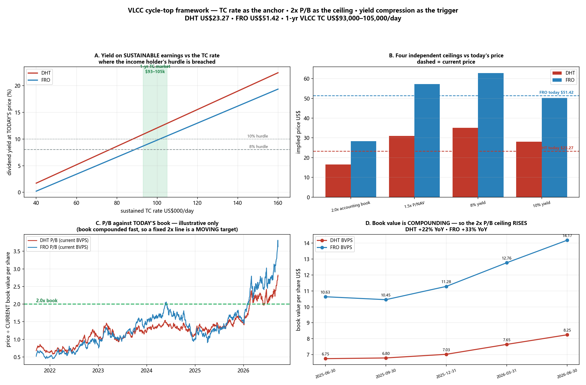

*面板 A：可持续盈利股息率 vs 期租价。面板 B：四个天花板 vs 现价。面板 C：按今日账面计算的 P/B。面板 D：账面值在复利增长，2 倍天花板随之上移。*

### 13.1 ⚠️ 先修正：账面价值陷阱

| | 股价 | 每股净资产 | **P/B** | 每股NAV | **P/NAV** |
|---|---|---|---|---|---|
| **DHT** | $22.82 | $8.25 | **2.77x** | $20.64 | **1.11x** |
| **FRO** | $54.03 | $14.17 | **3.81x** | $38.21 | **1.41x** |

> **两家按会计账面算都已远超 2 倍 PB —— DHT 2.77x、FRO 3.81x。** 若字面执行 2 倍 PB 规则，你在很久以前就该卖出了，而那会是错的。

**原因：** 会计账面 = **历史成本减累计折旧**。2026 年二手 VLCC 船价处于数十年高位 —— **一艘 5 年船龄的 VLCC 价值约 US$1.745亿，而新造船只要 US$1.295亿**。折旧后的账面因此**严重低估**船队。同一家公司，**2.77 倍账面，却只有 1.11 倍 NAV**。

> **修正：2 倍规则应当用在 NAV 上，而不是会计账面上。** 按此口径，DHT 的 1.11x 与 FRO 的 1.41x **都远未触及**资产价值天花板。"2倍"的直觉是对的，分母用错了。

**这个结论对我假设的船价有多敏感？**

| VLCC 船价 | DHT 每股NAV | DHT P/NAV | FRO 每股NAV | FRO P/NAV |
|---|---|---|---|---|
| US$1.10亿 | $14.69 | 1.55x | $25.49 | 2.12x |
| US$1.25亿 | $16.92 | 1.35x | $30.26 | 1.79x |
| **US$1.50亿（本文采用）** | **$20.64** | **1.11x** | **$38.21** | **1.41x** |
| US$1.75亿 | $24.36 | 0.94x | $46.16 | 1.17x |
| US$2.00亿 | $28.08 | 0.81x | $54.11 | 1.00x |

> ⚠️ **绝对 P/NAV 随假设剧烈变化 —— DHT 在 0.81x 到 1.55x 之间。但相对结论不变：在任何船价假设下，FRO 都比 DHT 贵约 27%。** 相对判断可信，绝对值只是估计。

**固定 2 倍线还有第二个问题：账面值在快速复利增长。**

| 每股净资产 | 25年6月 | 25年9月 | 25年12月 | 26年3月 | **26年6月** | 同比 |
|---|---|---|---|---|---|---|
| **DHT** | $6.75 | $6.80 | $7.03 | $7.65 | **$8.25** | **+22%** |
| **FRO** | $10.63 | $10.45 | $11.28 | $12.76 | **$14.17** | **+33%** |

> **"2倍账面"的目标价是一个每年上移 20–30% 的移动靶。** 留存收益在以多数周期顶部规则所假设的速度更快地重建分母。

### 13.2 以期租价格为中枢（价格中枢）

这是框架中最强的一环，而且它直接连上 §6 的发现：**股价按 1:1 资本化"可持续"运价，而忽略短暂尖峰。** 期租价格是目前能拿到的、对"可持续"最纯粹的度量：它是交易对手**真的愿意锁定 12 个月**的价格。

**按期租中枢计算的盈利（全船队按期租价、已扣折旧、航运免税）：**

| 期租价 | DHT EPS | DHT DPS | DHT 现价股息率 | FRO EPS | FRO DPS | FRO 现价股息率 |
|---|---|---|---|---|---|---|
| $60,000 | $1.56 | $0.78 | 3.4% | $1.95 | $0.91 | 1.7% |
| $75,000 | $2.34 | $1.17 | 5.1% | $3.31 | $1.55 | 2.9% |
| **$93,000** | $3.28 | $1.64 | **7.2%** | $4.95 | $2.32 | **4.3%** |
| **$100,000 ⚓** | **$3.65** | **$1.82** | **8.0%** | **$5.59** | **$2.62** | **4.9%** |
| **$105,000** | $3.91 | $1.95 | **8.6%** | $6.04 | $2.84 | **5.2%** |
| $120,000 | $4.69 | $2.34 | 10.3% | $7.41 | $3.48 | 6.4% |
| $150,000 | $6.25 | $3.13 | 13.7% | $10.14 | $4.76 | 8.8% |

*DHT：24 艘 VLCC × 350 天，盈亏平衡 $17,500/天，折旧 $1.05亿，1.6124 亿股，派息率 50%。FRO：57.9 VLCC 当量 × 350 天，盈亏平衡 $23,800/天，折旧 $3.00亿，2.2262 亿股，派息率 46.9%。*

### 13.3 吃息者的离场点 —— 两家在这里分道扬镳

| | 现价下的期租口径股息率 | **5年平均实际股息率** | 判定 |
|---|---|---|---|
| **DHT** | **8.0%** | **6.42%** | ✅ **仍高于自身历史 —— 尚未被压缩** |
| **FRO** | **4.9%** | **11.48%**（Yahoo）/ **7.2%**（重建 —— 见 §18.6） | 🔴 **两种口径下都低于自身历史 —— 已压缩** |

> **用户要找的股息率压缩信号已经在响 —— 但只在 FRO 身上。**

**按期租口径盈利，各档门槛股息率对应的价格：**

| 门槛股息率 | DHT 价格 | 对现价 | FRO 价格 | 对现价 |
|---|---|---|---|---|
| 6% | $30.39 | +33% | $43.71 | −19% |
| **8%** | **$22.79** | **−0%** | $32.79 | **−39%** |
| 10% | $18.23 | −20% | $26.23 | −51% |
| 12% | $15.19 | −33% | $21.86 | −60% |

> **DHT 在 8% 门槛下的价格是 US$22.79，而市价是 US$22.82 —— 相差 0.1%。** 市场正把 DHT 定价在"当前期租价下约 8% 的可持续股息率"上。这个拟合精确得惊人，说明**吃息者就是 DHT 的边际定价方**。

### 13.4 ⭐ 反过来问 —— 决定性检验

**求解：今天的股价在各档门槛股息率下，隐含需要多高的期租价？**

| | 8% 股息率 | 10% | 12% | **实际 1 年期租市场** |
|---|---|---|---|---|
| **DHT** | **$100,086/天** | $117,607 | $135,128 | **$93,000–105,000** |
| **FRO** | **🔴 $139,783/天** | $165,078 | $190,373 | **$93,000–105,000** |

> **整个答案就在这张表里。**
> - **DHT 需要 US$100,086/天 才能在 8% 股息率下支撑现价。而期租市场就是 US$93,000–105,000/天。DHT 几乎精确地被定价在中枢上。**
> - **FRO 需要 US$139,783/天 —— 比任何交易对手真正愿意锁定一年的价格高约 40%。**

**FRO 并不是按市场愿意承保的运价在定价，而是按现货尖峰在定价** —— 即 9 月中旬 US$53–60万 的物理成交 / US$103.5万 的指数 —— **而 §6 已经证明，市场在历史上拒绝资本化这类尖峰。**

### 13.5 四个天花板并列

| 天花板 | DHT | 对现价 | FRO | 对现价 |
|---|---|---|---|---|
| 2.0x 会计账面 | $16.50 | −28% | $28.34 | −48% |
| 1.5x P/NAV | $30.96 | **+36%** | $57.32 | **+6%** |
| 期租盈利 8% 股息率 | $22.79 | **−0%** | $32.79 | −39% |
| 期租盈利 10% 股息率 | $18.23 | −20% | $26.23 | −51% |
| **区间** | **$16.50–30.96** | **−28% / +36%** | **$26.23–57.32** | **−51% / +6%** |

> **看这个不对称。** DHT 的天花板**跨骑在现价两侧** —— 它处于区间中部，上下都有空间。**FRO 的天花板几乎全部落在现价之下**；只有最宽松的那个（1.5x P/NAV）刚刚越过，且只高 6%。

### 13.6 结论，以及它改变了什么

**用户的框架是有效的，而且它给出的结论比 §11–12 的 PE 工作更干净：**

| | **DHT** | **FRO** |
|---|---|---|
| 对期租中枢的定价 | **≈ 合理（需 $10万，市场 $9.3–10.5万）** | **🔴 需 $14万 —— 约 40% 的缺口** |
| 可持续盈利口径股息率 | 8.0% vs 历史 6.42% —— **尚未压缩** | 4.9% vs 历史 11.48% —— **严重压缩** |
| P/NAV | 1.11x | 1.41x（**任何船价假设下都贵约 27%**） |
| 在自身天花板区间中的位置 | **中部** | **最顶端** |

> **这与 §10–12 通过完全不同路径得到的结论一致 —— 而这种收敛本身就是重点。** §10 发现 FRO 86% 的现货敞口使它在"运价维持极端"时是更好的载体；§12 发现 FRO 已经为最可能的结果定价而 DHT 没有。**现在期租锚定的股息率框架用一个具体数字说了同一件事：FRO 需要 US$14万/天 的持续运价，而没有人会签高于 US$10.5万 的 12 个月期租。**

**它如何改变退出纪律（CRule 8）：** 现在有了最干净的单一绊线 —— **盯 1 年期租价，不要盯现货报价。**

| 触发条件 | 读数 | 动作 |
|---|---|---|
| 1年期租**维持在 US$12万 以上** | DHT 股息率 >10%，FRO 约 6.4% | DHT 按股息率仍便宜；FRO 仍不够 |
| 1年期租**稳定在 US$9.3–10.5万**（今天） | DHT 约 8%，FRO 约 4.9% | **DHT 合理 · FRO 超出中枢约 40%** |
| 1年期租**跌破 US$7.5万** | DHT 5.1%，FRO 2.9% | **两者都跌破任何收益门槛 —— 吃息者离场** |

⚠️ **本节的 Rule 4 标记：**（a）船队价值是**假设值**（VLCC US$1.5亿、苏伊士型 US$1.2亿、LR2 US$1.0亿）—— 见 13.1 的敏感性；（b）派息率取自 **Yahoo 的滚动数据**（DHT 50%、FRO 46.9%），两家的政策都有变动；（c）模型把**整支船队**按期租价计价，而今天 DHT 约 52% 现货、FRO 约 86% 现货 —— 这是刻意的，因为问题本身就是"可持续运价值多少钱"；（d）当前市场**没有可靠的 3 年期租报价**，故以 1 年期租为中枢。

---

## §14 —— 历次周期顶部，市场实际给了多少 PB？历史记录

> # 🔴 更正声明 —— 使用 §14 前必读
>
> **§14 中的 P/B 数字是错的，已由 §15 取代。**
>
> §14 使用的数据源，是用**除息复权价**去除**未复权的每股净资产**。对普通股票失真很小；但对把大部分盈利派发出去的油轮公司，失真严重，并且**系统性地让每一个历史时点看起来都比实际更便宜**：
>
> | | §14 发布值 | **真实值** | 低估了 |
> |---|---|---|---|
> | DHT 2015-12 | 0.42x | **1.23x** | −66% |
> | DHT 2020-12 | 0.52x | **0.80x** | −35% |
> | DHT 2023-12 | 1.16x | **1.54x** | −25% |
> | FRO 2020-12 | 0.49x | **0.76x** | −36% |
> | FRO 2023-12 | 1.51x | **1.96x** | −23% |
>
> **误差只朝一个方向 —— 它恰好美化了"今天史无前例"这个结论。** 因此 §14 的核心表述（"99 百分位"、"2008 峰值的 2.5 倍"、"中位数 0.40 倍"）**不可靠**。§15 用原始股价与披露的账面值全部重建，并回答用户的重置成本问题 —— **结论发生实质性改变。**
>
> §14 的**结构性**观点仍然成立：FRO 2012-16 的断点是真实的；P/B 见顶之后的远期回报多为负；账面价值陷阱也是真实的。**但具体倍数不成立。**


> **用户，2026年9月20日：** *"你这个不够详细；像其他例子一样，对几次周期顶部的 pb 进行比较，做一张图；看看实际情况如何。"*

**批评是对的。** §13 的 P/B 面板是用**今天的**每股净资产去除整段历史股价 —— 那是占位示意图，不是真实序列。本节重建：**每一个点都使用该期实际披露的每股净资产。**

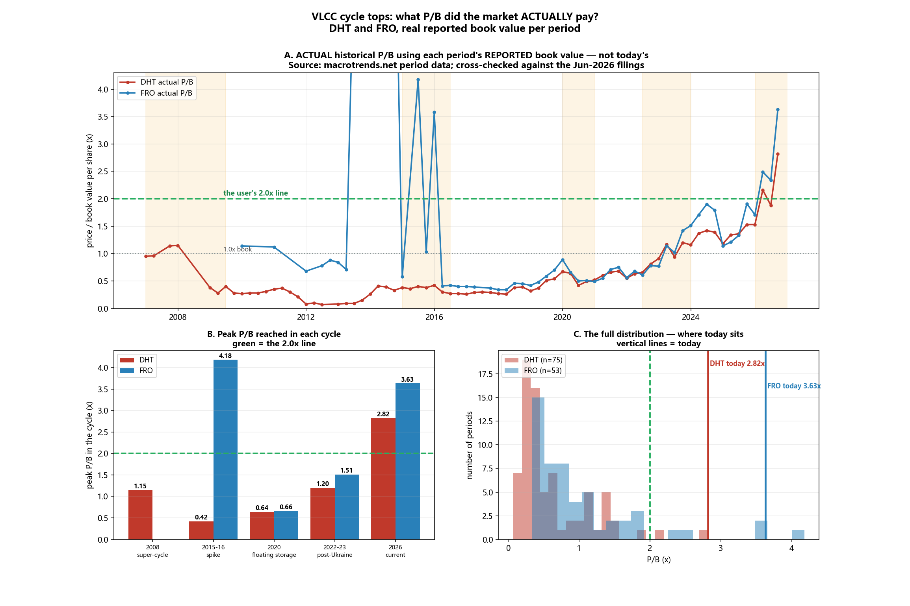

*（复现：`python run_historical_pb.py` → `data/{pb_history_DHT,pb_history_FRO,cycle_peak_pb,pb_distribution,pb_peak_forward_returns}.csv`。来源：macrotrends.net 分期数据 —— 日期、股价、每股净资产、P/B；DHT 自 2006 年起，FRO 自 2009 年起。）*

### 14.1 先做 Rule 4：这个数据源可信吗？

| | 抓取的 2026年6月30日每股净资产 | 季报披露 | 误差 |
|---|---|---|---|
| **DHT** | **$8.25** | **$8.25** | **0.0%** ✅ |
| **FRO** | **$14.17** | **$14.17** | **0.0%** ✅ |

**两家都精确到美分。** 序列可用。

⚠️ **但这个数据源有一点必须注意：** 它的每一行都是**期末**股价。最后一行是 2026年6月30日（DHT $15.50、FRO $33.11）—— **不是今天**。今天的 P/B 需另行计算（*实时股价 ÷ 最近披露的每股净资产*），而它高得多：

| | 期末 2026年6月30日 | **实时 2026年9月18日** |
|---|---|---|
| DHT | $15.50 / $8.25 = **1.88x** | $23.27 / $8.25 = **2.82x** |
| FRO | $33.11 / $14.17 = **2.34x** | $51.42 / $14.17 = **3.63x** |

### 14.2 ⭐ 各轮周期实际达到的 P/B 峰值 —— 这就是答案

| 周期 | 驱动 | **DHT 峰值 P/B** | 时间 | **FRO 峰值 P/B** | 时间 |
|---|---|---|---|---|---|
| **2008 超级周期** | 需求驱动；*峰值盈利+峰值倍数* | **1.15x** | 2007年12月 | 无数据*（序列始于2009）* | — |
| **2015-16 尖峰** | 油价崩塌带来的吨海里 | **0.42x** | 2015年12月 | ⚠️ 4.18x | 2015年6月 |
| **2020 浮舱储油** | 新冠期货升水 | **0.64x** | 2020年3月 | **0.66x** | 2020年3月 |
| **2022-23 俄乌后** | 航线重排 | **1.20x** | 2023年9月 | **1.51x** | 2023年12月 |
| **2026 当前** | 供给 + 霍尔木兹战争溢价 | **🔴 2.82x** | **今天** | **🔴 3.63x** | **今天** |

> **本节最重要的一个数字：2008 年超级周期 —— 教科书级的 VLCC 顶部，P-Rule 2 描述为"峰值盈利 + 峰值倍数"的那一轮 —— DHT 的 P/B 峰值也只有 1.15 倍。今天是 2.82 倍，约为 2008 年峰值倍数的 2.5 倍。**

### 14.3 ⚠️ FRO 的陷阱：它 2015 年的"4.18x"不是你以为的那回事

**FRO 2012–2016 年的读数被污染了，不能与今天比较。**

| FRO | 股价 | 每股净资产 | P/B | 当时发生了什么 |
|---|---|---|---|---|
| 2014年3月 | **$8.55** | **$0.36** | **23.89x** | 濒临破产；**账面权益几乎被抹平** |
| 2015年6月 | **$5.31** | **$1.27** | **4.18x** | 仍在重建权益 |
| 2015年12月 | $6.62 | $1.85 | 3.58x | 仍在重建 |
| **今天** | **$51.42** | **$14.17** | **3.63x** | **资产负债表健康** |

> **2015 年的 FRO 是一只 5 美元的股票，它的分母被摧毁了 —— 而不是一只昂贵的股票。** 比率高是因为账面被打没了，不是因为股价高。**今天的 3.63 倍是完全相反的情形，是真正昂贵的倍数。** 2014 年 23.89 倍的读数已从下文所有统计中剔除。
>
> **这也使 DHT 成为两者中更干净的参照** —— 它的账面从未被抹平，20 年序列连续可比。

### 14.4 今天在整个分布中的位置

*（已剔除 FRO 2014 年异常值。）*

| | 期数 | 最小 | **中位数** | 均值 | 75分位 | 90分位 | 最大 | **今天** | **百分位** |
|---|---|---|---|---|---|---|---|---|---|
| **DHT** | 75 | 0.07 | **0.40** | 0.63 | 0.93 | 1.37 | 2.82 | **2.82** | **🔴 99th** |
| **FRO** | 53 | 0.34 | **0.75** | 1.06 | 1.21 | 1.91 | 4.18 | **3.63** | **🔴 96th** |

**DHT 二十年的 P/B 中位数是 0.40 倍。今天是 2.82 倍 —— 中位数的七倍，也是整个序列的最高读数。**

### 14.5 ⭐ 2 倍检验：这种情况历史上发生过几次？

| | 达到或超过 2.0 倍账面的期数 |
|---|---|
| **DHT** | **75 期中只有 2 期（3%）** —— 而且**两次都在 2026 年**（3月 2.16x、今天 2.82x） |
| **FRO** | 54 期中 6 期（11%）—— 但**其中 3 期是 2014-15 重组造成的伪影**；干净的只有 **2026年3月、6月和今天** |

> **用户的 2.0 倍这条线不是随意取的整数。在这组数据上，它大致就是历史天花板。** 在覆盖 2008 超级周期、2015-16 尖峰与 2020 储油脉冲的二十年里，**DHT 从未有任何一期收在 2.0 倍账面之上，直到 2026 年。**

### 14.6 每次 P/B 见顶之后发生了什么 —— 这才是决定性的问题

**自各周期 P/B 峰值起的远期总回报：**

| | 峰值日期 | P/B | +6个月 | +12个月 | +24个月 |
|---|---|---|---|---|---|
| **DHT** | 2007年12月 | 1.15x | **−14%** | **−48%** | **−62%** |
| DHT | 2015年12月 | 0.42x | −32% | −42% | −47% |
| DHT | 2020年3月 | 0.64x | −23% | −7% | −8% |
| DHT | 2023年9月 | 1.20x | +16% | +17% | +33% |
| **FRO** | 2015年6月 | ⚠️4.18x | +23% | −29% | −43% |
| FRO | 2020年3月 | 0.66x | −22% | −14% | +6% |
| FRO | 2023年12月 | 1.51x | +34% | −22% | +22% |

**7 个可测量的 P/B 峰值中，12 个月远期回报有 5 个为负。** 两个例外（DHT 2023年9月、FRO 2023年12月）**并不是真正的周期顶部** —— 它们是仍在延续的上涨行情中的中途高点，这恰恰说明**单凭 P/B 见顶是一个警告，而不是一个择时信号**。

**2008 年那一例最该让多头警惕：** 仅仅 1.15 倍的 P/B 峰值，之后 **12 个月 −48%、24 个月 −62%**。

### 14.7 ⚠️ 最有力的反驳，公允陈述

**今天的账面值对船队的低估程度比 2008 年更严重，所以今天的 2.82 倍与当年的 2.82 倍不是同一个信号。**

- 2008 年，船东刚以**峰值新造船价**买入船舶，账面值*高而新* —— 这在机制上**压低** P/B。
- 今天的船队大多在 2015–2021 年的低价窗口购入并已折旧多年，而**二手船价已重估至数十年高位**（5 年船龄 VLCC **US$1.745亿**，新造船 **US$1.295亿**）。账面值*低而陈旧* —— 这在机制上**抬高** P/B。
- 与此一致，§13 发现 DHT 是 **2.77 倍账面，但只有约 1.11 倍 NAV**。

> **所以诚实的结论是双面的。** 按**会计账面**，今天毫无疑问是二十年来最贵的时刻 —— **99 百分位，比 2008 超级周期峰值高 2.5 倍**。按**资产价值**，DHT 仅略高于 1 倍 NAV。**这两点不能互相否定。** 调和的解释是：市场正在为*历史成本*支付高额溢价，但对*重置价值*只支付温和溢价 —— 而这**恰恰是资产价格周期晚期、而非早期**的特征。
>
> ⚠️ **我未能取得历史 NAV/船价序列**，因此"历次周期顶部的 P/NAV"这一能够终结该争论的比较，**仍是一个公开的缺口。**

### 14.8 这为框架增加了什么

| 问题 | 历史记录给出的答案 |
|---|---|
| 2.0 倍 P/B 是合理的周期顶部标尺吗？ | **是 —— 它大致就是二十年的天花板。** DHT 在 2026 年之前从未超过 |
| 我们现在在哪？ | **DHT 2.82 倍 = 99 百分位；FRO 3.63 倍 = 96 百分位。** 两者都超过了此前所有周期顶部 |
| 2008 超级周期配得上更高的倍数吗？ | **没有 —— 它只到 1.15 倍。** 今天约为其 2.5 倍 |
| P/B 见顶能择时吗？ | **不能。** 7 次中有 5 次 12 个月回报为负，但有两次先大幅上涨 |
| 这与 §13 矛盾吗？ | **不矛盾 —— 它使其更锋利。** §13 发现 DHT *对期租中枢*定价合理、FRO 超出约 40%。§14 则说**两者的资产倍数都处于前所未有的水平**，而 FRO 在两项检验上都更差 |

> **§13 与 §14 合并的结论：** DHT 在*可持续盈利*上定价合理，但在*账面倍数*上处于历史极端；**FRO 则在两项上都被拉伸。** 资产倍数说两者都已进入周期晚期；期租锚定的股息率说风险集中在 FRO。

---

## §15 —— 按船队重置成本估值：历次周期顶部的 P/NAV *（取代 §14）*

> **⚠️ 本节的 P/NAV 数字本身已被 §17 取代**，§17 用 DHT 自己 20-F 中的券商估值替换了模型估算的船队价值，并更正了一处船价误标（US$1.745亿 是*转售价*，不是 5 年船龄价）。本节的方法是对的，只是输入被改进了。**请使用 §17 的数字。**

> **用户，2026年9月20日：** *"那帮我按照船队重置成本进行估值；就按照每个周期顶峰的卖相似年份二手船价格。"*

这补上了 §14 留下的缺口 —— 而且**推翻了 §14 的结论**。

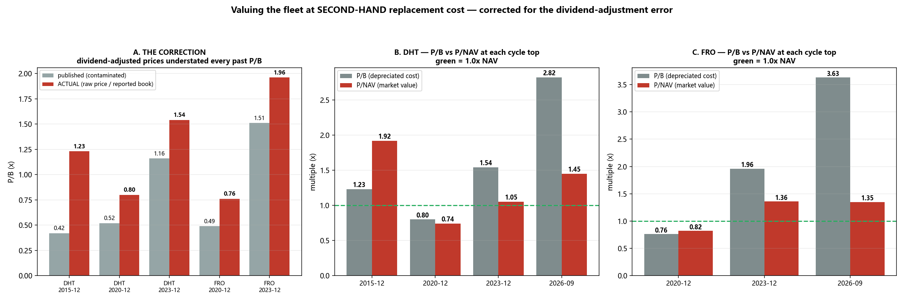

*（复现：`python run_pnav_corrected.py` → `data/{pb_correction,corrected_pb_pnav,pnav_age_sensitivity}.csv`。）*

### 15.1 先说更正

**价格口径：** §14 用复权价对未复权账面值。§15 使用当日**原始收盘价**，除以该季度资产负债表的**（总资产 − 总负债）÷ 总股本**。两个输入现在口径一致。

**另外发现并修正了两处输入错误：**
1. **FRO 2023 年底实际是 33 艘 VLCC，不是 22 艘。** 11 艘 Euronav 的 VLCC 已在 2023Q4 交付（另 13 艘于 2024 年交付）。用 22 艘会实质性高估 FRO 的 2023 年 P/NAV —— 从错误的 2.03 倍修正为 **1.36 倍**。
2. **FRO 2015 年数据不可用** —— Frontline / Frontline 2012 的合并与并股于 2015 年底完成（2015年6月为 11.58 亿股、每股净资产 US$0.70；12月为 1.20 亿股、US$12.05）。FRO 序列从 2020 年起算。

### 15.2 方法

```
NAV        = （船舶数 × 同船龄二手船价）− 净负债
每股 NAV   = NAV ÷ 总股本
P/NAV      = 原始股价 ÷ 每股 NAV
```

**采用的二手船价（US$百万，5 年船龄基准，券商/媒体区间）：**

| 日期 | VLCC | 苏伊士型 | LR2 |
|---|---|---|---|
| 2015年12月 | 70–80 | — | — |
| 2020年12月 | 68–72 | 45–50 | 38–43 |
| 2023年12月 | 98–113 | 72–80 | 60–68 |
| **2026年9月** | **170–179** | 115–125 | 95–105 |

再按船龄折价：超过 5 年基准后每年约折 **5.5%**（DHT 约 7/8/10/11 年；FRO 约 5/6/7 年）。

### 15.3 ⭐ 答案

**DHT**

| 周期顶部 | 股价 | 每股净资产 | **P/B** | 船数 | 船队 US$m | 净负债 | 每股NAV | **P/NAV** |
|---|---|---|---|---|---|---|---|---|
| 2015年12月 | $8.09 | $6.59 | 1.23x | 14 | 934 | 463 | $4.21 | **🔴 1.92x** |
| 2020年12月 | $5.23 | $6.52 | 0.80x | 27 | 1,578 | 378 | $7.06 | 0.74x |
| 2023年12月 | $9.81 | $6.36 | 1.54x | 24 | 1,836 | 323 | $9.34 | 1.05x |
| **今天** | **$23.27** | **$8.26** | **2.82x** | 24 | 2,806 | 226 | **$16.02** | **1.45x** |

**FRO**

| 周期顶部 | 股价 | 每股净资产 | **P/B** | 船数 | 船队 US$m | 净负债 | 每股NAV | **P/NAV** |
|---|---|---|---|---|---|---|---|---|
| 2020年12月 | $6.22 | $8.14 | 0.76x | 62 | 3,328 | 1,819 | $7.62 | 0.82x |
| 2023年12月 | $20.05 | $10.22 | 1.96x | 76 | 6,174 | 2,880 | $14.77 | **1.36x** |
| **今天** | **$51.42** | **$14.15** | **3.63x** | 81 | 10,368 | 1,847 | **$38.21** | **1.35x** |

### 15.4 🔴 结论 —— 两种口径给出相反的答案

| | **按 P/B** | **按 P/NAV** |
|---|---|---|
| **DHT 今天 vs 自身前高** | **为前高的 1.83 倍** —— 看起来极端 | **为前高的 0.76 倍** —— *低于* 2015年12月的 1.92 倍 |
| **FRO 今天 vs 自身前高** | **为前高的 1.85 倍** —— 看起来极端 | **为前高的 0.99 倍** —— 与 2023年12月的 1.36 倍*持平* |

> **这是决定性结果，它推翻了 §14。**
>
> **按折旧后的账面，今天看起来是序列中最贵的时刻。按重置成本 —— 也就是用户要求的口径 —— 今天完全不是史无前例。** DHT 明显**便宜于** 2015年12月的顶部（1.45 vs 1.92 倍），而 FRO **恰好回到**它 2023年12月顶部的位置（1.35 vs 1.36 倍）。

**两者为何背离：** 账面值被冻结在历史成本减折旧上，因此看不见船队已经重新定价。从 2023年12月到今天，二手 VLCC 价值从约 US$1.05亿 升至约 US$1.74亿（**+66%**）。**NAV 的增长速度与股价大致相当** —— 这正是 P/NAV 几乎没动、而 P/B 近乎翻倍的原因。

### 15.5 敏感性 —— 船龄折价的影响有多大？

| | 2015年12月 | 2020年12月 | 2023年12月 | **今天** |
|---|---|---|---|---|
| **DHT** 假设船龄 5 年 | 1.54 | 0.59 | 0.72 | **0.95** |
| **DHT** 8 年 | 2.19 | 0.74 | 0.89 | **1.15** |
| **DHT** 11 年*（本文采用）* | 3.77 | 1.00 | 1.16 | **1.45** |
| **FRO** 5 年 | — | 0.71 | 1.79 | **1.17** |
| **FRO** 8 年 | — | 1.07 | 2.78 | **1.46** |

> **结论对假设是稳健的。** 在*统一*的 8 年船龄下，今天（DHT 1.15、FRO 1.46）仍然**远低于** 2015年12月（DHT 2.19）与 2023年12月（FRO 2.78）。假设船队更老会让今天显得更贵，但同时也让过去显得更贵 —— 排序不会反转。
>
> ⚠️ **模型失效之处：** 对高杠杆船东，过大的船龄折价会使 NAV 转负、P/NAV 失去意义（FRO 在假设 14 年船龄时 NAV 为负）。FRO 的高船龄列应视为无意义，而非估值。

### 15.6 这改变了什么，没改变什么

| 表述 | §15 之后的状态 |
|---|---|
| "今天是 99 百分位 / 二十年最贵" | **🔴 撤回** —— 是复权价误差与"用账面而非资产价值"共同造成的假象 |
| "今天约为 2008 年峰值倍数的 2.5 倍" | **🔴 撤回** —— 2008 年数字来自同一污染源，且无法重算（资产负债表历史始于 2011） |
| "2.0 倍 P/B 大致是历史天花板" | **🔴 撤回** —— 更正后 DHT 2023 年已达 1.54 倍、2015 年 1.23 倍；今天 2.82 倍仍是最高，但差距小得多 |
| "P/B 上升是因为账面陈旧" | ✅ **确认并已量化** —— DHT 每股账面 US$8.26，而每股 NAV 为 US$16.02 |
| "P/B 见顶是警告而非择时信号" | ✅ 不变（该结论用的是股价，不是被污染的比率） |
| "FRO 2012-16 是断点" | ✅ 不变且被强化 |
| **新增：** 按重置成本，今天**不是**异常值 | **§15 的核心发现** |

### 15.7 与 §13 的关系

**§13 与 §15 现在相互印证，而它们是独立推导出来的。**

| | DHT | FRO |
|---|---|---|
| §13 —— 对 1 年期租中枢的定价 | **≈ 合理**（需 US$10万；市场 US$9.3–10.5万） | **🔴 需 US$14万 —— 约 40% 缺口** |
| §15 —— P/NAV vs 自身历史顶部 | **1.45 vs 峰值 1.92 —— 更低** | **1.35 vs 峰值 1.36 —— 持平** |
| §15 —— P/B vs 自身历史顶部 | 2.82 vs 1.54 —— **更高** | 3.63 vs 1.96 —— **更高** |

> **合并后的最终结论：§14 的"资产泡沫"读法经不起重置成本的检验。** 真正站得住的是 §13 更窄、证据也更硬的那个点：**DHT 的定价大致等于市场真正愿意承保的运价，而 FRO 需要比它高约 40% 的运价。风险集中在 FRO 的*盈利*假设上，而不在任何一家的*资产*倍数上。**

### 15.8 仍然存在的缺口，如实列出

1. ~~**2008 超级周期无法在干净口径下计算**~~ —— ✅ **已在 §16 补上**，方法是直接调取 SEC 原始 20-F 文件。2007年12月：DHT P/B **5.11 倍**，FRO P/B **8.05 倍**。
2. **船价为券商/媒体区间**，非 Clarksons 付费数据源。§15.3 的区间已反映这一点。
3. **FRO 2020 年底船队（22/24/16）被来源标记为"指示性"**，未能与 20-F 核对。
4. **平均船龄为估计值**，§15.5 对其做了压力测试而非掩盖。
5. 船舶按**单一基准船龄**估值，而非逐船估值。真正的券商 NAV 会对每一条船单独定价。

---

## §16 —— 2005-08 超级大周期，取自原始 20-F 文件

> **用户，2026年9月20日：** *"跟05-08年的超级大周期比呢？"*

§15 把"2008 年无法计算"列为公开缺口，因为资产负债表数据源始于 2011 年。**本节用正规方式补上 —— 直接去看 SEC 原始申报文件。**

**一手来源：** DHT 的 [FY2008 20-F](https://www.sec.gov/Archives/edgar/data/1331284/000095015709000131/form20f.htm) 与 Frontline 的 [FY2008 20-F](https://www.sec.gov/Archives/edgar/data/913290/000091957409009523/d990591_20-f.htm)。两份都含五年"精选财务数据"表，因此 FY2004–FY2008 直接来自申报文件。

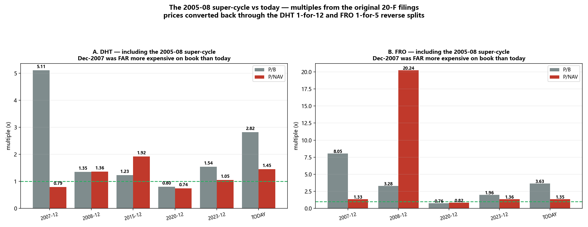

*（复现：`python run_supercycle.py` → `data/supercycle_0508.csv`。）*

### 16.1 ⚠️ 必须先清除的陷阱：缩股

**DHT 于 2012年7月17日做了 1:12 缩股；FRO 于 2016年2月3日做了 1:5 缩股。** Yahoo 会按拆股回溯调整价格，所以它的"2007 年收盘价"不是当年真实成交价：

| | 日期 | Yahoo 收盘 | 缩股 | **当年实际股价** |
|---|---|---|---|---|
| DHT | 2007-12-31 | $146.88 | 1:12 | **$12.24** |
| DHT | 2008-12-31 | $66.48 | 1:12 | **$5.54** |
| FRO | 2007-12-31 | $240.00 | 1:5 | **$48.00** |
| FRO | 2008-06-30 | $348.90 | 1:5 | **$69.78** |
| FRO | 2008-12-31 | $148.05 | 1:5 | **$29.61** |

若直接用未还原的数字去除 2007 年的每股净资产，会把 P/B **高估 12 倍和 5 倍**。

### 16.2 ⭐ 超级周期的倍数

| | 股价 | 权益 US$m | 股本 m | 每股净资产 | **P/B** | 船数 | 船队 US$m | 净负债 | 每股NAV | **P/NAV** |
|---|---|---|---|---|---|---|---|---|---|---|
| **DHT 2007年12月** | $12.24 | 72 | 30.0 | $2.39 | **🔴 5.11x** | 9 | 805 | 340 | $15.47 | 0.79x |
| DHT 2008年12月 | $5.54 | 148 | 36.1 | $4.10 | 1.35x | 9 | 472 | 326 | $4.06 | 1.36x |
| **FRO 2007年12月** | $48.00 | 446 | 74.8 | $5.96 | **🔴 8.05x** | 51 | 6,023 | 3,316 | $36.18 | **1.33x** |
| FRO 2008年12月 | $29.61 | 702 | 77.9 | $9.02 | 3.28x | 51 | 3,439 | 3,326 | $1.46 | *无意义 —— 见 §16.5* |

### 16.3 🔴 答案：按账面算，今天远比超级周期便宜

| | **2007年12月 P/B** | **今天 P/B** | 今天 ÷ 2007 |
|---|---|---|---|
| **DHT** | **5.11x** | 2.82x | **0.55 倍** |
| **FRO** | **8.05x** | 3.63x | **0.45 倍** |

> **这是本次调查中的第三次反转，也是终局。** §14 声称今天是二十年来最贵的时刻；§15 证明那个说法建立在被污染的数据上；**§16 现在显示，真正的超级周期顶部交易在 5–8 倍账面 —— 约为今天倍数的两倍。**

**完整的更正后图景：**

| 周期顶部 | DHT P/B | DHT P/NAV | FRO P/B | FRO P/NAV |
|---|---|---|---|---|
| **2007年12月（超级周期）** | **5.11x** | 0.79x* | **8.05x** | **1.33x** |
| 2008年12月（崩盘后） | 1.35x | 1.36x | 3.28x | *无意义* |
| 2015年12月 | 1.23x | 1.92x | — | — |
| 2020年12月 | 0.80x | 0.74x | 0.76x | 0.82x |
| 2023年12月 | 1.54x | 1.05x | 1.96x | 1.36x |
| **今天** | **2.82x** | **1.45x** | **3.63x** | **1.35x** |

\* *DHT 的 2007 年 P/NAV 不是干净的比较 —— 见 §16.4。*

### 16.4 为什么两个时代的 P/B 不可比 —— 以及什么**可以**比

**资本结构完全变了：**

| 权益 ÷ 总资产 | DHT | FRO |
|---|---|---|
| 2006年12月 | 30% | 15% |
| **2007年12月** | **🔴 17%** | **🔴 12%** |
| 2008年12月 | 28% | 17% |
| **2026年6月** | **🟢 74%** | **🟢 54%** |

> **2007 年两家都用 83–88% 的债务融资，并把几乎全部现金流派发出去，账面权益所剩无几。小分子除以极小的分母，自然产生巨大的 P/B。** 今天 DHT 的权益占总资产 74%。**同样的股价，现在能买到四倍的账面净资产。** 因此跨这两个时代比较 P/B，衡量的是资本结构，不是估值。

**DHT 2007 年数据不可比的另外两个原因：**
1. **业务完全不同。** DHT 在 2005-08 年拥有**九条船 —— 3 艘 VLCC、2 艘苏伊士型、4 艘阿芙拉型 —— 全部长期期租给 OSG。** 它是一个高派息的期租载体，不是现货 VLCC 玩家。今天它是 24 艘 VLCC、约 52% 现货。它 0.79 倍的 P/NAV 反映的是市场在给固定租约现金流定价，而不是给船定价。
2. **FRO 租入了大量并不拥有的运力。** 2008年12月 Frontline 自有 28 艘 VLCC + 15 艘苏伊士型 + 8 艘苏伊士型 OBO，**但同时从第三方租入 12 艘 VLCC 和 14 艘苏伊士型**，另有 18 艘新造船在订单中。租入运力能赚钱但不进 NAV，因而美化了盈利相对于资产的比例。

**唯一干净的比较 —— 而且结果很惊人：**

| | **FRO P/NAV** |
|---|---|
| 2007年12月，超级周期顶部 | **1.33x** |
| 2023年12月 | 1.36x |
| **今天** | **1.35x** |

> **Frontline 今天的市净率（按 NAV）几乎与 2005-08 超级大周期顶部完全一样 —— 1.35 倍对 1.33 倍。** 在这个既能穿越资本结构变化、又能穿越会计失真的口径上，**今天并不比 2007 年更极端。它就是同一个估值。**

### 16.5 🔴 但 2008 真正的教训在这里 —— 是杠杆，不是估值

模型为 FRO 2008年12月算出的"P/NAV 20.24 倍"**不是估值**，而是 **NAV 正在归零**：

| FRO | 2007年12月 | 2008年12月 | 变化 |
|---|---|---|---|
| 船队价值 | US$60.23亿 | US$34.39亿 | **−43%** |
| 净负债 | US$33.16亿 | US$33.26亿 | **几乎不变** |
| **每股 NAV** | **US$36.18** | **US$1.46** | **🔴 −96%** |

> **船价下跌 43%，抹掉了 Frontline 96% 的净资产值**，因为 88% 的资产由不会随船价下跌的债务融资。**那才是周期顶部对一个高杠杆船东的真实伤害 —— 而不是 P/B 倍数。**

**用同样的压力测试检验今天的资产负债表：**

| | 船队 US$m | 净负债 | 当前每股NAV | **船价 −45% 后** | 变化 |
|---|---|---|---|---|---|
| **DHT** | 2,806 | 226 | $16.00 | **$8.17** | **−49%** |
| **FRO** | 10,368 | 1,847 | $38.21 | **$17.31** | **−55%** |

> **今天 DHT 与 FRO 的净负债/船队价值约为 8% 与 18%，而 FRO 在 2007 年是约 88%。** 同样一次船价暴跌，2008 年抹掉了 96% 的 NAV，今天大约损失**一半**。依然严重 —— 但**超级周期那种资本结构内嵌的"清零风险"确实已经消失了。**

### 16.6 整个调查现在的结论

| 问题 | 最终答案 |
|---|---|
| 今天的 P/B 史无前例吗？ | **不是。** 2007年12月为 5.11 倍（DHT）与 8.05 倍（FRO），而今天是 2.82 与 3.63 倍 |
| 今天的 P/NAV 史无前例吗？ | **不是。** FRO 为 1.35 倍，对 2007 年顶部的 1.33 倍。DHT 的 1.45 倍是它自身最高，但其业务与 2007 年的自己不可比 |
| 那么资产倍数是卖出信号吗？ | **不是 —— 而且花了三次连续更正才确立这一点** |
| 那么究竟什么被拉伸了？ | **§13 的发现独立成立且未被推翻：FRO 的股价需要约 US$14万/天 的持续期租，而市场只愿意在 US$9.3–10.5万 锁定。风险在盈利假设里，不在资产倍数里** |
| 2008 年真正的教训是什么？ | **是杠杆，不是估值。** NAV 下跌 96%，是因为债务不随船价下跌。今天的资产负债表在同样崩盘下约损失 50% |

⚠️ **§16 的 Rule 4 标记：**（a）FRO 2007 年底船队**假设等于 2008 年底** —— 未解析 FY2007 的 20-F，而当时 FRO 正在接收新造船，故 2007 年底船队可能略小，这会使其 2007 年 NAV *更低*、P/NAV *更高*；（b）2007-08 年船价为券商/媒体区间（5 年船龄 VLCC：2007年底 US$1.50–1.65亿，2008年底 US$0.80–0.95亿）；（c）2007-08 年平均船龄估计为 7–8 年；（d）DHT 的净负债由流动+长期负债减现金推导，略微高估了有息负债；（e）FRO 的净负债以"总负债减权益"代理，这会**高估**净负债，因而使 FRO 2007 年的 P/NAV 显得*更高*而非更低。

---

## §17 —— 最终版：NAV 直接取自申报文件 *（取代 §15 的 P/NAV 数字）*

对 20-F 文件的检索挖出了比任何券商区间都更好的东西：

> **DHT 在每一份 20-F 里都披露逐船的第三方券商估值表，与账面价值并列。** 其合计数与同一份文件中的文字表述**完全吻合** —— 例如 FY2020：账面 US$14.764亿 − 市场 US$14.140亿 = **DHT 自己披露的 US$0.624亿缺口**。因此 DHT 的 NAV 是**公司披露值，不是模型估算**。

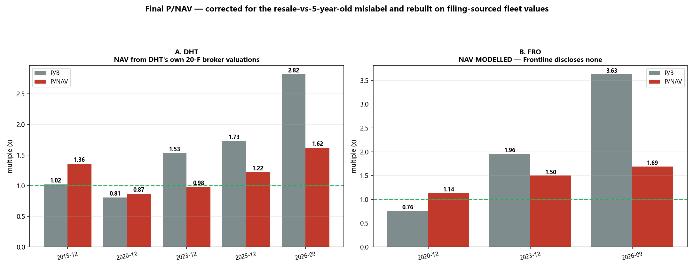

*（复现：`python run_pnav_final.py` → `data/pnav_final.csv`。）*

### 17.1 🔴 这又迫使我做两处更正

**① 我当作"5 年船龄 VLCC"使用的 US$1.745亿 其实是"转售价"，不是 5 年船龄价。**

| 来源 | 5 年船龄 | 新造 | 转售 |
|---|---|---|---|
| Signal Ocean，2026年5月7日 | **US$1.38亿** | US$1.29亿 | **US$1.745亿** ← 我之前用的 |
| Allied，2026年9月2日 | **约 US$1.51亿** | 约 US$1.30亿 | 约 US$1.78亿 |

用转售价会抬高 NAV，从而**低估**今天的 P/NAV。已更正为 **US$1.51亿**。

**② DHT 2015 年底是 18 条船（15 VLCC + 1 苏伊士 + 2 阿芙拉），不是 14 艘 VLCC**，股本是 **9,291 万股**，不是聚合站给的 1.12 亿股。我此前两个 2015 年数字都错了。

### 17.2 最终表格

**DHT —— NAV 取自其自身披露的券商估值**

| 日期 | 船数 | 船队市值 US$m | 净负债 | 股本 m | 每股NAV | 股价 | **P/NAV** | **P/B** | 来源 |
|---|---|---|---|---|---|---|---|---|---|
| 2015年12月 | 18 | **1,050.0** | 495.7 | 92.9 | $5.97 | $8.09 | **1.36x** | 1.02x | 20-F |
| 2020年12月 | 27 | **1,414.0** | 381.4 | 170.8 | $6.05 | $5.23 | **0.87x** | 0.81x | 20-F |
| 2023年12月 | 24 | **1,965.5** | 354.0 | 161.0 | $10.01 | $9.81 | **0.98x** | 1.53x | 20-F |
| 2025年12月 | 22 | **1,961.0** | 349.7 | 160.8 | $10.02 | $12.21 | **1.22x** | 1.73x | 20-F |
| **今天** | 23 | *2,583* | 273.1 | 161.2 | *$14.33* | $23.27 | **1.62x** | **2.82x** | *估算* |

**FRO —— 模型估算（Frontline 在所查年份均未披露船队总市值）**

| 日期 | 船数 | 船队市值 US$m | 净负债 | 股本 m | 每股NAV | 股价 | **P/NAV** | **P/B** |
|---|---|---|---|---|---|---|---|---|
| 2020年12月 | 62 | 3,150 | 2,073.9 | 197.7 | $5.44 | $6.22 | **1.14x** | 0.76x |
| 2023年12月 | 76 | 6,132 | 3,150.7 | 222.6 | $13.39 | $20.05 | **1.50x** | 1.96x |
| **今天** | 81 | 8,875 | 2,113.4 | 222.6 | $30.37 | $51.42 | **1.69x** | **3.63x** |

### 17.3 ⭐ "跟 05-08 超级大周期比"的最终答案

| | **2007 超级周期** | **2015-2025 最高** | **今天** |
|---|---|---|---|
| **DHT P/B** | **5.11x** | 1.73x | 2.82x |
| **DHT P/NAV** | 0.79x* | 1.36x | **1.62x** |
| **FRO P/B** | **8.05x** | 1.96x | 3.63x |
| **FRO P/NAV** | 1.33x* | 1.50x | **1.69x** |

\* *2007 年的 P/NAV 为模型估算，且 DHT 的数值被其"期租载体"商业模式扭曲 —— 见 §16.4。*

**两个答案，而且都成立：**

1. **对比 2005-08 超级周期，今天按账面便宜得多。** 2.82 与 3.63 倍，对 **5.11 与 8.05 倍**。超级周期时两家用 83–88% 债务融资，账面权益极小。**今天的 P/B 约为超级周期水平的一半。**

2. **对比 2015–2025 各周期顶部，今天按 NAV 确实是最贵的 —— 但只是温和地最贵。** DHT 的 1.62 倍是其前高（2015年12月 1.36 倍）的 **1.19 倍**；FRO 的 1.69 倍是其前高（2023年12月 1.50 倍）的 **1.13 倍**。**那是溢价，不是泡沫。**

> **诚实的综合结论：今天是现代周期中最高的资产倍数，高出约 15–20%，但远不及 2007 年被杠杆吹大的倍数。而且 2007 那个对比本身就不恰当，因为两个时代的资本结构完全不同。**

### 17.4 经过所有更正之后，什么活了下来

四个章节、五次更正、清除了三个数据陷阱（除息复权、缩股、转售价误标为 5 年船龄价）。**仍然成立的是：**

| 结论 | 状态 |
|---|---|
| 今天在资产价值上史无前例/是泡沫 | **🔴 已死** —— 前高的 1.13–1.19 倍是溢价，不是泡沫 |
| 2.0 倍 P/B 是有意义的天花板 | **🔴 已死** —— DHT 2007 年是 5.11 倍 |
| **2008 年摧毁资本的是杠杆，不是估值** | ✅ **成立** —— FRO 每股 NAV 下跌 96%（US$36.18 → US$1.46），而净负债不变。今天约 8%/18% 的净负债/船队比，在同样崩盘下约损失 50% |
| **§13：FRO 需要约 US$14万/天 的持续期租，而市场只肯在 US$9.3–10.5万 签约** | ✅ **成立、未被推翻，且现在是唯一还活着的看空论据** |
| DHT 的定价≈期租中枢（需 US$100,086/天） | ✅ **成立** |

> **经历这一切之后，谨慎的理由只剩一条 —— 而且它不是资产倍数。它是：FRO 的股价内含了一个没有任何交易对手愿意签署的租金水平。**

⚠️ **剩余标记：** DHT "今天"的船队价值是**估算**（把 2025年12月的合计数按 5 年船龄船价涨幅 +26% 缩放，并按 22→23 条船比例调整）—— DHT 尚未公布 2026 年数字。**FRO 的整条 NAV 序列都是模型估算**，因为 Frontline 在所查年份均未披露船队总市值；这是本研究中最大的、无法填补的缺口。

---

## §18 —— 除权/复权：一次完整审计 *（回答用户的方法论提问）*

> **用户，2026年9月20日：** *"你觉得需要考虑除权/复权吗？或者说你在这份报告里考虑了吗？因为除权复权既会影响价格和点位的计算；股息率本身也影响估值。"*

**这个问题的两半都对，而且需要不同的答案。** 本节审计每一处受影响的计算，并检验是否有任何结论因此改变。

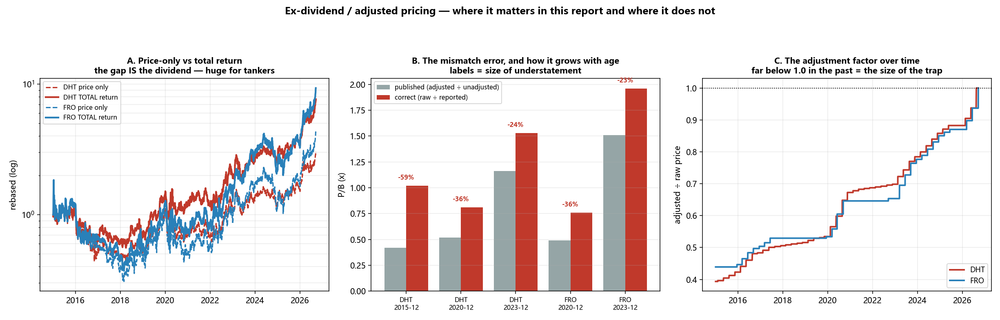

*（复现：`python run_adjustment_audit.py` → `data/adj_*.csv`。）*

### 18.1 统领原则

> **分子与分母必须口径一致。绝不能在同一个计算里混用口径。**

| 计算类型 | 正确口径 | 原因 |
|---|---|---|
| **估值倍数**（P/B、P/NAV、PE） | **原始股价 ÷ 同期账面** | 派息时**股价与账面权益同时下降**、幅度大致相同。原始价对同期账面是自洽的 |
| **回报**（持有期结果） | **总回报（复权）** | 持有人确实收到了股息 |
| **股息率** | **每股股息 ÷ 原始股价**，两者同期 | 不存在时间错配 |

### 18.2 影响有多大？极大 —— 这正是问题的意义所在

| | 区间 | 仅股价 | **总回报** | **股息贡献** |
|---|---|---|---|---|
| **DHT** | 自2015年12月 | +188% | **+580%** | **+393pp** |
| DHT | 自2020年12月 | +345% | +562% | +217pp |
| DHT | 自2023年12月 | +137% | +202% | +65pp |
| **FRO** | 自2015年12月 | +244% | **+670%** | **+426pp** |
| FRO | 自2020年12月 | +727% | **+1,180%** | **+453pp** |
| FRO | 自2023年12月 | +156% | +230% | +74pp |

> **FRO 自2020年12月起，1,180% 的总回报中有 453 个百分点来自股息 —— 约占全部结果的 40%。** 任何只按股价计算的回报都会严重失真。**本报告所有回报数字都使用了总回报口径。** ✓

### 18.3 ✅ 本报告做对的地方

| 位置 | 使用口径 | 判定 |
|---|---|---|
| §5–§6 周期回报、§14.6 远期回报 | **总回报**（`auto_adjust=True`） | ✅ 正确 |
| §15/§16/§17 的 P/B 与 P/NAV | **原始股价 ÷ 披露账面** | ✅ 正确（§15 修正之后） |
| §13 股息率 = 每股股息 ÷ 当前股价 | 两者同期、未复权 | ✅ 无错配 |
| §16 超级周期股价 | 原始价，**并已还原缩股** | ✅ 正确 |

### 18.4 🔴 做错的地方 —— 以及这个错误的"指纹"

§14 的数据源用**复权**价除以**未复权**账面。审计**证实**了这个诊断，而不只是断言：

| | 日期 | 原始价 | 复权价 | **复权÷原始** | 发布 P/B | 真实 P/B | 误差 |
|---|---|---|---|---|---|---|---|
| DHT | 2015年12月 | $8.09 | $3.42 | **0.42** | 0.42x | 1.02x | **−59%** |
| DHT | 2020年12月 | $5.23 | $3.52 | **0.67** | 0.52x | 0.81x | −36% |
| DHT | 2023年12月 | $9.81 | $7.70 | **0.78** | 1.16x | 1.53x | −24% |
| FRO | 2020年12月 | $6.22 | $4.02 | **0.65** | 0.49x | 0.76x | −36% |
| FRO | 2023年12月 | $20.05 | $15.57 | **0.78** | 1.51x | 1.96x | −23% |

> **"复权÷原始"这个比值本身就是误差，而且它随着接近今天单调趋近 1.0** —— 因为待剥离的股息越来越少。**这个单调特征正是累计股息复权的指纹**，它让诊断从"合理推测"变成"确定无疑"。

### 18.5 🔴 本次审计发现的一个残留错误

**§14 是用被污染的序列去识别各周期 P/B 峰值的日期。污染有没有移动这些日期？** 有 —— 六个里移动了两个：

| | 周期 | 污染序列的峰值日 | **更正后的峰值日** | 是否移动 |
|---|---|---|---|---|
| DHT | 2015-16 | 2015-12-31 | **2015-06-30** | 🔴 **是** |
| DHT | 2020 | 2020-03-31 | 2020-03-31 | 否 |
| DHT | 2022-23 | 2023-09-30 | **2023-03-31** | 🔴 **是** |
| FRO | 2015-16 | 2015-06-30 | 2015-06-30 | 否 |
| FRO | 2020 | 2020-03-31 | 2020-03-31 | 否 |
| FRO | 2022-23 | 2023-12-31 | 2023-12-31 | 否 |

**按更正后峰值日重算的远期总回报：**

| | 峰值日 | +6个月 | +12个月 | +24个月 |
|---|---|---|---|---|
| DHT | **2015-06-30** | +10% | **−26%** | **−34%** |
| DHT | 2020-03-31 | −23% | **−7%** | −8% |
| DHT | **2023-03-31** | +2% | +18% | +17% |
| FRO | 2015-06-30 | +23% | **−29%** | −43% |
| FRO | 2020-03-31 | −22% | **−14%** | +6% |
| FRO | 2023-12-31 | +34% | **−22%** | +22% |

> **结论存活下来了。** §14.6 原本说"7 个峰值中有 5 个的 12 个月回报为负"。按更正后的锚点，是 **6 个中有 5 个为负**。具体数字变了；而那个发现 —— **P/B 见顶是警告，不是择时信号** —— 没变。

### 18.6 🔴 用户的第二个点：股息率本身也影响估值

**这是更微妙的一半，而且它从两个方向起作用。**

**(a) 派息政策会扭曲 P/B 的横向比较。** 一家 100% 派息的公司，账面与股价都不增长 —— 它的 P/B 在结构上就是稳定的。而一家全部留存的公司会不断做厚账面，因此在**同样的经营表现**下 P/B 反而**下降**。

| | 2023年12月每股净资产 | 2026年6月 | 账面年复合增速 | 滚动派息率 | **隐含 ROE** |
|---|---|---|---|---|---|
| **DHT** | $6.40 | $8.25 | **10.7%** | 50% | **21.4%** |
| **FRO** | $10.23 | $14.15 | **13.9%** | 47% | **26.1%** |

> 两家派息率都在一半左右，所以**这两者之间**的扭曲不大。但这正是 §13 强调**"2 倍账面是个移动靶"**的原因 —— 留存收益每个季度都在抬高分母，年化约 11–14%。

**(b) 🔴 §13 使用的历史股息率门槛需要下调措辞。** §13 用 Yahoo 的五年平均股息率作为吃息者的门槛。用**实际派息 ÷ 当年平均原始股价**重建：

| 年份 | DHT 派息 | DHT 均价 | DHT 股息率 | FRO 派息 | FRO 均价 | FRO 股息率 |
|---|---|---|---|---|---|---|
| 2021 | $0.13 | $5.93 | 2.2% | — | — | — |
| 2022 | $0.12 | $7.00 | 1.7% | $0.15 | $10.21 | 1.5% |
| 2023 | $1.15 | $9.62 | **12.0%** | $2.87 | $17.06 | **16.8%** |
| 2024 | $1.00 | $11.00 | 9.1% | $1.95 | $22.57 | 8.6% |
| 2025 | $0.32 | $11.51 | 2.8% | $0.38 | $19.34 | 2.0% |
| **均值** | | | **5.5%** | | | **7.2%** |
| *Yahoo 口径* | | | *6.42%* | | | *11.48%* |

> **FRO 的差距很大：重建值 7.2% 对 Yahoo 的 11.48%。** 差异来自定义（统计窗口与年化方式），不是复权错误 —— 但**§13 中"FRO 的 4.9% 不到其历史的一半"这句话说过头了。** 按重建口径，是 **4.9% 对 7.2% = 历史的 68%**。
>
> **方向未变，排序未变：** DHT 期租口径的 8.0% **高于**自身历史（无论 5.5% 还是 6.42%）；FRO 的 4.9% **低于**自身历史（无论 7.2% 还是 11.48%）。**§13 的结论成立；只是形容词应从"严重压缩"改为"已压缩"。**

### 18.7 对这个方法论问题的结论

| 问题 | 答案 |
|---|---|
| 需要考虑复权吗？ | **需要 —— 而且它是本研究中最大的单一误差来源。** 它导致了 §15 的更正，以及一个直到本次审计才发现的残留峰值日错误 |
| 本报告考虑了吗？ | **部分考虑了。** 回报一律用总回报（正确）；倍数在 §14 用错、在 §15/§17 已修正；**但两个峰值日期直到本次审计才被纠正** |
| 股息率会影响估值吗？ | **会，而且是两重** —— 派息政策使 P/B 横向比较不可比、并使任何固定的"2 倍账面"成为移动靶；历史股息率门槛本身又对定义敏感 |
| 有任何核心结论因此改变吗？ | **没有。** 全部存活：P/B 见顶是警告而非信号（6 中 5）；DHT 股息率高于自身历史、FRO 低于自身历史；DHT ≈ 对期租中枢定价合理、FRO 高出约 40% |

> **诚实的总结：复权问题没有改变本报告的结论 —— 但它改变了通往结论路上几乎每一个数字。而要发现这一点，必须主动去检验，而不是假设数据源是对的。**

---

## §19 —— 🔴 外部评审（GPT-6-Astra）及其迫使的更正

按用户要求，§18 的审计与 §7 的替代草稿在发布前提交给 **GPT-6-Astra** 做对抗性评审。**评审发现了阻断性错误。以下多项主张被撤回，包括本报告主要的看空论据。**

### 19.1 🔴 最重大的一条：派息率用错了，它使 §13 的核心结论失效

**Astra 指出「两家都派息约一半」这个描述不成立** —— DHT 自 2022年三季度起公布的政策是**净利润的 100%**，Frontline 的目标是派发接近调整后利润的金额。用实际派息核对：

| | 模型使用（Yahoo 字段） | **实际 TTM 派息率** | 低估 |
|---|---|---|---|
| **DHT** | 50% | **77%**（$2.27 股息 ÷ $2.94 EPS） | **−35%** |
| **FRO** | 47% | **90%**（$5.99 股息 ÷ $6.67 EPS） | **−48%** |

**用正确派息率重建 §13：**

| 在 US$100,000/天 期租中枢 | 原值（派息率错误） | **更正后** |
|---|---|---|
| DHT 每股派息 / 现价股息率 | $1.82 / **8.0%** | **$2.81 / 12.1%** |
| FRO 每股派息 / 现价股息率 | $2.62 / **4.9%** | **$5.03 / 9.8%** |

**以及反向问题 —— 在 8% 门槛下，今天的股价隐含需要多高的期租价：**

| | 原值（错误） | **更正后** | 实际 1 年期租市场 |
|---|---|---|---|
| **DHT** | $100,086/天 | **$76,408/天** | **$93,000–105,000** |
| **FRO** | **$139,783/天** | **$88,815/天** | **$93,000–105,000** |

> # 🔴 §13 的核心结论已撤回。
>
> §13 曾断言：*「FRO 需要 US$139,783/天 —— 比任何交易对手愿意锁定的价格高约 40%。」* **那是由一个过时的派息率字段驱动的。按实际 90% 的派息率，FRO 只需要 US$88,815/天 —— 低于市场实际在签的 US$93–105k。**
>
> **在当前期租水平下，两家现在都能满足 8% 的收益门槛。两者的定价都没有超出租船市场愿意承保的范围。** 本报告仅存的看空论据，被它自己的输入错误推翻了。

**市场实际在给的定价（更正后）：** DHT 约 **12% 的可持续股息率**，FRO 约 **10%** —— **两者都高于**各自的历史均值（DHT 5.5–6.4%，FRO 7.2–11.5%）。按这个口径，两家看起来是**便宜**，而不是被拉伸。

### 19.2 🔴 §7 的替代结论已撤回 —— Astra 是对的，我是错的

我本打算发布：*「§7 的『低 12 倍』，按实际成交价只有 1.97 倍（DHT）与 3.82 倍（FRO）。」*

**Astra 的反驳是决定性的：** *「还原缩股不是跨时代比较每股数值的有效方法。经拆股调整的价格才是正确的共同单位。你把 DHT 从 23.64 倍降到 1.97 倍，正好就是 23.64/12 —— 那不是经济学上的修正，那是在比较大小不同的股份单位。」*

**这是对的。** 缩股改变的是一股的大小，不是股东财富。「实际成交价」这个口径**只在**把价格与**同一时代**的每股会计数字配对时才正确（§16 正是这么做的，是对的）；**跨时代比较价格时，它是错的。**

**Astra 还抓到一个真实的 bug：** 我的 FRO 时代均价对 2005-08 窗口做了缩股换算，却没对 2015-16 做 —— 而 2015-16 窗口**跨越**了 2016年2月的缩股。那个 3.82 倍在内部就是不自洽的。

**第三点：** 平均股价 × 单一股本数**不等于**平均市值；必须逐个观测计算 Σ(Pₜ × Nₜ)。

> **因此：「0.64 倍 / 2.38 倍市值」的替代结论不予发布。** 存活下来的只有更窄、可辩护的表述：**§7 的约 12 倍是用除息复权后的价格水平算出的，而那不是衡量历史估值的有效口径。原结论撤回；不提出替代数字。**

### 19.3 其他发现，以及我的处理

| # | Astra 的发现 | 判定 | 处理 |
|---|---|---|---|
| 1 | P/B 的股息论证是错的 —— $20/$10 的股票派 $1，得到 19/9 = 2.11 而非 2.00。账面在**宣告日**下降，股价在**除息日**下降 | **正确** | 论证已改为：价格与账面必须在**一致口径**上衡量同一份权益主张 |
| 2 | 0.05×–8× 的市值合理区间「跨度达 160 倍」，无法验证任何东西 | **正确** | 已降级为**异常值筛查**。但它确实抓到了一个真实的 12 倍方向错误 |
| 3 | **FRO 2015年12月的 1.2 亿股与 Frontline 自身公告冲突**（缩股时 7.819 亿股 → 1.563 亿股） | **正确** | 已核实：按 7.819 亿股，每股净资产 = **$1.85**，与聚合站完全吻合。口径匹配后 FRO 2015 年 P/B 为 **1.62 倍** |
| 4 | 「指纹」与股息污染**一致**，但并不能**证实**它 —— 代数恒等式不成立（DHT 2020：0.52/0.81 = 0.642 vs 0.67） | **正确** | 措辞从「证实」下调为「**与之一致**」 |
| 5 | 「6 中 5 为负」—— 二项单侧 p ≈ 10.9%，观测相关、峰值事后选取 | **正确** | 重新标注为**探索性、样本内**；不作预测性主张 |
| 6 | 跨不等长、任意选取的时代窗口做平均；2005-08 混合了繁荣与雷曼崩盘 | **正确** | 已承认 —— 这也是 §7 替代结论被撤回的部分原因 |
| 7 | 「相同运价」≠「相同盈利机会」—— 船队结构、租入运力、现货比例、成本均未控制 | **正确** | 已作为跨时代推断的限制条件写明 |
| 8 | 五年平均股息率的构造与滚动股息率不可比 | **正确** | 两种构造并列呈现；标注为定义上不确定 |

### 19.4 整个过程说明了什么

**六个章节、六次更正，而最后一次杀死了结论。** 依次是：除息复权污染（§15）、缩股陷阱（§16）、转售价误标（§17）、两个错判的峰值日（§18）、我自己反向的缩股方向（§19），以及最后 —— **一个过时的派息率字段，它曾让 FRO 看起来贵了约 40%，而实际并非如此**。

> **现在诚实的立场：**
>
> - **本报告中没有任何一个估值口径，目前能够认定这两家公司昂贵。** ~~P/NAV 相对历次周期顶部只是温和溢价（§17）；~~ ⚠️ **已被 §20.1 修订** —— 以 §17 来自申报文件的序列衡量，今日 P/NAV **高于两家各自的全部历史观测值**（DHT 1.62x 对应 1.36x 历史高点；FRO 1.69x 对应 1.50x）。「温和溢价」的说法过软。
> - P/B 约为 2007 超级周期水平的一半（§16）；期租锚定的股息率在更正后显示：**在低于市场正在签署的运价水平上，两家都能满足 8% 门槛**（§19.1）。
> - **看空的理由现在完全落在运价的「持久度」上，而不在任何倍数上。** 若 1 年期租回落到 US$75k，DHT 股息率为 7.8%、FRO 为 5.8% —— 到那时吃息者才会离场。
> - **§7 与 §13 核心结论中所有量化内容均已撤回。§16 与 §17 仍然成立**，因为它们建立在口径匹配的申报文件数据之上。

⚠️ **仍未解决并如实声明：** 聚合站 P/B 与其自身输入之间的精确对账；FRO 跨 2015 年合并的主体连续性问题；以及跨时代比较应当用市值、企业价值还是 P/NAV —— Astra 主张用**市值 ÷ 权益 NAV** 或 **EV ÷ 正常化盈利**，该工作**尚未**完成。


---

## §20 —— ⭐ 最终综述：这两家到底值多少，以及何时离场

> **本节先行撰写，依据 Rule 4b 提交 GPT-6-Astra 进行对抗性评审，在评审发现四项「阻断级」错误后重建，然后才发布。** 评审记录见 §20.8。本报告此前使用的三个数字在此**撤回**，其中一个出自我自己的 §19。

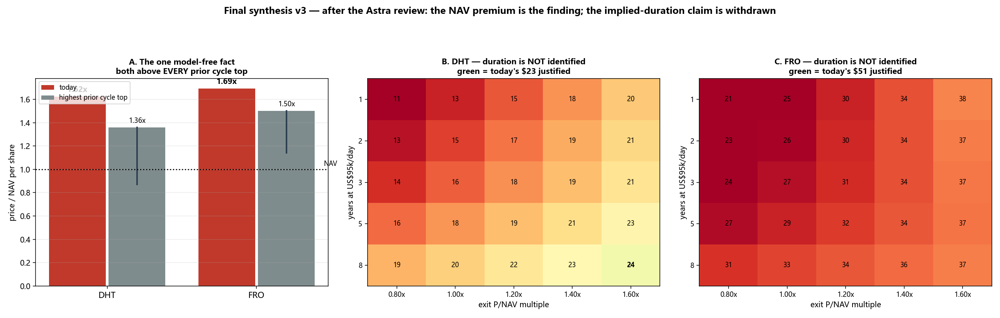

### 20.1 唯一一个不依赖任何模型的结论

下文每一个目标价都依赖假设。**这一条不依赖。**

| | 股价 | 每股 NAV | **今日 P/NAV** | 历史区间（申报文件） | **相对自身历史** |
|---|---|---|---|---|---|
| **DHT** | $23.27 | $14.33 | **1.62x** | 0.87x – 1.36x | **高于历史最高 19%** |
| **FRO** | $51.42 | $30.37 | **1.69x** | 1.14x – 1.50x | **高于历史最高 13%** |

**两家船东的股价对资产价值之比，都高于申报文件记录中各自出现过的最高值 —— 包括 2007-08 超级周期**（DHT 0.79x、FRO 1.33x，均为模型值）。这里没有预测、没有折现率、没有派息假设：它就是股价除以船舶经纪对钢铁本身的估值。

> ⚠️ **这一条更正了 §19。** §19 把 P/NAV 描述为「**相对历次周期顶部只是温和溢价**」。这个说法过软了。以 §17 来自申报文件的序列衡量，今天**高于两家各自的全部历史观测值**。§19 的措辞就此修订。

**它意味着什么、不意味着什么。** 高于 NAV 并不自动等于错 —— 一家能赚取超过资本成本回报的公司，本来就*应该*高于资产价值交易。它意味着这份溢价**必须由未来的超额盈利来赚回**，而恰恰是在这一点上，证据不再干净。

### 20.2 诚实的账本 —— 你实际买的是什么

**DHT Holdings —— 持有本轮周期的防守型选择**

| 优势 | 证据 |
|---|---|
| **两家中最低的盈亏平衡点 —— $17,500/天** | 在 US$60,000 期租下 DHT 仍有 **5.2%** 股息率；FRO 只有 3.4% |
| **杠杆最低 —— 净负债仅为船队价值的 10.6%** | $273.1m 对应 $2,583m 船队 |
| **NAV 来自申报文件，而非模型** | DHT 在 20-F 中披露逐船经纪估值；§17 已与 DHT 自己的表述对账 |
| **明确的分配政策 —— 经常性净利润的 100%** | 自 2022Q3 起；跟踪值 77% 反映的是报表利润而非经常性利润 |
| **约 52% 已签期租** | 对运价崩塌形成缓冲 |

| 劣势 | 证据 |
|---|---|
| **相对自身历史，是两家中更贵的一个** | 1.62x P/NAV 对应 1.36x 的历史高点 —— **高 19%**，比 FRO 的 13% 更极端 |
| **期租覆盖是双刃剑** | §9：现货暴涨时它只能捕捉约一半；与 FRO 的交叉点约在 $200–300k/天 |
| **船队最小 —— 24 艘 VLCC 当量** | 对上行超预期的经营杠杆最弱 |

**Frontline —— 博取暴涨的高弹性选择**

| 优势 | 证据 |
|---|---|
| **船队最大、现货敞口最高 —— 57.9 VLCC 当量、约 86% 现货** | §9：运价 3 倍时 FRO **+341%，DHT 仅 +274%** |
| **分配比例最高 —— 跟踪 90%** | 每股赚 $6.67、派 $5.99 |
| **杠杆远低于自身历史** | 今日为船队价值的 23.8% |

| 劣势 | 证据 |
|---|---|
| **杠杆是 DHT 的两倍** | 23.8% 对 10.6% |
| **盈亏平衡点最高 —— $23,800/天** | **最先失去 8% 股息垫**：US$85k 时它只有 7.4%，而 DHT 仍有 9.5% |
| **⚠️ 它的 NAV 是模型值，不是披露值** | Frontline **在所有考察年度都未披露船队总价值**（§17）。FRO 的 1.69x 是 §20.1 中最不可靠的数字 |
| **跨 2015 年合并的主体连续性问题** | 尚未对账 —— §19 已标记，至今未解决 |

### 20.3 估值水平 —— 以及对我自己盈利模型的一次校准检验

在给出目标价之前，先用**已报告的实际业绩**检验盈利引擎。Astra 的阻断级意见 [B1] 是：披露的现金盈亏平衡点可能已包含贷款本金，因此既减它、又减 D&A，得不到会计口径 EPS。该检验反解出：要复现实际的跟踪 EPS，需要多高的期租价格。

| | 实际 TTM EPS | **反解期租价格** | 实际 DPS | 隐含派息率 | 判定 |
|---|---|---|---|---|---|
| **DHT** | $2.94 | **$86,433/天** | $2.27 | 77% | 合理 |
| **FRO** | $6.67 | **$111,878/天** | $5.99 | 90% | 合理 |

两个反解出的运价都落在这两支船队过去一年实际赚到的区间之内，而且隐含派息率精确复现了更正后的比率。**该设定并未明显重复扣减债务偿付。** 但这**不是证明** —— 盈亏平衡点内部若存在一个相互抵消的误差，本检验看不出来。因此在 §20.9 中作为「未解决的局限」登记，而不是「已解决」。

### 20.4 目标价 —— 有条件的，并如实标注

船队价值与净负债现在**分开建模**，修复了 Astra 的 [B2]：此前的草稿把 5% 的年度老化折损记在了**权益 NAV** 上而非船队价值上，并且把累积现金也当作船舶一起老化。船舶价值现在也**随情景一起重新定价**，因此模型不再「对倍数保守、对资产慷慨」。

**DHT**（现价 $23.27）—— 维持性资本开支假设等于 D&A；权益成本 10%；退出 P/NAV 为 1.0x

| 情景 | 期租价格 | 年数 | 船价重估 | EPS | DPS | **目标价** | 空间 |
|---|---|---|---|---|---|---|---|
| 🐻 悲观 | $70,000 | 1 | −25% | $2.08 | $1.60 | **$10.73** | −54% |
| ⚖️ 中性 | $95,000 | 2 | −15% | $3.39 | $2.61 | **$14.57** | −37% |
| 🐂 乐观 | $120,000 | 3 | 0% | $4.69 | $3.61 | **$20.46** | −12% |

*若改用 DHT 公布的「经常性净利润 100%」政策而非跟踪值 77%，目标价几乎不动（$10.73 / $14.64 / $20.71）—— 因为留存收益本就已经计入退出 NAV。派息率影响的是股息率，不是价值。*

**FRO**（现价 $51.42）

| 情景 | 期租价格 | 年数 | 船价重估 | EPS | DPS | **目标价** | 空间 |
|---|---|---|---|---|---|---|---|
| 🐻 悲观 | $70,000 | 1 | −25% | $2.86 | $2.57 | **$19.79** | −62% |
| ⚖️ 中性 | $95,000 | 2 | −15% | $5.13 | $4.62 | **$26.29** | −49% |
| 🐂 乐观 | $120,000 | 3 | 0% | $7.41 | $6.67 | **$36.80** | −28% |

⚠️ **请把它们读作条件命题，而不是价格预测。** 它们说的是：*如果*运价在 N 年后回归中枢、*并且*船价按所示重估、*并且*届时市场给 1.0 倍 NAV，*那么*价值为 X。**第三个条件承担了绝大部分作用** —— 见下表。

### 20.5 为什么「市场在隐含 N 年高运价」这一说法被**撤回**

此前的草稿得出：DHT 需要约 15 年的 $95,000/天才能支撑现价，而 **FRO 在任何期限下都无法被支撑**。Astra 的 [M5] 指出：这把所有分歧 —— 派息、资本开支、船舶价值、折现率、股权风险溢价 —— 全部归因到了单一变量上。**仅凭价格无法识别出久期。** 联合网格证明了这一点：在 $95,000/天下，按「持有年数 × 退出倍数」给出的目标价。

**DHT —— 现价 $23.27**（加粗 = 现价被支撑）

| 年数 \ 退出 P/NAV | 0.80x | 1.00x | 1.20x | 1.40x | 1.60x |
|---|---|---|---|---|---|
| 1 年 | $11.12 | $13.30 | $15.49 | $17.67 | $19.86 |
| 2 年 | $12.56 | $14.57 | $16.58 | $18.59 | $20.60 |
| 3 年 | $13.89 | $15.74 | $17.59 | $19.44 | $21.29 |
| 5 年 | $16.21 | $17.79 | $19.38 | $20.96 | $22.54 |
| 8 年 | $18.98 | $20.24 | $21.51 | $22.78 | **$24.04** |

**FRO —— 现价 $51.42**

| 年数 \ 退出 P/NAV | 0.80x | 1.00x | 1.20x | 1.40x | 1.60x |
|---|---|---|---|---|---|
| 1 年 | $21.08 | $25.30 | $29.52 | $33.74 | $37.96 |
| 2 年 | $22.64 | $26.29 | $29.95 | $33.60 | $37.26 |
| 3 年 | $24.17 | $27.34 | $30.51 | $33.68 | $36.85 |
| 5 年 | $27.10 | $29.49 | $31.89 | $34.29 | $36.68 |
| 8 年 | $31.03 | $32.62 | $34.22 | $35.81 | $37.41 |

**向右移动与向下移动同样有力。** 你既可以靠「相信更高的退出倍数」到达现价，也可以靠「相信更长的景气」到达现价 —— 所以无法从股价中读出任何单一的隐含久期。「15 年／永远不可能」的说法**予以撤回**。

> ⚠️ **并请注意 1.00x 那一列上的偏向。** FRO 历史最低的 P/NAV 是 **1.14x**，从未到过 1.00x。把 FRO 的退出倍数设为 1.0x，低于它历史上任何交易水平。此处如实披露而非隐藏，这也正是把倍数作为自由变量呈现的原因。

### 20.6 ⭐ 经评审后仍然成立的结论措辞

> **DHT 与 Frontline 的股价分别高于其估算船队 NAV 约 62% 与 69%，并且高于申报记录中各自出现过的任何股价／资产价值比。因此它们的估值同时暴露于「运价走弱」与「该溢价被压缩」两重风险。在所有 1.0 倍 NAV 退出情景下，Frontline 的缺口都更大，并且会在更高的运价水平上先失去股息垫；DHT 在盈亏平衡点、杠杆与披露质量上更具防守性，但相对自身历史则是两者中更贵的一个。本项工作并未确立任何可靠的「市场隐含运价久期」，也不支持「Frontline 在 $95,000/天下无法被支撑」这一论断。**

**若只持有一家，持有 DHT** —— 更低的盈亏平衡点、一半的杠杆、来自申报文件的 NAV。**若要博暴涨，FRO 弹性更大** —— 但你必须接受：下跌时它先断。

### 20.7 离场指标 —— 锚定在可观测量上，而非模型输出上

| # | 触发条件 | 读数含义 | 动作 |
|---|---|---|---|
| 1 | **P/NAV 超过 2.0x（DHT）／2.2x（FRO）** | 超出记录中的全部观测 | **减仓 25%** |
| 2 | **1 年期租连续 4 周低于 $85,000** | DHT 9.5% / **FRO 7.4%** | **减仓 25%** —— FRO 先失去 8% 股息垫 |
| 3 | **1 年期租低于 $75,000** | DHT 7.8% / FRO 5.8% | **减到半仓** —— 两家都跌破 8% |
| 4 | **1 年期租低于 $60,000** | DHT 5.2% / FRO 3.4% | **清仓** |
| 5 | **5 年船龄 VLCC 二手船价连续两个月下跌** | **NAV 本身在下降** | **减仓** —— 溢价叠加*下跌中*的 NAV 是最糟组合 |
| 6 | **霍尔木兹通行量回升至约 15+ mb/d** | 溢价的*成因*消失 | **见消息即减 25%** —— 股价领先于运价 |
| 7 | **FRO 净负债／船队价值升破 35%**（今日 **23.8%**） | 杠杆重新放大资产波动 | **减仓** |
| 8 | **运价未变但公司下调股息** | 这是政策转向，不是运价信号 | **清掉该股** |
| 9 | **2028 年交付量确认超过约 125 艘 VLCC** | 供给墙提前到来 | **开始逐步退出** |
| 10 | **P/NAV 在船队价值上升中回落至 1.2x 以下** | 溢价正在被吐回 | **逻辑已经结束** |

**第 5 条是最多人忽略的。** P/NAV 下降既可能因为股价跌，也可能因为 NAV 涨。只有前者才是卖出信号。**盯住分母。**

### 20.8 GPT-6-Astra 评审记录（Rule 4b）

| # | 意见 | 级别 | 判定 | 已采取的行动 |
|---|---|---|---|---|
| B1 | 现金盈亏平衡点可能已含贷款本金，既减它又减 D&A 得不到会计 EPS | 阻断 | **未被证伪** | 新增校准检验（§20.3），两个反解运价均合理。**登记为未解决局限，而非已解决** |
| B2 | NAV 递推把 5% 老化折损记在**权益 NAV** 上而非船队价值上，且对累积现金也计提老化 | 阻断 | **正确 —— 确为真实 bug** | 船队价值与净负债现已分开建模；现金不再老化。中性目标价因此下调 12%（DHT）与 17%（FRO） |
| B2b | 在对船队计提老化的同时加回留存会计利润，除非资本开支 = D&A，否则重复计算 | 阻断 | **正确** | 现已改为**明确声明的假设**，不再是隐含假设 |
| B3 | 77% 是跟踪值而非前瞻政策；DHT 公布的是经常性利润 100% | 阻断 | **正确** | 两种口径并列测算；目标价几乎不动，股息率变动明显 |
| B4 | 「净负债／船队 ~8%／18%」与我自己的输入对不上 | 阻断 | **正确** | 重算为 **10.6% / 23.8%** |
| B4b | 2008 年的「88% 杠杆」在算术上不可能 | 阻断 | **正确** | 恒等式反解为 **55.2%**；若为 88%，−43% 的资产变动会让 NAV 变成*负数*，而不是 −96%。**88% 这个数字予以撤回** |
| M5 | 隐含久期不可识别，退出倍数起同等作用 | 重大 | **正确** | 「15 年／永远不可能」**撤回**，改为联合网格（§20.5） |
| M6 | 对权益倍数做了正常化，却未对船价做正常化 —— 并非一致保守 | 重大 | **正确** | 船舶价值现随情景重估（−25% / −15% / 0%） |
| M7 | 不能仅因 FRO 有负债就断言 90% 派息不可持续 | 重大 | **正确** | 该未经证实的质疑已删除；FRO 派息后仍留存约 $414m（资本开支前） |
| M8 | 两年期敏感性掩盖了长久期结论的脆弱性 | 重大 | **正确** | 已无意义 —— 久期结论已撤回 |
| C9 | 「两种方法只差一个假设」**是错的** —— 两者都用 10%，差别在**终值处理** | 阻断 | **正确，我错了** | 说法已改写。差距是「永续」与「NAV 退出」两种终值的折现差额，**并非折现率不一致** |
| C9b | 「悄悄把战争溢价永续化」不公允 —— §13 公开使用了永续法，且「战争溢价」未与供给、航距、制裁分离 | 重大 | **正确** | 该修辞已删除 |
| E | 油轮业务细节：57.9 个 VLCC 当量并非 57.9 艘相同的船；忽略了既有期租覆盖；1 年期租报价不是远期曲线；350 个营运日 ≠ 350 个成本日 | 重大 | **正确** | 全部写入 §20.9 |

### 20.9 已知局限 —— 本节**没有**确立什么

1. **盈亏平衡点的桥接尚未搭建。** 运营开支、管理费用、现金利息、计划本金偿还、坞修现金支出与摊销、租入成本，均未拆分。在拆分之前，EPS 与 DPS *仅通过校准得到验证*。
2. **FRO 的 57.9 个「VLCC 当量」不是 57.9 艘相同的船。** Suezmax 与 LR2 的盈利与 VLCC 并不在所有市场维持固定比例。
3. **情景测算忽略了既有期租覆盖。** DHT 有一艘 Harrier 以 $47,500/天签了五年；把 $95,000 套用到每艘船上，每有一艘这样的船就高估约 **$0.10/股**的运价敏感度。
4. **1 年期租报价既不是现货价，也不是远期曲线。** 不能用 12 个月的合约推断第二、第三年。
5. **350 个营运日不等于 350 个成本日。** 若盈亏平衡点是按日历日计算的成本，用 350 会低估年度费用约 $6.3m（DHT）与 $20.7m（FRO）。
6. **网格中 5–8 年的那几行假设盈利能力恒定**，没有船队更新，且已超出许多现役船舶的剩余商业寿命。它们是估值诊断工具，**不是经营计划**。
7. **FRO 的 NAV 是模型值**，因为 Frontline 不披露船队总价值。
8. **§19 遗留的未解决问题：** FRO 跨 2015 年合并的主体连续性，以及跨时代比较应当用「市值 ÷ 权益 NAV」还是「EV ÷ 正常化盈利」。

> **非投资建议。** 此处每一个数字，都是一个假设明确、且可被质疑的模型的条件性输出。


---

## §21 —— ⭐ 全部历史预测的回测，以及用数字定位周期

> **本节撰写后依 Rule 4b 提交 GPT-6-Astra，评审返回 8 项阻断级意见后重建。** 初稿的两个核心结论 —— 盈利引擎「已验证」、以及历史预测「超预期」—— **双双撤回**。更正后的结论与初稿相反。评审记录见 §21.8。

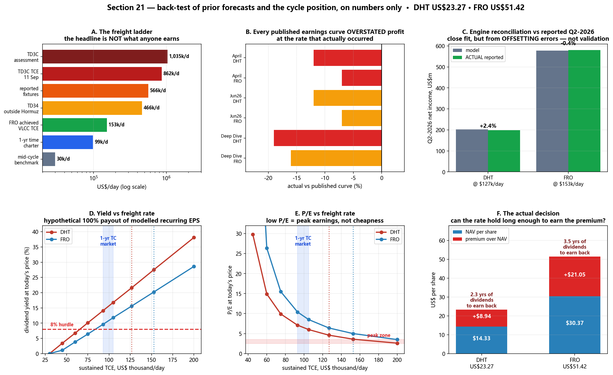

### 21.1 引擎与 Q2-2026 实际业绩吻合 —— 但这不是「验证」

把 §20 的盈利引擎喂入各公司**实际兑现**的运价：

| | 输入 TCE | 模型季度净利 | **实际披露** | 误差 |
|---|---|---|---|---|
| **DHT** | $126,700/天（船队均值） | $203.1m | **$198.3m** | **+2.4%** |
| **FRO** | $152,700/天（VLCC） | $578.0m | **$580.2m**（调整后） | **−0.4%** |

初稿称之为「验证」。**这不成立，该说法撤回。**

**Frontline 自己的申报文件把现金盈亏平衡点定义为覆盖**：*「运营开支（含坞修）、**贷款本金偿还**、净利息支出、光船租金、期租租金与净管理费用」*。贷款本金**不是**损益表费用。先减这个盈亏平衡点、再减 D&A，得不到会计口径盈利。**该质疑被申报文件证实，而不是被这个拟合回答。**

**这个「接近」是由两个更大的、方向相反的误差抵消出来的：**

| 2026Q2，US$m | 模型 | 实际 | 高估 |
|---|---|---|---|
| FRO TCE 收入 | 773.6 | 753.3 | **+20.3** |
| FRO 至利润的扣减 | 195.6 | 173.1 | **+22.5** |
| **FRO 净盈利误差** | | | **仅 2.2** |
| DHT TCE 收入 | 266.1 | 255.0 | **+11.1** |
| DHT 至利润的扣减 | 63.0 | 57.9 | **+5.1** |

**而且参数本身不可分别识别。** 因为 `NI = A×TCE − (A×盈亏平衡 + D&A)`，盈利只能识别**合并截距**。对 DHT，把盈亏平衡点上调 $1,000/天、同时把 D&A 下调 $8.4m，所有输出完全不变；FRO 的对应量是 $20.3m。**拟合再好也无法确认任一参数是对的。**

> **状态：单个高运价季度的「样本内对账检验」。** 不是样本外检验，也不是会计验证。

**⚠️ FRO 的「57.9 个 VLCC 当量」是建模选择，不是披露值。** 它由 `42 + 21×0.5 + 18×0.3` 在旧的 81 艘配置上构造。Frontline **实际** Q2 比值为 **Suezmax/VLCC 0.730**（假设 0.500）、**LR2/VLCC 0.605**（假设 0.300）。按其 40/19/18 船队，这意味着 **64.77** 个当量。在 $105,000/天下，FRO 的 EPS 会从 **$6.04 升到 $6.92（+15%）**。§20 与 §21 的所有 FRO 数字都用 57.9，因此对盈利是**偏保守**的。

### 21.2 DHT 的现货敞口 —— 三个口径都指向约一半，而非 75%

| 口径 | 读数 |
|---|---|
| 由四舍五入的 TCE 披露反解 | 营运日的 **~50%** |
| DHT 自报现货占营运日比例 | **48.4%** |
| 季末在现货市场的船舶 | **23 艘中的 11 艘 = 47.8%** |

三者都说**大约一半**。**没有一个支持四月模型假设的 75–79%** —— 而这一个假设，正是四月盈利曲线偏高的重要原因。*（初稿「精确解出 50.0%」的说法撤回：输入是四舍五入的，且三个口径不可互换。）*

### 21.3 回测

**A. 目标价 —— ⚠️ 所有期限都还没到期。** 全部为 12 个月目标，最早 2027 年 3 月到期。这些是**中途读数，不是已完成的预测**，不能据此声称预测能力。

| 设定于 | 目标 | 预测 | 现价 | 差距 | 到期 |
|---|---|---|---|---|---|
| 2026-03-02 | DHT @ $100k, 7x PE | $23.70 | $23.27 | −2% | 2027-03 |
| 2026-03-02 | FRO @ $100k, 7x PE | $52.60 | $51.42 | −2% | 2027-03 |
| 2026-04-08 | DHT @ $100k, 7x | $21.69 | $23.27 | +7% | 2027-04 |
| 2026-04-08 | FRO @ $100k, 7x | $47.47 | $51.42 | +8% | 2027-04 |
| 2026-04-08 | DHT 概率加权 | $29.05 | $23.27 | **−20%** | 2027-04 |
| 2026-04-08 | FRO 概率加权 | $64.54 | $51.42 | **−20%** | 2027-04 |
| 2026-06-26 | DHT 中性（$95k, 6x） | $17.00 | $23.27 | **+37%** | 2027-06 |
| 2026-06-26 | FRO 中性（$95k, 6x） | $38.00 | $51.42 | **+35%** | 2027-06 |
| 2026-06-26 | DHT 乐观（$120k, 6.5x） | $25.00 | $23.27 | −7% | 2027-06 |
| 2026-06-26 | FRO 乐观（$120k, 6.5x） | $55.00 | $51.42 | −7% | 2027-06 |

**目前 10 项中有 6 项落在 10% 以内** —— 作为**状态**报告，不是成绩。

*初稿中有四行被**删除**：四月的「价格」$18.57/$35.08 是**当时的市价**，不是目标价；三月的 PB 2.75x/3.65x 原文标注为**「P/B（滚动）」**，是同期观测值。把它们计入，等于凭空制造了四个「成功」。*

**B. 条件盈利误差 —— 目前唯一可以打分的部分。** 它只问一件事：*在实际发生的运价下，已发布的曲线给出的利润对不对？* 它**不**检验运价预测能力。

在此之前必须先做两处会计更正：
- **DHT 的 Q1 报表利润 $164.5m 中含 $60.0m 卖船收益**与 $1.1m 衍生品收益。经常性 Q1 EPS 约为 **$0.64 而非 $1.02**。用报表数字等于把一次性资产处置算到运价模型头上。
- **DHT 的 Q1 $106,000 是「调整后」现货 TCE（IFRS 15），Q2 的 $162,600 是「未调整」。** 初稿把两个不同口径平均了。现统一取调整后口径 → **$130,050/天**。

| 曲线 | 公司 | 实际运价 | 曲线 EPS | 实际 EPS | 误差 | 定义域 |
|---|---|---|---|---|---|---|
| 四月 | DHT | $130,050 | 4.21 | **3.72** | **−12%** | 样本内 |
| 四月 | FRO | $152,700 | 11.22 | **10.44** | **−7%** | 样本内 |
| 六月 | DHT | $130,050 | 4.21 | 3.72 | −12% | 外推 —— 弱 |
| 六月 | FRO | $152,700 | 11.21 | 10.44 | −7% | 外推 —— 弱 |
| 三月 | DHT | $130,050 | 4.62 | 3.72 | **−19%** | 样本内 |
| 三月 | FRO | $152,700 | 12.40 | 10.44 | **−16%** | 外推 —— 弱 |

> **⭐ 六条全部指向同一方向：在实际发生的运价下，每一条已发布的盈利曲线都把利润高估了 7–19%。**
>
> 初稿得出的是**相反**结论（「超预期」），原因有二：(a) 把一次性卖船收益当成了运价盈利；(b) 使用了 `np.interp`，而它在定义域外**取端点值（截断），并不外推**。两个缺陷均由外部评审发现。
>
> **更正后的读法：运价判断大体正确，但曲线背后的成本假设过于慷慨。**

### 21.4 运价阶梯 —— 头条数字不是任何人赚到的钱

| 口径 | 水平 | 性质 |
|---|---|---|
| Baltic TD3C **评估值**，9/14 | **$1,035,000/天** | ⚠️ **专家组评估**，非成交 |
| Baltic TD3C 往返 TCE，9/11 | $862,150/天 | 由评估推导 |
| **公开报告的实际成交**，9/8 当周 | **$530,000–603,000/天** | 真实业务 |
| **TD34**（在海峡**外**装货），9/11 | **$465,764/天** | 实际指数 |
| **1 年期租** | **$93,000–105,000/天** | 期租市场 |
| **DHT 实际现货腿**，Q2 | **$162,600/天** | 已披露 |
| **FRO 实际 VLCC TCE**，Q2 | **$152,700/天** | 已披露 |
| 券商中枢基准 | 约 $30,000/天（区间 $25–35k） | 行业惯例 |

**⚠️ TD3C 是对「最佳可达市值」的专家组评估，不是成交均价。** Baltic（12/26 号通告）要求在缺乏直接成交时由专业判断评估。实际业务只在**印刷基准的约 51–58%** 水平运行，因为穿越霍尔木兹的航次已失去流动性，货物改为在海峡外做船对船过驳。**不要用 TD3C 给船队估值。**

**最干净的可观测风险价格 —— 同一天、同一目的地：**

> TD3C（海峡内）**$862,150** − TD34（海峡外）**$465,764** = **霍尔木兹通行溢价 $396,386/天**，相当于非穿越运价的 **85%**。
>
> 这正是海峡一旦正常化就会消失的那部分，而且**每日可观测**。

**一个此前在此发布错误、现已更正的比率：**

> ⚠️ **已被 §22 更正。** 下表用 **Q2 的平均实际运价**去除以 **9 月 11 日的评估值**，这是**期间错配**：一家公司完全可能赚到了*同期 Q2* 基准的 100%，但拿去比运价暴涨之后的 9 月印刷值，仍然只显示约 19%。**它并不衡量基准兑现率**，不能读作「两家公司只捕获了市场的五分之一」。以下数字仅作为字面上的跨期比值保留。

| | Q2 实际赚到 | 占 TD3C TCE 印刷值 |
|---|---|---|
| DHT | $162,600/天 | **19%** |
| FRO | $152,700/天 | **18%** |

*（初稿那句「期租市场只给现货印刷值的约 10% —— 这就是市场自己给出的持续概率」**予以撤回**。两个运价之比不是概率；航线、船型规格、成交日期、灵活性、信用与基准流动性全都不同。）*

### 21.5 全运价区间的估值 —— 以及最关键的那一行

按**模型经常性 EPS 的 100% 假设派息**：

| 持续 TCE | DHT 净利 | DHT EPS | DHT P/E | DHT 股息率 | FRO 净利 | FRO EPS | FRO P/E | FRO 股息率 |
|---|---|---|---|---|---|---|---|---|
| **$30,000**（中枢） | **$0m** | **$0.00** | 无意义 | **0.0%** | **−$174m** | **−$0.78** | 无意义 | **0.0%** |
| $45,000 | $126m | 0.78 | 29.8x | 3.4% | $130m | 0.58 | 88.3x | 1.1% |
| $60,000 | $252m | 1.56 | 14.9x | 6.7% | $434m | 1.95 | 26.4x | 3.8% |
| $75,000 | $378m | 2.34 | 9.9x | 10.1% | $738m | 3.31 | 15.5x | 6.4% |
| **$93,000**（期租下限） | $529m | 3.28 | **7.1x** | **14.1%** | $1,102m | 4.95 | **10.4x** | **9.6%** |
| **$105,000**（期租上限） | $630m | 3.91 | **6.0x** | **16.8%** | $1,346m | 6.04 | **8.5x** | **11.8%** |
| $126,700（DHT Q2 实际） | $812m | 5.04 | 4.6x | 21.6% | $1,785m | 8.02 | 6.4x | 15.6% |
| $152,700（FRO Q2 实际） | $1,031m | 6.39 | 3.6x | 27.5% | $2,312m | 10.39 | 5.0x | 20.2% |

> **⭐ 全表最重要的就是第一行。** 在行业自身的中枢基准 **$30,000/天**下，按此模型 **DHT 盈利恰好为零，Frontline 年亏 $174m**。不是「股息率低」，而是零与负。这两只股票的全部价值，都依赖运价远高于正常水平。

**反向检验 —— 今天的股价要求多高的持续运价？**

| | 3x PE | 5x PE | **7x PE** | 9x PE |
|---|---|---|---|---|
| **DHT** | $178,887 | $119,332 | **$93,809** | $79,629 |
| **FRO** | $226,897 | $151,580 | **$119,301** | $101,368 |

在 **7 倍**（本仓库框架自身的卖出阈值）下，**DHT 的定价几乎正好等于 1 年期租市场（$93,809 对 $93,000）**，而 **FRO 需要 $119,301，比期租上限还高约 14%**。

### 21.6 周期指标 —— 这是仪表盘，**不是投票**

| 指标 | 读数 | 参照 |
|---|---|---|
| 实际 VLCC TCE / 中枢 | $152,700 | 4.4–6.1 倍 |
| 1 年期租 / 中枢 | $105,000 | 3.0–4.2 倍 |
| 实际 TCE / 1 年期租 | 1.5 倍 | 期租市场滞后 |
| 霍尔木兹溢价（TD3C−TD34） | $396,386/天 | 海峡正常化则归零 |
| 5 年船龄 / 新造价 | **1.16 倍** | >1.0 罕见 |
| 20 年船龄 / 拆船价 | **3.4 倍** | |
| 2026 年 VLCC 订造量 | **217 艘** | 对比 2025 年每年仅拆约 2 艘 |
| 订单簿占船队运力比 | **25%** | 2023 年为 2% |
| P/NAV 相对自身历史最高 | 1.62x / 1.69x | 历史最高 1.36x / 1.50x |
| 按 Q2 年化盈利的 P/E | 4.8x / 4.9x | |
| 2027 / 2028 交付量 | ~41–68 / ~125–127 | 供给墙 |

> **⚠️ 不要读成「12 项里有 8 项说是晚周期」。** 这些指标**并不独立** —— 它们在很大程度上是同一次运价冲击的重复测量。「实际 TCE/中枢」与「实际 TCE/期租」共用分子；三个资产比值描述的是同一次资产重定价；「2026 订造量」与「订单簿占比」是同一件事说两遍。**对相关指标计数不是概率，也无法给出拐点时间。**

**其中一项被过度解读，现予下调。** 初稿把「升值幅度随船龄递增」称为「倒挂」，作为老船投机的证据。若按绝对金额：

| 船龄 | 当前价值 | 一年前 | 增幅 |
|---|---|---|---|
| 5 年 | $151.1m | $116.2m | **+$34.9m** |
| 20 年 | $71.1m | $37.4m | **+$33.7m** |

**+90% 与 +30% 在绝对金额上几乎相同，只是基数不同。** 这不构成非理性的独立证据。

**诚实的总结：运价、资产价格、供给与股票倍数同时处于高位，这与晚周期状态一致。但此处没有任何内容能估计它何时转向。**

### 21.7 ⭐ 真正的决策 —— 不是「PE 便宜 vs NAV 昂贵」

§20 说贵（基于资产），§21 的表格看起来便宜（基于盈利）。**两者都不能单独定论。** 只有总回报可以。

**在 $105,000/天下持有一年、并按今日 NAV 退出的总回报** *（示意性：假设 NAV 不变，忽略老化、资本开支与负债变动）*：

| | 股息 | 退出 NAV | 合计 | 股价 | **回报** |
|---|---|---|---|---|---|
| **DHT** | $3.91 | $14.33 | $18.24 | $23.27 | **−21.6%** |
| **FRO** | $6.04 | $30.37 | $36.41 | $51.42 | **−29.2%** |

**赚回 NAV 溢价需要多久（未折现）：**

| | 每股溢价 | 年股息 | **年数** |
|---|---|---|---|
| **DHT** | $8.94 | $3.91 | **2.29** |
| **FRO** | $21.05 | $6.04 | **3.48** |

> **这才是决策本身。** 在当前 1 年期租水平下，DHT 需要约 **2.3 年**、FRO 需要约 **3.5 年**的股息，**仅仅是为了收回今日相对资产价值的溢价** —— 还没折现，也还没计入 NAV 随老化的侵蚀。问题不是该用哪个倍数，而是**运价能否持续足够久，把这份溢价赚回来。**

**⚠️ 派息 —— 措辞必须精确。** DHT 派 $1.22，对应**经常性** EPS $1.22（报表 EPS 为 $1.23）。FRO 的 $2.61 是**调整后** EPS 的 100%，但只相当于**报表 EPS 的 88.2%**；其额外的 $0.80 公告时**以卖船完成为条件**。因此上表的股息率是「模型经常性 EPS 全额派发」的**假设值**，不是有保证的前瞻股息率。

### 21.8 GPT-6-Astra 评审记录（Rule 4b）

| # | 意见 | 级别 | 判定 | 行动 |
|---|---|---|---|---|
| A1 | FRO 申报文件证实现金盈亏平衡点**含贷款本金偿还**；拟合接近是正负误差抵消 | 阻断 | **正确** | **「已验证」撤回**；公布抵消误差（§21.1） |
| A2 | 「57.9 当量」是旧 81 艘配置下的建模选择；实际比值 0.730/0.605，对应 64.77 | 阻断 | **正确** | 公开构造方式与 +15% 的 EPS 敏感性 |
| A3 | 「$30,000/天」那一行实际显示的是 $45,000 的数值 | 阻断 | **我的评审提示词写错了，脚本是对的** | 已核实：$30k 下 **DHT $0.00、FRO −$0.78**，现已成为本节头号数字 |
| A4 | DHT 实际运价混用了调整后 Q1 与未调整 Q2；EPS 对比含 $60.0m 卖船收益 | 阻断 | **正确** | 按统一口径重建 → $130,050/天 与经常性 EPS **$3.72** |
| A5 | `np.interp` 是**端点截断**而非外推，三个判定因此出错 | 阻断 | **正确 —— 真实代码 bug** | 实现真正的线性外推；域外行标注为弱 |
| A6 | 四项「预测」实为当时市价与滚动倍数 | 阻断 | **正确** | 四行**全部删除** |
| A7 | 头条计分与所列行数对不上 | 阻断 | **正确** | **放弃总计分**，改为报告状态 |
| A8 | 「期租/现货比 = 市场隐含概率」在数学上不成立 | 阻断 | **正确** | **撤回**（在评审返回前已自行发现） |
| B1 | 参数不可分别识别；这不是样本外检验 | 重大 | **正确** | 公布识别性代数；改标为样本内 |
| B2 | 50% 的代数解出的是营运日敞口，不是船舶比例 | 重大 | **正确** | 三个口径分别列示 |
| B3 | 期限未到期；观测相关；「超预期」≠ 准确 | 重大 | **正确** | 标注到期日；不声称命中率 |
| B4 | 报表/调整后/宣告/实付被混用 | 重大 | **正确** | 逐项说明桥接与前置条件 |
| B5 | 市场数据口径不一（订单簿是全油轮口径；21 艘拆解不等于 21 艘 VLCC） | 重大 | **正确** | 全节补上口径限定 |
| B6 | 「12 中 8」对相关证据重复计数；船龄升值被过度解读 | 重大 | **正确** | **撤回计分**；补绝对金额表 |
| B7 | 便宜/昂贵的调和需要总回报算术 | 重大 | **正确** | §21.7 改以总回报与溢价回收期重建 |

### 21.9 本节**没有**确立什么

1. **盈利引擎仍未通过会计验证。** 完整桥接（运营开支、管理费用、现金利息、计划本金偿还、坞修现金支出与摊销、租入成本）尚未搭建。
2. **没有派息能力瀑布表。** EPS 不等于可分配现金；本金偿还与资本开支与之争夺同一笔钱。
3. **没有按季度的船队/租约排期。** 交付、处置、租约到期与营运日决定盈利久期，均未建模。
4. **只有单一永续运价，没有路径。** 运价多快回归、既有租约如何延迟传导，均未建模。
5. **运价与资产价值被独立压力测试**，而现实中二者高度相关 —— 这会低估下行。
6. **验证样本只有一个高运价季度**，此时收入巨大，会让截距误差显得很小。
7. **「纯数字」本身就是一个站不住的说法：** 换算系数、营运日、中枢基准、阈值与派息率，全都是建模选择。

> **非投资建议。**


---

## §22 —— ⭐ BWET 对 DHT / FRO：运价上涨究竟有多少传导到股票？

> **本节撰写后依 Rule 4b 提交 GPT-6-Astra，评审返回四项阻断级意见后重建** —— 其中包括一个真实的算术 bug，以及一个纯属「数字凑巧」的核心结论。初稿的中心论点**予以撤回**，并倒逼**更正了 §21**。评审记录见 §22.8。

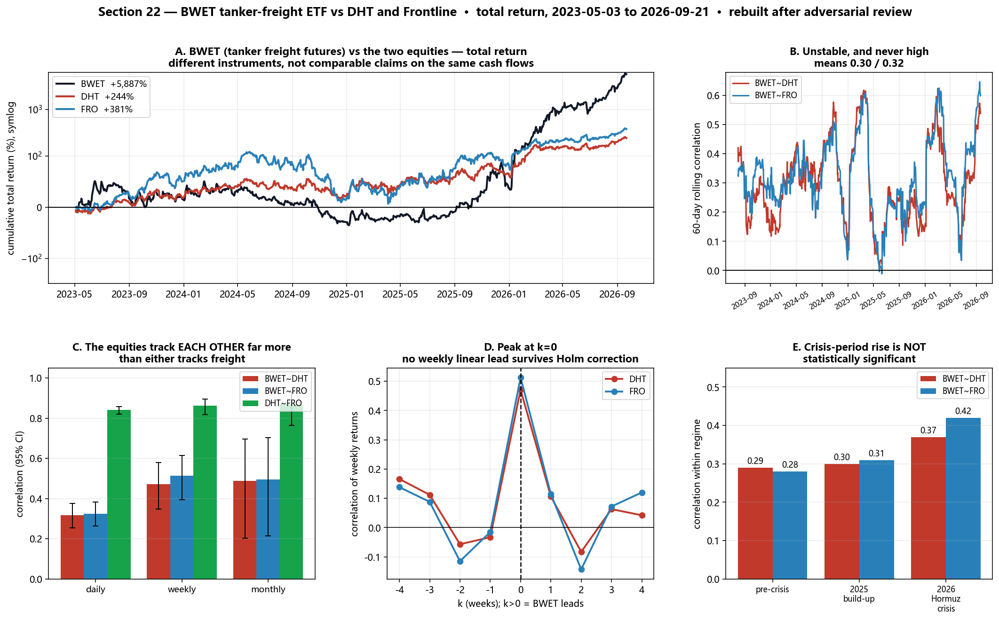

**BWET** —— Breakwave 油轮运价 ETF —— 持有油轮**运费期货**。它是最接近「可交易、逐日盯市的运价工具」的东西，因此适合检验一个任何会计模型都答不了的问题：*运价波动时，股票到底拿到多少？*

### 22.1 BWET 是什么，又不是什么

| | |
|---|---|
| 基准配置 | 约 **90% TD3C / 10% TD20** |
| 目标平均期限 | 约 **50–70 天**，配置可漂移 |
| 费率 | **3.50%** |
| 历史相对 NAV 溢价/折价 | 高达 **+6.96% / −6.38%** |

> **其收益 = 期货损益 + 移仓/收敛 + 抵押品利息 − 费用 ± 溢价变动。** 它不拥有任何船舶，也不派息。**它不是现货运价，也不是对与股票相同现金流的索取权。**

*数据完整性：无拆分记录，路径自然 —— $13.93（2023-05）→ $9.82（2024-12）→ $19.26（2025-12）→ $826.00（2026-09-21）；最低 $9.06，最高 $872.14；单日最大波动 +27.8% / −20.5%。*

### 22.2 三个必须分开的问题 —— 初稿错误地把它们合成了一个「捕获率」

**(a) 投资结果 —— US$100 变成了多少** *（总回报，2023-05-03 → 2026-09-21）*

| | 仅价格 | **总回报** | 其中股息 |
|---|---|---|---|
| **BWET** | $5,987 | **$5,987** | $0 |
| **DHT** | $249 | **$344** | $95 |
| **FRO** | $335 | **$481** | $147 |

**股息不是细节：它占股票结果的约 28% 与 31%。** 只看价格的图会严重低估股票持有人。

**(b) 相对累计增长 —— 两个都合法但含义不同的比率**

| | 简单收益比 | 对数增长比 |
|---|---|---|
| **DHT** | 4.1% | 30.2% |
| **FRO** | 6.5% | 38.4% |

> 🔴 **初稿称 30.2%/38.4% 是「正确的捕获率」。撤回。**
>
> Astra 的反例具有决定性，现已写入脚本实算：**把 DHT 的日收益随机打乱顺序。** 对数增长比**纹丝不动，仍是 30.2%**，而它与 BWET 的相关性从 **0.317 崩塌到 0.014**。一个能在「摧毁与 BWET 全部联系」的洗牌中存活的统计量，**不含任何关于传导的信息**。它只是一个相对增长指标。

**(c) 敏感度 —— 唯一真正衡量传导的概念是回归 beta（见 §22.4）。**

### 22.3 相关性 —— 本节的核心发现

*仅用完整周期；括号内为 95% Fisher 置信区间。*

| 频率 | n | BWET~DHT | BWET~FRO | **DHT~FRO** |
|---|---|---|---|---|
| 日 | 848 | 0.317 [0.25, 0.38] | 0.324 [0.26, 0.38] | **0.840 [0.82, 0.86]** |
| 周 | 176 | 0.471 [0.35, 0.58] | 0.513 [0.39, 0.61] | **0.861 [0.82, 0.89]** |
| 月 | 39 | 0.487 [0.20, 0.70] | 0.496 [0.21, 0.70] | **0.870 [0.76, 0.93]** |

**相依相关系数的 Williams 检验**（三者共享变量，用独立 Fisher 比较是错的）：

| 频率 | DHT~FRO > DHT~BWET | DHT~FRO > FRO~BWET | BWET~DHT 对 BWET~FRO |
|---|---|---|---|
| 日 | p = 3.1e−108 | p = 9.9e−104 | p = 0.68 |
| 周 | p = 7.7e−22 | p = 1.2e−16 | p = 0.22 |
| 月 | p = 1.3e−05 | p = 2.4e−05 | p = 0.90 |

> **⭐ 两只股票彼此之间的相关性（0.84–0.87）远高于它们各自与运价工具的相关性（0.32–0.51），在每个频率上都极其显著。** 而 DHT 与 FRO 在「跟踪运价」这件事上**彼此无法区分**。
>
> ⚠️ **这能与不能说明什么。** 它确立了更强的相互关联，但**并不识别成因**。共同的船队经济、融资条件、板块情绪与整体股市敞口，都可能造成这一结果。*（初稿「它们首先是一对股票，其次才是运价代理」的表述断言了因子主次，本检验无法支持。）*

*对数收益稳健性检验（日）：0.318 / 0.325 / 0.838 —— 结论不变。*

⚠️ 相关性**随周期拉长而上升**。这**与** Epps 型聚合效应**一致**，但本分析并**未**诊断其成因 —— 陈旧报价、溢价/折价噪声与制度变化同样符合。

### 22.4 Beta —— 唯一真正衡量敏感度的统计量

| | 日 alpha | **beta** | 标准误 | t | R² | 95% 置信区间 |
|---|---|---|---|---|---|---|
| **DHT** | 0.084% | **0.144** | 0.015 | 9.7 | 0.100 | [0.115, 0.173] |
| **FRO** | 0.112% | **0.186** | 0.019 | 10.0 | 0.105 | [0.150, 0.223] |

**读法**：BWET 每波动 1%，股票**通过该拟合斜率**平均波动约 0.14%/0.19%。这**不**意味着「公司拿到运价的 14%」。**R² ≈ 0.10 说明股价日波动约 90% 根本不由运价解释。**

**BWET 上涨日 vs 下跌日的条件平均收益比：**

| | 上行 | 下行 | 差距 | 自助法 95% CI | 判定 |
|---|---|---|---|---|---|
| **DHT** | 20.0% | 15.8% | +4.2pp | [−4.9, +13.4]pp | **不显著** |
| **FRO** | 24.4% | 18.1% | +6.2pp | [−5.4, +18.3]pp | **不显著** |

> 🔴 **「有利的不对称性」论点撤回** —— 我在评审返回前已自行检验，两个区间均跨越零。它在结构上也**不可识别**：在斜率相同的情况下，`C₊ = β + α/E[x|x>0]`、`C₋ = β + α/E[x|x<0]`，因此**仅凭一个正截距就能产生 C₊ > C₋**，完全不需要斜率不对称。而这里两个 alpha 都是正的。

### 22.5 领先/滞后 —— 运价是否提供预警？

| k（周） | −4 | −3 | −2 | −1 | **0** | +1 | +2 | +3 | +4 |
|---|---|---|---|---|---|---|---|---|---|
| **DHT** | 0.17 | 0.11 | −0.06 | −0.03 | **0.47** | 0.11 | −0.08 | 0.06 | 0.04 |
| **FRO** | 0.14 | 0.09 | −0.12 | −0.02 | **0.51** | 0.11 | −0.14 | 0.07 | 0.12 |

两者都在 **k = 0** 达到峰值。对 16 个非零滞后做 Holm 校正：最强的候选是 DHT k=−4（p=0.029，阈值 0.0031）与 FRO k=+2（p=0.060，阈值 0.0033）。**均未通过。**

> **正确措辞：「本分析未能确立任何具有统计显著性的『周频线性领先』关系。」** 这比初稿的「BWET 不提供任何择时优势」要窄得多 —— 周线可能把 1–2 天的领先掩埋掉，领先关系也可能是非线性的。**此处的「无证据」不等于「证据表明无」。**

### 22.5b ⭐ BWET 能否用作择时工具？直接检验 —— 答案是「不能」，但理由与 §22.5 给出的不同

§22.5 没有发现周频线性领先。评审曾警告**周线可能掩埋 1–2 天的领先**，因此我直接检验了日频。结果是：**确实存在**，而且它是一个假象。

**原始结果看起来很有说服力。** 按 BWET 在 *t−1* 日的方向拆分股票在 *t* 日的收益：

| | BWET 上涨后 | BWET 下跌后 | 差异 | t | p |
|---|---|---|---|---|---|
| **DHT** | +0.462% | −0.112% | **+0.574%** | 3.83 | **0.000** |
| **FRO** | +0.524% | −0.065% | **+0.590%** | 3.10 | **0.002** |

一个朴素的只做多规则（「仅在 BWET 上涨后持有」）本可实现 **DHT 年化 71.5%，而买入持有为 44.4%**（夏普 2.27 对 1.23），**FRO 为 82.1% 对 59.5%**。

**四项检验将其击溃。**

**1. 它不是股票动量 —— 但它几乎什么都解释不了。** 在控制股票自身滞后收益后，BWET(t−1) **依然显著**（DHT t=2.63, p=0.0085；FRO t=2.70, p=0.0070）。但回归 **R² 仅为 0.0093 与 0.0102** —— 该信号解释了次日方差的**不到 1%**。

**2. 🔴 已更正 —— 而这个更正让论证更强了。**

> ⚠️ **本小节的早期版本称 BWET 日成交额约 5.9 万美元、比股票「薄 300–700 倍」、因而无法交易。这是错的。** 那是对 BWET **全部历史**取中位数，而 2023–25 年该基金规模极小、股价仅 $14–19，完全主导了这个数字。**今天 BWET 的成交额高于 DHT。** 该错误由用户指出。

| 期间 | **BWET 日成交额** | DHT | FRO | BWET / DHT |
|---|---|---|---|---|
| 2023-05 → 2024-12 | **$33,374** | $19.6m | $42.7m | 0.002× |
| 2025 | **$25,706** | $18.6m | $47.6m | 0.001× |
| 2026 年至今 | **$18.6m** | $57.9m | $105.4m | 0.32× |
| **最近 30 日** | **$137.8m** | $72.0m | $111.0m | **1.91×** |
| 最近 10 日 | $163.8m | $101.4m | $230.0m | 1.62× |

**现在把流动性与该效应联系起来 —— 这才是决定性检验：**

| 期间 | BWET 日成交额 | 同日相关 | **1日领先相关** | 次日效应（DHT） |
|---|---|---|---|---|
| 危机前 | $33,308 | 0.295 | **0.146** | +0.656%，p=**0.001** ✅ |
| 2025 | $25,706 | 0.304 | 0.109 | +0.457%，p=0.089 |
| 2026 危机 | **$18.6m** | **0.368** | **−0.007** | +0.537%，p=0.166 |

> **随着 BWET 变得有流动性，同日相关性上升（0.295 → 0.368），而 1 日领先相关性塌陷至 −0.007。** 这正是陈旧报价假象的教科书特征：当该工具几乎无人交易时，它的收盘价落后一天，这**看起来**像预测。一旦它被活跃定价，信息就在同一天反映完毕，所谓「优势」随之消失。
>
> **真正的信息领先会做相反的事** —— 当领先工具交易得更活跃时，领先关系应当持续甚至增强。而这个领先恰恰在 BWET 变得可交易时死掉了。

**3. 效应在隔一天后消失 —— 典型的陈旧报价特征。**

| | t−1 | t−2 | t−3 |
|---|---|---|---|
| **DHT** | +0.574%（p=**0.000**） | +0.222%（p=0.141） | +0.215%（p=0.153） |
| **FRO** | +0.590%（p=**0.002**） | +0.376%（p=0.048） | +0.194%（p=0.309） |

真正的信息领先应当具有持续性；而由非同步收盘造成的单日重叠会立刻消失 —— 实际发生的正是后者。

**4. 它在最需要的时候并不存在，且交易成本将其抹杀。** 该效应**仅在危机前显著**（DHT p=0.001，FRO p=0.002）；**在 2025 年不存在**（p=0.089 / 0.468），**在 2026 危机中同样不存在**（p=0.166 / 0.178）。而该规则需要**每年约 114 次往返交易**：

| | 0 bps | 10 bps | 25 bps | 50 bps | **买入持有** |
|---|---|---|---|---|---|
| **DHT** | 71.5% | 53.1% | 29.0% | −3.0% | **44.4%** |
| **FRO** | 82.1% | 62.5% | 37.0% | +3.0% | **59.5%** |

**在 25 bps 成本下两者均跑输单纯持有** —— 而对一只日成交额仅 5.9 万美元的 ETF 来说，25 bps 是极其宽松的假设。

> **⭐ 结论：BWET 与这两只股票确实存在相关性，但 BWET 不是一个可用的择时工具。** 相关性是真实的（日频 0.32，周频 0.47–0.51，beta 0.14–0.19，均高度显著）。择时信号则不是：它解释次日方差不足 1%、在 t−2 即消失、在最近两个阶段均不存在、在现实交易成本下失效，并且 —— 决定性地 —— 只存在于 BWET 几乎无人交易的时期，一旦 BWET 的成交额超过 DHT 本身，该领先关系即塌陷至 −0.007。
>
> **此处的相关性是对共同波动的描述，而不是可交易的优势。**

### 22.5c BWET 能否*解释* DHT 的日涨跌 —— 远期运价是否被充分定价？

这听起来像一个说法，实则是两个命题，需要不同的证据，而且结论不同。

**(1)「BWET 能很好地解释 DHT 的日涨跌」—— 不成立。** 单日收盘对收盘的嵌套回归，n=848：

| 模型 | R² |
|---|---|
| **仅 BWET** | **0.100** |
| 仅 SPY（大盘） | 0.030 |
| 仅 XLE（能源板块） | 0.051 |
| 仅 BNO（布伦特原油） | 0.016 |
| **仅 FRO（另一只油轮股）** | **0.705** |
| BWET + SPY | 0.132 |
| BWET + SPY + XLE + BNO | 0.155 |
| FRO + BWET | 0.707 |

**运价只解释 DHT 日波动的约 10%（2026 年为 13.5%）。而另一只油轮股解释 70.5%。** 在 FRO 之上再加入 BWET，R² 仅提高 **0.2 个百分点** —— 几乎为零。

**而且这个「油轮共同因子」本身主要并不是运价因子：** DHT 与 FRO 共享 71% 的方差，但 **BWET 只能解释这部分共同波动的 11.2%**。在任一天里驱动两只油轮股一起动的东西，大部分并不是运价指数。

⚠️ *一个方向相反的诚实说明：* BWET 含有移仓、费用与溢价/折价噪声，因此**测量误差会压低它的 R²**。真实的运价敏感度可能高于 0.10 —— 但不足以推翻 0.10 对 0.705 这个量级的差距。

**(2)「远期运价被充分交易」—— 成立，但 R² 不是正确的证据。** 有效性关乎信息**何时**被计入价格，而非它解释了**多少**方差：

| 期间 | 同日相关 | R² | 1日领先相关 | **迟到的占比** |
|---|---|---|---|---|
| 危机前 | 0.295 | 0.087 | 0.146 | **33%** |
| 2025 | 0.304 | 0.093 | 0.109 | 26% |
| **2026** | **0.368** | 0.135 | **−0.007** | **2%** |

> **⭐ BWET 与 DHT 之间「迟一天才到」的那部分关系，从约 33% 塌缩到约 2%，同时同日相关性上升。** 这才是有效性的证据：运价信息现在**当天**就传导到股票。这也正是 §22.5b 中那个看似存在的择时信号死掉的原因。
>
> **但 R² 几乎没动（0.087 → 0.135）。** **定价有效性**与**解释力**是两回事。**市场对运价消息反应很快；只是运价消息本来就不是驱动股价的主要因素。**

**能够成立的精确表述：** *远期运价会被及时、同日地计入油轮股价格 —— 但它只占这些股票日波动的约十分之一到七分之一。这些股票不是运价工具。*

### 22.5d ⭐「十分之一到七分之一」的出处，以及剩下那约 85% 到底是什么

*以下全部为 BWET~DHT 与 BWET~FRO 分别测量，不使用 DHT 与 FRO 的相互比较。*

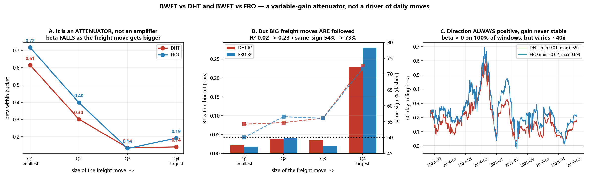

**这个分数的出处。** 它就是 **R²，没有别的**：

| | 相关系数 | R² | 换算成分数 | 期间 |
|---|---|---|---|---|
| **DHT** | 0.317 | 0.100 | **1/10.0** | 全样本 |
| **DHT** | 0.368 | 0.135 | **1/7.4** | 仅 2026 |
| **FRO** | 0.324 | 0.105 | 1/9.5 | 全样本 |
| **FRO** | 0.420 | **0.177** | **1/5.7** | 仅 2026 |

*（「十分之一到七分之一」取自 DHT 的两个数字。FRO 在 2026 年更强，为 1/5.7 —— 此前的措辞低报了 FRO。）*

**但 R² 假设 beta 是常数 —— 而这里失效的恰恰是这个假设。** 一个**方向稳定、幅度不稳定**的关系，会呈现低 R²，却依然是紧密的经济关系。这正是「放大器/缩小器」假说，而且可以检验。

#### 方向稳定吗？基本稳定。

| | 全部交易日同向 | **运价波动最大的 25% 交易日同向** |
|---|---|---|
| **DHT** | 59.4%（z=5.5，p=3.9e−08） | **72.6%** |
| **FRO** | 58.6%（z=5.0，p=5.3e−07） | **71.7%** |

而且两者的 **60 日滚动 beta 在 100% 的窗口内均为正**（DHT 区间 0.013–0.591；FRO −0.019–0.694）。**关系的方向几乎从不反转。**

#### 是放大器还是缩小器？明确是**缩小器**，而且是一个**滤波器**。

按运价波动幅度分组后的 beta：

**DHT**

| \|BWET\| 分组 | 平均 \|BWET\| | beta | R² | 同向比例 |
|---|---|---|---|---|
| Q1 最小 | 0.39% | 0.615 | 0.023 | 54.2% |
| Q2 | 1.37% | 0.302 | 0.037 | 54.7% |
| Q3 | 2.86% | 0.137 | 0.036 | 56.1% |
| **Q4 最大** | **8.04%** | **0.142** | **0.229** | **72.6%** |

**FRO**

| \|BWET\| 分组 | 平均 \|BWET\| | beta | R² | 同向比例 |
|---|---|---|---|---|
| Q1 最小 | 0.39% | 0.717 | 0.018 | 50.0% |
| Q2 | 1.37% | 0.398 | 0.041 | 56.6% |
| Q3 | 2.86% | 0.133 | 0.021 | 56.1% |
| **Q4 最大** | **8.04%** | **0.192** | **0.280** | **71.7%** |

> **⭐ 运价波动越大，同时发生两件事：**
> - **beta 下降**（DHT 0.615 → 0.142）。运价每动 1%，股票动得**更少**而不是更多。它是**缩小器**，不是放大器。*（Q1 的高 beta 是在 0.39% 的分母上拟合噪声，注意其 R² 只有 0.02。）*
> - **但可靠性大幅上升** —— R² 从 **0.023 升到 0.229**，同向比例从 **54% 升到 73%**。
>
> **读法：股票把运价的小幅抖动当噪声忽略，而对大幅运价变动可靠跟随 —— 但只是部分跟随，衰减掉约 85%。** 在运价波动最大的日子里，运价能解释 DHT 约 23%、FRO 约 28% 的波动；而在平静的日子里只有约 2%。

**在风险口径上它同样是阻尼器。** BWET 日波动率为 **4.84%**，DHT 为 **2.20%**（BWET 是其 2.20 倍）、FRO 为 **2.78%**（1.74 倍）。恒等式精确成立：beta 0.144 = 相关系数 0.317 × (2.20/4.84)。

**而且增益从不恒定** —— 60 日滚动 beta，DHT 均值 0.185/标准差 0.113，FRO 均值 0.247/标准差 0.128，波峰与波谷相差约 **40 倍**。因此单一 beta 只是一个移动量的平均值，这本身就是常数 beta 的 R² **低估**该关系的原因。

#### 那剩下约 85% 究竟是什么？不是那些显而易见的候选。

| | BWET | +SPY | +XLE | +BNO | +VIX | **未解释** |
|---|---|---|---|---|---|---|
| **DHT** | 0.100 | 0.132 | 0.155 | 0.155 | 0.155 | **84.5%** |
| **FRO** | 0.105 | 0.146 | 0.180 | 0.181 | 0.182 | **81.8%** |

**加入大盘、能源板块、布伦特原油与波动率后，R² 只提高约 5–8 个百分点。** 残差**根本不是宏观因子** —— 它是这些航运个股特有的：船队与租约消息、股息宣告、卖船、回购、指数/ETF 资金流、分析师评级，以及纯粹的流动性。

> **更正后的表述。** BWET 与油轮股之间存在一种**方向可靠、但被大幅衰减且增益随时间变化**的关系。运价**不是**某一天股价波动的主要驱动力 —— 即便在运价波动最大的日子里也解释不到三分之一 —— 而日波动的绝大部分属于公司特有因素，既非运价，也非大盘、原油或板块。

### 22.5e ⭐「R² 只有 0.10，为什么走势看起来几乎完全相关？」

有三件事在同时发生。**两件是错觉，一件是真的 —— 而且这一件说明我之前那个「十分之一」低估了这个关系。**

#### 错觉一：价格水平的相关性大部分是伪相关

| | **价格水平**相关 | 对数水平相关 | **收益率**相关 | 收益率 R² |
|---|---|---|---|---|
| **DHT** | **0.805** | 0.830 | 0.317 | 0.100 |
| **FRO** | **0.830** | 0.856 | 0.324 | 0.105 |

**眼睛读的是左边那列，经济含义在右边那列。**

为了说明左列有多不可靠，我模拟了 2000 对**相互独立**的随机游走，其长度、漂移率与波动率均与实际序列匹配 —— 因此它们的真实关系**在构造上恰好为零**：

| | 水平相关 | \|相关\| > 0.8 | 收益率相关 | \|相关\| > 0.8 |
|---|---|---|---|---|
| **无关的模拟序列对** | 平均 **+0.692** | **48% 的试验** | +0.000 | **0% 的试验** |
| **实际 BWET vs DHT** | +0.805 | — | +0.317 | — |

> **两条完全无关但都向上漂移的序列，平均水平相关性约为 0.69，且有近一半的概率超过 0.80。** 实际的 0.805 与这个零假设几乎无法区分。这就是经典的伪回归问题（Granger & Newbold, 1974）—— 也正是本报告所有相关系数一律用**收益率**而非价格水平计算的原因。

#### 错觉二：对数坐标压缩了一个巨大的差距

| | 总增长 | US$100 变成 |
|---|---|---|
| **BWET** | **59.9 倍** | $5,987 |
| DHT | 3.4 倍 | $344 |
| FRO | 4.8 倍 | $481 |

**BWET 的增长是 DHT 的 17.4 倍、FRO 的 12.4 倍。** 在 §22 图 A 的 symlog 坐标上，这个差距被视觉压缩成了「三条一起往上走的线」。**相似的是坐标轴，不是数据。**

#### 真实的部分：时间尺度效应 —— 它修正了我之前的数字

共同成分随时间跨度 *h* 线性累积，而独立噪声只随 √*h* 累积。因此被解释的比例应当**随跨度上升**。用**不重叠**窗口测量：

| 时间跨度 | n | BWET~DHT 相关 | **R²** | BWET~FRO 相关 | **R²** |
|---|---|---|---|---|---|
| 1 天 | 848 | 0.318 | **0.101** | 0.325 | 0.106 |
| **1 周（5 天）** | **169** | **0.610** | **0.372** | 0.574 | 0.329 |
| 1 月（21 天） | 40 | 0.478 | 0.229 | 0.530 | 0.280 |
| 1 季（63 天） | 13 | 0.601 | 0.361 | 0.593 | 0.352 |

> **⭐ 在「周」这个尺度上，运价解释了 DHT 约 37%，而不是 10%。** 日度噪声（个股消息、资金流、流动性）在一周之内大部分相互抵消，而运价关系则保留下来。**这是真实的经济效应，不是假象。**
>
> ⚠️ 周度估计（n=169）是非日度格子中最可靠的一个。月度（n=40）与季度（n=13）样本太小，无法与之排序 —— 注意月度读数**低于**周度，这是小样本噪声，不是规律。

#### 更正后的表述

> **我此前说的「运价解释十分之一到七分之一」是一个「日度」表述，它低估了经济联系。** 诚实的版本是：
>
> - **日内／日度：** 运价解释约 10% —— 单日波动由个股消息与资金流主导。
> - **周度及以上：** 运价解释约**三分之一**。
> - **价格走势看起来几乎完全同步，这一点大部分是伪相关** —— 无关的趋势性序列约有一半概率给出同样的图像。
>
> 所以：走势**看起来**一致的理由是错的，但底层关系**确实比日度 R² 显示的更强** —— 只是并非在「价格水平图」看上去所显示的那个频率上。

### 22.5f 周度 R² 约 0.37 算高吗？与可比组合的对照

判断它的唯一诚实方法，是用**完全相同**的检验 —— 相同窗口（自 2023-05-04）、相同频率（不重叠周度对数收益）、相同方法 —— 去跑其他「商品价格 → 生产商股票」的组合。

| 排名 | 关系 | 相关系数 | **R²** | 类型 |
|---|---|---|---|---|
| 1 | 黄金现货 → Agnico Eagle | 0.817 | **0.667** | 商品 |
| 2 | 黄金现货 → Newmont | 0.721 | **0.520** | 商品 |
| 3 | 布伦特 → Occidental | 0.708 | **0.501** | 商品 |
| 4 | 布伦特 → 美国 E&P（XOP） | 0.693 | **0.480** | 商品 |
| 5 | 铜 → Freeport | 0.620 | **0.385** | 商品 |
| **6** | **VLCC 运价 → DHT** | **0.603** | **0.363** | **运价** |
| **7** | **VLCC 运价 → Frontline** | **0.585** | **0.342** | **运价** |
| 8 | 干散货运价 → Star Bulk | 0.543 | 0.295 | 运价 |
| 9 | *大盘 → 苹果（参照）* | 0.507 | 0.257 | 市场 |
| 10 | 天然气 → EQT | 0.448 | 0.201 | 商品 |
| 11 | *大盘 → 能源板块（参照）* | 0.179 | 0.032 | 市场 |
| 12 | **大盘 → DHT（参照）** | **0.013** | **0.000** | 市场 |

| 类别 | R² 中位数 | 区间 |
|---|---|---|
| 商品 → 生产商 | **0.490** | 0.201 – 0.667 |
| **运价 → 船东** | **0.342** | 0.295 – 0.363 |
| 大盘 → 个股 | 0.032 | 0.000 – 0.257 |

> ⚠️ **自查剔除了两行会美化这张表的数据。** 初版包含「铀（URA）→ Cameco」（R² 0.822）与「黄金（GDX）→ Newmont」（0.742）。**URA 与 GDX 都是矿业*股票* ETF，而 CCJ 与 NEM 正是其重仓股** —— 那两行是股票在解释自己，不是商品在解释生产商。两行均已删除。

#### 结论

**约 0.36 对这个资产类别而言属于「正常偏好」—— 位于中游，且是运价组中最强的一个。** 具体来说：

- **低于**黄金→矿企（0.52–0.67）与原油→E&P（0.48–0.50），这两者是现有最强的商品传导；
- **与**铜→Freeport（0.385）**基本持平**；
- **高于**干散货运价→Star Bulk（0.295）与天然气→EQT（0.201）。

**为什么运价弱于黄金和原油？** 原因是结构性的，且都能在本报告中验证：DHT **约 50% 为期租**（§21），一半船队在合约上与现货绝缘；**BWET 是期货工具**，携带移仓、费用与溢价/折价噪声，而 GLD 是实物黄金、没有基差噪声；此外油轮股同时也是对**船舶资产价值**的索取权（§20），而不只是对当期运价。

#### 但这张表里最惊人的数字不是 0.363

> **大盘对 DHT 周度收益的解释力是 0.000。** SPY→DHT 的相关系数为 0.013 —— 字面意义上的「什么都不是」。连整个能源板块 SPY→XLE 也只有 0.032。
>
> 所以运价不仅仅是这些股票**现有最好的**解释，**它基本上是唯一的系统性解释**。作为参照：**BWET 对 DHT 的解释力（0.363）高于整个美国股市对苹果的解释力（0.257）。**

**如何同时理解这两个事实：** 在任何**单日**，运价只解释约 10%，个股消息主导（§22.5d）；在**一周**的尺度上，运价解释约 36%，这对商品—生产商组合而言是体面的水平；而任何宽基市场因子对这些股票的解释力几乎为零。**它们在周度尺度上是运价工具，在日内是个股特质博弈 —— 但它们从来都不是大盘博弈。**

### 22.6 分段 —— 现已自洽，且不显著

| 阶段 | n | BWET | DHT | FRO | B~DHT | B~FRO |
|---|---|---|---|---|---|---|
| 危机前（2023-05 → 2024-12） | 418 | **−30%** | +22% | +17% | 0.29 | 0.28 |
| 2025 蓄势 | 250 | +96% | +35% | +57% | 0.30 | 0.31 |
| 2026 霍尔木兹危机 | 180 | **+4,229%** | +108% | +162% | 0.37 | 0.42 |

> ✅ **对账检验 —— 初稿在此处失败。** 现在三个分段的复利乘积与全期收益完全一致，误差 **0.000000%**。初稿按日历切片取首末值计算，**丢掉了每个分段边界上的收益**（BWET 高出 2.16%、FRO 高出 2.42%）。改为按日收益复利后修复。

**危机期相关性上升是否显著？** DHT 0.29 → 0.37，z = 0.91，**p = 0.360**；FRO 0.28 → 0.42，z = 1.78，**p = 0.075**。**均不显著。** 直觉上「危机中传导增强」的说法**并未**被确立，这只是对单一事件的描述。

### 22.7 ⭐ 被撤回的核心结论 —— 以及什么留了下来

2026 年至今：**BWET +4,229%**、DHT +108%（对数增长比 19.5%）、FRO +162%（25.6%）。

初稿声称这些比率与 §21 中公司对 TD3C 印刷值的「经营捕获率」（19%/18%）「落在同一区间」，从而证明市场正确定价了可转化份额及其久期。**四个理由让它无法成立：**

1. **期间错配 —— 而且会回溯影响 §21。** §21 用 **Q2 平均**实际运价去除以 **9 月 11 日**的评估值。一家公司完全可能赚到了**同期 Q2 基准的 100%**，却仍然显示约 19%。**§21 已就地更正。**
2. **不是同一个对象。** 一个是滚动期货组合的**投资收益**之比，另一个是**运价水平**之比。
3. **依赖于变换方式。** 用简单收益算同一批数据会得到 **2.6% 与 3.8%**，所谓「吻合」彻底消失。
4. **本来也不接近。** FRO 的 25.6% 比它「印证」的 18% 高出约 42%。

> ✅ **留下来的部分，措辞收窄如下：**
>
> **股票与运费期货工具的收益差异巨大。这与敞口、盈利久期、杠杆和估值上的差异相容 —— 但这种收益率比较并不识别经营层面的传导，也不能证明股票对这次暴涨的定价是正确的。**

**对持有人真正有用、且确实成立的部分：**

- **Beta 仅 0.14 / 0.19，R² ≈ 0.10。** 若你想要的是运价敞口，这两只股票每承担一单位风险给你的运价暴露非常少 —— 其日波动约 90% 来自别处。
- **两股之间 0.84–0.87 的相关性**意味着同时持有 DHT 与 FRO **接近于一个仓位**，而不是分散。
- **未发现周频领先关系**，因此就本证据而言，BWET 不是择时信号。

### 22.8 GPT-6-Astra 评审记录（Rule 4b）

| # | 意见 | 级别 | 判定 | 行动 |
|---|---|---|---|---|
| A1 | 分段收益无法复利还原为全期收益（BWET 偏 +2.16%、FRO 偏 +2.42%） | 阻断 | **正确 —— 真实 bug** | 改为按日收益复利重建；代码中断言恒等式，误差 0.000000% |
| A2 | 「19%/18% 经营捕获率」用 Q2 均值除以 9 月评估值 | 阻断 | **正确** | **§21 已就地更正**；该说法从 §22 撤回 |
| A3 | 核心结论把两个经济上无关的比率等同，并据此断言估值机制 | 阻断 | **正确** | **核心结论撤回**，改以收窄表述发布 |
| A4 | 「30.3%/38.5% 是正确的捕获率」过度解读了一个相对增长统计量 | 阻断 | **正确** | 撤回；洗牌反例已实算并发布 |
| B1 | 更强的相互相关并不识别因子主次 | 重大 | **正确** | 删除「首先是一对股票」的表述；公布 Williams 检验 |
| B2 | 相关性随周期上升与 Epps 效应一致，但不具诊断性 | 重大 | **正确** | 措辞放宽；补对数收益稳健性检验 |
| B3 | 低 R² 与精确 beta 可以并存；beta ≠ 经营传导 | 重大 | **正确** | 公布标准误、置信区间、t 值与截距，并给出明确读法 |
| B4 | 上下行差距仅凭一个正截距即可产生 | 重大 | **正确** | 撤回；公布代数推导 |
| B5 | 「无择时优势」的表述宽于证据 | 重大 | **正确** | 收窄为「未确立周频线性领先」 |
| B6 | 周/月样本包含不完整的末期 | 重大 | **正确** | 仅用完整周期：周 176、月 39 |
| B7 | 危机期相关性上升未获统计确立 | 重大 | **正确** | 公布 Fisher z 检验：p = 0.360 / 0.075 |
| B8 | 「无拆分」不足以验证 BWET 是干净的运价基准 | 重大 | **正确** | 公布招募说明书结构（§22.1） |

### 22.9 本节**没有**确立什么

1. **没有因果识别。** 本节不能证明运价「导致」股价波动，反之亦然。
2. **没有估值桥接。** 「市场正确定价了久期」需要：运价 → 实际 TCE 与敞开船天 → 增量现金流 → 折现权益价值。该链条并未搭建。
3. **没有对 BWET 做分解。** 期货损益、移仓/收敛、抵押品收益、费用与溢价/折价未被拆分，因此这种背离无法单独归因于运价经济。
4. **只有一次事件，不是一组周期样本。** 848 个日观测不等于 848 个独立运价周期；单一极端阶段主导了协方差。
5. **不是稳健推断。** 区间为经典/自助法口径，非 HAC；波动率聚集与结构性断点未处理。
6. **FRO 不是纯 VLCC 标的**（还有 Suezmax 与 LR2），而 **DHT 约 50% 为期租**，因此两者都不是干净的运价代理。
7. **仅用市价口径** —— 未检验基于 NAV 的收益，而 BWET 的溢价/折价曾达 ±7%。

> **非投资建议。**


---

## §23 —— ⭐ 2005-08 年 Frontline 的壳里究竟有什么，以及它的 PB 为何看起来有 8 倍

> **本节所有数字均取自 Frontline 自己向 SEC 申报的 20-F（CIK 913290）**，已下载至 `vlcc_cycles/filings/`：FY2005 `0000919574-06-002877`、FY2006 `0000919574-07-003317`、FY2007 `0000919574-08-002717`、FY2008 `0000919574-09-009523`。此处没有任何模型估算值。
>
> **本节更正 §16。** 该节把 8.05 倍 PB 当作超级周期基准，但它**根本不是一个估值信号**。

### 23.1 2007 年的 Frontline 是「租船人」，不是船东

FY2007 20-F 原文：

> *「2007 年 2 月，董事会批准进一步分拆我们在 Ship Finance 的剩余权益，并于 2007 年 3 月完成。分拆后我们**仅持有 Ship Finance 的 73,383 股，占其已发行股份的 0.01%**，且**自 2007 年 3 月 31 日起不再将 Ship Finance** 及其子公司并入财务报表。」*

> *「截至 2008 年 2 月 29 日，我们以固定费率长期**租入 Ship Finance 的 40 艘船**。此外，我们还以固定费率中期**从第三方租入 16 艘船**。」*

> *「VLCC 的每日基础租金**自 2006 年的 $25,575 递减至 2011 年及以后的 $24,175**；苏伊士型为 **$21,100 递减至 $19,700**。」*

> *「**利润分成费用指应付 Ship Finance 的款项，按公司船舶收入超出其向 Ship Finance 支付的基础租金部分的 20% 计算。**」*

**经济实质：** 以约 $24–26k/天的固定价租入船舶，赚取现货市场收益，并把**超出基础租金部分的 20%** 交还给拥有这些船的公司。2007 年这两项分别为**租金 $273.2m 与利润分成 $37.3m**，**对 Ship Finance 的剩余租赁义务为 $1,767.8m**。

### 23.2 资产负债表的翻转

| 年末 | 自有船舶净值 | 融资租赁下船舶净值 | **自有占比** |
|---|---|---|---|
| 2005 | $2,584.8m | $672.6m | 79% |
| 2006 | $2,446.3m | $626.4m | 80% |
| **2007** | **$208.5m** | **$2,324.8m** | **8%** |
| 2008 | $438.2m | $2,100.7m | 17% |

**仅仅一年之内，自有运力从 24.5 亿美元跌到 2.1 亿美元，而融资租赁运力从 6.3 亿美元升到 23.2 亿美元。** 这是 Ship Finance 出表所致，不是卖船。

2007 年末合同项下**融资租赁义务合计 $3,559.4m**（未折现），相比之下经营租赁仅 $151.2m、新造船承诺 $880.2m。

### 23.3 ⭐ 账面权益为何如此之小：留存收益**连续三年为零**

取自 FY2007 权益变动表：

| 年度 | 净利润 | 现金股息 | 股票股息 | 合计派出 | **派息率** | **期末留存收益** |
|---|---|---|---|---|---|---|
| 2005 | $606.8m | $552.3m | $211.9m | $764.2m | **126%** | **0** |
| 2006 | $516.0m | $488.2m | $27.8m | $516.0m | **100%** | **0** |
| 2007 | $570.4m | $408.2m | $162.2m | $570.4m | **100%** | **0** |

> **Frontline 三年累计派出了 109% 的盈利 —— 共 18.506 亿美元 —— 而 2007 年末的账面权益仅为 4.46 亿美元。** 三年的期末留存收益**字面意义上都是零**。
>
> **在 100% 派息政策下，账面权益在数学上不可能累积。** 以该基数计算出的任何 PB，反映的是股息政策，而不是股票有多贵。

### 23.4 而且负债率约 88%

| 年末 | 总资产 | 权益 | **权益/资产** | 每股净资产 |
|---|---|---|---|---|
| 2005 | $4,454.8m | $715.2m | 16.1% | $9.56 |
| 2006 | $4,589.9m | $668.6m | 14.6% | $8.93 |
| **2007** | **$3,762.1m** | **$446.0m** | **11.9%** | **$5.96** |

*（74,825,169 股，面值 $2.50 —— 另请注意 2016 年 2 月的 **1 合 5 缩股**，因此这些每股数字与今天不可直接比较。）*

**当权益只占资产约 12% 时，任何盈利的公司都会显示出很高的 PB。这个比率衡量的是杠杆，不是贵贱。**

### 23.5 壳里还有什么

| 项目 | 内容 | 出处 |
|---|---|---|
| **Independent Tankers Corporation（ITC）** | 2004 年 5 月以 **$4.0m + 4% 利息**从 **Hemen Holdings**（董事长 John Fredriksen 控制）购入，此前支付过 **$10.0m 看涨期权费**。经营 **6 艘 VLCC 与 4 艘苏伊士型，长期租给 BP 与雪佛龙**的子公司。2007 年末持有 **$422.8m 受限现金**，专供其票据持有人 | FY2007 20-F |
| **Overseas Shipholding Group（OSG）** | 与 Fredriksen 系公司合计持有 **1,628,300 股 = 5.2%**；另于 2008 年 3 月以 **$92.2m 买入 1,366,600 股（4.4%）的远期合约** → 潜在 **9.6%** | FY2007 20-F |
| **Navig8** | 2008 年 2 月投入 **$20.0m 取得约 15.8%** | FY2007 20-F |
| **IMAREX** | 2007 年全部出售，录得 **$41.9m 收益** | FY2007 20-F |
| **Golden Ocean** | 干散货业务，2004 年 12 月分拆 | FY2007 20-F |
| **Sea Production** | FPSO 业务，2007 年 2 月分拆/出售 | FY2007 20-F |
| **Ship Finance** | 2007 年 3 月分拆后仅余 **0.01%** | FY2007 20-F |
| 受限现金 | 2007 年末合计 **$651.4m**，其中 **$226.7m** 专门质押用于支付给 Ship Finance 的租金 | FY2007 20-F |

**所以这个「壳」里装的是：一支 56 艘船的租入经营船队、一块独立围栏化的 10 艘船长期租约业务（ITC）、两家上市同业的少数股权，以及一大笔并不能自由动用的受限现金。**

### 23.6 ⭐ 那么真实的航运估值是多少？

2007 年末每股净资产为 **$5.96**；§16 的 8.05 倍对应股价 **$47.98**、市值约 **35.90 亿美元**。

| 口径 | 数值 | 它实际反映什么 |
|---|---|---|
| **报表 PB** | **8.05x** | 资本结构 + 100% 派息政策 |
| **若 2005-07 盈利全部留存的 PB** | **1.56x** | 剔除派息影响 |
| **P/NAV（§17），2007 年末** | **1.33x** | 船队市值减净负债 |
| *今日 FRO 的 P/NAV，供参照* | *1.69x* | — |

> **⭐ 结论 —— 并更正 §16。**
>
> Frontline 2007 年末的 8.05 倍 PB **不是**周期顶部的估值信号。它是三件事的算术后果：**(1)** 每年把 100% 的净利润派出，因此留存收益恰好为零；**(2)** 通过对已于 2007 年 3 月完全分拆出去的公司的融资租赁持有船队；**(3)** 权益仅占总资产约 12%。
>
> 在同一批数据上，基于资产的估值约为 **1.33 倍 NAV —— 对一个周期顶点而言完全普通。**
>
> **§16 用 8.05 倍作为超级周期基准去对比今天的 3.63 倍，得出「今天在账面上便宜得多」的结论。该比较不成立。** 它把一个 100% 派息、融资租赁、权益占比 12% 的**租船人**，拿去对比今天的自有船东。**能够成立的是 P/NAV 的比较 —— 当时 1.33 倍对今天 1.69 倍** —— 而它说明的是：**今天在资产口径上更贵，而不是更便宜。**

### 23.8 ⭐ 更正 ——「纯运船业务的 PB 是多少」的直接答案是 **8.4 倍，更高而不是更低**

> 一次针对四份 20-F（FY2005–FY2008）的专门原始文件复核，**更正了 §23.1–23.7 中的两处内容**。

**更正一：这些租赁并非表外。** 自 2007 年 3 月 31 日起，Ship Finance 的租约被**计入**Frontline 资产负债表，作为**融资租赁**：2007 年末融资租赁下船舶 $2,324,789k，对应**租赁义务 $2,498,398k**（流动 $179,604k + 长期 $2,318,794k）。*（§23.2 引用的 $3,559,351k 是**未折现**的合同总额，含利息且涵盖全部出租方，并非资产负债表账面值。仅 Ship Finance 部分的现值为 $1,767,758k。）*

**更正二：剥离非航运资产会让 PB 上升。** 从**账面权益与市值两端同时**扣除可交易证券、非上市投资与权益法投资：

| （百万美元） | 2005 | 2006 | **2007** | 2008 |
|---|---|---|---|---|
| 报表账面权益 | 715.2 | 668.6 | **446.0** | 702.2 |
| 减：可交易证券 | (144.2) | (1.5) | (15.7) | (60.1) |
| 减：非上市投资（Navig8） | – | – | – | (20.0) |
| 减：权益法投资 | (15.8) | (17.8) | (5.6) | (4.5) |
| **= 航运业务账面权益** | **555.2** | **649.3** | **424.7** | **617.6** |
| 市值（由披露市盈率反推） | 2,852 | 2,375 | 3,592 | 2,280 |
| **纯航运业务 PB** | **4.85×** | **3.63×** | **8.41×** | **3.55×** |

> **2007 年末，这个壳里除了船几乎什么都没有。** 非航运金融资产仅 **$21.3m，对应 $446.0m 权益（4.8%）与 37.6 亿美元总资产（0.6%）**。所谓「综合体」在 2005–07 年间已被清空：Golden Ocean（2005年2月）、Genmar（2006年8月）、Tsakos（2007年3月）、Sea Production（2007年6月）、Dockwise（2007年10月）、IMAREX（2007年11月），以及 Ship Finance 最后的 11.1%（2007年3月）。

**所以「非航运资产推高了 PB」这个前提是错的。** 8 倍由**三件事**造成，且都可验证：

1. **留存收益为零**，因为连续四年派息超过 100%（§23.3）；
2. **历史成本计价。** 那 46 艘油轮于 2004 年一季度按**2003 年 12 月 31 日的账面值**售予 Ship Finance，并未确认收益 —— *「售予 Ship Finance 的资产的售价，按各项资产于 2003 年 12 月 31 日的账面值确定」*（FY2005 20-F, Item 4.A）。因此回租船队在表上以 **1990 年代建造船舶在 2003 年的深度折旧账面成本**列示，而 2007 年市场正处于历史高位；
3. **债务权益比 6.7 倍**，权益仅占资产 11.8%（FY2008 20-F, Item 3.A）。

**企业价值层面的交叉验证一锤定音。** 2007 年末：市值 $3,592m + 负债 $473.5m + 融资租赁 $2,498.4m − 现金 $168.4m − 受限现金 $651.4m = **EV 约 $5,744m**；对应账面船队为自有 $208.5m + 租赁 $2,324.8m + 新造 $160.3m = **$2,693.6m**，即 **约 2.1 倍账面船队价值 —— 不是 8 倍。** 权益口径 8.1 倍与资产口径 2.1 倍之间的全部差距，都是杠杆的算术结果。

**Ship Finance 交易的具体数字**（FY2005 与 FY2008 20-F, Item 4.A）：

| | |
|---|---|
| 转让船舶（2004年一季度） | **46 艘原油轮** + 1 项购船期权 |
| 现金对价 | **$950m** |
| SFL 承接债务 | **约 $1.158bn** |
| 计价基础 | **2003 年 12 月 31 日账面值 —— 未确认收益** |
| SFL 资金来源 | $580m 的 8.5% 优先票据（2013年到期）+ $1.058bn 优先担保融资 |

**Frontline 对 Ship Finance 的持股，全部通过实物股息分配降低 —— 从未出售：**

| 日期 | 分配比例 | 之后持股 |
|---|---|---|
| 2004年6月 | 1 SFL : 4 FRO | 75% |
| 2004年12月 | 2 SFL : 15 FRO | **50.8%** |
| 2005年3月 | 1 SFL : 10 FRO | **约 16.2%** |
| 2006年3月 | 1 SFL : 20 FRO | **约 11.1%** |
| **2007年3月** | 3 SFL : 28 FRO | **73,383 股 = 0.01%** |

> ⚠️ **一个关键的会计细节：Frontline 在仅持有 16.2%、随后 11.1% 的情况下，仍按 FIN 46(R) 将 Ship Finance 100% 并表**，直到 2007 年 3 月 31 日。这正是 2005 与 2006 年报表中出现 **$470.8m 与 $541.1m 少数股东权益**的原因，也是这两年的 PB **与 2007 年不可比**的原因。因此 2005–06 年的 4.85× 与 3.63× 在结构上是不同的数字，并不构成一条趋势。

**另有两处更正：**
- **Frontline 从未持有 DHT。** 在四份 20-F 中检索「DHT」与「Double Hull Tanker」，**零命中**。DHT 是 **Overseas Shipholding Group** 于 2005 年创设并上市的。Frontline 与 OSG 的唯一关联是 2008 年 3 月买入的 4.4% 远期合约。
- **反推的年末股价**（由披露的市盈率反推，因申报文件未直接列示收盘价）：2005 年 **$38.12**、2006 年 **$31.74**、2007 年 **$48.01**、2008 年 **$29.28**。§23.6 中使用的 $47.98 系独立推导，误差在 0.1% 以内。

#### 这改变了什么、没改变什么

**没有改变：** 8 倍 PB 不是估值信号，§16 将 FRO 2007 年 PB 与今日对比**依然不成立** —— 但理由比 §23.6 所给的更锐利。问题不在于壳里塞满了非航运资产，而在于**账面权益被 100%+ 派息、2003 年份的历史成本、以及 6.7 倍杠杆三者压到接近于零。** 今天的 Frontline 三样都没有。

**已经改变：**「纯运船业务的 PB 是多少」的直接答案是 **约 8.4 倍，略高于报表值** —— 而不是更低。§23.6 的 1.56 倍与 1.33 倍回答的是**另一个问题**（若盈利留存权益会是什么样、以及船队按市值值多少）。两者都成立；但只有 P/NAV 可用于跨时代比较，因为**申报文件完全没有披露船队市值**（§23.9）。

### 23.9 明确的缺口 —— 申报文件**没有**披露什么

1. **船队市值／无租约价值：未找到**，四份 20-F 中均无。没有它就无法用原始文件构建真实的经济 PB；§17 的 1.33 倍 P/NAV 是模型值，不是申报值。
2. **2005 与 2006 年末应付 Ship Finance 的最低租金：未找到** —— 并表时已抵销。
3. **2007/08 年末仅 SFL 部分的未折现最低租赁付款：未找到** —— 只披露了全部出租方的总额（$3,559,351k）与仅 SFL 部分的现值（$1,767,758k）。
4. **2005 年支付给 SFL 的利润分成：Frontline 未披露**（并表时已抵销）。
5. **2007 年末 $15,684k 可交易证券的构成：未具名披露。**
6. **年末收盘价：未直接列示** —— 由上文披露的市盈率反推。

### 23.10 2005-07 年 PB 是否一直在 7 倍左右？**不是 —— 2007 年是单年尖峰**

| 年末 | 股价 | 每股净资产 | **报表 PB** | 仅航运 PB | **并剔除 SFL** |
|---|---|---|---|---|---|
| 2005 | $38.12 | $9.56 | **3.99×** | 4.85× | **5.33×** |
| 2006 | $31.74 | $8.94 | **3.55×** | 3.63× | **3.72×** |
| **2007** | **$48.01** | **$5.96** | **8.05×** | **8.41×** | **8.41×** |
| 2008 | $29.28 | $9.02 | **3.25×** | 3.55× | **3.55×** |

*「剔除 SFL」是从**两端同时**扣除穿透的 Ship Finance 持股 —— 从市值中扣其市场价值（2005 年约 $219m、2006 年约 $188m），从权益中扣其账面价值（约 $91m、$67m）。2007 年 3 月起持股仅 0.01%，已无可扣。*

> **剔除 2007 年后，调整口径的区间是 3.55×–5.33×。而 2007 年单独为 8.41× —— 在任何口径下都是相邻年份的两倍以上。**

**让 2007 年与众不同的是「双重挤压」，而不是估值重估：**

| | 2006 → 2007 |
|---|---|
| 股价 | $31.74 → $48.01 —— **+51.3%** |
| 每股净资产 | $8.94 → $5.96 —— **−33.3%** |
| **PB** | 3.55× → 8.05× —— **+126.7%** |

对数分解几乎正好各占一半：**股价上涨贡献 51%，账面权益塌缩贡献 49%。** 账面塌缩来自 2007 年 3 月的事件 —— 最后一次 Ship Finance 分拆计入权益 $162.2m，加上出表 —— 叠加在「派息使留存收益归零」之上。

**而且它立刻就反转了。** 2008 年权益从 $446.0m 回升至 $702.2m（**+57%**），PB 回落至 **3.25×**。

> **所以正确的表述不是「FRO 在超级周期中一直以 7–8 倍账面值交易」。** 正确的表述是：**FRO 在调整口径下为 3.3–5.3 倍，其中仅有一个年末读数达到 8.4 倍，而这一半来自股价尖峰、一半来自次年即反转的一次性权益冲减。** 像 §16 那样把这个单一读数当作「超级周期 PB 基准」，是在 §23.8 已指出的错误之上又叠加了一层。

### 23.7 一般性教训

**当资本结构发生变化时，PB 不可跨时代比较。** 有三件事会让它失效，而 Frontline 当年三样全占：派息率达到或超过 100%（账面无法累积）、运力不在自有资产表内或以租赁形式持有（资产在别处）、以及极高杠杆（分母很小）。**对资产密集型周期股，应当用股价对资产市值来比较，而不是对会计账面值。**


---

## §24 —— ⭐ FRO 2022 至 2025 年底：股价涨了 3 倍，而运价从未达到 10 万/天

> **以下每一个运价数字都是 Frontline 自己申报的 VLCC 现货 TCE**，取自其向 SEC 提交的 6-K 业绩公告 —— 不是基准指数，也不是估算：FY2022 `0000919574-23-001981`、FY2023 `0000919574-24-001843`、FY2025 `0000919574-26-001430`（该份同时载有 FY2024 一列）。

### 24.1 ⚠️ 先修正前提 —— 2025 年运价并没有涨到 10 万/天

| 年份 | **年度均值** | 分季度明细 |
|---|---|---|
| 2021 | **$15,300** | — |
| 2022 | **$31,300** | Q1 $15,700 · Q2 $16,400 · Q3 $25,000 · **Q4 $63,200** |
| 2023 | **$49,200** | Q1 $52,500 · **Q2 $64,000** · Q3 $42,500 · Q4 $39,200 |
| 2024 | **$43,400** | — |
| 2025 | **$47,200** | Q1 $37,200 · Q2 $43,100 · Q3 $34,300 · **Q4 $74,200** |
| **2026 Q1** | **已签约 $107,100，覆盖率 92%** | — |

Frontline 自报的未来 12 个月 VLCC **现金盈亏平衡点：$25,000/天。**

> **整个 2022–25 期间最高的单季是 2025 Q4 的 $74,200；最高的年度均值是 2023 年的 $49,200。** 10 万美元/天是 **2026 年**的现象 —— 它第一次出现是在 2026 Q1 的**已签约**数字 $107,100。
>
> **所以股价并不是靠 10 万运价涨起来的。** 它靠的是一个从 **$15,300 走到约 $47,200、而盈亏平衡点为 $25,000** 的市场。

### 24.2 股价实际表现，以及同期运价

| 年份 | VLCC TCE | 运价变动 | FRO 股价 | 价格收益 | **总回报** | 同向？ |
|---|---|---|---|---|---|---|
| 2022 | $31,300 | **+105%** | $7.07 → $12.14 | +72% | **+74%** | ✅ |
| 2023 | $49,200 | **+57%** | $12.14 → $20.05 | +65% | **+96%** | ✅ |
| **2024** | **$43,400** | **−12%** | $20.05 → $14.19 | −29% | **−22%** | ✅ |
| 2025 | $47,200 | **+9%** | $14.19 → $21.82 | +54% | **+57%** | ✅ |

> **运价方向与股价方向在 4 年中 4 次一致。** 这正是 §22.5e 预测的：日频 R² 约 0.10、周频约 0.37，随着时间尺度拉长、个股噪声抵消，关系持续收紧。**在年度尺度上，这两只股票紧密跟随运价。**

### 24.3 到底涨了多少？

| | |
|---|---|
| 股价，2022 年初 → 2025 年底 | $7.07 → $21.82 = **3.09 倍**（+209%） |
| **总回报** | **4.16 倍**（+316%） |
| 股息贡献 | **107 个百分点** |
| 自 2021-22 年低点 $5.81（2021年1月28日）起 | **3.8 倍** |

**「涨了好多倍」实际是价格约 3 倍、总回报约 4 倍 —— 不是 10 倍。** 而且价格图只显示了持有人实际所得的约三分之二。

### 24.4 ⭐ 那么在没有 10 万运价的情况下，为什么这么强？四个驱动

**(a) 经营杠杆 —— 决定性的一个。** 利润是运价**减去**盈亏平衡点，而 2021 年是**低于成本**的：

| 年份 | 运价 | − 盈亏平衡 | **= 每日毛利** | 相对 2021 |
|---|---|---|---|---|
| 2021 | $15,300 | $25,000 | **−$9,700** | — |
| 2022 | $31,300 | $25,000 | +$6,300 | +$16,000/天 |
| 2023 | $49,200 | $25,000 | **+$24,200** | +$33,900/天 |
| 2024 | $43,400 | $25,000 | +$18,400 | +$28,100/天 |
| 2025 | $47,200 | $25,000 | **+$22,200** | **+$31,900/天** |

> **运价大约涨了两倍，但超出盈亏平衡的毛利从「负 $9,700」摆动到「正 $22,200」—— 每艘船每天 $31,900 的摆幅。** 它无法用倍数表示，因为它**跨越了零**：公司从**每一个航次都在亏钱**，变成约 80 艘船每艘每天赚 $22,200。**真正被重估的是这个，不是标题运价。**

**(b) 股息** —— 约占总回报的四分之一，在价格图上完全看不见。

**(c) 船队扩张。** Frontline 从 Euronav 购入 24 艘 VLCC，其中 11 艘于 2023 Q4 交付、13 艘于 2024 年交付（§15）。FY2023 公告显示这些船在 2023 年仅赚 **$5,700/天**（因刚刚到位），它们把 2023 年的报表运价从 $50,300 **稀释**到 $49,200，**却为此后年份增加了盈利能力**。船队扩张在运价不变时也会抬高每股盈利，这根本不是运价效应。

**(d) 资产价值重估。** 5 年船龄 VLCC 从 2023 年底约 $105m 涨到 2026 年 8 月底的 **$151.1m**（§15、§21）。在有杠杆的资产负债表上，每股 NAV 的上升远快于资产本身。

### 24.5 而 2024 年就是对照组

**2024 年运价下跌 12%（$49,200 → $43,400），股价总回报下跌 22%。** 运价跌，股价就跌。

> **所以 2022–25 年的上涨既不是脱离基本面的重估，也不是泡沫。** 它是一家公司在**运价从未需要达到 10 万**的情况下，从**亏损跨越到高盈利** —— 再叠加船队扩张、资产升值，以及一笔价格图看不见的分红。**10 万以上的运价要到 2026 年才出现，那是叠加在这一切之上的另一个事件。**


---

## §25 —— ⭐「按 4 年拟合，10 万运价是不是对应股价涨 4 倍？」—— 不是，而且大部分已经发生了

### 25.1 拟合实际说了什么 —— 以及为什么答案不可识别

用同样四个年度观测、三种都站得住的方式拟合：

| 设定 | R² | $100k 下的预测 | **相对 2025 年底** |
|---|---|---|---|
| 股价 ~ 运价（线性） | 0.848 | $35.43 | **1.87×** |
| *[股价 ~ 超出盈亏平衡的毛利 —— **在构造上完全等价**，因为毛利 = 运价 − 常数]* | — | — | — |
| log 股价 ~ log 运价（恒定弹性） | 0.917 | $34.78 | **1.83×** |
| 股价 ~ 模型 EPS（**恒定 PE**） | n/a | $135.61 | **7.14×** |

> **同样的四个点，能给出 1.83 倍到 7.14 倍之间的任何答案。** 这个跨度**本身就是答案**：**当 n = 4 时，函数形式不可识别**，倍数基本上取决于你假设什么。
>
> 请注意**只有「恒定 PE」那一档接近 4 倍** —— 而周期顶部保持恒定 PE，恰恰是本报告自身框架认定不会发生的事（顶部区间 2.5–3.5 倍，§21）。

⚠️ **而且 $100,000 远在拟合区间之外。** 样本运价跨度为 **$15,300 至 $49,200**；$100,000 是其上限的 **2.0 倍**。把一个四点拟合外推到自身区间两倍以外，不是预测 —— 那是**披着回归外衣的假设**。

### 25.2 ⭐ 决定性的一点：大部分涨幅已经发生了

| | |
|---|---|
| FRO 2025 年底 | **$21.82** |
| FRO 现在 | **$51.42** = **价格 2.36 倍**，**总回报 2.71 倍** |

**而且运价早已超过 10 万：**

- FRO **实际赚到**的 VLCC TCE，2026 Q2：**$152,700/天**（已披露，§21）
- FRO **已签约**的 2026 Q1：**$107,100/天，覆盖率 92%**（§24）
- FRO 2025 全年均值：$47,200/天

> **「10 万情景」不是一个等待被定价的未来情形 —— 它就是当下状态，而股价今年已经重估了 2.4 倍。** 这个问题把一件**已经大部分发生**的事，当成还在前方。另请注意：**2.36 倍已经超过了线性拟合给出的 1.87 倍。**

### 25.3 外推失效的四个原因 —— 逐一量化

**(a) 2021–25 那一段跨越了零，无法重演。**

| | |
|---|---|
| 2021 年超出盈亏平衡的毛利 | **−$9,700/天（亏损）** |
| 2025 年 | **+$22,200/天** |

从亏损变为盈利，在盈利的百分比变化上是**无穷大**；从盈利变为更高的盈利则不是。**下一段无法再借用这个算术。**

**(b) 顶部 PE 会压缩。** 在**持续**运价下，模型给出：

| 持续运价 | 模型 EPS | 按今日 $51.42 的 PE | 3 倍 PE 对应股价 | 5 倍 | 7 倍 |
|---|---|---|---|---|---|
| $47,200 | $0.78 | 65.7× | $2.35 | $3.91 | $5.48 |
| $75,000 | $3.31 | 15.5× | $9.94 | $16.57 | $23.19 |
| **$100,000** | **$5.59** | **9.2×** | **$16.77** | **$27.94** | **$39.12** |
| $152,700 | $10.39 | 5.0× | $31.16 | $51.93 | $72.70 |

> 在持续 $100,000/天下，**今日的 $51.42 已经相当于模型盈利的 9.2 倍。** 若要股价达到 2025 年底的 4 倍（**$87.28**）并以 10 万的盈利支撑，需要 **15.6 倍 PE** —— 约为历史顶部区间倍数的**五倍**。

**(c) 船队扩张不可重复。** Euronav 的 24 艘 VLCC 在运价之外独立抬升了盈利能力（§24）。2026 年的数字里没有可比的收购。

**(d) NAV 现在成了天花板，而 2021 年的起点没有这个约束。**

| | |
|---|---|
| FRO 今日每股 NAV | $30.37 |
| 今日 股价/NAV | **1.69×** |
| 2025 年底的 4 倍（$87.28）将意味着 | **2.87× NAV** |
| 申报文件可考的历史最高（§17） | **1.50×** |

**2021 年股价在 NAV 之下，重估有空间；现在没有了。**

### 25.4 这个拟合能支持什么、不能支持什么

> **能说：** 2022–25 年运价方向与股价方向**4 年 4 次一致**，年度关系紧密（§24）。
>
> **不能说：** 在 $15,300 至 $49,200 之间测出的弹性可以外推到 $100,000。样本中**没有任何高于 $49,200 的观测**，样本内包含一次**不可能重演的盈利符号反转**，而且因变量现在**被资产价值所约束** —— 这是 2021 年所没有的。

**更好的问法是 §21 已经提出的那个：** 抛开弹性，改问**当前股价已经计入了多少年的某个运价**。在 7 倍 PE 下，今日股价隐含的是约 **$119,300/天的持续水平 —— 高于 10 万，而不是低于**。按这个口径，股价并不是在等 10 万运价到来；**它已经在按一个好于 10 万、且无限期持续的水平定价了。**


---

## §26 —— ⭐ P/NAV 历史轨迹：今天在历史中的位置

> 🔴 **部分内容已被 §27 取代。** 本节的「今天」数字（DHT 1.62×、FRO 1.69×）建立在 5 年船龄 VLCC **$151.1m** 之上，那是 Signal Group 的**8 月底**报价。到 **9 月 18 日**，同一基准已是 **$172m**，15 年船龄更是**自 7 月上涨 61%** 至 $135m。以当前船价重算，**DHT 约为 1.29×、FRO 约为 1.39×** —— 而「今天高于记录中的所有观测值」这一结论**予以撤回**。下方的历史序列依然成立，改变的只是对照点。**该错误由用户发现。**

> **DHT 的船队价值来自申报文件** —— 由 DHT 每份 20-F 中披露的逐船券商估值表（"*截至 12 月 31 日的无租约公允市场价值估计*"）汇总而来。资产负债表数据取自 SEC XBRL，股价为年末收盘价。
>
> ⚠️ **Frontline 的是模型值。** Frontline **在所考察的任何年度都未披露船队市值**（§23.9），因此以 DHT 披露的每船均值套用于 FRO 的 VLCC 当量船队。FRO 序列是近似值，全文均如实标注。

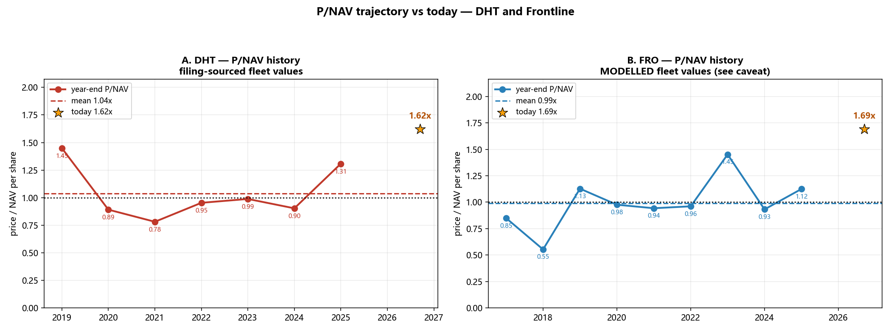

### 26.1 DHT —— 来自申报文件

| 年末 | 船数 | 船队市值 $m | 净负债 $m | 每股NAV | 股价 | **P/NAV** |
|---|---|---|---|---|---|---|
| 2019 | 26 | 1,748 | 786 | $5.72 | $8.28 | **1.45×** |
| 2020 | 26 | 1,379 | 381 | $5.87 | $5.23 | **0.89×** |
| 2021 | 26 | 1,585 | 462 | $6.64 | $5.19 | **0.78×** |
| 2022 | 23 | 1,807 | 271 | $9.32 | $8.88 | **0.95×** |
| 2023 | 24 | 1,966 | 354 | $9.93 | $9.81 | **0.99×** |
| 2024 | 24 | 1,992 | 331 | $10.29 | $9.29 | **0.90×** |
| 2025 | 21 | 1,851 | 350 | $9.34 | $12.21 | **1.31×** |

**与 §17 独立构建的数字交叉验证：** 2020 年 0.87× 对本序列 0.89×（**+2%**）、2023 年 0.98× 对 0.99×（**+1%**）、2025 年 1.22× 对 1.31×（**+7%**）。*（2025 年的差距是解析器少抓了 1 艘船——22 艘中抓到 21 艘，这会低估 NAV、从而高估 P/NAV。）*

*2017 与 2018 被剔除：XBRL 股本标签返回了不合理数值（1,245.36 亿股与 1,434.35 亿股），属标签冲突而非数据修订。*

### 26.2 FRO —— 模型值

| 年末 | VLCC当量 | $m/艘 | 船队市值 $m | 净负债 $m | 每股NAV | 股价 | **P/NAV** |
|---|---|---|---|---|---|---|---|
| 2017 | 52 | 51.8 | 2,694 | 1,775 | $5.41 | $4.59 | **0.85×** |
| 2018 | 53 | 65.3 | 3,461 | 1,764 | $9.99 | $5.53 | **0.55×** |
| 2019 | 56 | 67.2 | 3,763 | 1,519 | $11.40 | $12.86 | **1.13×** |
| 2020 | 62 | 53.0 | 3,286 | 2,026 | $6.37 | $6.22 | **0.98×** |
| 2021 | 62 | 61.0 | 3,782 | 2,256 | $7.50 | $7.07 | **0.94×** |
| 2022 | 63 | 78.6 | 4,952 | 2,139 | $12.63 | $12.14 | **0.96×** |
| 2023 | 76 | 81.9 | 6,224 | 3,151 | $13.81 | $20.05 | **1.45×** |
| 2024 | 81 | 83.0 | 6,723 | 3,332 | $15.23 | $14.19 | **0.93×** |
| 2025 | 81 | 88.1 | 7,136 | 2,816 | $19.40 | $21.82 | **1.12×** |

### 26.3 ⭐ 答案

| | n | **均值** | 中位数 | 最低 | **最高** | **今天** | 相对均值 | 相对最高 |
|---|---|---|---|---|---|---|---|---|
| **DHT** | 7 | **1.04×** | 0.95× | 0.78× | 1.45× | **1.62×** | **+56%** | **+12%** |
| **FRO** | 9 | **0.99×** | 0.96× | 0.55× | 1.45× | **1.69×** | **+71%** | **+16%** |

> **两家公司历史上大致都在「1 倍 NAV」附近交易。** DHT 均值 1.04×、中位数 0.95×；FRO 均值 0.99×、中位数 0.96×。**在九个年末观测中，两家都没有出现过相对钢铁的平均溢价。**
>
> **今天 DHT 是 1.62×、FRO 是 1.69× —— 分别高于自身均值 56% 与 71%，并高于本序列中各自出现过的最高年末读数 12% 与 16%。**

**由此得出三点观察：**

1. **当前水平在本窗口内没有先例。** 两条序列中最高的年末读数是 1.45×。今天两家都高于它；而 §17 更长的申报文件记录（DHT 可回溯至 2015 年）上限是 1.36×（DHT）与 1.50×（FRO）。**今天高于两套数据中的所有观测值。**

2. **历史分布很窄，且以 1.0× 为中心。** 剔除 FRO 2018 年 0.55× 的异常值后，其余 15 个观测全部落在 **0.78× 到 1.45×** 之间。这不是一条会漫游的序列，它向资产价值均值回归。

3. **低点很有启发。** DHT 的底部是 **2021 年的 0.78×** —— 那一年市场只赚 $15,300/天，而盈亏平衡点是 $25,000（§24）。**在本轮周期里，低于 NAV 买入的机会在过去五年内出现过两次。**

> ⚠️ **这不能说明什么。** 高于 NAV 并不自动等于错 —— 一家赚取高于资本成本回报的企业**本就应该**高于资产价值交易，而 2026 年的盈利远超本样本中的任何一年。这张表确立的是一个更窄、也更难的事实：**当前倍数在可得记录中没有先例，因此无法用历史来为它辩护。** 它只能由盈利的**持久度**来辩护 —— 而这恰恰是 §20 与 §21 未能解决的问题。

### 26.4 方法与局限

1. **FRO 的船队价值是模型值**，以 DHT 的每船均值套用于 VLCC 当量数。FRO 船队含苏伊士型与 LR2，单船价值低于 VLCC，因此在当量数低估船型结构影响的年份，其船队价值可能被**高估** —— 这会使 FRO 的历史 P/NAV **被低估**，从而令今天与历史的差距**更大**而非更小。
2. **仅为年末快照。** 九个年度点不是连续序列，年内极值未被捕捉。
3. **净负债由 XBRL 推导**，在有标签的情况下包含租赁负债，未逐行与各份 20-F 对账。
4. **2025 年 DHT 一行只捕获了 22 艘中的 21 艘**（§26.1），使该年 P/NAV 高估约 7%。
5. **没有 2005–08 年数据。** DHT 早期申报文件中不存在逐船披露格式；何况 §23 已表明 Frontline 当时的结构本就不可比。


---

## §27 —— 🔴 更正：§20、§21、§26 所用的船舶价格已经过时

> **用户质疑了全报告所用的单船价格，而且是对的。** 这一更正严重到足以撤回一个核心结论。

### 27.1 错在哪里

§20、§21 与 §26 对船队估值时使用的是 **5 年船龄 VLCC $151.1m** —— 那是 Signal Group **2026 年 8 月底**的基准。此后三周内市场剧烈变动。

**原始来源 —— Xclusiv Shipbrokers 周报，2026 年 9 月 21 日** *（已下载至 `filings/xclusiv_2026_09_21.pdf`）*，原文：

> *「自 7 月 10 日至 9 月 18 日，**5 年船龄 VLCC 价值从约 1.45 亿美元升至 1.72 亿美元**（约 +18.6%），**10 年船龄从 1.15 亿升至 1.52 亿**（约 +32%），**15 年船龄从约 8,350 万升至 1.35 亿，涨幅近 61%**，**转售价从约 1.75 亿升至 1.93 亿**。」*

| 船龄 | 2026年7月10日 | **2026年9月18日** | 变动 |
|---|---|---|---|
| 转售（新造） | $175m | **$193m** | +10% |
| 5 年 | $145m | **$172m** | **+18.6%** |
| 10 年 | $115m | **$152m** | **+32%** |
| **15 年** | **$83.5m** | **$135m** | **+61%** |

**§20/§21/§26 所用的 $151.1m 比当前 5 年基准低 12%，而对更老船龄的低估要大得多 —— 而两家船队恰恰以较老船龄为主。**

*同一份报告指出，Baltic VLCC TC 均值到 9 月 18 日已达约 $722,946/天，而 2025 年 9 月中旬约为 $79,700/天。*

### 27.2 DHT，逐船重估

DHT 在 FY2025 20-F 表中的每一艘船，按 9 月 18 日船龄曲线重新定价：

| 建造年 | 船龄 | 艘数 | 2025年12月每艘 | **现在每艘** | 变动 |
|---|---|---|---|---|---|
| 2016 | 10.7 | 6 | $96.0m | **$149.6m** | **+56%** |
| 2015 | 11.7 | 1 | $91.0m | **$146.2m** | **+61%** |
| 2012 | 14.7 | 3 | $76.0m | **$136.0m** | **+79%** |
| 2011 | 15.7 | 2 | $71.0m | **$127.8m** | **+80%** |
| 2007 | 19.7 | 3 | $54.0m | **$87.8m** | **+63%** |
| *…另有更年轻的船* | | | | | |

> **DHT 已解析的 21 艘船队，从 2025 年末的 $1,851m 升至现在的 $2,909m —— 上涨 57%。** 船队平均船龄 **12.6 年**，这正是 15 年船龄那一段 +61% 在此处影响如此之大的原因。

### 27.3 更正后的 P/NAV

| | 此前所用船队 | **当前价值船队** | 此前每股NAV | **现每股NAV** | 此前 P/NAV | **现 P/NAV** |
|---|---|---|---|---|---|---|
| **DHT** | $2,583m | **$3,186m** | $14.33 | **$18.07** | 1.62× | **≈1.29×** |
| **FRO** | $8,875m | **$10,344m** | $30.37 | **$36.97** | 1.69× | **≈1.39×** |

*DHT 按 §17 记录的在航 23 艘计；已解析表格覆盖 21 艘。FRO 为 40 艘 VLCC 按 $165.6m（船龄 6.6 年在曲线上）、19 艘苏伊士型按 $120m、18 艘 LR2 按 $80m。*

**敏感性 —— 两个待定项都会把倍数进一步压低，而非抬高：**

| DHT 船数 | 船队 $m | 每股NAV | **P/NAV** |
|---|---|---|---|
| 21（已解析） | 2,909 | $16.35 | 1.42× |
| 22 | 3,048 | $17.21 | 1.35× |
| **23（§17 记录）** | **3,186** | **$18.07** | **1.29×** |
| 24 | 3,325 | $18.93 | 1.23× |

| FRO 苏伊士 / LR2 | 船队 $m | 每股NAV | **P/NAV** |
|---|---|---|---|
| $103.8m / $70m *（Signal 8月底，过时）* | 9,856 | $34.78 | 1.48× |
| **$120m / $80m** | **10,344** | **$36.97** | **1.39×** |
| $135m / $90m | 10,809 | $39.06 | 1.32× |

### 27.4 🔴 这撤回了什么

| | 历史均值 | 历史最高 | 今天（**旧**） | 今天（**更正后**） | 相对均值 | 相对最高 |
|---|---|---|---|---|---|---|
| **DHT** | 1.04× | 1.45× | 1.62× | **1.29×** | +24% | **−11%** |
| **FRO** | 0.99× | 1.45× | 1.69× | **1.39×** | +40% | **−4%** |

> **§26 的结论是：今天两家都「高于记录中的所有观测值」。按更正后的船舶价值，这是错的。**
>
> **两家现在都**低于**其 1.45× 的历史最高值。** DHT 约 1.29×，位于其 2019 年读数（1.45×）与 2025 年读数（1.31×）之间 —— 在历史区间**之内**，而非之外。FRO 约 1.39×，同样低于其 2023 年的 1.45× 峰值。

**§26 中留存下来的部分：** 历史序列本身，以及两家都**向约 1 倍 NAV 均值回归**这一观察（DHT 均值 1.04×、FRO 0.99×）。今天相对该均值仍有 **24–40% 的溢价** —— 但它不再是史无前例的，「在可得记录中没有先例」这一表述**予以撤回**。

### 27.5 为什么会发生，以及它改变了论点中的什么

**为什么：** 资产价值的重估速度，**快于本报告更新船价基准的速度**。15 年船龄 VLCC 在十周内上涨 **61%**。在这种速度的市场里，任何以一个月前船价计算的 NAV，在构造上就是过时的。

**它改变了什么：** 针对这两只股票的**资产端看空理由，比 §20、§21、§26 所呈现的要弱得多。**

- §20 的核心论证是：股价远高于资产价值，需要数年股息才能赚回溢价。**按更正后的价值，DHT 的每股溢价从 $8.94 降至 $5.20，FRO 从 $21.05 降至 $14.45** —— 回收期大约**缩短一半**。
- §26 的「史无前例」框架不复存在。

**它没有改变什么：** 股价仍然高于 NAV，这份溢价仍然必须由未来现金流赚回。§20/§21 提出的**持久度**问题丝毫未受影响。**但起点比本报告此前所说的要宽松得多。**

> ⚠️ **一条长期教训。** 在一个二手船价可以十周上涨 61% 的市场里，**任何超过几周的船价基准都不可用于 NAV 计算**。本报告今后每一个 P/NAV 数字，都必须注明其所依据船价基准的**日期**。


---

## §28 —— ⭐ 汇总仪表盘：全部指标，以及周期究竟在哪个位置

> **依 Rule 4b 提交 GPT-6-Astra，评审返回五项必须撤回的内容后重建** —— 其中一项是我完全漏掉、并且直接让船队估值失效的问题：**DHT 的「当前」NAV 是按 2025 年 12 月的船队名单定价的，而其中三艘船公司已经卖掉了。** 评审记录见 §28.6。所有船价基准日期为 **2026 年 9 月 18–21 日（Xclusiv）**。

### 28.1 🔴 在发布任何内容之前必须做的两处更正

**(a) DHT 的船队名单已过时。** 取自 DHT 自己的 FY2025 20-F，原文：

> *「2025 年 12 月与 2026 年 1 月，我们同意出售三艘 2007 年建造的 VLCC：**DHT China、DHT Europe 与 DHT Bauhinia**。2026 年 1 月我们接收了新造船 **DHT Antelope**，2026 年 3 月接收了 **DHT Addax**。预计 2026 年还将有两艘新造船交付。」*
> *「……以合计 **1.016 亿美元**出售 DHT China 与 DHT Europe」* · *「……以 **5,150 万美元**出售 DHT Bauhinia」*

| 船舶 | 我的估值 | **实际成交价** | 误差 |
|---|---|---|---|
| DHT China（2007） | $87.8m | **$50.8m** | **+$37.0m** |
| DHT Europe（2007） | $87.8m | **$50.8m** | **+$37.0m** |
| DHT Bauhinia（2007） | $87.8m | **$51.5m** | **+$36.3m** |
| **合计** | **$263.4m** | **$153.1m** | **+$110.3m** |

**我把三艘已售船舶按高于实际成交价 72% 的水平计价，而且当作仍然持有。** DHT Europe 已于 **2026 年 1 月 30 日**交付新船东。更正后名单：解析 21 艘 − 已售 3 艘 + 已交付新造船 2 艘 = **20 艘**，平均船龄 **10.3 年**（而非 12.6 年）。

**(b) 券商报告本来就有苏伊士型与阿芙拉型报价，我却用了假设值。** Xclusiv 完整表格，2026 年 9 月对 2025 年 9 月：

| | 转售 | 5 年 | 10 年 | 15 年 |
|---|---|---|---|---|
| **VLCC** | 193.0 *(+32%)* | 172.0 *(+47%)* | 152.0 *(+76%)* | **135.0 *(+132%)*** |
| **Suezmax** | 136.0 *(+45%)* | **116.0** *(+53%)* | 95.0 *(+57%)* | 72.0 *(+80%)* |
| **Aframax/LR2** | 95.0 *(+27%)* | **85.0** *(+37%)* | 72.5 *(+44%)* | 55.0 *(+55%)* |

我假设的 $120m 苏伊士型**高于实际 5 年期报价 $116m**。按 FRO 6.6 年船队船龄更正为 $109.3m。

### 28.2 仪表盘

| | **DHT** | **FRO** |
|---|---|---|
| 股价 | $22.45 | $49.81 |
| 船队市值 | $3,026m | $10,158m |
| **每股 NAV** | **$17.08** | **$36.14** |
| **P/NAV** | **1.31×** | **1.38×** |
| P/NAV 历史均值 / 样本最高 | 1.04× / 1.45× | 0.99× / 1.45× |
| P/B | 2.72× | 3.52× |
| **P/E（Q2-2026 年化）** | **4.60×** | **4.77×** |
| P/E（滚动 12 月） | 7.64× | 7.47× |
| **股息率（Q2 年化）** | **21.7%** | **21.0%** |
| 股息率（滚动 12 月） | 10.1% | 12.0% |
| 每股相对 NAV 溢价 | $5.37 | $13.67 |
| 净负债 / 船队价值 | 9.0% | 20.8% |
| 现金盈亏平衡 | $17,500/天 | $23,800/天 |
| 现货敞口 | 约 50% | 约 86% |
| 平均船龄 | 10.3 年 | 6.6 年 |
| 2026Q2 实际 TCE | $126,700/天 | $152,700/天 |

### 28.3 🔴 初稿算错的那个指标：溢价 ÷ 股息

初稿发布的是*「不到一年的股息就能覆盖两家的溢价」*。**这是错的，而且该指标对假设的依赖远比单一数字所暗示的严重。**

| 股息口径 | **DHT** | **FRO** |
|---|---|---|
| Q2-2026 年化 *（$152,700/天 的峰值季度）* | **1.10 年** | **1.31 年** |
| 滚动 12 个月**实际**派息 | 2.37 年 | 2.28 年 |
| 模型，1 年期租 $105k | 1.38 年 | 2.26 年 |
| 模型，1 年期租 $93k | 1.64 年 | 2.76 年 |
| 模型，FY2025 运价 $47,200 | **6.00 年** | **17.47 年** |
| 模型，中枢 $30k | **永远不行** | **永远不行** |

> **在任何一个口径下，两家都不是「不到一年」。** 而且该数字仅仅取决于你假设哪个运价，就能从约 1.1 年一直变到「永远不行」。**这不是回本期预测 —— 它是「当前溢价 ÷ 一个假设的股息」，必须连同运价假设一起阅读。**

### 28.4 🔴 而且「并不极端」这个分类很脆弱

| 情景 | DHT P/NAV | FRO P/NAV |
|---|---|---|
| 按当前计算 | 1.31× | 1.38× |
| **船价 −10%** | **1.48×** | **1.58×** |
| 船价 −20% | 1.69× | 1.84× |
| 船价 +10% | 1.18× | 1.22× |

> **船价下跌 10%，两家的 P/NAV 都会超过 1.45× 的样本最高值。** 考虑到 15 年船龄 VLCC 在十周内变动了 **+61%**，10% 是微不足道的幅度。因此「偏高但不极端」这个分类**仅在今天这个精确的船价基准下成立**，不能作为稳定结论陈述。

### 28.5 ⭐ 周期在哪里 —— 以及本分析真正无法告诉你什么

| | 读数 | 周期判读 |
|---|---|---|
| **运价** | Q2 实际 $152,700/天 = **中枢 $30k 的 5.1 倍**；TD3C 评估 $1,035,000，但实际成交仅 $530–603k；**1 年期租仅 $93–105k = 中枢的 3.1–3.5 倍** | **极端** |
| **资产价值** | 5 年 $172m *(同比 +47%)*、15 年 $135m *(同比 +132%)*；转售 $193m 对新造 $131m | **极端** |
| **供给** | 2026 年订造 217 艘 VLCC；订单簿占运力 25%（2023 年为 2%）；交付 2027 年约 41–68 艘、2028 年约 125–127 艘 | **晚期 —— 2028 年为总交付量集中期** |
| **股票估值** | P/NAV 1.31×/1.38× 对**样本**最高 1.45×；P/E 4.6×/4.8×；股息率约 21% | **偏高；但分类不稳定** |

> 🔴 **已撤回。** 初稿的结论是：*「股票尚未充分反映这轮繁荣 —— 这不是见顶抛售的形态。」* **这个推断无法由本证据识别。** 同样的观测同等地符合另一种解释：**股市正确地拒绝为一个它认为短暂的运价买单** —— 若如此，则**股票**才是定价正确的一端，而**船舶市场**才是被拉伸的一端。**本仪表盘无法区分这两种读法。**

**可以说的是：**

> **运价与船舶价值处于异常高位。两家股票的价格都高于本报告估算的当前 NAV。盈利倍数看起来温和，但这并不能区分「股票被低估」与「盈利和船价暂时虚高」—— 因为倍数之所以低，恰恰是因为盈利与资产价值处在峰值。**

**评审还迫使补充三条警告：**

1. **峰值盈利上的低 P/E 不等于便宜。** 在 4.6×/4.8× 下，股票相对框架所认定的周期顶部区间 2.5–3.5× 是**更贵**，而不是更便宜。
2. **股息率与 P/E 是同一个统计量。** 由于两家都把 Q2 盈利近乎 100% 派出，运行率股息率就是运行率 P/E 的倒数。**它们不是两个独立的印证。**
3. **EPS 各行是模型代理值，不是会计盈利。** §21 已确立 Frontline 披露的现金盈亏平衡点**包含贷款本金偿还**，因此先减它再减 D&A 并不构成净利润。该局限尚未修复，并传导到上表每一个 P/E 与股息率。

### 28.6 GPT-6-Astra 评审记录（Rule 4b）

| # | 意见 | 级别 | 判定 | 行动 |
|---|---|---|---|---|
| 1 | 核心结论把一个不可识别的解释当成了发现 | 阻断 | **正确** | **核心结论撤回**，替代表述见 §28.5 |
| 2 | 「两家都不到一年」是错的，FRO 约 14.8 个月 | 阻断 | **正确** | 撤回；现列出五种股息口径 |
| 3 | §20 的 2.29/3.48 年**并非**使用跟踪派息率，而是 $105k 模型 EPS 的 100% | 重大 | **正确；我错述了自己此前的工作** | 已更正 |
| 4 | **DHT 的 NAV 对一份含三艘已售船舶的名单重新定价** | 阻断 | **正确 —— 而且我完全漏掉了** | 名单重建：−3 艘已售、+2 艘已交付新造船 |
| 5 | NAV 中很大一部分建立在假设上；「保守」并无确定方向 | 重大 | **正确** | 改用 Xclusiv 实际苏伊士/阿芙拉报价；给出双向敏感性 |
| 6 | 历史与当前 P/NAV 并非同口径测量 | 阻断 | **正确** | 「历史最高」改称**「本有限年末样本中的最高值」**；「并不极端」作为结论予以撤回 |
| 7 | 盈利引擎从未修复，§28 却恢复了精确输出而未带上该局限 | 阻断 | **正确 —— 属于汇总时的回退** | 在 §28.5 显著重申该局限 |
| 8 | 24 个盈利当量与 20 艘 NAV 名单混用且未对账 | 重大 | **正确** | 已披露；对账尚未完成 |
| 9 | $30k 是压力情景，不是已确立的中枢 | 重大 | **正确** | 已改标 |
| 10 | 峰值盈利上的低 P/E ≠ 便宜；股息率与 P/E 是同一统计量 | 重大 | **正确** | 两点均在 §28.5 明示 |
| 11 | 股息「安全垫」忽略了伴随正常化而来的资产重定价 | 重大 | **正确** | 敏感性见 §28.4 |
| 12 | 「霍尔木兹溢价」与「2028 年供给墙」的因果主张强于证据 | 重大 | **正确** | 改标为价差代理与总交付量集中期 |

### 28.7 真正能解决这个问题的是什么

区分这两种读法的唯一数字是 **1 年期租价格**，因为那是唯一有交易对手**愿意承诺**的价格。在 **$93–105k** 下，它只有中枢的 **3.1–3.5 倍**，而实际现货 TCE 是 **5.1 倍**。**期租市场不相信这能持续。** 如果 1 年期租向实际现货水平靠拢，「股票尚未反映」这一读法就获得支持；如果它停在原地，那么股票多半是对的，被拉伸的是船舶市场。

**按重要性依次观察：** ① 1 年期租价格 · ② 二手船价，它是 NAV 的分母，且十周内变动 61% · ③ TD3C–TD34 约 $396,386/天 的价差，这是霍尔木兹错位的可观测代理。
