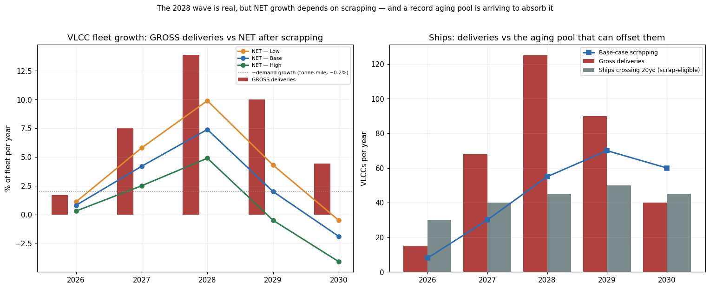

# VLCC 供给深挖：2027/2028 新船浪潮会打破周期吗？
## 把吓人的"总交付"换算成"净船队增长"
### 2026 年 8 月 22 日 —— 周期供给分析（CRule 3）

> **用户的问题：** 2027 年约有 68 艘新 VLCC 交付、2028 年约 125 艘（外加 Suezmax 等）。这些数字会*大幅*影响供需平衡吗？

> **TL;DR —— 总量数字触目惊心；真正重要的是净增长，而且按年份分化。**
> - **浪潮真实，2028 是枢纽。** 68（2027）+ 125（2028）≈ **193 艘总交付 = 两年内约占约 900 艘船队的 21%。** 按*总量*计，仅 2028 就是 **+13%**——2008–10 以来最大的供给冲击。
> - **但总量 ≠ 净量。抵消它的是一个创纪录的老龄池。** 已有约 **130 艘 VLCC 船龄超 20 年（约占船队 20%），到 2029–30 翻倍至约 300 艘。** IMO-2030 / EEXI / CII 让这些船无法承租——一个被迫拆解的蓄水池恰在同一时间到来。**2027–28 的净船队增长为 +7.6%（高拆解）至 +16.4%（低拆解），而非 +21% 的总量头条。**
> - **2027 仍紧，2028 才咬人。** 2027 净增长仅 **+2.5% 至 +5.8%**（交付温和、补库仍在吸纳船只）。**2028 净 +4.9% 至 +9.9%** 才是真正考验——且它落在本仓库此前标记的紧张窗口*之后*（见 [报告 #13](../13_VLCC_Supply_Shortage_EN)，甜蜜点"现在至 2028 年中"）。
> - **需求是摆动项，且在走软。** 吨海里增长 2027–28 约为 0%（BIMCO），故不像 2021–24 有需求顺风来吸纳船只——*除了* **SPR 补库**（多年约 30–70 艘 VLCC）与**影子船队退出**（约 166 艘离开合规贸易），二者共同缓冲 2027，但或无法完全抵消 2028 的交付集群。
> - **结论：是的，影响显著——但作为 2028 的*运价正常化器*，而非 2027 的周期终结者。** 供给浪潮为*上行*封顶，并把周期到期定在**2027 年底/2028**，与本仓库的退出纪律（CRule 8）一致。决定性未知数是**拆解速度**——区分"健康换新"与"过剩"的唯一变量。
> - **仅为教育/分析，并非投资建议。**

---

## ⚠️ 协议与数据提示

应用**两步研究协议**与**周期 CRule 3**（供需时长）。§1 事实底稿/Rule-4 区间 · §2 第一步草稿 · §3 第二步评审 · §4 净增长模型 · §5 需求侧 · §6 结论与触发器。基于仓库 [#13 供给短缺](../13_VLCC_Supply_Shortage_EN) 与 [#37 周期定位 2026 年 6 月](../37_VLCC_Cycle_Position_Jun2026_EN)。模型经 `run_supply_model.py` 可复现。

---

# 第 1 节 —— 事实底稿（2026 年 8 月 22 日核实；Rule-4 区间已标注）

| 指标 | 数字 | 来源/备注（Rule 4）|
|---|---|---|
| VLCC 船队总量 | **~900**（870–917）| Clarksons WFR / Fairway / Affinity，2026 年 1 月 |
| 合规"主流"船队 | **~650–700** | 仓库 #13（剔除影子 ~166–200）|
| **2027 总交付** | **~41–68** | **用户引 68；Gibson 约 41——>20% 差距，已标注。** 模型用 68（保守偏空）|
| **2028 总交付** | **~125–127** | Seatrade/MSI"2028 排定 127 艘"；用户的 125 ✓ |
| 2026 上半年 VLCC *订单* | **~177**（纪录）| MSI；订单簿跃至**约船队 35%**（2023 年为 2%）|
| 船龄 >20 年的 VLCC | **~130（~20%）** → **2029–30 约 300** | Splash247 / Tankers International |
| 近年拆解 | **2024 约 1 艘、2025 约 5 艘** | 近乎为零——高运价推迟了拆解 |
| 吨海里需求增长 | **~+2%（2026）→ ~0%（2027）→ 持平（2028）** | BIMCO |
| SPR 补库需求 | **约 30–70 艘 VLCC，多年** | 仓库 #13（IEA 释放 4 亿桶 + 中/印）|
| 影子船队（退出合规贸易）| **~166–200 艘 VLCC** | 仓库 #13——"单向门" |

**须牢记的 Rule-4 分歧：** 2027 交付从 **41（Gibson）到 68（用户）** 不等——>20% 的差距会显著改变 2027 的紧张度。我按**更高（68）**建模，使结论*相对更偏空的供给情形被压力测试*；若 Gibson 的 41 为真，则 2027 比图示更紧。

---

# 第 2 节 —— 第一步：简明研究草稿

**核心结论：** 2027/2028 订单簿**会显著松动市场——但主要在 2028、且主要作为*上行封顶/运价正常化器*，而非 2027 崩塌**——因为创纪录的总交付被创纪录的老龄/拆解池、以及 SPR 与影子船队动态所抵消。正确的透镜是净船队增长、而非总量。

*支撑（主张 → 需要什么证据）：*
1. **净量 ≪ 总量，因创纪录拆解池同时到来** → 130→300 艘越过 20 岁；IMO-2030 强制退出。*证据：§1 船龄 + §4 模型——已取得。*
2. **2027 仍紧** → 净增长温和（+2.5–5.8%）+ SPR 补库持续。*证据：§4/§5——已取得。*
3. **2028 才是真正松动** → +13% 总量 / +5–10% 净量，面对约 0% 吨海里需求。*证据：§4/§5——已取得。*

*反对（主张 → 需要什么证据）：*
1. **拆解或*不*加速 → 净量趋近总量 → 真过剩** → 高运价下船东推迟拆解（如 2024–25）。*证据：前瞻拆解率——**未知/行为性**。*
2. **Suezmax/LR2 级联增加有效 VLCC 供给** → 大量 Suezmax 订单可在部分航线替代。*证据：Suezmax 订单簿 + 替代弹性——**仅部分取得**。*

---

# 第 3 节 —— 第二步：严格同行评审（不重写草稿）

1. **需核实的事实：** **确切的 2027 交付数**（41 vs 68——随提供方而变，改变 2027 约 4% 的船队）；真实的 **2027–28 拆解**（行为性、尚未观察）；"2030 年 >300 艘 20 岁以上"到底是*拆解*还是仅迁入**影子船队**（那意味着既无合规供给缓解、也无供给移除）；精确的 **Suezmax 订单簿**及其对 VLCC 的替代率。
2. **逻辑跳跃 / 概念偷换：** "老龄池 = 拆解"是**核心偷换**——老船可以*拆解*或*加入影子船队*，只有前者减少总供给。且"交付 = 供给增长"忽略了**船厂延期**（2028 订单常滑到 2029）。以及订单簿占*总*900 船队 vs 占*合规*700 船队给出截然不同的增长率——必须明确分母。
3. **缺失的反例 / 竞争解释：** 一次**需求冲击**（补库提前结束、中国放缓、OPEC+ 减产）会让即便*净*2028 增长也很痛；反之**影子船队再吸收**（制裁解除）是模型未含的供给*冲击*。2008–10 类比（大量交付撞上需求崩塌 → 多年熊市）是警示参照（CRule 6）。
4. **应补充的最重要一手来源：** Clarksons **世界船队登记**逐船交付表；Clarksons/Gibson **船龄结构**与拆解预测；BIMCO/Drewry **吨海里**模型；公司（DHT/FRO/CMES）船队换新披露。
5. **至多算推测、而非事实的句子：** "2028 是枢纽/运价正常化器"；具体净增长百分比（完全取决于假设的拆解率）；"补库缓冲 2027"；以及周期到期时点——均为**情景推断**、非既定事实。

---

# 第 4 节 —— 净增长模型（答案的核心）

*总交付被拆解抵消。三种拆解行为情景；2026 年船队起点 = 900。可在 `run_supply_model.py` 复现。*

**净船队增长（占船队 %/年）：**

| 年份 | 总交付 | 总量 % | 净 % — 低拆解 | 净 % — 基准 | 净 % — 高拆解 |
|---|---|---|---|---|---|
| 2026 | 15 | +1.7% | +1.1% | +0.8% | +0.3% |
| **2027** | **68** | **+7.5%** | **+5.8%** | **+4.2%** | **+2.5%** |
| **2028** | **125** | **+13.0%** | **+9.9%** | **+7.4%** | **+4.9%** |
| 2029 | 90 | +8.5% | +4.3% | +2.0% | −0.5% |
| 2030 | 40 | +3.6% | −0.5% | −1.9% | −4.1% |

**2027+2028 累计净增：**

| 情景 | 总量 | 拆解 | **净增** | **占船队 %（2 年）** |
|---|---|---|---|---|
| 低拆解（高运价、推迟）| 193 | 45 | **+148** | **+16.4%** |
| 基准（IMO-2030 渐进退出）| 193 | 85 | **+108** | **+12.0%** |
| 高拆解（监管悬崖）| 193 | 125 | **+68** | **+7.6%** |



**解读：** **总量**柱（红）令人生畏——2028 +13%。但**净量**线到 2029–30 塌向（基准）或跌破（高拆解）**约 0–2% 需求增长**的虚线，因为右图的**灰色老龄池**（越过 20 岁的船）足够大，*若拆解*即可吸收大部分浪潮。**整个问题归结为一个变量：拆解会加速吗？** 高拆解情景下 2029–30 反而*缩减*船队；低拆解情景下市场将过剩数年。

---

# 第 5 节 —— 需求侧（为何 2027 ≠ 2028）

供给从不单独起作用。两个需求缓冲解释了为何**2027 仍紧、2028 松动**：

1. **SPR 补库（近端减震器）。** 据 [仓库 #13](../13_VLCC_Supply_Shortage_EN)，IEA 4 亿桶释放 + 中/印重建，**持续 3–5 年吸纳约 30–70 艘 VLCC**。这相当于把有效船队的 **4–10%** 从贸易池移除——足以吸收 2027 的*温和*净增。到 2028，若补库成熟，这一缓冲恰在交付见顶时变薄。
2. **影子船队退出（结构性收紧）。** 约 166–200 艘影子 VLCC 正永久离开合规贸易。故新船**部分*替代*消失的运力**、而非纯增量——*合规*船队增长远小于*总*船队。**警告（§3）：** 若老船*加入*影子船队而非拆解，则合规市场收紧、但全球总供给不降。
3. **吨海里持平（逆风）。** 不同于 2021–24，BIMCO 预计 **2027–28 吨海里增长约 0%**——故无内生需求增长来吸纳船只。这正是 2028 集群要紧之处：它撞上一个**无需求顺风**的市场，完全依赖拆解 + 补库来维持平衡。

**净供需解读：** 2027 ≈ 平衡偏紧（温和净供给 + 补库）；**2028 = 首次真正松动**（交付见顶、补库变薄、需求持平），除非高拆解情景兑现。

---

# 第 6 节 —— 结论、周期时点与触发器

**直接回答——68（2027）+ 125（2028）会*大幅*影响平衡吗？**

- **2027：不会大幅。** 净 +2.5–5.8%，大体被 SPR 补库 + 影子退出吸收。紧张窗口保持。
- **2028：会，且显著——这是枢纽。** +13% 总量 / +5–10% 净量，面对约 0% 需求增长，是首次真正松动；它**为上行封顶并开始正常化运价**，与本仓库"甜蜜点现在至 2028 年中"及运价路径（2027 $10–15 万 → 2028 下半年起 $7–10 万，[#13](../13_VLCC_Supply_Shortage_EN)）一致。
- **它是运价正常化器、未必是周期终结者**——因为创纪录的老龄池 + IMO-2030 *若拆解加速*可抵消大部分浪潮。即便基准情景也让运价保持历史强位；只有低拆解情景才有真过剩风险。

**周期定位小结（CRule 1/3 格式）：**
```
当前位置：   中后段周期；供给反应如今在订单簿中可见（占船队 35%）。
证据：       总交付 2027=68、2028=125（约船队 21%）；订单簿自 2023 年 2%->35%。
历史类比：   2008-10（大量交付撞上走软需求）——但被影子船队退出 + 创纪录拆解池
             所缓和，而这些在 2008 年并不存在。
预测路径：   2027 紧 -> 2028 首次松动 -> 2029-30 平衡取决于拆解。
运价见顶时点：2027 年底/2028 是供给驱动的强势窗口到期。
关键风险：   拆解*不*加速（低拆解）-> 净量趋近总量 -> 过剩。
```

**须盯的触发器（CRule 8 退出纪律）：**
1. **拆解运行率**——主变量。2027 全年月度拆船销售 < 约 3–4 艘/月 = 低拆解过剩风险在累积。
2. **2028 交付滑期**——船厂延期把船推到 2029 会*延长*窗口（利多）；准时交付偏空。
3. **影子船队再吸收**——任何制裁解冻使运力回归 = 第二次供给冲击（[季节性报告 §8](../vlcc_seasonality/report_cn) 的"黑油转白"风险）。
4. **SPR 补库完成**——当 IEA/中/印停止采购，近端缓冲消失。
5. **新订单**——订单簿已约 35%；进一步大量订购把过剩风险推向 2029–30（CRule 5 卖出信号："订单簿填满"）。

> **给用户的结论：** 原始数字（68 + 125）*看着*像周期终结者，但按**净量**它们是**2028 的运价正常化器、而非 2027 崩塌**——正是那令你担忧的创纪录订购，与一支**创纪录的老龄船队**和一次**永久的影子船队退出**同时到来，吸收了其中大部分。市场保持紧张至**约 2028 年中**、随后松动；松动*多少*几乎完全取决于**拆解速度**。实操上：这**确认了周期的到期窗口（2027 年底/2028）**，并支持本仓库的退出纪律——**吃下紧张的 2026–2028 上半年，然后在 2028 交付集群到来时减仓**，而非死守迎接 2008 式的运力过剩。

---

## 自行复现

```
cd vlcc_supply
python run_supply_model.py     # 写入 data/balance.csv + charts/net_growth.png
```

**假设在 `run_supply_model.py` 顶部明确且可编辑**（总交付、拆解情景、老龄池）。**数据文件：** `vlcc_supply/data/balance.csv`。**图表：** `vlcc_supply/charts/net_growth.png`。

**来源（访问于 2026 年 8 月 22 日）：** Clarksons 世界船队登记/新造价格指数；MSI 与 Shipping Telegraph（2026 上半年订单、2028 交付）；Gibson（2027 交付）；Splash247 / Tankers International（船龄结构）；Seatrade-Maritime（2028 挤压）；BIMCO（吨海里）；本仓库 [#13](../13_VLCC_Supply_Shortage_EN)（合规船队、影子船队、SPR 补库）。**2027 交付数（41 vs 68）与前瞻拆解是关键的 Rule-4 不确定性。**

---

*两步研究协议已应用（§2 草稿 + §3 评审）。模型假设为情景、非预测；净增长数字完全取决于拆解率输入。仅为教育/分析，并非投资建议。*
