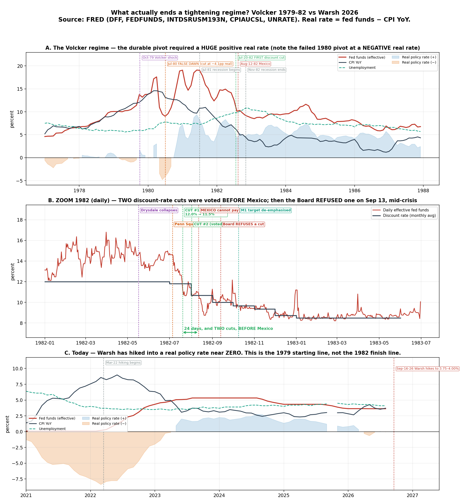
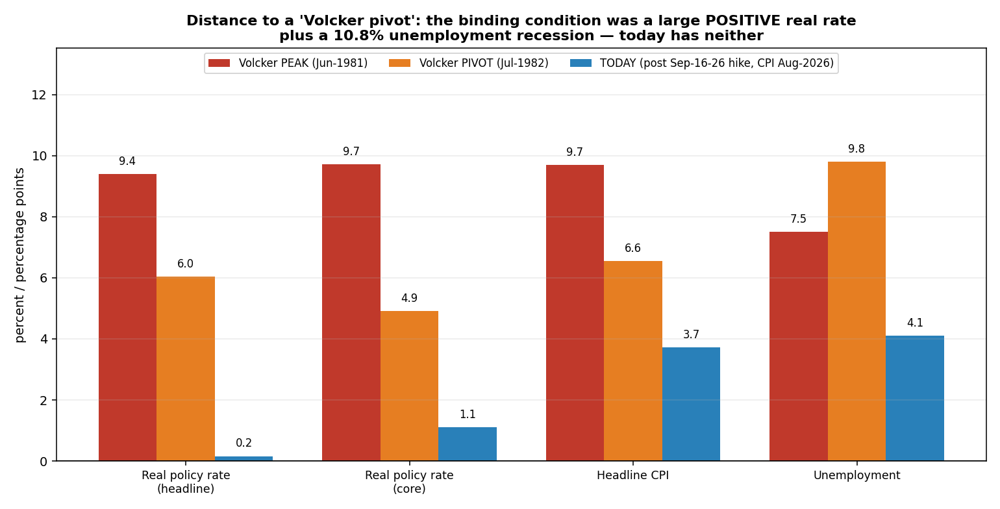

# 是拉美债务危机终结了沃尔克的高利率政策吗？
## 以此类推 —— 什么才会真正让沃什放缓？
### 2026年9月17日 —— 宏观 / 政策体制分析

> **用户的提问：** *"如果把俄乌战争比作第一次石油危机，美伊战争比作第二次石油危机，最新的沃什加息比作1979年的沃尔克时刻；那么终结沃尔克高利率政策的是拉美债务危机吗？如此类比，什么情况下沃什的加息才会放缓？"*

> **TL;DR —— 这个前提有一处关键错误，而这处错误会改变答案。**
> - **不是。拉美债务危机并没有终结沃尔克的紧缩。** 美联储**在墨西哥之前就已经降息两次**：理事会于 **1982年7月19日**通过第 1 次降息（7月20日生效），**7月30日**通过第 2 次 —— 分别比财长席尔瓦·埃尔索格 **1982年8月12日**的那通电话早 **24 天和 13 天**。有效联邦基金利率在**墨西哥开口之前的 7 月就已下行 −1.56pp（14.15% → 12.59%）**。
> - **三个事实直接击穿该论点。**（1）1982 年七次降息中有两次早于墨西哥。（2）**1982年9月13日 —— 危机最烈之时 —— 理事会否决了进一步降息。**（3）随后美联储在**债务危机不断恶化的过程中反而重新加息 +3.13pp**（1983年2月 8.51% → **1984年8月 11.64%**）—— 大陆伊利诺伊银行 1984 年 5 月倒闭。到**布雷迪计划（1989年3月）**债务真正减记时，联邦基金利率是 **9.85% —— 高于 1983 年的低点**。利率见底比危机解决**早了约 6 年半**。
> - **真正终结它的：通胀已经被压下来，且代价已经付过了。** CPI 从 **14.8%（1980年3月）→ 转向时的 6.6% → 1982年12月的 3.8%**，代价是战后最深的衰退（**失业率 10.8%**）。美联储官方史料写得很直白：*"到1982年10月，通胀已降至5%……美联储允许联邦基金利率回落至9%。"* **Goodfriend & King 关于这次去通胀的权威论文，全文一次都没提到墨西哥。**
> - **墨西哥究竟起了什么作用：** 它是**加速器与锁定器**，不是触发器 —— 而且美联储用**流动性工具而非降息**来应对它（**18.5 亿美元 BIS 框架**内美联储 3.25 亿美元互换，外加监管宽容）。**私下里 FOMC 承认了脆弱性动机** —— 副主席 Solomon，1982年8月24日：*"我们因为担心脆弱性而把货币政策放到了次要位置。虽然我们确实在这么做，但从某种意义上说又不是。"*
> - **当代对照实验证实了这一点：2023年3月10日 SVB 倒闭 —— 美联储3月22日照样加息 25bp，同时推出 BTFP。** 有效联邦基金利率**在银行危机中一路从 4.57% 升到 5.12%（+0.55pp）**。金融事故换来的是流动性工具，不是转向。
> - **所以对沃什而言，债务危机这条线索是"找错了绊线"。** 真正的前置条件是可测量的，而且**几乎一条都没满足**。沃尔克转向时**实际政策利率是 +6.0pp**；9月16日加息之后沃什的是 **+0.2pp（头条）/ +1.1pp（核心）**。当年失业率 **9.8%**，今天 **4.1%**。**沃什站在 1979 年的起跑线上，不是 1982 年的终点线上 —— 目前根本没有"限制性立场"可供解除。**
> - **最可能让沃什放缓的，不是债务危机，而是霍尔木兹重开。** 今天的通胀冲动**就是这场战争**：布伦特 **~$104–108**，霍尔木兹通过量**约 200 万桶/日，正常为 1800–2000 万桶/日**，头条 CPI **3.7%** 对核心 **2.8%**。**头条与核心之间的全部缺口就是这次石油冲击。** 移除它，继续加息的理由基本自行瓦解 —— *而且不需要任何衰退或违约。*
> - **⚠️ 跨报告联动（对仓位极重要）：** 同一个事件正是 **VLCC 超级飙升**。[TD3C 约 103.5 万美元/天](../vlcc_cycles/report_cn) 与布伦特 $107 是**同一个事件、两笔交易**。一次让沃什停手的霍尔木兹正常化，**同时会击垮油轮运价**。不要把"美联储转向"和"油轮飙升"当成两个独立的赌注 —— **它们是同一个赌注的正反两面。**
> - **1980 年的"假黎明"才是沃什会很慢的原因。** 沃尔克曾在**实际利率 −4.12pp** 时**三个月内降息 −8.58pp**（1980年4月 17.61% → 7月 9.03%），随后被迫**重新加息 +9.87pp**。一位明确因通胀信誉而被任命的主席，最怕的就是这个先例。
> - **仅供教育/分析，非投资建议。**

---

## ⚠️ 协议与数据卫生提示

适用本仓库的**两步研究协议**：§2 是第一步草稿（核心结论 + 3 个支持 / 2 个反对，均写成"主张 → 需要什么证据"）；§3 是第二步严格同行评审，**不重写草稿**，并且**攻击 §2、包括攻击我自己的结论**。§4 之后是证据。

**Rule 4 标记 —— 引用任何数字前请先看这里：**

| # | 标记 |
|---|---|
| **F1** | **CPI 冲突。** FRED 给出 2026年8月头条 CPI 同比 **3.71%（季调）/ 3.69%（未季调）**，核心 **2.76% / 2.75%**。某二手财经聚合站引述 **3.35% / 2.45%**。**本文采用 FRED。** 这 ~0.35pp 的差异**不改变任何结论** —— 实际政策利率按 FRED 是 +0.2pp，按媒体数字是 +0.5pp，而 1982 年所需为 **+6.0pp**。 |
| **F2** | **政策利率口径。** FRED 的月度有效联邦基金利率（2026年8月 3.63%）**早于** 9月16日的加息。"今天"一律采用**目标区间中值 3.875%**，并在使用处标明。 |
| **F3** | **信用利差历史被截断。** 本环境的 FRED 镜像对 `BAMLH0A0HYM2` 与 `BAMLEMCBPIOAS` 只返回 **2023年9月**起的数据。百分位是**该 ~3 年窗口内**的，不是完整历史。**水平值可靠，百分位不可与 1998/2008 比较。** |
| **F4** | **二手来源的日期。** Drysdale（1982年5月17日）、宾州广场（7月5日）、Lombard-Wall（8月12日）、道指低点（776.92，8月12日）、贝克计划（1985年10月8日）、布雷迪计划（1989年3月10日）依赖**二手来源**；*月份*与后果经 FDIC/美联储证实，*具体日*未证实。**所有贴现率表决日期均为一手**（美联储理事会 1982 年年报）。 |
| **F5** | **未证实：回忆录。** 未取得沃尔克《Keeping At It》、Silber 传记或 Meltzer 第二卷的任何原文。**本文不引用其中任何内容。** 某 Silber 网络摘要含事实错误（把墨西哥通知时间写成 1982年7月），已整体弃用。 |
| **F6** | **2026 年的宏观/地缘事实均为网络来源的时点数据**（沃什加息、布伦特、霍尔木兹通过量、EM 再融资悬崖），已如此标注。**1979–89 年的记录与全部 FRED 序列均可由 `run_volcker_warsh.py` 复现。** |
| **F7** | **§10 的情景概率是我的主观判断，不是数据。** 结构（触发条件 → 阈值 → 今日读数）才是持久的贡献；权重是观点，请替换成你自己的。 |

---

## §1 —— 方法

这是一个**周期性体制**问题，因此适用本仓库的 **CRule 1 两周期回溯**，把紧缩*体制*当作周期：

- **参照周期：** 沃尔克，1979年10月 → 1982 年转向 → 1983-84 年重新加息。
- **对照周期：** 鲍威尔，2022年3月 → 2023 年 SVB 冲击（"金融事故会终结加息周期吗"的一次干净自然实验）。
- **当前周期：** 沃什，2026年9月 → ？

方法上刻意与提问方向**相反**。我不是先问*"是不是债务危机？"*再去找支持性证据，而是：

1. **先确立带日期的事件序列**（§4）—— 因为原因不可能晚于结果；
2. **主动寻找反证**（§5）—— 危机**最严重**时美联储做了什么？
3. **然后才**归因，并区分**有据可查的事实 / 主流历史解释 / 推测**；
4. **把真正的原因转化为可测量的绊线**（§8），再用同一套仪表读今天的数值。

---

## §2 —— 第一步：简明研究草稿

### 核心结论

**拉美债务危机没有终结沃尔克的高利率政策；是去通胀终结的。债务危机只是加速了一场已在进行中的宽松，并随后限制了美联储掉头。以此类推，沃什不会因为新兴市场或信用爆雷本身而放缓 —— 他会在通胀冲动本身消退时放缓，而今天这主要意味着霍尔木兹石油冲击过去，或者劳动力市场破裂。沃什站在 1979 年的起跑线上，不是 1982 年的终点线上：他的实际政策利率约为 0%，因此目前没有任何东西可供"解除"。**

### 支持点 1

**主张 → 美联储的宽松在时间上早于墨西哥违约，因此违约不可能是其原因。**
*需要的证据：* 来自一手美联储文件的 1982 年每一次贴现率变动的理事会表决日期；以及 1982 年逐月的有效联邦基金利率。**已获得 —— 见 §4。** 第 1 次降息表决于 **7月19日**，第 2 次 **7月30日**，墨西哥 **8月12日**。EFFR 在**墨西哥之前的 7 月已下行 −1.56pp**。

### 支持点 2

**主张 → 在该论点预测"宽松最大化"的时刻，美联储的行为恰恰相反。**
*需要的证据：* 危机高峰期，以及危机蔓延的 1983–84 年，美联储的实际动作。**已获得 —— 见 §5。** 理事会在 **1982年9月13日否决**了降息，并在巴西被救助、大陆伊利诺伊倒闭的 1984 年**重新加息 +3.13pp**。

### 支持点 3

**主张 → 美联储自己陈述的理由与学术共识，都把转向归因于"去通胀已兑现 + 衰退"，而非外债。**
*需要的证据：* 每一次贴现率表决所附的理由；美联储官方史；权威学术论述。**已获得 —— 见 §4.3 与 §6。** 1982 年每一次表决援引的都是*市场利率*与*货币信贷增长受限*。Goodfriend & King（NBER WP 11562）把 1982 年 10 月的转变归因于通胀降至约 5%，且**全文一次都未提墨西哥**。

### 反对点 1（针对我自己的结论）

**主张 → FOMC 私下确实是出于金融脆弱性而宽松，因此"去通胀"与"危机"的区分有人为成分。**
*需要的证据：* 转向前后的 FOMC 会议纪要全文。**已获得，而且确实损害了我论点的"干净版本" —— 见 §7。** Solomon（1982年8月24日）：*"我们因为担心脆弱性而把货币政策放到了次要位置。"* 沃尔克（9月24日）：*"金融体系的脆弱在国际和国内都仍然非常明显。"* 沃尔克还亲自指示在 10 月的政策指令中提及*"特别是对外放贷的问题……只是为了表明我们身处真实世界的某个地方"*。

### 反对点 2（针对我自己的结论）

**主张 → 墨西哥在 8月12日之前就已是 FOMC 的现实议题，因此"早于违约"可能是在量错了日期。**
*需要的证据：* 8 月之前 FOMC 对墨西哥的讨论。**已获得，这是一处真实的弱点 —— 见 §7。** 在 **1982年6月30日–7月1日**的 FOMC 上，沃尔克就墨西哥向委员会做了通报（*"这全都反映出国际金融市场现在对墨西哥关得相当紧"*），且美联储与墨西哥央行已有 **7 亿美元互换**在途。*压力*在*公告*前约六周就可见。我的时序论证否定的是"**8月12日的违约**导致了转向"；它**并不能**完全否定"**国际脆弱性**对此有贡献"。

### 明确标注为**未知**

- 沃什是否有一条私下的金融稳定阈值 —— **未知**；无纪要可查（2026 年纪要要 5 年后才公布）。
- 霍尔木兹中断是否持续 —— **未知且不可预测**；机构对布伦特年底的预测区间为 **$85（高盛）至 $140+（Rystad）**，这本身就是"没人知道"的自认。
- 是否存在现代版"M1 失真"为沃什提供技术掩护 —— **未知；未发现。**

---

## §3 —— 第二步：严格同行评审（针对 §2，不重写）

### 1. 需要核实的事实

- **"第 1 次降息表决于 1982年7月19日"** —— 已对照**美联储理事会第 69 期年报（1982），"理事会政策行动 —— 贴现率"**核实：理事会 1982 年共批准**七次**下调，每次半个百分点，从 7 月中的 12% 降至年底的 8.5%。属一手来源。✔
- **"墨西哥，1982年8月12日"** —— 已核实：FDIC《八十年代史》第一卷第 5 章第 191 页 —— 墨西哥财长通知美联储主席、财政部长与 IMF 总裁，墨西哥无法履行 **8月16日**对约 **800 亿美元**债务的义务。美联储史料一致。✔
- **银行敞口数字互不等价，草稿不得混用。** 存在四个不同的权威口径：占资本 **176%**（九家货币中心银行，**拉美**，Sachs 1988，经美联储史料转引）；**约 290%**（同批银行，**全部 LDC**）；占资本与准备金 **147%**（八大行，**仅墨西哥+巴西+委内瑞拉+阿根廷**，约 370 亿美元，FDIC/FFIEC 1982年12月）；**217%**（LDC 贷款 / 资本+准备金，货币中心银行均值，1982 年末，FDIC 表 5.1a）。**任何引用都必须写明分子。**
- **仍未证实（F4/F5）：** Drysdale、宾州广场、Lombard-Wall、道指低点、贝克与布雷迪计划的**具体日期**。以及**未取得任何回忆录原文** —— 草稿正确地没有引用。
- **2026 年的 CPI 数字存在争议（F1）**，草稿不得把 3.7% 当作无争议数据呈现。

### 2. 逻辑跳跃 / 偷换概念

- **草稿最大的弱点是把"拉美债务危机"偷换成了"8月12日的违约"。** 这是两个不同的对象。*违约*是一个有日期的事件；*危机*是一个过程，FOMC 到 **1982年6月30日**已清楚可见，甚至可追溯到 1981 年。时序否定了前者，没有否定后者。**§2 的反对点 2 已经承认这一点，这是对的，但核心结论的措辞仍强于证据所能支撑的程度。** 站得住的表述是：*拉美债务危机对 1982 年的转向既非必要也非充分*（由 §5 支撑），而不是*"它没有起任何因果作用"*。
- **"是去通胀做到的"本身也是一次偷换。** 去通胀不是一个动作；FOMC*相信*去通胀是持久的，才是动作。真正起作用的变量是**信誉**，而信誉不可观测。草稿不应在不指出"这只能通过预期起作用"的情况下，把"通胀降到 5%"当作机制呈现。
- **沃尔克↔沃什的映射在"沃尔克时刻"一词上偷换了概念。** 沃尔克 1979 年 10 月的动作是一次**体制变更** —— 放弃联邦基金利率目标、改为非借入准备金目标，主动放弃对利率的控制。**沃什是加息 25bp 并保留现有框架。** 称之为"沃尔克时刻"，引入了该政策并不具备的联想。草稿直接沿用了用户的框架而未审计它。**§4.1 必须补上审计。**
- **石油危机的映射也很松散。** 1973 年是*禁运*（政治性地扣留供给）；1979 年是*革命*（产能丧失）；2026 年是*咽喉封锁*（过境被拒，产能完好）。**第三种是三者中最可逆的** —— 这恰恰不利于"这就是 1970 年代重演"的读法。

### 3. 缺失的反例 / 竞争性解释

- **权重被低估的最强竞争解释：国内金融事故。** Drysdale（5月）与**宾州广场（7月5日）**比墨西哥更紧密地先于 7 月的转向。在 **7月15日的电话会议**上沃尔克说交易台一直*"比原本更警觉……以便稍微走在市场前面"*，并提到*"市场有一股不安的暗流"*。如果草稿说脆弱性重要，**那么 7 月起作用的脆弱性是美国的，不是墨西哥的。** 这对"墨西哥做的"论点是*更*大的打击，而不是更小 —— 但草稿用得不够。
- **草稿本应提供却缺失的反例：1980 年。** 沃尔克确实曾因非通胀原因转向过一次（信贷管制引发的衰退），而且失败了。这是关于"一位美联储主席在压力下会怎么做"的最佳可得证据 —— 而它指向沃什会**偏晚**宽松。**已补为 §6。**
- **缺失的当代对照：2023年3月。** 草稿仅凭 1982 年一例（n=1）就断言"金融事故 ≠ 转向"。**SVB 提供了第二个观测，且结论一致。** **已补为 §5.3。**
- **未处理的竞争性解释：政治压力。** 2026 年存在公开的总统降息施压。1982 年政治屈服的证据很弱，但草稿对现代版本否定得过快。应把它列为一条**低置信度**的活跃渠道 —— 因为美联储独立性正是当下被检验的东西。
- **缺失：财政/债务付息渠道。** 1982 年美国联邦债务约占 GDP 的 30%，今天远高于此，因此*政府自身*的利息负担构成了 1982 年不存在的政策压力。**本文未量化 —— 作为缺口标记。**

### 4. 最应补充的一手来源

1. **美联储理事会第 69 期年报（1982），"理事会政策行动 —— 贴现率"** —— 1982 年每一次表决日期（含 **9月13日的否决**）的唯一权威来源。*（已补 —— §4.3。）*
2. **FOMC 纪要：1982年6/30–7/1、7/15（电话）、8/24、9/24（电话）、10/5、12/20–21** —— 与公开记录相矛盾的私下记录。*（已补 —— §7。）*
3. **《联邦储备公报》1982年11月，第 691–92 页 —— 沃尔克《关于货币政策的讲话》，1982年10月9日，Business Council，弗吉尼亚 Hot Springs** —— M1 淡化的逐字理由。*（已补 —— §4.4。）*
4. **《联邦储备公报》1982年12月，第 761–66 页 —— 1982年10月5日政策行动记录**，其中含唯一一处公开提及*"墨西哥的融资困难"*。*（已补 —— §7。）*
5. **FDIC《八十年代史》第一卷第 5、7 章** —— LDC 敞口比率与大陆伊利诺伊。*（已补 —— §4.5、§5。）*
6. **Goodfriend & King, "The Incredible Volcker Disinflation," NBER WP 11562 (2005)** —— 学术基准，其显著之处在于**零次提及墨西哥**。*（已补 —— §6。）*

### 5. 哪些句子至多只能算推测，而非事实

| §2 中的陈述 | 正确定性 |
|---|---|
| "第1次降息7月19日表决；墨西哥8月12日；EFFR 7月 −1.56pp" | **有据可查的事实**（理事会年报；FRED） |
| "理事会1982年9月13日否决了降息" | **有据可查的事实**（理事会年报） |
| "美联储在1983-84年重新加息 +3.13pp" | **有据可查的事实**（FRED） |
| "是去通胀而非债务危机终结了紧缩" | **主流历史解释**，支撑很强 —— 但仍是解释 |
| "债务危机是加速器与锁定器" | **解释**，有纪要支撑 |
| "让沃什放缓的将是石油冲击消退而非债务危机" | **推测。** 一个结构化、有证据锚定的推断 —— 但它是对一位没有公开反应函数的具体个人的预测。**不能称为事实。** |
| "沃什站在1979年的起跑线上" | **测量 + 解释。** 实际利率的测量是事实；"起跑线"的框架是解释，且它假定他的目标是沃尔克式的实际利率 —— 这**并未被确立**。 |
| §10 的全部概率 | **主观判断（F7）。** 不是数据。 |

> **评审人的结论：** 反对"拉美债务危机终结了紧缩"的**时序证据与行为证据都很强，且经得起推敲** —— §5 尤其接近决定性。**弱点在于向前的推断**，那是披着历史外衣的推测，必须全程如此标注。**草稿的核心结论应当收窄** —— 从"债务危机没起因果作用"收窄为"**债务危机既非必要也非充分**"，并且**"沃尔克时刻"的映射必须先审计再使用**（§4.1）。

---

## §4 —— 类比审计与带日期的事件序列

### §4.1 用户的映射成立吗？三部分审计

| 类比要素 | 结论 | 证据 |
|---|---|---|
| **俄乌 ≈ 第一次石油危机（1973）** | **部分成立。** 两者都是政治驱动的供给中断并导致重新路由。但 1973 年是针对特定国家的*蓄意禁运*；2022 年是*制裁驱动的重新路由*，桶数基本仍在流动，只是换了买家。**2022 年的全球供给损失小得多。** | 原油继续流向印度/中国；油轮市场是吨海里拉长，而非货量丧失 |
| **美伊 ≈ 第二次石油危机（1979）** | **三者中最贴近，且正在变得更贴近。** 1979 年是伊朗产能丧失；2026 年是**咽喉封锁**。IEA 称之为*"石油市场史上最大的供给冲击"*，自 3 月以来损失约 **350 万桶/日**，**霍尔木兹通过量约 200 万桶/日，正常 1800–2000 万**。 | 布伦特 **~$104–108**（2026年9月14-16日） |
| **沃什 ≈ 沃尔克时刻（1979年10月）** | **修辞上是；实质上尚未。** 沃尔克改变的是**操作体制**（非借入准备金目标，放弃利率控制），这让联邦基金利率一路冲到 **22.36%**。沃什是在现有框架内**加息一次 25bp 至 3.75–4.00%** —— **实际利率 +0.2pp**。 | §8 |

**这次审计最重要的发现：** 前两个映射讲的是**供给冲击**，大体成立。第三个讲的是**政策体制**，而它 —— 目前 —— 不成立。**这种不对称本身就是答案。** 类比中石油冲击的那一半是真实的，所以通胀是个现实问题；沃尔克的那一半是愿景性的，所以**"什么会终结它"这个问题在结构上就问早了。你无法询问一个尚未开始的沃尔克体制何时结束。**

**关于通胀本身的一处关键"反类比"。** 沃尔克继承的是**十年未锚定的预期** —— 在第二次石油冲击落地*之前*，1979 年 6 月 CPI 就已达 **11%**。沃什继承的是**核心 CPI 2.76%**。在预期已锚定时，同样的油价带来的二轮通胀要小得多。**具体地说：今天头条与核心的全部缺口（3.71% − 2.76% = 0.95pp）就是能源冲击。** 这就是沃什需要的是 4%、而不是 19% 的原因。
### §4.2 带日期的事件序列 —— 直接答案

以下每个日期都有来源。**加粗 = 美联储一手文件。**

| 日期 | 事件 | 联邦基金利率 | 来源 |
|---|---|---|---|
| 1979年10月6日 | 沃尔克"周六夜特别行动" —— 转向非借入准备金目标 | 13.8% | 美联储史料 |
| 1980年3月 | **CPI 见顶：14.59%（季调）/ 14.76%（未季调）** | 17.19% | FRED |
| 1980年4→7月 | **假黎明 —— EFFR 从 17.61% 崩至 9.03%（−8.58pp），当时实际利率 −4.12pp** | — | FRED |
| 1980年12月 | 被迫重新紧缩：**18.90%**（较 7 月低点 +9.87pp） | 18.90% | FRED |
| **1981年6月** | **月度 EFFR 峰值 19.10%**；日频峰值 **22.36%（1981年7月22日）** | 19.10% | FRED |
| 1981年7月 | NBER 衰退开始 | 19.04% | NBER |
| **1982年6月21日** | **理事会否决降息** —— "在近期市场利率上升之后，下调贴现率并不合适" | 14.15% | **1982年年报** |
| **1982年6月30日–7月1日** | **FOMC：沃尔克通报墨西哥** —— *"这全都反映出国际金融市场现在对墨西哥关得相当紧"* | — | **FOMC 纪要** |
| 1982年7月5日 | **宾州广场银行倒闭** —— 当时 FDIC 史上最大赔付；大陆伊利诺伊持有约 10 亿美元参贷 | — | FDIC 第7章 |
| **1982年7月15日** | FOMC 电话会 —— 沃尔克：*"我们比原本更警觉地这么做 —— 以便稍微走在市场前面"* | — | **FOMC 纪要** |
| **🟢 1982年7月19日** | **第1次降息表决：12% → 11.5%，7月20日生效** | 12.59%（7月均） | **1982年年报** |
| **🟢 1982年7月30日** | **第2次降息表决：11.5% → 11%，8月2日生效** | — | **1982年年报** |
| **🔴 1982年8月12日** | **墨西哥 —— 席尔瓦·埃尔索格通知美联储主席、财长与 IMF 总裁：墨西哥无法履行8月16日对约800亿美元债务的义务** | 10.12%（8月均） | FDIC 第5章 p.191 |
| 1982年8月12日 | Lombard-Wall 申请第11章破产；**道指收盘低点 776.92**（均为二手 —— F4） | — | 二手 |
| **1982年8月13日** | 第3次降息表决：11% → 10.5%（墨西哥后一天） | — | **1982年年报** |
| **1982年8月26日** | 第4次降息表决：10.5% → 10% | — | **1982年年报** |
| 1982年8月30日 | **美联储/财政部宣布为墨西哥央行提供 18.5 亿美元 BIS 框架融资（美联储 3.25 亿互换；财政部 6 亿）** —— *对墨西哥的回应是流动性，不是降息* | — | **公报 1982年9月** |
| **🔴 1982年9月13日** | **理事会否决进一步降息 —— 就在危机最烈之时** | 10.31% | **1982年年报** |
| **1982年10月5日** | FOMC 表决**不设定 M1 目标** | 9.71% | **公报 1982年12月** |
| **1982年10月9日** | 沃尔克公开宣布淡化 M1（Business Council，Hot Springs） | — | **公报 1982年11月** |
| 1982年10月8日/11月19日/12月13日 | 第5、6、7次降息 → **8.5%** | 8.95%（12月） | **1982年年报** |
| 1982年11月 | **失业率见顶 10.8%**；NBER 衰退结束 | 9.20% | FRED / NBER |
| **1983年2月** | **EFFR 周期低点：8.51%** | 8.51% | FRED |

**一句话的答案：1982 年七次降息中有两次在墨西哥之前表决** —— 早 24 天和 13 天 —— 且有效联邦基金利率在 **7 月已下行 −1.56pp**，而其余五个月合计 **−3.64pp**。**宽松先开始；墨西哥随后让它的速度大约翻了一倍。**

### §4.3 美联储自己说的理由 —— 七次表决全部

出自**美联储理事会第 69 期年报（1982）**。请注意其中*缺少*什么。

| # | 表决 | 生效 | 变动 | **陈述理由** |
|---|---|---|---|---|
| 1 | 7月19日 | 7月20日 | 12 → 11.5 | *"在短期市场利率近期回落、以及近几个月货币与信贷增长相对受限的背景下"* |
| 2 | 7月30日 | 8月2日 | 11.5 → 11 | *"鉴于市场利率以及相对受限的货币与信贷增长"* |
| 3 | 8月13日 | 8月16日 | 11 → 10.5 | *"货币温和增长、银行信贷需求减少的若干迹象，以及市场利率的回落"* |
| 4 | 8月26日 | 8月27日 | 10.5 → 10 | *"使贴现率与短期市场利率更好地对齐"* |
| — | **9月13日** | — | **否决** | *"鉴于金融市场的现行状况以及货币总量的近期表现"* |
| 5 | 10月8日 | 10月12日 | 10 → 9.5 | *"旨在与短期市场利率保持适当对齐"* |
| 6 | 11月19日 | 11月22日 | 9.5 → 9 | *"在价格稳定方面的持续进展，以及经济活动持续疲弱的迹象"* |
| 7 | 12月13日 | 12月14日 | 9 → 8.5 | *（进一步下调；公报 1983年1月）* |

**七次之中没有一次提及拉美、墨西哥或对外放贷。** 反复出现的理由是**市场利率**与**受限的货币与信贷增长** —— 也就是*去通胀在见效，贴现率脱节了*。第 6 次最明确：**"在价格稳定方面的持续进展"**。

### §4.4 技术掩护 —— 沃尔克 1982年10月9日的原话

> *"未来几个月我们面对的不只是可能性，而是几乎必然的失真……就在此刻以及未来几周，约有 **310 亿美元的'全民储蓄存单'到期**……**我们知道 M1 会受影响，但我们根本无法衡量这种转移的程度。**……在此情形下，我认为在货币政策的实际执行中，我们别无选择，只能在近期对 M1 的变动赋予远低于通常的权重。"*
> —— **《联邦储备公报》1982年11月，第 691–92 页**

以及同一场讲话中对"政策已改变"的明确否认：

> *"这次贴现率的小幅下调 —— 就像**7月和8月那四次同等幅度的变动**一样 —— **并不代表政策基本取向的任何改变**……在衰退中的经济里利率走低并不罕见，且与复苏的需要是一致的。"*

**请仔细读这句：沃尔克本人把墨西哥之后的降息与之前的降息归为同一项、未曾改变的政策。** 这是针对"墨西哥改变了政策"论点所能得到的、最有力的同期陈述 —— 出自最该知道的人。

### §4.5 敞口到底有多大？（写明分子 —— 评审 §1）

| 数字 | 定义 | 来源 |
|---|---|---|
| **占资本 176%** | **九家**最大货币中心银行的**拉美**债务，1982 | Sachs (1988)，经美联储史料转引 |
| **约 290%** | 同批银行，**全部 LDC** 债务 | Sachs (1988) |
| 占资本+准备金 **147%** | **八大行**，**仅墨西哥+巴西+委内瑞拉+阿根廷**（约 370 亿美元） | **FDIC 第5章 p.191**（FFIEC，1982年12月） |
| 占资本+准备金 **217%** | **全部 LDC** 贷款，货币中心银行均值，1982 年末 | **FDIC 第5章 表5.1a** |

拉美未偿债务：**290 亿（1970）→ 1590 亿（1978）→ 3270 亿美元（1982）**。仅墨西哥即约 **800 亿美元**。

**这对类比很关键。** 1982 年的银行体系按最宽口径计，对即将被重组的债务的敞口达到**其资本的约 2.9 倍**。**这比今天任何可见的情形都高出一个数量级**（§9）。那场危机是真正存亡性的 —— **而美联储在 9 月 13 日仍然拒绝降息。** 这说明通胀使命的压倒性程度。
---

## §5 —— 决定性反证：美联储在危机中反向加息

这一节是定论所在。如果拉美债务危机终结了高利率政策，那么在危机解决之前利率就应当**保持**在低位。事实并非如此。

| 日期 | EFFR | 债务危机当时的状况 |
|---|---|---|
| **1983年2月** | **8.51%** | **周期低点。** 墨西哥的 IMF 方案尚未落定；巴西救助进行中（45 亿美元以上新增银行资金、BIS 过桥） |
| 1983年8月 | **9.56%** | 危机**正在蔓延** —— 到 1983年10月，**27 个国家、2390 亿美元**已重组或正在重组 |
| **1984年5月** | **10.32%** | **大陆伊利诺伊倒闭** —— 当时美国史上最大银行倒闭 |
| **1984年8月** | **11.64%** | **重新紧缩的峰值：较低点 +3.13pp**，而此时债务危机处于最糟阶段 |
| 1985年10月 | 7.99% | **贝克计划** —— 只重组、**不减记**债务 |
| 1989年3月 | **9.85%** | **布雷迪计划** —— 终于开始真正的本金减免（约 610 亿美元，约占 1/3，18 个国家，1989–94） |

**三个单独看已具杀伤力、合起来致命的观察：**

1. **在危机不断恶化的同时，美联储加息了 +3.13pp。** 一场"终结了紧缩"的危机，显然并没能阻止一轮新的紧缩。
2. **当债务终于被*减记*时（布雷迪，1989年3月），联邦基金利率是 9.85% —— 高于六年前 8.51% 的低点。** 利率周期与债务周期是**脱钩的**。
3. **花旗直到 1987 年才为这些损失计提拨备** —— 距那场"终结了紧缩的危机"已过去五年。

### §5.1 美联储对墨西哥实际动用了什么

不是降息。**1982年8月30日宣布的、18.5 亿美元 BIS 框架内的 3.25 亿美元美联储互换（财政部 6 亿）**，外加**监管宽容** —— 允许银行推迟确认损失。（公报 1982年9月；FDIC 第5章。）

**这是结构性教训，也是本报告中最具可迁移性的发现：**

> **中央银行用流动性工具与监管工具应对偿付/融资危机，而把政策利率留给通胀。两者是被刻意分开的。**

### §5.2 1982 年的"分离原则"

| 问题 | 1982 年动用的工具 |
|---|---|
| 通胀 6.6% 且在回落 | **贴现率 / 联邦基金利率** |
| 墨西哥还不了 800 亿美元 | **互换额度 + BIS 过桥 + IMF 方案** |
| 美国银行敞口达资本的 176–290% | **监管宽容**（推迟确认损失） |
| 宾州广场的储户 | **FDIC 赔付** |

### §5.3 当代对照实验 —— SVB，2023年3月（n=2）

1982 年只是单一观测。**2023 年提供了第二个，且结论一致。**

| 月份 | EFFR | CPI 同比 | 事件 |
|---|---|---|---|
| 2023年2月 | 4.57% | 5.96% | |
| **2023年3月** | **4.65%** | 4.92% | **SVB 于3月10日倒闭。美联储3月22日加息 25bp，并在同一周推出 BTFP。** |
| 2023年4月 | 4.83% | 4.95% | |
| 2023年7月 | **5.12%** | 3.29% | |

**EFFR 在银行危机中一路从 4.57% 升至 5.12%（+0.55pp）。** 流动性工具（BTFP）与政策利率**在同一天朝相反方向移动** —— 这就是 1982 年的分离原则，在现代被公开执行了一遍。

> **因此，"债务/信用危机会迫使沃什停手"被否证了两次 —— 1982 年与 2023 年。危机能换来的是一项工具，而不是一次降息。**

---

## §6 —— 1980 年的假黎明：为什么第二次转向需要 +6pp 的实际利率

用户的提问假定紧缩需要一个*外部*事件来终结。历史说的恰恰相反：**真正的约束是内部的 —— 沃尔克已经失败过一次。**

| | 1980年4月 | **1980年7月** | 1980年12月 | 1981年6月 |
|---|---|---|---|---|
| EFFR | 17.61% | **9.03%** | 18.90% | **19.10%** |
| CPI 同比 | 14.59% | 13.15% | 12.35% | 9.70% |
| 失业率 | 6.9% | 7.8% | 7.2% | 7.5% |
| **实际政策利率** | **+3.0pp** | **−4.12pp** | **+6.6pp** | **+9.40pp** |

**沃尔克在实际利率为负 −4.12pp 时三个月内降息 −8.58pp，随后被迫重新加息 +9.87pp。** 美联储自己的史料点名了这件事：

> *"沃尔克降低通胀与通胀预期的第一次尝试被证明是不充分的……随着失业攀升，美联储放松了，**这一举动让人想起公众早已预期的'走走停停'政策**。"*
> —— 美联储史料《1981–82 年衰退》

而市场惩罚了它：**10 年期收益率从 1980年10月的约 11% 升至一年后的 15% 以上**，*"可能是因为市场相信美联储会退缩"*（Goodfriend & King, 2005）。**过早转向抬高了长端利率。**

**这是对 2026 年最重要的教训。** 1982 年的转向之所以发生在 **+6.0pp 实际利率**而不是 −4pp，正是因为 **−4pp 的转向已经试过一次、并且公开失败了。** 沃什 —— 明确以通胀信誉被任命、面对公开的降息政治压力 —— 恰好处在这个先例约束最紧的位置上。

> **由此得出的推断（并明确标注为推测）：沃什的错误会是停得太晚，而不是太早。** 一位整个使命就是信誉的主席，不会拿 1980 年的重演去冒险。

---

## §7 —— 诚实的反面论证：会议纪要显示了什么

**评审 §2 指出我的核心结论说过了头，这是对的。** 以下完整呈现*反对我自己结论*的证据。

### 7.1 FOMC 私下确实在为脆弱性而宽松

**副主席 Anthony Solomon（纽约联储主席），1982年8月24日** —— 对我论点杀伤力最大的一句：

> *"无论如何我们都会看到更多报道，说**我们因为担心脆弱性而把货币政策放到了次要位置。虽然我们确实在这么做**，但从某种意义上说又不是；我们很幸运地目前仍与货币政策[目标]保持一致。"*

**沃尔克，同一次会议：**

> *"坦白说，在目前货币市场的状况下，我无法接受短期利率朝任何方向剧烈波动……在这个特定时期，那就是错误的政策，没有别的说法。"*

**沃尔克，1982年9月24日电话会议：**

> *"墨西哥的问题丝毫没有解决；拉美其余国家的问题显然正被普遍的经济放缓和衰退所加剧……**金融体系的脆弱在国际和国内都仍然非常明显**……他们**离'坐立不安'并没有退开多远**。"*

**理事 Lyle Gramley，1982年10月5日：**

> *"我认为**世界经济实际上正在为流动性挨饿**……节食是很好的事，除非它失控……失控时病人就会**厌食**……我担心我们让世界经济挨饿已经够久了。"*

### 7.2 沃尔克亲自把墨西哥写进了公开的政策指令

在 1982年10月5日的会议上，**沃尔克指示工作人员加入这处提及**：

> **沃尔克主席：** *"我认为这里可以加一两句审慎的话，略微提及当下银行部门的压力……**特别是对外放贷的问题** —— 表述需要非常审慎 —— 只是为了表明**我们身处真实世界的某个地方**……用非常平静的方式表达，但**不要完全忽略**。"*

由此产生的句子，**1982年10月5日国内政策指令**（公报 1982年12月，第 765 页）：

> *"……反映出近几个月来国内外少数银行广受关注的问题以及**墨西哥的融资困难**，私人信贷市场中更为谨慎的氛围体现为利差走阔……"*

**这是整个宽松过程中美联储公开文件里唯一一处提及墨西哥 —— 而且它被置于市场*背景*，而非政策*理由*。** 但沃尔克是刻意放进去的，这意味着它对他是重要的。

### 7.3 墨西哥在 8月12日之前六周就已在议程上

在 **1982年6月30日–7月1日**的 FOMC 上，沃尔克就墨西哥向委员会做了通报，美联储还在 7月4日墨西哥大选前通过互换提供了"粉饰门面的资金"。**与墨西哥央行的 7 亿美元互换当时已在途。**

### 7.4 权衡 —— 修正后的结论

| 候选原因 | 文献支撑 | 判定 |
|---|---|---|
| **已兑现的去通胀 + 深度衰退** | **最强。** 七次表决的全部陈述理由；美联储史料；Goodfriend & King（**零次提及墨西哥**） | **主因** |
| **国内金融脆弱性**（Drysdale、宾州广场） | **强，且在时间上与 7 月转向最为贴合** | **真实的次要原因** |
| **M1 失真** | **有据可查地作为陈述理由**（10月9日讲话）—— 但纪要显示委员会清楚它同时是掩护 | **近因机制 + 掩护** |
| **拉美债务危机** | 纪要显示它确实压在委员会心上 —— **但它晚于两次降息，理事会在危机中否决了降息，且美联储随后在危机中加息** | **加速器与锁定器。既非必要也非充分。** |
| 政治压力 | 沃尔克被刻画为抵制国会；无屈服的纪要证据 | **弱** |

> **修正后的核心结论（按评审 §2 收窄）：** *拉美债务危机对终结沃尔克的高利率政策**既非必要也非充分**。它加速了一场已在进行中的宽松、提供了金融稳定方面的理由、并使掉头更难 —— 但紧缩之所以结束，是因为**去通胀已经兑现且代价已经付过**，而美联储用**在危机最糟阶段重新加息 +3.13pp** 亲自证明了这一点。*
---

## §8 —— 距离"沃尔克式转向"有多远：同一套仪表上的今日读数



*面板 A：沃尔克体制 —— 注意 1980 年在负实际利率下失败的那次转向。**面板 B：1982 年日频放大 —— 两次降息在墨西哥之前表决，随后 9月13日否决。** 面板 C：今天。*



| 指标 | **沃尔克峰值**（1981年6月） | **沃尔克转向**（1982年7月） | **今天**（2026年9月16日加息后） |
|---|---|---|---|
| 名义政策利率 | **19.10%** | **12.59%** | **3.875%**（目标中值） |
| 头条 CPI 同比 | 9.70% | 6.56% | **3.71%** |
| 核心 CPI 同比 | 9.38% | 7.68% | **2.76%** |
| **实际政策利率（头条）** | **+9.40pp** | **+6.03pp** | **+0.16pp** |
| **实际政策利率（核心）** | **+9.72pp** | **+4.91pp** | **+1.11pp** |
| 失业率 | 7.5% | **9.8%**（峰值 10.8%，1982年11月） | **4.1%** |
| 10 年期国债 | 13.47% | 13.95% | 4.68% |

**距离 1982 年转向条件，还差 5.9pp 的实际政策利率。**

> **这是整个答案的关键。** "什么会让沃什放缓"这个问题预设了他正在快跑。**他没有。** 加息之后，政策利率仅略高于通胀。**根本没有限制性立场可供解除。** 今天问什么会终结沃什的紧缩，就像在 **1979年11月**问什么会终结沃尔克的紧缩 —— 当时的答案会是"再过三年、一个 19% 的联邦基金利率、以及一场失业率 10.8% 的衰退"，而那个答案是对的。

---

## §9 —— 谁是今天的"墨西哥"？现代脆弱性地图

用户的直觉 —— *去找那个会断裂的东西* —— 是好直觉；只是绊线找错了地方。现代对应物的位置如下。

| 1982 年的脆弱点 | 2026 年对应物 | 今日读数 | 是否承压 |
|---|---|---|---|
| **九家货币中心银行 LDC 债务达资本的 176–290%** | 美/欧银行的新兴市场敞口 | 欧洲银行 EM 敞口据报约 **3400 亿美元**（*二手、未证实*）—— **与 2.9 倍资本完全不在一个量级** | ❌ **否** |
| **墨西哥：800 亿美元，还不上** | 新兴市场主权再融资 | 2026年底→2027年初约 **1.4 万亿美元** EM 债券待再融资，多数收益率在 6.5% 以上；IMF 预计 **8–12 国**重组；**40% 的低收入国家**面临债务困境风险（*二手 —— F6*） | ⚠️ **在累积，未断裂** |
| **信用市场承压** | 美国高收益 OAS | **2.76%** —— 可得窗口的 **第 19 百分位** | ❌ **否 —— 偏紧** |
| **国际放贷承压** | **新兴市场企业债 OAS** | **1.37%** —— **第 1 百分位；窗口最低值创于 2026年9月10日** | ❌ **否 —— 处于最紧** |
| **Drysdale / 宾州广场**（非银杠杆） | 私募信贷、非银金融机构杠杆 | **未见公开事故。风险在于不透明；没有利差可读。** | ❓ **未知** |
| 大陆伊利诺伊 | 系统重要性机构倒闭 | 无 | ❌ **否** |

**⚠️ 适用 F3：** 上述百分位仅在 **~3 年**窗口内。但**水平值**是明确的：**就在用户问"债务危机在哪里"的这一刻，新兴市场企业信用处于整个可得窗口中最紧的位置 —— 而这个最紧值是一周前创下的。**

**诚实的总结：** 现代的新兴市场压力是一个**慢燃的再融资问题**，而不是**砸向高杠杆银行体系的突发偿付冲击**。而且按 §5，即便是 1982 年那个*确实*存亡性的版本，产出的也是**互换额度与监管宽容，不是降息**。

> **需要明确点名的盲区：** 唯一标记为 ❓ 的那一格是**私募信贷/非银杠杆**，它在构造上**没有可观测的利差**。1982 年的意外（Drysdale、宾州广场）正是来自这类未被观测的杠杆。**如果 2026 年发生事故，最可能就来自那里 —— 而按 §5.3，它换来的仍然是一项工具，不是一次降息。**

---

## §10 —— 那么什么才会让沃什放缓？

从**真实的** 1982 年原因（§7.4）推导，而非从债务危机的迷思推导。

### §10.1 触发条件仪表盘

| # | 触发条件 | 1982 年对应 | **今天** | 状态 |
|---|---|---|---|---|
| **T1** | **通胀冲动消退** | 头条 CPI 6.6%，较 1980年3月 14.6% 的峰值下降 **8.0pp** | 头条 **3.71%**，核心 **2.76%** —— **0.95pp 的缺口全部是能源** | ⚠️ **部分满足** |
| **T2** | **实际政策利率先变得真正具限制性** | **+6.0pp** 头条 / **+4.9pp** 核心 | **+0.16pp** / **+1.11pp** | ❌ **未满足 —— 关键缺口** |
| **T3** | **劳动力市场破裂** | 失业率 **9.8%**，较 1979年5月 5.6% 低点 +4.2pp；**Sahm +2.23** | **4.1%**，较 2023年4月 3.4% 低点 +0.7pp；**Sahm +0.30** | ❌ **未满足** |
| **T4** | **金融事故** | Drysdale、宾州广场、墨西哥、Lombard-Wall | HY OAS **2.76%**，EM 企业 OAS **1.37%**（窗口最低） | ❌ **未满足** —— *且按 §5.3，这换来工具而非降息* |
| **T5** | **技术/框架掩护** | **310 亿美元**全民储蓄存单扰乱 M1 → 1982年10月9日弃用目标 | **未发现** | ❓ **未知** |

### §10.2 排序后的答案

**1. 霍尔木兹重开 —— 可能性最大、速度最快（T1）。**
今天的通胀问题**就是这场战争**。布伦特 **~$104–108**；霍尔木兹通过量 **约 200 万桶/日 vs 正常 1800–2000 万**；自 3 月以来损失约 **350 万桶/日**（IEA）。**核心已经是 2.76%。** 若过境恢复正常，头条约两个季度内向核心收敛，**继续加息的理由基本自行瓦解 —— 不需要衰退，也不需要违约。** 这是唯一一条**不带经济损伤**就能让沃什停手的路径 —— 这也正是它可能性最大的原因。

**2. 劳动力市场破裂（T3）。** 经典路径，也是真正终结 1982 年的那条。盯住 **Sahm 规则（今天 +0.30，触发阈值 +0.50，1982年7月为 +2.23）**。更慢，且需要真实的损伤。

**3. 沃什达到限制性实际利率后自行停手（T2）。** 注意区分：**"停止加息" ≠ "降息"。** 核心 2.76% 下，约 2pp 的实际利率意味着名义政策利率在 **4.75–5.00%** 附近 —— 即**还有约 4 次 25bp 加息**。达到它本身就是一种放缓。

**4. 金融事故（T4）—— 用户的假设。按对利率的影响排在最后，且差距不小。** 已被否证两次（1982：9月13日否决降息并随后加息 +3.13pp；2023：SVB 后 11 天加息 25bp）。**预期得到的是一项工具，不是一次转向。**

**5. 政治屈服 —— 低置信度，但非零。** 公开的总统施压确实存在；沃什的回应是*"我们只做自己的事"*。不可测量，且这恰恰是他的任命本应排除的东西。

### §10.3 情景表

**⚠️ F7：概率是我的主观判断，不是数据。请替换成你自己的 —— 结构才是持久的部分。**

| # | 情景 | 触发路径 | 概率* | 美联储路径 | 市场含义 |
|---|---|---|---|---|---|
| **S1** | **霍尔木兹在约 2 个季度内正常化** | T1 | **35%** | 9月这次是最后一次或倒数第二次；**2027 年全年按兵不动** | 头条 → 约 2.5%；**长端上涨**；⚠️ **VLCC 运价崩塌** |
| **S2** | **战争僵持，油价维持 $100+** | T1 失败 | **25%** | **再加 2–4 次至 4.75–5.00%**；2028 年前不降息 | 实际利率终于转为限制性；**1979 式体制才真正开始** |
| **S3** | **劳动力先破裂（Sahm 触发）** | T3 | **15%** | 立即停止加息；约 2 个季度内降息 | 经典衰退交易；**油轮需求同样下滑** |
| **S4** | **金融事故（私募信贷/非银）** | T4 | **15%** | **先给工具，利率路径基本不变**（2023 模板） | 利差跳升；**不要假设会转向** |
| **S5** | **通胀重新加速；1980 重演风险** | T1 + T2 均失败 | **10%** | 加息超过 5%；真正的沃尔克类比终于到来 | 这才是能*验证*用户框架的情景 —— 而它是尾部 |

*\*主观。非数据。*

### §10.4 ⚠️ 跨报告警告 —— 这是可操作的部分

**情景 S1（通向美联储暂停的最可能单一路径）与 VLCC 超级飙升的崩塌是同一个事件。**

| | 若霍尔木兹重开 | 若战争僵持 |
|---|---|---|
| **布伦特** | 下跌 | 维持 $100+ |
| **头条 CPI** | 向核心收敛 | 维持高位 |
| **沃什** | **停手** | **继续加息** |
| **TD3C / VLCC 运价** | **从约 103.5 万美元/天崩塌** | **维持极端** |
| **DHT / FRO** | **下跌** | 上涨 |

油轮一侧见 [VLCC 周期报告 §9–§12](../vlcc_cycles/report_cn)。**含义是：「美联储暂停」与「油轮持续暴利」不是两个独立仓位 —— 它们是同一个关于霍尔木兹海峡的赌注的正反两面。** 同时持有两者当作分散化敞口的人，实际上**在主导变量上被对冲到接近零**，却在两边都付着持有成本。这正是[组合报告](../portfolio/report_cn)所要捕捉的相关性盲区。

---

## §11 —— 自行复现

```bash
cd volcker_warsh
python run_volcker_warsh.py
```

拉取 **FRED**（`DFF`、`FEDFUNDS`、`INTDSRUSM193N`、`CPIAUCSL`、`CPILFESL`、`CPIAUCNS`、`CPILFENS`、`UNRATE`、`GS10`、`BAMLH0A0HYM2`、`BAMLEMCBPIOAS`）—— 无需 API key —— 并生成：

| 输出 | 内容 |
|---|---|
| `data/macro_panel_monthly.csv` | 含实际政策利率的完整月度面板 |
| `data/volcker_1982_path.csv` | 1982 年逐月转向路径 |
| `data/pivot_preconditions.csv` | §8 对照表 |
| `data/false_dawn_1980.csv` | 1980 年过早转向 |
| `data/pivot_triggers.csv` | §10.1 触发条件仪表盘 |
| `data/retightening_1983_84.csv` | §5 反证序列 |
| `data/svb_2023_control.csv` | §5.3 对照实验 |
| `charts/volcker_vs_warsh.png` | 三面板：沃尔克时代 · 1982 日频放大 · 今天 |
| `charts/distance_to_pivot.png` | 峰值 vs 转向 vs 今天 |

---

## §12 —— 来源

**一手 —— 美联储**
1. **美联储理事会第 69 期年报（1982）**，*"理事会政策行动 —— 贴现率"* —— 1982 年每一次表决日期，含 **6月21日与9月13日的否决**。[FRASER](https://fraser.stlouisfed.org/files/docs/publications/arfr/1980s/arfr_1982.pdf)
2. **《联邦储备公报》** 1982年8/9/10/11/12月及1983年1月 —— 贴现率公告；**《为墨西哥提供多边融资》**（1982年9月）；**沃尔克《关于货币政策的讲话》，1982年10月9日**（1982年11月，第691–92页）；**1982年10月5日政策行动记录**（1982年12月，第761–66页）。[FRASER](https://fraser.stlouisfed.org/title/federal-reserve-bulletin-62)
3. **FOMC 会议纪要**，1982年6/30–7/1、7/15（电话）、8/24、9/24（电话）、10/5、12/20–21。[federalreserve.gov](https://www.federalreserve.gov/monetarypolicy/fomchistorical1982.htm)

**官方史 / 学术**
4. **FDIC《八十年代史 —— 面向未来的教训》第一卷**，第 5 章《LDC 债务危机》与第 7 章《大陆伊利诺伊》。
5. **美联储史料**，[《1981–82 年衰退》](https://www.federalreservehistory.org/essays/recession-of-1981-82) 与 [《拉美债务危机》](https://www.federalreservehistory.org/essays/latin-american-debt-crisis)。
6. **Goodfriend & King, "The Incredible Volcker Disinflation," NBER WP 11562 (2005)** —— *零次提及墨西哥。*
7. **Sachs (1988)**，收于 Feldstein 编《International Economic Cooperation》—— 176% / 290% 数字（经来源 5 转引）。
8. **NBER**，美国商业周期扩张与收缩年表。

**数据**
9. **FRED** —— 序列见 §11。

**二手 / 已标记（F4、F6）**
10. UPI 档案（Drysdale、Lombard-Wall）；俄克拉荷马历史学会（宾州广场）；Motley Fool / Yahoo / StatMuse（1982年8月道指收盘）；IMF "Money Matters"（贝克计划）。
11. 2026 年宏观/地缘：CNBC、Axios、Yahoo Finance、Forbes、InvestmentNews（沃什 2026年9月16日加息）；半岛电视台、海湾新闻、FinanceFeeds（布伦特、霍尔木兹）；IMF/道富/穆迪评论（新兴市场债务）。

**未使用（F5）：** 沃尔克《Keeping At It》；Silber《Volcker: The Triumph of Persistence》；Meltzer 第二卷 —— **未取得原文；未引用任何内容。**

---

## §13 —— 什么会让我改变看法

| 如果发生这件事 | 它会证伪 |
|---|---|
| 沃什在实际利率仍接近零时降息、或明确释放暂停信号，**并援引金融稳定或外债作为理由** | §10.2 的排序 —— 危机渠道原来是活的 |
| 某家美/欧银行被揭露其新兴市场或私募信贷敞口达到**其资本的数倍**（1982 式） | §9 的"与 2.9 倍资本完全不在一个量级" |
| 霍尔木兹正常化**但**头条 CPI 在约 2 个季度内**没有**向核心收敛 | §10.2 对 T1 的排序 —— 那说明通胀是国内的，不是能源的 |
| 在油价仍高时 Sahm 规则突破 +0.50 | S3 超越 S1 |
| 出现一手证据表明 FOMC 1982年7月降息**是因为**墨西哥 | §4.2 以及整个结论 |

---

*仅供分析与教育。**非投资建议。** 1979–89 年的每个数字都可通过 `run_volcker_warsh.py` 从 FRED 复现；每个政策日期都溯源至美联储一手文件；每个 2026 年数字都已标注为网络来源的时点数据。凡无法核实之处，均标注为"未证实"，而非猜测。*