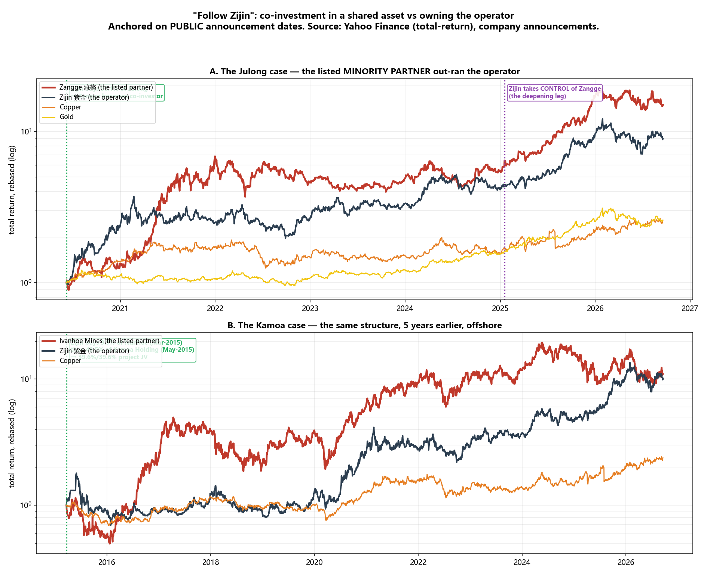
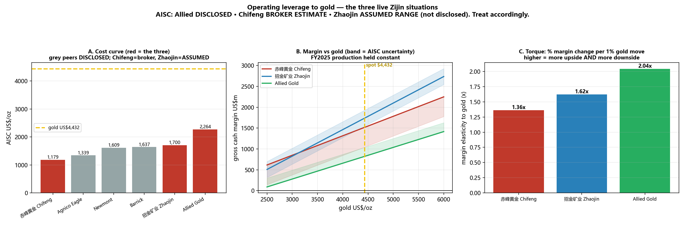

# 跟着紫金 Following Zijin
## 与中国矿业龙头"共同参股"，到底赚不赚钱？
### 2026年9月18日 —— 策略回测 + 赤峰黄金 · 招金矿业 · Allied Gold 深度剖析

> **用户的原话与思路：** *"藏格矿业参股巨龙矿业，和紫金成为利益共同体；这就是一个很好的从先共同参股到进一步加深合作的情况。"* —— 也就是说，可交易的模式不是"紫金全资收购了谁"，而是**上市公司成为紫金在同一资产上的少数股东（利益共同体）、并且仍然保持上市**，从而分享紫金的资本与运营能力所释放的价值。

> **TL;DR —— 思路是对的，机制只对了一半，而最新的交易带着一个五年前不存在的新风险。**
> - **这个模式真实存在，而且幅度巨大。** 以**公开公告日**（不是事后低点）为锚，七个满一年的"可跟随"标的**中位数 7.62 倍**，**7 个里有 5 个跑赢紫金自己**。两个尖子是 **Montage Gold +11.4 倍（紫金的 5.68 倍）** 和 **万国黄金 +7.62 倍（紫金的 3.65 倍）**。
> - **你的记忆是对的，我最初的"纠正"才是错的。** 锚点不是紫金 2025 年收购藏格，而是 **2020年6月8日紫金以 38.83 亿元拿下巨龙铜业 50.1%**、藏格保留 **30.78%** 的那一刻。从这个公开日期起藏格 **4.81 → 72.16 = 15.02 倍（年化 +54%）**，几乎正是你记得的"16 倍"。**从 2020 年低点算起的涨幅有 84% 发生在公告之后** —— 它是可投资的，不是事后诸葛。
> - **"少数股东比操盘方弹性更大"这个机制被证实，但幅度有限。** 藏格跑赢紫金 **1.67 倍**，Ivanhoe **1.10 倍**。共享资产占伙伴 NAV 的比重远高于占紫金的比重。同一资产，更高集中度，更大弹性。
> - **⚠️ 但因果关系并未被证明，而且有一个近似对照实验削弱了它。** **西部矿业（601168.SS）持有玉龙铜矿、紫金只是不参与运营的约 22% 被动少数股东，它照样涨了约 6.5 倍。** 这份名单的大部分回报可能来自**商品beta + 小盘集中度**，而不是"紫金的眼光"。Montage、万国、招金都是**黄金**股，而且是在一轮历史级黄金牛市中测量的。**§6 把这个归因问题当作核心，而不是脚注。**
> - **🔴 该模式的第二个真实案例没有跑赢紫金 —— 而它恰恰告诉你这个思路何时有效。** 招金（1818.HK）与藏格结构完全相同（**紫金直接持有海域金矿 30%** + **持有招金 18.20%**），但只有 **3.00 倍 = 紫金的 0.73 倍**。区别在于：**巨龙二期已于 2026年1月投产，而海域没有。** **真正的催化剂是"投产"，不是"公告"。**
> - **🔴 最重要的新风险：紫金的约束已从东道国转移到中国自己。** **Solaris（2024）死于加拿大的《投资加拿大法》国安审查。** 但 **Allied Gold（2026）—— 紫金史上最大交易，C$44.00/股、约 55 亿加元 —— 于 2026年7月29日死于中国自己的发改委，而加拿大一侧当时已经放行。** **没有分手费。股价单日 −18%。**
> - **而市场早就看出来了，你也看得出来：** 终止前一天 AAUC 报 **C$29.50，较 C$44.00 的要约价折价 33%**。这么宽的并购套利价差是市场在给失败定价，不是机会。
> - **三家在场标的的真实画像：** **赤峰黄金** = 财务质量最好（净现金、41% 经营利润率、**三年净利 6.8 倍**），但**增长 100% 来自金价 —— H1-2026 销量反而跌了 9.45%**；**招金矿业** = **海域金矿的高杠杆期权，而它还没兑现** —— **截至 2026年8月23日中期公告，海域仍未投产**（32 页公告里"海域"二字出现 **0 次**），据报因 **2026年2月一起安全生产事故**延期，同时 **H1-2026 矿产金暴跌 21.87%**、**未派中期息**；**Allied Gold** = **成本最高、弹性最大**（**Q1-2026 AISC US$2,264/oz，比 Agnico 高约 69%**），FY2024 与 FY2025 **连续两年亏损**。
> - **⚠️ 可操作：赤峰 H 股（6693.HK）较 A 股折价 25.6%**，同一家公司同一批资产，紫金 25.85% 的控股交易预计 **2026年9月30日**交割。
> - **下行不是纸上谈兵。** 2014年以来最大回撤：**藏格 −90%、Ivanhoe −73%、龙净 −72%、赤峰A −70%、紫金黄金国际 −65%、紫金A −61%、招金 −60%。** 年化波动率：**赤峰H 81%、紫金黄金国际 70%。** 这不是低波动复利资产，赢家也会腰斩。
> - **仅供教育/分析，非投资建议。**

---

## ⚠️ 协议与数据卫生提示

适用本仓库的**两步研究协议**（§2 草稿、§3 同行评审——评审攻击的是我自己的结论）与 **CRule 1 / CRule 6**（周期回溯；经营杠杆）。

**本报告包含我对自己工作的三处更正，以及对用户前提的一处更正。它们被保留而非悄悄修掉**——因为错误本身有价值。

| # | 更正 | 经过 |
|---|---|---|
| **C1** | **我锚错了事件。** | 我最初从紫金 2025年1月收购藏格起算，得出"紫金在高位接盘"。错了：利益共同体形成于 **2020年6月8日的巨龙交易**。**用户的框架是对的，我的不是。** |
| **C2** | **一处我拒绝发布的 3.5 倍数据冲突，最后证明是拆股。** | 万国黄金 HK$8.33 认购价 vs HK$2.27–2.43 成交价，经 **2025年11月25日生效的 1拆4** 调和（HK$9.25÷4=HK$2.3125 ✓）。修正入股价 **HK$2.0825**，修正回报 **7.62 倍，而非 1.90 倍**。 |
| **C3** | **代码回收。** | `CNL.TO` 今天是 **Collective Mining**，不是紫金 2020 年收购的 Continental Gold —— 与巴里克 `GOLD`→`B` 同类的陷阱。已退市标的一律按交易条款处理，绝不按代码。 |
| **C4（用户）** | **赤峰的加纳矿是 Wassa，不是 Bibiani。** | Bibiani 属于 **Asante Gold**。老挝的 Sepon 那部分是对的。 |

**Rule 4 标记 —— 引用任何数字前请先看：**

| # | 标记 |
|---|---|
| **F1** | **AISC：Allied 有披露（Q1-2026：US$2,264/oz）。赤峰其实也披露过——但只有 FY2023 的 US$1,179.1/oz（H股招股书），已过时**；FY2026 未披露且必然高得多（H1-26 单位成本 +20.18%）。**招金则完全不披露 AISC**，本文用的约 US$1,700 仅为敏感性假设。⚠️ *赤峰招股书数字经二手转引，我未亲自打开 PDF。* |
| **F2** | ✅ **已解决：赤峰 FY2025 矿产金 14.51 吨（较 2024年 15.16 吨 −4.3%）**，据中国黄金协会引述 2025 年报。**"16.7 吨"的说法是错的。** |
| **F3** | ✅ **部分解决：资源量 582.7 吨（+49.41%）** 已确认；**储量仍未解决** —— 年报摘要未列表，105.8 吨与 75 吨两个版本均未证实，**作为缺口发布**。 |
| **F4** | ✅ **基本解决（negative finding）：截至招金 2026年8月23日港交所中期业绩公告，海域金矿尚未投产 —— 全文 32 页中"海域"出现 0 次。** 按港交所规则，最大在建项目投产通常需披露，因此这个"沉默"本身就是证据。⚠️ **延期原因（2026年2月安全生产事故）仅有二手来源，本文为"据报道"而非断言。** |
| **F5** | **招金与 Allied 的股本数为推导值、置信度低**，故不发布每股指标。 |
| **F6** | ✅ **已由审计报表解决，且它证伪了"资产负债表被拖垮"的假设。** 紫金**资产负债率从 FY2024 的 55.19% 改善到 FY2025 的 51.56%**，而这一年是其史上并购最猛的一年。总资产 +29.1%，负债仅 +20.6%。 |
| **F7** | **91.3% 的完成率是我自行汇编**，非审计清单，应视为**上限**。 |
| **F8** | §8–§9 中的概率与定性判断属**解释**，已如此标注。 |

---

## §1 —— 方法

问题是：**"跟着紫金"是策略，还是故事？**

设计上刻意排除了这类研究惯常的两种自欺：

1. **一律以"公开公告日"为锚，绝不用低点。** 下文每一个回报都是外部投资者在消息**之后**按收盘价、或按已披露认购价能真实拿到的。这也是 §4 即使"事后低点"更好看也要拒绝它的原因。
2. **区分"可跟随"与"不可跟随"。** **全面收购**中标的退市，外部股东只拿一次溢价，之后创造的价值与其无关。那些交易是关于紫金的证据，不是策略。只有**伙伴仍然上市的少数股权与合资**才进入回测。

| 分类 | 含义 | 外部人能跟吗 |
|---|---|---|
| **FOLLOWABLE 可跟随** | 少数股权/项目合资；标的仍上市 | ✅ 能 |
| **DEEPENING 加深** | 紫金增持或取得控制权，标的仍上市 | ✅ 能 |
| **TAKEOVER 全面收购** | 100% 收购，标的退市 | ❌ 不能——一次性被清退 |
| **SPINOFF 分拆** | 紫金黄金国际 | ✅ 能，但那是紫金本身 |

基准是**紫金自己的 A 股**（最诚实的门槛——为什么不直接买紫金？），外加**铜与金**（§6 将证明这才是真正的挑战）。

---

## §2 —— 第一步：简明研究草稿

### 核心结论

**与紫金在同一资产上共同参股，历史回报极其可观——七个满一年标的中位数 7.62 倍，5/7 跑赢紫金本身。但因果机制只有一部分属于"紫金"，很大一部分是商品beta与小盘集中度；价值兑现于"资产投产"而非"公告"；而最新的交易带着一个新的、无法对冲的风险：中国自己对紫金对外投资的审批。**

### 支持点 1

**主张 → 上市少数股东系统性跑赢操盘方，因为共享资产主导其 NAV。**
*需要的证据：* 同一公告日起算的伙伴 vs 紫金回报。**已获得——§5。** 藏格自巨龙交易起 **1.67 倍于紫金**；Ivanhoe **1.10 倍**；Montage **5.68 倍**；万国 **3.65 倍**。

### 支持点 2

**主张 → 这是可重复的模式，不是孤例。**
*需要的证据：* 同一结构出现一次以上。**已获得——§5、§7。** 紫金至少做过三次：**巨龙/藏格（2020）**、**Kamoa/Ivanhoe（2015）**、**海域/招金（2022）**——每次都是**项目层面股权 + 上市公司层面股权**指向同一资产。

### 支持点 3

**主张 → 紫金买的是"停滞/困境但它能修好"的资产，所以增值是运营性的、真实的。**
*需要的证据：* 收购时资产的状态。**已获得——§7。** 巨龙在 **2019年下半年因原控股方资金短缺停工**；赤峰刚刚**未完成 2025 年产量目标**（Wassa 品位下降）；Nevsun 的 Timok 长期卡住；Continental Gold 有安全问题。

### 反对点 1（针对我自己的结论）

**主张 → 大部分回报是商品beta，不是紫金。**
*需要的证据：* 一个紫金在场但**不运营**的案例。**已获得，而且很有杀伤力——§6。** **西部矿业在紫金作为被动、不运营的约 22% 少数股东的情况下涨了约 6.5 倍。** 而且本名单最大的赢家都是**黄金**股，金价从约 US$1,900 涨到 **US$4,432**。

### 反对点 2（针对我自己的结论）

**主张 → 光有结构不够，招金就是证明。**
*需要的证据：* 同一结构却跑输的案例。**已获得——§7.2。** **招金只有 3.00 倍 = 紫金的 0.73 倍**，尽管它拥有完全相同的"项目股权+上市公司股权"架构。区别变量是：**海域尚未投产，而巨龙二期已投产。**

### 明确标注为**未知**

- **紫金下一笔共同参股是否已公告但未被注意** —— 未知；本名单并不穷尽（F7）。
- **发改委的审批风险是永久性的体制转变，还是仅针对 Allied 的个案判断** —— 未知；只有一个观测。
- **赤峰 FY2026 的真实 AISC** —— 未知；公司不再披露。

---

## §3 —— 第二步：严格同行评审（针对 §2，不重写）

### 1. 需要核实的事实

- **巨龙条款** —— 紫金 50.1%、**38.83 亿元**，**2020年6月8日**公告（6月6日签约）；藏格相关方保留 **30.78%**。股权结构现为 **紫金 57.35% / 藏格 30.78% / 大普工贸 9% / 西藏地矿 2.87%**。✔
- **藏格控股权条款** —— **2025年1月16日**签署、**17日**公告，**24.82% @ ¥35.00/股 = 137.29 亿元**，最终约 **26.18%**。✔
- **万国 2025年11月25日生效的 1拆4**，如今是 7.62 倍回报的承重事实。它已通过算术验证（HK$9.25÷4 = HK$2.3125 对应观测到的 HK$2.27–2.43），但 **HK$8.33 认购价本身是经二手转引港交所公告得到的，并非解析原文。** ⚠️ **这是记分牌中杠杆最高的一个未完全证实的输入。**
- **AISC 的可比性是本报告最大的呈现风险（F1）。** 赤峰披露的是"自产金单位销售成本"——一个**现金**成本，不含维持性资本开支、勘探与公司管理费。把它与 Agnico/Newmont/Barrick 的 AISC 并列**不是同口径**，草稿任何时候都不得不加标注地这样做。
- **赤峰的产量与储量在各来源间自相矛盾（F2、F3）。** 给出点估计就是虚假精确。

### 2. 逻辑跳跃 / 偷换概念

- **草稿的核心偷换是"这个模式赚钱了" → "是紫金让它赚钱的"。** 这是两个不同的主张。回报回测无法把操盘方的增值与商品周期分开。**反对点 1 承认了，但 TL;DR 仍以策略框架领衔。** 诚实的表述是：*该模式可靠地识别出高弹性、资产高度集中、且处在紫金正在投入资本的商品里的股票* —— 这可能是**筛选**价值，而非**运营**价值。
- **"中位数 7.62 倍"把样本统计量偷换成了期望值。** n=7，选自我能找到的交易，处在铜与金都暴涨的十年。**这是对过去的描述，不是预测，小样本警告必须写在数字旁边，而不是脚注里。**
- **"紫金买困境资产并修好"混淆了两件事**：买得便宜（金融能力）与修得好（运营能力）。巨龙支持后者；而赤峰 **+18.95%（对 20日VWAP）** 的溢价、藏格对未受扰动价的溢价，都说明紫金**并不**系统性地买得便宜。
- **"可跟随"这个词承担了过多含义，必须压力测试。** Xanadu 证明上市伙伴可以**既可跟随又一文不值** —— 紫金持股 15.7%，随后**接受 A$0.08** 并只保留项目合资权益。上市公司只是融资壳，外部人持有的是壳，不是矿。**定义必须收紧为"伙伴仍上市 **且** 共享资产在上市公司体内"**，Xanadu 不满足。

### 3. 缺失的反例 / 竞争性解释

- **最强的竞争性解释检验不足：黄金本身。** 金价从约 US$1,900 涨到 **US$4,432**。Montage（+11.4倍）、万国（+7.6倍）、招金（+3.0倍）都是黄金股，而 Montage 是**尚无盈利的开发商**（P/B 13.8、ROE 为负）：本质是金价的长久期看涨期权。**仅靠金价上涨，这类证券就会有惊人回报，与紫金是否在场无关。**
- **幸存者偏差未被充分处理。** 名单是通过搜索"发生过的交易"组建的。紫金悄悄退出的持股、从未被报道的小额认购，都是不可见的。**Xanadu 之所以被抓到，只是因为它以戏剧化方式收场。**
- **西部矿业是最接近对照组的案例，却只被提了一句。** 如果**被动、不运营**的紫金少数股权同样对应 6.5 倍，那么"运营增值"假说就有大麻烦。**它应该单独成节。** *（已执行——§6。）*
- **缺失：收购方的资金成本解释。** 紫金的认购常常带**折价**（万国 −9.95%；赤峰 H 股低于 60 日均价）。"跟随紫金的回报"中有一部分只是**紫金拿到了比二级市场买家更好的入场价**——而外部人永远拿不到这个折价。
- **缺失：汇率。** 回报以本币计（CNY、HKD、CAD、USD）。6–11 年里汇率影响重大，本文**未作调整**。

### 4. 最应补充的一手来源

1. **紫金的上交所公告** —— 巨龙（2020年6月）、龙净（2022）、藏格（2025年1月）、赤峰（2026年3月）。*（已引用——§4、§5。）*
2. **港交所：万国认购公告（2024年9月22日）与 1拆4 通函（2025年11月）** —— 7.62 倍的承重事实。⚠️ *仍为二手。*
3. **招金 2026 年中期报告（1818.HK）** —— 解决海域状态的唯一途径（F4）。✅ *已获取中期业绩公告。*
4. **赤峰 H 股上市文件（2025年3月）** —— 唯一可能存在国际口径成本披露之处。✅ *已确认含 FY2023 AISC。*
5. **Allied Gold 2025年四季度 MRMR 与 2026年二季度 MD&A** —— 储量与净现金/净负债的调节。✅ *储量已获取；调节仍未完全解决。*
6. **紫金 2025 年报与 2026 中报** —— 替换聚合站的杠杆数字（F6）。✅ *已获取审计口径。*

### 5. 哪些句子至多只能算推测，而非事实

| 陈述 | 正确定性 |
|---|---|
| "藏格自 2020-06-08 起 15.02 倍；Ivanhoe 11.02 倍；Montage 11.38 倍" | **计算所得的事实**（以公告日为锚，可复现） |
| "紫金 2020年6月8日以 38.83 亿元收购巨龙 50.1%" | **有据可查的事实** |
| "Allied Gold 的 C$44 要约于 2026年7月29日终止" | **有据可查的事实** |
| "发改委是阻挡方" | **被广泛报道并相互印证 —— 但未取得发改委官方声明。** 应标注为"据报道"。 |
| "发改委顾虑溢价与马里风险" | **转述/归因，非官方理由。** |
| "伙伴跑赢操盘方是因为 NAV 集中度" | **解释。** 机制上成立，3 例中 2 例吻合，被招金证伪。 |
| "催化剂是投产而非公告" | **基于 n=2 的解释**（巨龙已投产、海域未投产）。是假说，不是发现。 |
| "赤峰 FY2026 AISC 约 US$1,750–2,190" | **券商估算，非公司数字。** |
| "招金 AISC 约 US$1,700" | **仅为敏感性假设，无证据基础。** |
| "海域因 2026年2月安全事故延期" | **仅二手来源。必须标注为据报道。** |
| §8/§9 的排序与"潜力" | **解释。** |

> **评审人的结论：** **回报测量本身是扎实的，"公告日锚定"的纪律确实严格** —— 本研究避开了此类研究惯常的事后作弊。**弱点在归因。** 草稿证明了这些标的*表现很好*；它**没有**证明*是紫金的参与*造成的，而一个近似对照（西部矿业）与一个结构性失败（招金）都指向相反方向。**草稿应当以归因不确定性开篇，而不是以它收尾**，并且必须把小样本警告放在中位数旁边。**§8 中的发改委发现，是本报告中最具决策相关性、证据也最扎实的新事实，甚至有理由排在回测之前。**

---

## §4 —— 前提核查：哪个锚点是诚实的？

用户记得*"藏格在 2020 年低点被紫金入股，之后涨了 16 倍"*。存在三个候选锚点，其中只有两个可投资。

| 锚点 | 价格 | → 今天（¥72.16） | 可投资？ |
|---|---|---|---|
| (a) 2020 年绝对低点，**5月12日** | ¥2.90 | **24.87x** | ❌ **否** —— 事后低点 |
| (b) **巨龙公告日，6月8日** | **¥4.81** | **15.02x（年化 +54%）** | ✅ **是 —— 这才是真锚点** |
| (c) 藏格控股权公告，2025年1月17日 | ¥30.89（交易价 ¥35.00） | **2.34x**（按交易价 2.06x） | ✅ 是 —— 加深的那一腿 |

**从 2020 年低点算起的涨幅有 84%（对数口径）发生在巨龙公告之后。** "抄到底"的说法不成立 —— 紫金买的是**矿**，不是**股票**，而且是在低点之后一个月 —— **但这不重要**，因为回报绝大部分在公告之后，因此是可捕捉的。

### 到底发生了什么，以及为什么是藏格

藏格曾是**巨龙的控股方并把它做停了** —— 项目于 **2019年下半年因控股方资金短缺停工**。紫金自己的说法：*"紫金与藏格的合作始于巨龙铜矿……藏格作为该矿的大股东时，虽已投入巨资，但在推进项目上陷入僵局。2020年6月，紫金取得该矿控股权并成为运营方。"*

**紫金接手后的巨龙：**

| 年份 | 铜产量 |
|---|---|
| 2022 | **115 kt** |
| 2023 | **154 kt** |
| 2024 | **166 kt** |
| **2026年1月** | **二期投产** —— 新增 20 万吨/日，合计 **35 万吨/日**（约 1.05 亿吨/年） |
| 目标 | **30–35 万吨/年铜**；藏格权益 **9.23–10.77 万吨/年** |
| 三期 | 由紫金牵头规划；**时间表待定** |

**紫金为何随后要买下藏格本身（2025年1月）：** 藏格手里的 30.78% 构成**二期/三期资本开支审批上的少数股东摩擦**。紫金的表述是要取得*"对巨龙铜矿的绝对控制"*。藏格的其他资产 —— **察尔汗钾肥**（约 110 万吨/年 KCl，中国第二大）与 **麻米措盐湖锂 24.01%** —— 一并带入。

> **巨龙主导藏格利润表的直接证据：藏格的报告净利率高达 143.6%** —— 来自巨龙的权益法投资收益**超过其自身营业收入**。整个思路所依赖的 NAV 集中度，在一个比率里就看得见。
---

## §5 —— 记分牌：每一个可跟随的紫金标的，以公告日为锚



*面板 A：巨龙案例 —— 上市少数股东跑赢了操盘方。面板 B：同样结构，早五年，在海外（Kamoa/Ivanhoe）。*

| 公告日 | 标的 | 类型 | 入股价 | 现价 | **倍数** | **vs 紫金** | 共享资产 |
|---|---|---|---|---|---|---|---|
| 2015-03-23 | **Ivanhoe Mines** (IVN.TO) | 可跟随 | C$1.09 | C$12.01 | **11.02x** | **1.10x** ✅ | 刚果金 Kamoa-Kakula 铜 |
| 2020-06-08 | **藏格矿业** (000408.SZ) | 可跟随 | ¥4.81 | ¥72.16 | **15.02x** | **1.67x** ✅ | 西藏巨龙铜矿 |
| 2022-06-30 | 龙净环保 (600388.SS) | 可跟随 | ¥10.80 | ¥17.45 | 1.62x | **0.44x** ❌ | *（无 —— 多元化）* |
| 2022-11-06 | **招金矿业** (1818.HK) | 可跟随 | HK$6.72 | HK$20.16 | 3.00x | **0.73x** ❌ | 山东海域金矿 |
| 2024-07-31 | **Montage Gold** (MAU.TO) | 可跟随 | C$1.75 | C$19.91 | **11.38x** | **5.68x** ⭐ | 科特迪瓦 Koné 金矿 |
| 2024-09-23 | **万国黄金** (3939.HK) | 可跟随 | HK$2.08¹ | HK$15.86 | **7.62x** | **3.65x** ⭐ | 所罗门群岛金岭矿 |
| 2025-01-17 | 藏格矿业 *（加深）* | 加深 | ¥35.00 | ¥72.16 | 2.06x | 1.02x ✅ | 控股伙伴本身 |
| 2026-03-22 | 赤峰黄金 (600988.SS) | 加深 | ¥41.36 | ¥44.26 | 1.07x | 1.05x | *太早* |
| 2026-08-10 | Allied Gold (AAUC.TO) | 可跟随 | C$32.55 | C$30.07 | **0.92x** ❌ | *太早* |

¹ *拆股调整：HK$8.33 认购价 ÷ 4（2025年11月25日 1拆4，更正 C2）。*

**满 1 年的七个标的：**

| 指标 | 数值 |
|---|---|
| **中位数倍数** | **7.62x** |
| **跑赢紫金自己** | **7 中 5** |
| **亏钱** | **7 中 0** |
| ⚠️ 样本量 | **n = 7** —— 这是对过去的描述，不是期望值（评审 §2） |

### 为什么全面收购不算在内

| 公告日 | 标的 | 对价 | 结果 |
|---|---|---|---|
| 2018-09 | Nevsun Resources | 18.6 亿加元 @ C$6.00（**+57%**） | **2019年3月退市** |
| 2019-12 | Continental Gold | 14 亿加元 @ C$5.50（**+29%**） | **2020年3月退市** |
| 2020-06 | Guyana Goldfields | 3.23 亿加元 @ C$1.85 | **2020年8月退市** |
| 2021-10 | Neo Lithium | 9.6 亿加元 @ C$6.50 | **2022年1月退市** |

外部股东只收到收购价**一次**。紫金随后在 Timok、Buriticá、3Q 锂矿创造的价值**一分钱都与他们无关**。**这恰恰说明用户的"共同参股"框架更优** —— 也正因如此，`CNL.TO` 今天返回的是 Collective Mining 而不是 Continental Gold（更正 C3）。

---

## §6 —— ⚠️ 归因问题：这是紫金，还是只是铜和金？

**本节因同行评审的要求而存在，也是对该思路最严肃的挑战。**

### 6.1 近似对照实验

**西部矿业（601168.SS）**持有**玉龙铜矿**（注意：玉龙 ≠ 巨龙，近音是真实陷阱）。紫金持有**约 22% 的少数股权但不运营该矿**。西部矿业仍然涨了约 **6.5 倍**。

> **如果被动、不运营的紫金少数股权同样对应 6.5 倍，那么"紫金的运营能力创造了回报"就没有被证明。** 对这份名单最简洁的解释是：**这些是小市值、资产高度集中、且商品价格大涨的股票。**

### 6.2 真正的基准

研究窗口内，**金价从约 US$1,900 涨到 US$4,432**，铜价大致翻倍。名单里两个尖子 —— **Montage（11.38x）** 与 **万国（7.62x）** —— 都是**黄金**股，而 Montage 是**尚未投产、没有盈利的开发商**（P/B 13.8、ROE 为负）：本质是金价的长久期看涨期权。**仅金价上涨就足以让这类证券产生惊人回报，无论紫金是否在场。**

### 6.3 经得起挑战的部分

仍有三点支持"存在真实但较小的紫金效应"：

1. **"停滞—修复"的记录是具体且可验证的。** 巨龙 **2019年下半年停工**，如今二期 **35 万吨/日**已投产。藏格做不到，紫金做到了。
2. **伙伴跑赢操盘方，这不是纯beta能解释的。** 若只是商品beta，同样受铜价驱动的藏格与紫金应当同步。藏格跑赢紫金 **1.67 倍**。NAV 集中度是真实的机械性优势。
3. **紫金的入股常带折价**（万国较参考价 −9.95%；赤峰 H 股低于 60 日均价），这是**议价能力**的证据 —— 尽管外部人永远拿不到这个折价。

### 6.4 诚实的表述

> **"跟着紫金"最好被理解为一个筛选器，而不是一台 alpha 引擎。** 它可靠地筛出**小市值、资产高度集中、高弹性、且有成熟战略买家正在投入资本的矿业股**。至于随后的回报是紫金的功劳还是商品的功劳，**在十年牛市里用 n=7 是分不开的。** 因此该策略对商品周期的依赖**远高于叙事所暗示的** —— 而在金价或铜价下行时，创造了 15 倍的同一个 NAV 集中度会反向运作（见 §9.3 的回撤）。

---

## §7 —— 三个在场标的，深入剖析

### 7.1 赤峰黄金 —— 600988.SS / 6693.HK

**紫金的交易（2026年3月22日）：** **25.85% 及控制权**，对价 **182.6 亿元** —— 2.42 亿股 A 股 @ **¥41.36**（100.06 亿元）+ 3.11 亿股新 H 股 @ **HK$30.19**（93.86 亿港元 ≈ 82.52 亿元），合计 5.72 亿股。交易结构刻意规避股东大会与重大资产重组认定。**预计 2026年9月30日交割。**

**财务（人民币，会计年度至12月31日）—— 已与资产负债表交叉验证：**

| 指标 | FY2022 | FY2023 | FY2024 | **FY2025** |
|---|---|---|---|---|
| 营业收入 | ¥62.7亿 | ¥72.2亿 | ¥90.3亿 | **¥126.4亿（+40.0%）** |
| 净利润 | ¥4.5亿 | ¥8.0亿 | ¥17.6亿 | **¥30.8亿（+74.7%）** |
| 经营利润 | ¥9.8亿 | ¥14.7亿 | ¥29.3亿 | **¥52.1亿** |
| 经营现金流 | — | — | — | **¥55.6亿（+70.0%）** |
| **负债/权益** | 50.5% | 45.9% | 28.9% | **8.3%** |
| 现金/总债务 | — | — | — | **¥68.2亿 / ¥11.1亿 = 净现金 ¥57亿** |
| 加权 ROE | — | — | 25.1% | **27.1%** |
| 分红 | — | — | — | **¥0.32/股（税前）** |

**经营利润率 41%。三年净利润 6.8 倍。净现金。这是三家中最好的资产负债表，且差距明显。**

**资产：** 内蒙古三矿（部分矿段 **>7 g/t**）+ **老挝 Sepon**（万象矿业，约 350 万吨/年；2025 重心转向 **Khanong 铜**矿体）+ **加纳 Wassa**（金星瓦萨，约 400 万吨/年，2025 约 6 吨，**2028 目标 11 吨**，资源 255.3 吨，选厂回收率约 95.5%）。**2024 年海外占产量 74.2%。**

**⚠️ 问题 —— 而且是真问题：**

| 问题 | 证据 |
|---|---|
| **产量在掉链子** | FY2024 **15.16 吨（+5.6%）** → FY2025 **14.51 吨（−4.3%，未达标）** ✅ *已确认，F2 解决*；FY2026 计划仅 **14.7 吨**。 |
| **原因** | **Wassa 矿石品位下降 + 雨季影响。** 这正是紫金能以合理价格拿下控制权的原因。 |
| **🔴 增长 100% 来自价格** | H1-2026 自产金**销量同比 −9.45%**，售价 **¥1,008.52/克（+44.08%）**。利润上升是因为金价上升；**销量在下降。** |
| **成本在上行** | H1-2026 单位销售成本 **¥383.44/克（+20.18%）**；Q2 **¥366.63/克（同比 +29.05%）**。驱动：资源税、权利金、与金价挂钩的可持续发展税费、低产量下的固定成本摊薄恶化。 |
| **AISC：披露过一次，然后不再披露** | ✅ **FY2023 AISC US$1,179.1/oz（H股招股书），当年全球均值 US$1,348.5/oz —— 这是真实的成本优势。** ⚠️ **但 FY2026 未披露**，券商估 ¥400–500/克 ≈ **US$1,750–2,190/oz**。**成本上行的同时公司不再给这个数字了。** |
| **储量未披露** | ✅ 资源量 **582.7 吨（+49.41%）** 已确认；**年报摘要未列储量**（F3）。 |

**✅ 可操作的不对称：**

| | 价格 | 折算人民币 | vs 紫金交易价 |
|---|---|---|---|
| A 股 600988.SS | ¥44.26 | ¥44.26 | **+7.0%**（对 ¥41.36） |
| **H 股 6693.HK** | **HK$38.62** | **¥32.91** | +27.9%（对 HK$30.19） |
| **H 较 A 折价** | | **−25.6%** | |

> **同一家公司、同一批资产，H 股便宜四分之一。** *（HKDCNY 0.8521，实算。）*

### 7.2 招金矿业 —— 1818.HK

**这是巨龙/藏格架构的第二个真实案例，也是整个思路最有教育意义的一个 —— 因为它还没奏效。**

**结构：**
- **紫金直接持有海域金矿 30%**（**2022年10月**经山东瑞银矿业以 **¥39.845亿** 购入）
- **紫金持有招金 18.20%**（入股 **2022年11月6日**，654,078,741 股 H 股 @ **HK$6.72** = 43.95 亿港元，较当日收盘折价约 1.75%；原为 20%，此后被稀释）
- **招金持有海域另外 70%**
- **紫金对海域的穿透经济权益约 42.9%**
- 第一大股东仍为**山东招金集团 33.27%**，紫金为第二。

**完全是巨龙模板：项目层面股权 + 上市公司层面股权，指向同一资产。**

**海域金矿：**

| 项目 | 数值 | 置信度 |
|---|---|---|
| 黄金资源量 | **562 吨（JORC）** | ⚠️ 二手 |
| 平均品位 | **4.2 g/t**；最好矿段 6.6 g/t | ⚠️ 二手 |
| 可采储量 | 约 **212 吨** | ⚠️ 二手 |
| 设计处理量 | **12,000 吨/日（396 万吨/年）** | ⚠️ |
| 满产产量 | **15–20 吨/年**（招金权益 10.5–14 吨） | ⚠️ |
| 总投资 | 约 **¥60亿**，**2024年底已投约 ¥45亿** | ⚠️ |
| 服务年限 | 约 23 年 | ⚠️ |
| 技术 | TBM 全断面硬岩掘进；**海底、高卤水、高腐蚀深竖井** | ⚠️ |

### ✅ H1-2026，直接读自港交所中期业绩公告（2026年8月23日）—— 人民币千元

| 利润表 | H1 2026 | H1 2025 | 变化 |
|---|---|---|---|
| 营业收入 | **9,021,699** | 6,972,841 | **+29.38%** |
| 毛利 | **4,346,765** | 3,050,236 | +42.5%（毛利率 **48.18%**） |
| 其他收入及收益 | 146,912 | 1,133,655 | **🔴 −87.0%**（去年同期含大额一次性） |
| 期间利润 | 2,105,402 | 1,776,694 | +18.50% |
| **归属于母公司股东** | **1,578,089** | 1,439,690 | **🔴 仅 +9.61%** |
| 少数股东损益 | 527,313 | 337,004 | **+56.5%** |
| 每股收益 | **¥0.42** | ¥0.38 | +10.75% |
| **中期股息** | **🔴 未派** | — | — |

| H1-2026 黄金产量 | 千克 | 变化 |
|---|---|---|
| **合计** | **12,526.34** | **−12.33%** |
| —— **矿产金** | **7,997.08** | **🔴 −21.87%** |
| —— 冶炼加工金 | 4,529.26 | +11.77% |
| 海外产量 | — | **+33.44%** |

**资产负债表（2026年6月30日）：** 有息负债合计 **¥185.4亿**（银行及其他 ¥125.4亿 + 公司债 ¥60.0亿），现金 **¥46.1亿** → **净负债 ¥139.3亿**；资产负债率 **49.96%**；净负债/权益 **45.6%**。

> **🔴 表面数字掩盖了两件事。**（1）**归母利润仅增 +9.61%，而集团利润增 +18.50%** —— 差额被少数股东拿走，且**"其他收入"减少 ¥9.87亿**，意味着内生增长远弱于 +29% 的收入增速。（2）**¥53.9亿的"永续资本工具"计在权益里。** 它们在经济实质上是债；剔除后归母权益约 ¥201.9亿，真实杠杆显著高于 49.96%。

**⚠️ 问题：**

| 问题 | 证据 |
|---|---|
| **🔴 海域尚未投产（F4）** | **2026年8月23日 32 页中期公告中"海域"出现 0 次。** 据报因 **2026年2月安全生产事故**延期 ⚠️*转述，仅二手*；修正后为约 2026年9月试产、**Q4-2026 首金（FY2026 约 1 吨）**、2027 年 12–15 吨。 |
| **🔴 国内基本盘被打断** | **H1-2026 矿产金 −21.87%**，因国内矿山安全监管趋严 —— 与据报延误海域的是同一股力量。**FY2026 不会复制 FY2025。** |
| **杠杆** | **净负债 ¥139.3亿**，资产负债率 **49.96%** —— *另加* **¥53.9亿永续工具计入权益**。 |
| **利润率偏弱** | 经营利润率 **26%**，赤峰为 **41%**。 |
| **已经杀估值** | **距 52 周高点 −50.3%**，全名单最差；**未派中期息**。 |
| **完全不披露 AISC** | F1 —— 三家中唯一从未给过成本数字的。 |

> **这个案例教会我们的事 —— 它把用户的思路提炼成了可用的东西：** 巨龙/藏格模板的回报兑现于 **2026年1月的二期投产**，而不是 2020 年的公告。招金有完全相同的结构，但共享资产**仍在建设**。**催化剂是"投产"。** 因此招金是**海域能否启动的高杠杆期权** —— 这也正是为什么核实 F4 比本报告里任何估值比率都重要。

### 7.3 Allied Gold —— AAUC.TO / NYSE American: AAUC

**紫金的头寸：** 经 **US$2.95亿 / C$4.17亿**的非承销定向增发取得约 **9.2%**，价格 **C$32.55**，2026年8月10日前后完成 —— **这是 C$44.00 全面收购失败后的安慰奖（§8.2）。**

**运营：** **Sadiola（马里）** · **Bonikro + Agbaou（科特迪瓦）** · **Kurmuk（埃塞俄比亚）**，在建，2026年年中投产。

| 期间 | 黄金 | 备注 |
|---|---|---|
| **FY2025** | **379,081 oz** | 超过 >37.5 万盎司指引 |
| 2025Q4 | 117,004 oz | 全年最佳；Sadiola 约 6 万盎司 |
| 2026Q2 | 97,429 oz | 同比 +7% |
| **FY2026 基础** | **385,000–425,000 oz** | Sadiola + Bonikro + Agbaou |
| **FY2026 含 Kurmuk** | **485,000–575,000 oz** | **9 万盎司的区间宽度 = 执行风险** |

**🔴 核心风险是成本。Allied 位于全球成本曲线顶部。**

| 公司 | AISC US$/oz | Allied 高出 |
|---|---|---|
| Agnico Eagle | 1,339 | **+69%** |
| Newmont | 1,609 | +41% |
| Barrick | 1,637 | +38% |
| Allied Gold（2025Q4） | ~1,980 | — |
| **Allied Gold（2026Q1）** | **🔴 2,264** | — |

**储量（2026年2月 MRMR，100% 口径）：** Kurmuk 证实+概略 **2,706 千盎司 @ 1.32 g/t**；探明+控制（含 Kurmuk）**3,363 千盎司 @ 1.44 g/t**；推断 Sadiola 1,656 千盎司 @ 1.13 g/t。⚠️ **1.13–1.49 g/t 的品位很低** —— 这是大吨位低品位组合。**这才是成本高企的结构性原因，而且不会改变。** 对照 **海域 4.2 g/t**。

**✅ Kurmuk 距首金只差几天：** 输电线路**已带电**，**2026年9月初首批矿石已进入破碎回路**。Kurmuk 目标 **<US$1,200/oz，甚至 <US$1,000/oz**。⚠️ **但首金要到 9 月中下旬，FY2026 Kurmuk 10–15 万盎司的指引上限已不可能实现 —— 485–575 千盎司的集团指引应按"下半区"看待。** *我的算术（非公司指引）：约 24–27 万盎司 @ <$1,200 与约 40 万盎司 @ ~$2,250 混合，约为 **US$1,700/oz** —— 仍高于巴里克。*

**财务（美元）：** **FY2024 亏损 US$1.156亿、FY2025 亏损 US$0.626亿**；2026Q2 净利 **+US$3,720万**（调整后 US$5,540万），调整后 EBITDA **US$1.65亿**。净现金 **2025年底 US$3.1亿** → **2026Q2 大致持平**（约 US$320万 净负债），因 Kurmuk 资本开支落地 —— **半年 US$3.13亿 的摆动**。⚠️ *未与 2026Q2 MD&A 完全调平。*

> **解释：** Allied 是三家中**弹性最大也最脆弱**的。在 US$4,432 金价下它印钞，在回撤中会迅速承压。叠加马里/埃塞俄比亚的司法辖区风险，这也是**发改委为何对 C$44/股 踩刹车**最合理的解释（§8.2）。
---

## §8 —— 紫金并购出问题时：下行风险的量化

### 8.1 基准成功率

| 指标 | 数值 |
|---|---|
| 2015–2026 已识别的已宣布交易 | **24 笔** |
| 已完成 | **21 笔** |
| **已终止** | **2 笔** |
| 待定（赤峰，目标 2026年9月30日） | **1 笔** |
| **完成率（23 笔已定案）** | **91.3%** |
| **🔴 按金额算的失败率** | **糟糕得多** —— 两笔失败合计 **C$1.3亿 + C$55亿 ≈ C$56亿**，且包含**紫金史上尝试过的最大一笔** |

> ⚠️ **F7：这是自行汇编的清单**，不含低于披露门槛的交易与公告前放弃的接洽。**91.3% 应视为上限。** 按笔数计的成功率**实质性低估**了投资者承担的风险，因为失败集中在最大的交易上。

### 8.2 🔴 最重要的发现：约束已从东道国转移到中国

| | **Solaris Resources（2024）** | **Allied Gold（2026）** |
|---|---|---|
| 交易 | C$1.3亿换 **15%** + 一个董事席位，用于 Warintza（厄瓜多尔） | **100% 收购，C$44.00/股，约 C$55亿 —— 紫金史上最大** |
| 公告 | 2024年1月 | **2026年1月26日** |
| **被谁否决** | **🇨🇦 加拿大** —— 《投资加拿大法》**国家安全审查** | **🇨🇳 中国 —— 发改委**，而且是在加拿大一侧已推进/放行之后 |
| 机制 | 卡了 **4 个多月**；**从未正式否决，只是永远没有结论** | 在 **2026年7月29日**最后期限双方协议终止；条件"在最后期限前、乃至此后任何合理时间内"均无法满足 |
| 报道的顾虑 | 加拿大自 2022 年底起收紧对**国有**资本投资关键矿产的审查 | 据报道：**(a) 紫金支付的溢价过高；(b) 马里风险。** ⚠️ *转述，非发改委官方理由* |
| **分手费** | — | **无** |
| 后续 | Solaris **把总部迁至基多**，2025年1月1日前完全退出加拿大 | 改为 **C$32.55 的 9.2% 定向增发** |

> **🔴 这与直觉叙事完全相反。** 偷懒的读法是"西方在封锁中国"。但证据显示，就最大的那笔交易而言恰恰相反：**在渥太华放行之后，北京把它否了。** 今天跟随紫金进入一笔"已宣布的收购"，你承担的是**中国对外投资审批风险 —— 不透明、未披露、无法对冲，且无任何分手费补偿。**

**价格序列 —— 而且市场早就看出来了：**

| 日期 | 价格 | 事件 |
|---|---|---|
| 2026年1月23日（未受扰动） | **C$41.75** | 要约较最后收盘价仅 **+5.4%**，但较 **20日VWAP +18.95%** —— 即**股价在公告前已异动** |
| 2026年1月26日 | C$43.40 | 以 C$44.00 宣布 |
| **2026年7月28日** | **C$29.50** | **死亡前一天，较要约价折价 33%** |
| **2026年7月29日** | **C$24.00（−18.6%）** | **终止** |
| 2026年8月10日 | C$32.55 | 紫金以较崩盘后价格 **+34% 的溢价**入股 |
| 今天 | **C$30.07** | 较那个从未发生的要约 **−31.7%** |

> **两条可交易的教训。**（1）**33% 的并购套利价差是市场在给失败定价，不是机会** —— 事实证明市场是对的。（2）**+5.4% 的收盘价溢价与 +18.95% 的 VWAP 溢价之间的落差，说明股价在消息前就动了。**

### 8.3 Xanadu Mines —— "可跟随"还不够

紫金 2022 年的分阶段入股让它取得 **Xanadu 9.9%（A$0.04）**、随后 **19.9%**、再以 **US$3,500万**取得 **Khuiten Metals 50%**（后者持 Kharmagtai 76.5%）。2025 年 **Bastion Mining 以 A$0.08/股（约 A$1.6亿，+57% 溢价）**发起要约。**作为 15.7% 第一大股东的紫金选择接受**，使 Bastion 越过 50.1% 与 90% 门槛完成强制收购，**2025年8月从 ASX 退市**。**紫金保留了 Khuiten Metals 的 50%。**

> **紫金在上市公司层面赚了一倍并保住了矿。外部 XAM 股东在 8 澳分被清退。** **上市公司只是融资壳，资产在壳之下。** 这迫使定义收紧：**"可跟随"要求共享资产在上市公司体内** —— 藏格（持巨龙 30.78%）与招金（持海域 70%）合格，**Xanadu 不合格**。

### 8.4 现有矿山的东道国风险 —— 量化

| 矿山 | 事件 | 量化影响 |
|---|---|---|
| **🔴 布里蒂卡，哥伦比亚** | 政府限制警察/军队进驻后，与 **Clan del Golfo** 有关的团伙掘洞进入浅部高品位矿段非法采矿；**2023 年发生安保与承包商人员被杀及爆炸袭击** | **2023 年损失约 3.2 吨黄金 ≈ US$2亿 ≈ 该矿产量的 38%。** 紫金已就此**向 ICSID 起诉哥伦比亚政府**。⚠️ *该数字源自《华尔街日报》经转引 —— 属"据报道"，非"已披露"* |
| **🔴 Kamoa-Kakula，刚果金** | **2025年5月地震导致 Kakula 严重透水**，井下全面停产。后续研究显示涌水**部分由过度开采与应力重分布自身引发** | 2025 年指引**中值下调 28%**（52–58万吨 → 37–42万吨铜）；**2026年 60 万吨目标撤回**；**Ivanhoe 当日 −16%。** 紫金按 **39.6%** 承担。**这就是 Ivanhoe"失灵"的原因：IVN 2026年 YTD −24.1%，而 52 周高点为 C$20.34** |
| **Sadiola，马里** | 2023年8月新矿业法把国家/本地权益从 **20% 提到 35%**。巴里克拒绝接受；马里索赔 **US$5.12亿**，逮捕员工、扣押黄金、关闭办公室、实施临时国家托管、对巴里克 CEO 发出逮捕令。**最终和解：巴里克支付约 US$4.3亿并撤回 ICSID 仲裁** | **✅ Allied 早期低价和解**（B2Gold 亦然，约 US$3,000万）—— **马里风险显著低于巴里克所承担的**。但军政府的剧本 —— 审计 → 税务索赔 → 扣押 → 和解 —— **是可重复的** |
| **Porgera，巴新** | 2020 年后重组 | **巴新方 51% / Barrick Niugini 49%**（BNL = 巴里克 50 / 紫金 50）→ **紫金实际权益 24.5%**。巴新获得 **53%** 的经济利益。*这本身就是资源民族主义，实质性削减了紫金的经济性* |
| Sepon（老挝）、Bisha（厄立特里亚） | ⚠️ **本轮未检索到不利事件。** Bisha 存在紫金入主前的强迫劳动诉讼（*Araya v. Nevsun*），其**状态未核实** —— 属 **ESG 实质性缺口** | — |

### 8.5 国内这一侧：龙净环保是警示案例

**龙净环保（600388.SS）回报 1.62 倍 = 紫金的 0.44 倍 —— 全名单最差。而这个跑输是有基本面解释的，不是市场误判。**

FY2025 看着强劲：营收 **¥118.7亿（+18.5%）** —— 19 家上市环保同业中营收增速第一 —— 净利 **¥11.1亿（约 +34%）**；储能收入 **¥19.3亿（+5 倍）**，绿电 **¥6.0亿（约 +4 倍）**。

**但质量很差：**

| 问题 | 证据 |
|---|---|
| **储能毛利率极低** | 2025 年毛利率**仅 9.25% 且在下滑**；电芯价格从 **¥0.8/Wh 崩到 ¥0.26/Wh** |
| **🔴 H1-2026 经营现金流转负** | 由储能/绿电的建设与调试资本开支驱动 |
| **重资产扩张，由紫金输血** | **2026 年计划资本开支约 ¥80亿**，依赖**紫金定增 + 银行债务** —— 紫金实际上成了**最后贷款人** |
| **可能是关联需求** | 分析师质疑新能源业务能否*"走出紫金股东生态圈"* |
| ✅ 一个真实的正面 | 紫金把历史商誉从约 **¥7.1亿减记到 ¥2.8亿（2022–25）**，清除了减值悬顶 |

> **结论：龙净不是失败，但它是低质量增长 —— 营收与账面利润在涨，现金创造能力在恶化。** 这是最清楚的证据：**紫金的优势在采矿，不在它买的任何东西。** 跟随紫金走出其能力圈，跑输了紫金本身一半以上。

### 8.6 那个极其鲜明的不对称

**藏格并入后运行良好** —— H1-2026 归母净利 **¥36.38亿（+102.1%）**；**巨龙二期 2026年1月投产**；**麻米措锂预计 2026年三季度投产**（一期 5 万吨/年；2026 产量 2–2.5 万吨；配套 **420MW 光伏+储能已全容量并网**）；钾肥为稳定现金引擎（察尔汗 2026 计划 **100 万吨**）。碳酸锂价格回升至 **¥14万/吨以上**，上半年含税实现均价 **¥16.5万/吨、毛利率 71%**。⚠️ *藏格持麻米措比例有 24.01%（2025年1月）与约 26.95%（2026）两说，未调和。*

**而且没有任何中国监管机构提出异议。** 三笔 A 股控股交易（龙净、藏格、赤峰）都被设计为规避股东大会与重大资产重组认定，**无一被挑战**。紫金自己的表述援引了**证监会鼓励**龙头上市公司同业并购的政策。

> **🔴 把两半拼起来：北京积极鼓励紫金的国内整合，而北京自己的发改委否决了紫金史上最大的海外交易。** 对投资者而言，这个不对称就是**策略指令**：**这套打法的国内一条腿，交易风险远低于海外那条腿。**

---

## §9 —— 结论：潜力、优势、劣势、风险

### 9.1 经营杠杆 —— "谁潜力最大"的诚实答案



金矿股的杠杆作用在 **(金价 − AISC)** 上，而不在金价上。**弹性 = 金价 ÷ (金价 − AISC)** = 金价每变动 1%，现金毛利变动的百分比。

| 公司 | AISC US$/oz | 来源 | US$4,432 下每盎司毛利 | 毛利率 | **弹性** |
|---|---|---|---|---|---|
| **赤峰（FY2023）** | **1,179** | **已披露 —— 但为 2023 年，已过时** | 3,253 | 73% | **1.36x** |
| Agnico Eagle | 1,339 | 已披露 | 3,093 | 70% | 1.43x |
| Newmont | 1,609 | 已披露 | 2,823 | 64% | 1.57x |
| Barrick | 1,637 | 已披露 | 2,795 | 63% | 1.59x |
| **招金** | **~1,700** | **⚠️ 假设 —— 未披露** | 2,732 | 62% | **1.62x** |
| *赤峰（2026 券商估）* | *~1,750–2,190* | *⚠️ 券商，未披露* | *~2,300–2,680* | *52–60%* | *~1.65–1.96x* |
| **Allied Gold（2026Q1）** | **2,264** | **已披露** | 2,168 | **49%** | **2.04x** |

> **🔴 这张表在一手文件到位后被重建，而且它颠覆了我此前的排序。**
> - **赤峰其实披露过 AISC** —— **FY2023 为 US$1,179.1/oz**，而当年全球均值 **US$1,348.5/oz**。按这个口径，赤峰是**整张表里成本最低的生产商，低于 Agnico。** 这是**真实**的成本优势，不是故事。
> - **但 FY2023 已过时，且方向明确在恶化。** H1-2026 单位销售成本 **+20.18% 至 ¥383.44/克**；**FY2026 AISC 未披露**；券商估 **¥400–500/克 ≈ US$1,750–2,190/oz**（斜体那一行）。**真相在 US$1,179 → US$2,190 之间，而公司外部没人知道具体在哪。**
> - **Allied 比我最初报告的更差：2026Q1 AISC US$2,264/oz —— 比 Agnico 高约 69%**，且其组合品位仅 **1.23–1.49 g/t**（大吨位低品位）。**这才是成本高的结构性原因。** 对照**海域的 4.2 g/t**。

**现金毛利 vs 金价（产量按 FY2025 实际固定，百万美元）：**

| 金价 US$/oz | 赤峰¹ | 招金² | Allied³ |
|---|---|---|---|
| 3,000 | 850 | 827 | 279 |
| 3,500 | 1,083 | 1,145 | 469 |
| 4,000 | 1,316 | 1,463 | 658 |
| **4,432（现货）** | **1,503** | **1,718** | **810** |
| 5,000 | 1,783 | 2,100 | 1,037 |
| 5,500 | 2,016 | 2,418 | 1,227 |

¹ *按已披露的 FY2023 AISC US$1,179 计算 —— 是今天毛利的上限；若按 2026 券商估算，赤峰这一列要低约 35–45%。*
² *按假设的 US$1,700 计算 —— 招金不披露 AISC，整列仅为示意。*
³ *按已披露的 2026Q1 AISC US$2,264 计算。*

> **令人不适的结论：潜力最大的那个，也是最脆弱的那个。** Allied 弹性最高（**2.04x**）**正是因为**它成本最高。这同时是多头逻辑和空头逻辑。而且要注意 **AISC 低估了它的脆弱性** —— Allied 在 FY2024 与 FY2025 都覆盖了 AISC，**净利润层面却依然亏损。**

### 9.2 三家并列

| | **赤峰黄金** | **招金矿业** | **Allied Gold** |
|---|---|---|---|
| **本质是什么** | 财务质量最好的那个 | **海域金矿的高杠杆期权** | **高成本、高弹性**的困境反转 |
| **优势** | **净现金 ¥57亿**；**经营利润率 41%**；三年净利 **6.8 倍**；ROE 27.1%；资源量 **582.7 吨（+49.41%）**；**FY2023 AISC US$1,179 是全表最低**；**H 股较 A 股便宜 25.6%**；紫金控股 **2026年9月30日**交割 | 资源 **1,504.68 吨**、储量 521.24 吨；**海域 562 吨 @ 4.2 g/t —— 全场最好的品位**；H1-26 营收 **+29.4%**、毛利率 **48.2%**；前瞻 PE **9.0** vs 滚动 18.0 | **Kurmuk 2026年9月已投料**，目标 **<US$1,200/oz**；**黄金弹性最高（2.04x）**；紫金以 **C$32.55** 背书；FY2025 超指引 |
| **劣势** | 2025 产量未达标（**14.51 吨，−4.3%**）；FY2026 计划仅 +1.4%；**H1-26 销量 −9.45%**；单位成本 **+20.18%**；**FY2026 AISC 不再披露** | **🔴 H1-26 矿产金 −21.87%**；归母利润**仅 +9.61%**；**净负债 ¥139.3亿 + ¥53.9亿永续计入权益**；利润率 **26%**；**未派中期息**；**3.00x = 紫金的 0.73x** | **🔴 2026Q1 AISC US$2,264 —— 比 Agnico 高 69%**；品位仅 **1.13–1.49 g/t**；**FY2024 与 FY2025 连续亏损**；净现金半年内归零 |
| **🔴 核心风险** | 增长 **100% 来自金价**；9月30日交割；**成本上行的同时公司停止披露 AISC** | **🔴 海域仍未投产**（8月23日中期公告 0 次提及）；国内安全监管也在打击其存量基本盘 | **马里 + 埃塞俄比亚司法辖区风险**；**全球成本曲线顶部**；多头逻辑完全押在 Kurmuk 摊薄成本上 |
| **2014年来最大回撤** | **−70%**（A）/ −50%（H） | **−60%** | **−51%** |
| **当前距 52 周高点** | −10.5%（A）/ −16.3%（H） | **−50.3%** | −31.2% |
| **年化波动率** | 48%（A）/ **81%**（H） | 45% | 54% |
| **估值** | PE 22.4（A）/ **16.7（H）**；前瞻 12.8 / 11.2；P/B 5.82 / 4.35 | PE 18.0、**前瞻 9.0**；P/B 3.02 | **滚动亏损**；前瞻 3.0；P/B 5.41 |

### 9.3 下行不是纸上谈兵

**2014 年以来最大回撤：** 藏格 **−90%** · Ivanhoe **−73%** · 龙净 **−72%** · 赤峰A **−70%** · 紫金黄金国际 **−65%** · 紫金A **−61%** · 招金 **−60%** · Montage −58% · Allied −51% · **铜 −44%、金 −25%。**

**连旗舰赢家也极其剧烈：** 紫金黄金国际 52 周区间 **HK$84.20–268.00 —— 距高点约 −42%**，而这距史上最大金矿 IPO 才一年。

> **仓位含义：** 这个策略期望回报很高，*同时*其实际路径经常包含 **50–70% 的回撤**。**一个你在 −60% 时卖掉的 15 倍，是一笔亏损。** 创造上行的 NAV 集中度，正是制造回撤的同一样东西。

### 9.4 提炼后的打法

| 步骤 | 规则 | 证据 |
|---|---|---|
| **1. 筛选** | 紫金取得**上市公司 >15% 股权 且 同时直接持有该公司主导资产的权益** | 藏格 ✅、招金 ✅、Xanadu ❌（资产在上市公司之外） |
| **2. 确认资产在上市公司体内** | 否则上市公司只是融资壳 | §8.3 |
| **3. 等"投产"，不是等"公告"** | 巨龙二期（2026年1月）→ 藏格 H1-26 +102%。海域未投产 → 招金 0.73x 紫金 | §7.2 |
| **4. 优先国内那条腿** | 北京鼓励国内整合；发改委否决了最大的海外交易 | §8.6 |
| **5. 绝不去赚已宣布收购的套利价差** | AAUC 在死前一天较要约价 **−33%** | §8.2 |
| **6. 选更便宜的股份类别** | 赤峰 H 股较 A 股低 **25.6%** | §7.1 |
| **7. 按 −60% 回撤来设仓位** | §9.3 | §9.3 |
| **8. ⚠️ 记住这可能只是 beta** | 西部矿业在紫金*被动*持股下也涨了 6.5 倍 | §6 |

---

## §10 —— 自行复现

```bash
cd zijin_stakes
python run_follow_zijin.py     # 以公告日为锚的回测与记分牌
python run_company_deep.py     # 估值、A/H 价差、回撤、失败交易
python run_gold_leverage.py    # AISC 成本曲线与金价经营杠杆
```

| 输出 | 内容 |
|---|---|
| `data/deal_returns.csv` | 每笔交易的入股口径、倍数、对紫金/铜/金的相对表现 |
| `data/takeovers.csv` | 已退市的全面收购 |
| `data/counterexamples.csv` | Solaris、Xanadu、Allied、紫金黄金国际 |
| `data/valuation_snapshot.csv` | 全名单的 PE、P/B、ROE、净负债 |
| `data/chifeng_ah.csv` | 含汇率换算的 A/H 价差 |
| `data/drawdowns.csv` | 最大回撤、距 52 周高点、年化波动率 |
| `data/cost_curve.csv` · `gold_sensitivity.csv` · `provenance.csv` | §9.1，以及每个 AISC 输入的来源 |
| `charts/follow_zijin.png` · `company_deep.png` · `gold_leverage.png` | 三张图 |

---

## §11 —— 来源

**一手 / 公司**
1. 紫金矿业上交所公告 —— 巨龙 50.1%（**2020年6月8日**）、龙净（2022）、藏格控股权（**2025年1月17日**）、赤峰（**2026年3月22日**）。
2. 港交所 —— 万国黄金认购（**2024年9月22日**，[公告](https://www1.hkexnews.hk/listedco/listconews/sehk/2024/0922/2024092200732_c.pdf)）与 **2025年11月25日生效的 1拆4**。⚠️ *经二手转引，见评审 §1。*
3. **招金矿业 2026年8月23日港交所中期业绩公告**（[原文 PDF](https://www1.hkexnews.hk/listedco/listconews/sehk/2026/0823/2026082300004_c.pdf)，32 页）；赤峰吉隆 FY2025 年报（600988.SS）；Allied Gold FY2025 业绩、2026Q2 MD&A 与 2026年2月 MRMR。
4. Ivanhoe Mines 公告 —— Kamoa 控股 49.5%，**US$4.12亿**（2015年5月宣布，2015年12月完成）。
5. 紫金矿业 2025 年审计年报（资产负债率 51.56% vs 55.19%）。

**市场数据**
6. **Yahoo Finance**（经 `yfinance`，全收益收盘价与基本面）、**FRED** 汇率。黄金 `GC=F`、铜 `HG=F`。

**媒体 / 二手（文中已标记）**
7. Mining.com、Mining Weekly、路透、财新、证券时报、上海证券报、新浪财经、中国黄金协会。
8. 《华尔街日报》（经转引）关于布里蒂卡 3.2 吨 / US$2亿 的数字 —— **属"据报道"，非"已披露"**。

**未核实 / 公开保留的缺口**
9. 海域延期原因（2026年2月安全事故，仅二手，**F4**）；赤峰储量（**F3**）；赤峰 FY2026 AISC 与招金 AISC（**F1**）；招金与 Allied 的股本数（**F5**）；Bisha 的 ESG 诉讼状态；交易名单的穷尽性（**F7**）；Allied 净现金/净负债的完全调节。

---

## §12 —— 什么会让我改变看法

| 如果发生这件事 | 它会证伪 |
|---|---|
| **海域确认商业化投产，一年后招金仍跑输紫金** | §7.2 的"催化剂是投产" —— 结构性论点将彻底死亡 |
| 证明西部矿业的 6.5 倍由与玉龙无关的因素驱动 | §6 的归因质疑减弱，紫金效应的故事增强 |
| 某笔紫金共同参股在**金价与铜价横盘或下跌**期间产生大幅收益 | §6 —— 这将是 alpha 胜过 beta 的第一个真实证据 |
| 赤峰 H 股对 A 股折价收窄至 <5% 且 A 股未下跌 | §7.1 的可操作不对称 |
| 发改委迅速批准紫金下一笔大型海外并购 | §8.2 的"约束已转移到中国" —— 一个观测不构成体制 |
| 赤峰 2026 年产量**高于** 14.7 吨且销量恢复增长 | §7.1 的"增长 100% 来自价格" |
| Allied 的 Kurmuk 把集团 AISC 降至 US$1,400/oz 以下 | §9.1 对 Allied 结构性高成本的判断 |

---

*仅供分析与教育。**非投资建议。** 每一个回报都以公开公告日或已披露认购价为锚，并可由 §10 的脚本复现。赤峰与招金的 AISC **并非由这两家公司完整披露**，全文已标注为券商估算或假设。凡无法核实之处均标注为"未证实"而非猜测，§3 是一篇针对我自己结论所写的同行评审。*